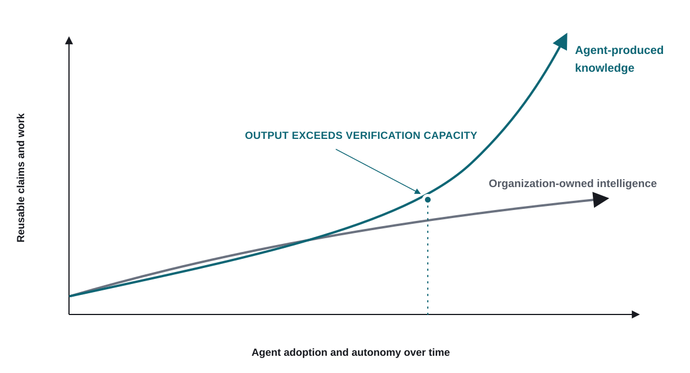
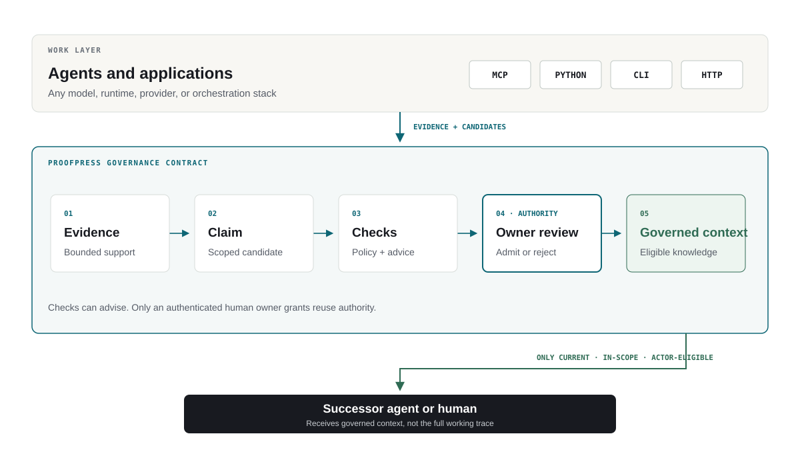
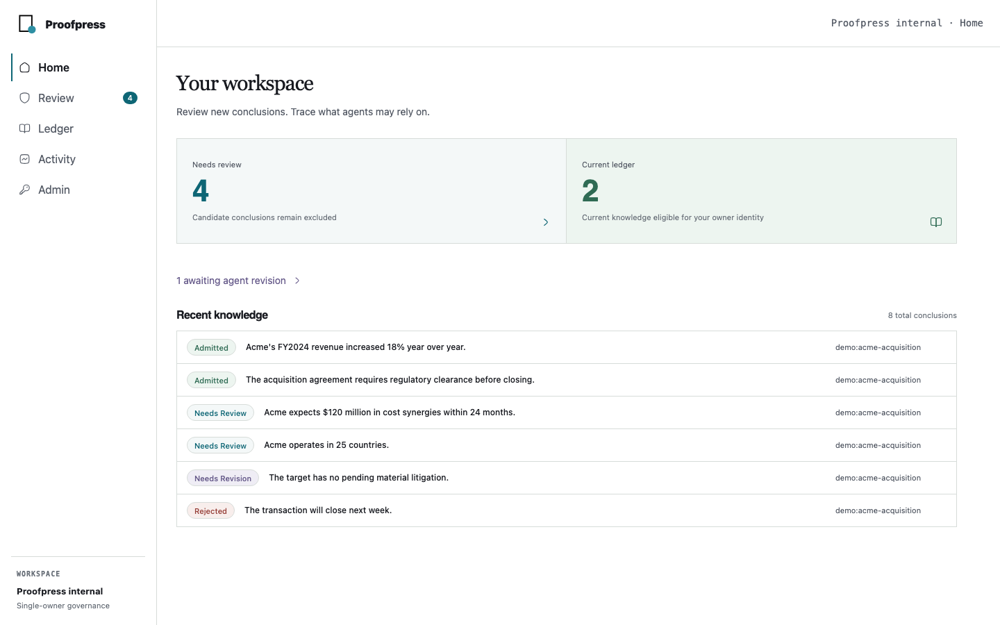

[//]: # (ob:6ec771b4)
<p align="center">
  
</p>

[//]: # (ob:de7999eb)
# Proofpress

[//]: # (ob:7542280e)
[](https://github.com/chenmingtang830/proofpress/actions/workflows/ci.yml)
[](LICENSE)

[//]: # (ob:e667d986)
**Agent work compounds. Trust has to keep up.**

[//]: # (ob:92fbc10e)
Proofpress makes agent-produced conclusions first-class governed objects. Each
one stays bound to evidence, scope, lifecycle, and human authority before it
can become context for the next agent or decision.

[Website](https://proofpress.dev) · [Quick start](#quick-start) ·
[Product thesis](docs/THESIS.md) · [Remote MCP](docs/REMOTE_MCP.md)

[//]: # (ob:62009490)
[//]: # (ob:thesis-summary)

[//]: # (ob:53ef8f8a)
## Agents are creating a new knowledge layer

[//]: # (ob:87f7edac)
Every run can create findings, analyses, decisions, and claims that become
premises for later work. Retrieval can make those conclusions available. A
trace can show where they came from. Neither decides whether they are still
current, in scope, or authorized for reuse.

[//]: # (ob:9727fa6a)
As agent adoption grows, this derived knowledge can compound much faster than
the enterprise corpus it started from. Informal review stops scaling at the
point where one agent's output routinely becomes another agent's input.

<p align="center">
  
</p>

<sub>Illustrative model, not measured data. The curve matches the model used on
the Proofpress landing page.</sub>

[//]: # (ob:41b3a522)
[//]: # (ob:governed-handoff)

[//]: # (ob:cf8ae608)
## Make conclusions governable

[//]: # (ob:9b444bbd)
Proofpress gives every reusable conclusion a lifecycle:

1. **Bind evidence.** Preserve bounded support and provenance.
2. **Propose a conclusion.** State the claim, scope, and intended reuse.
3. **Run checks.** Apply deterministic requirements and optional model advice.
4. **Require human authority.** An authenticated owner admits, rejects, or
   requests revision.
5. **Project governed context.** Return only admitted, current, in-scope,
   actor-eligible knowledge.

[//]: # (ob:8282eb31)
Agents may submit, propose, evaluate, and retrieve. They may never admit their
own conclusions or administer owner authority.

### A different layer of the stack

| Layer | Governs | Core question |
|---|---|---|
| RAG and memory | Context entering a run | What should the agent read next? |
| Observability | Execution events and traces | What happened while it worked? |
| Orchestration | Tasks, tools, and runtime flow | What should run, and in what order? |
| Knowledge graph / ontology | Enterprise entities and relationships | What does the organization know about its world? |
| **Proofpress** | Reusable agent-produced conclusions | **What may the next agent rely on, and under whose authority?** |

These layers are complementary. They can provide evidence to Proofpress or
consume governed context from it; they do not grant admission authority.

[//]: # (ob:612fa08f)
[//]: # (ob:product-surfaces)

[//]: # (ob:57f61eb0)
## One governance contract, four surfaces

[//]: # (ob:1aa1b52d)
<p align="center">
  
</p>

[//]: # (ob:ed5c57b7)
MCP, Python, CLI, and HTTP call the same versioned lifecycle. Local Git-backed
and hosted SQLite-backed deployments differ in storage, not in what counts as
evidence, admission, or authorized reuse.

The Owner workspace is the human authority layer: review the candidate and its
support, inspect lineage, then admit, reject, or request revision.

<p align="center">
  
</p>

[//]: # (ob:8db33fda)
[//]: # (ob:quickstart)

[//]: # (ob:4ccd51b9)
## Quick start

[//]: # (ob:70af4929)
Proofpress requires Python 3.11 or newer. Install both the project-level agent
skill and the local MCP/CLI in the repository where the governed work happens.

[//]: # (ob:1522656b)
```sh
mkdir -p .agents/skills/proofpress-governed-context
curl -fsSL \
  https://raw.githubusercontent.com/chenmingtang830/proofpress/main/.agents/skills/proofpress-governed-context/SKILL.md \
  -o .agents/skills/proofpress-governed-context/SKILL.md

mkdir -p .proofpress
curl -fsSL \
  https://raw.githubusercontent.com/chenmingtang830/proofpress/main/.agents/skills/proofpress-governed-context/assets/context-policy.yaml \
  -o .proofpress/context-policy.yaml

uv tool install --with "mcp>=2,<3" "git+https://github.com/chenmingtang830/proofpress.git"
proofpress quickstart
```

The skill teaches a compatible agent when to retrieve eligible context, submit
bounded evidence, propose a candidate, and stop for Human Approval. The MCP is
the safe tool surface that executes that workflow.

`.proofpress/context-policy.yaml` is the customer's versioned, repository-local
rule set for what the agent should and should not propose. Customize its narrow
workflow examples and commit it with the project. It guides proposal selection;
it cannot weaken Proofpress checks, credential boundaries, or Human Approval.
This repository dogfoods the same contract in its own
[context policy](.proofpress/context-policy.yaml).

Configure the optional LM Judge separately in Hosted Admin. Start with the
[evidence-support criteria](.agents/skills/proofpress-governed-context/assets/judge-criteria.md),
adapt them to the customer's risk and evidence requirements, and keep Human
Approval as the reuse gate. Judge criteria do not belong in
`.proofpress/context-policy.yaml`: the YAML controls what an agent may propose;
the Judge criteria assess whether bound evidence supports a proposal.

`proofpress quickstart` creates a new `./proofpress-demo` Git repository, seeds
the packaged synthetic admission lifecycle, and writes and prints a ready-to-copy
`proofpress-mcp.json` for a local stdio MCP connection. It uses no account,
hosted service, token, or model call, and it refuses to reuse an existing path or
ledger. Run `proofpress quickstart --ui` to continue into the loopback-only local
review UI, or add `--no-browser` when the UI should not open a browser.

This is the user setup. To change Proofpress itself, follow the separate
[contribution guide](CONTRIBUTING.md).

[//]: # (ob:6b08a324)
[//]: # (ob:python-example)
The same lifecycle can run in-process for a local Git workspace or over HTTP:

[//]: # (ob:d50b7fde)
```python
from proofpress import ProofpressClient, ProofpressError

client = ProofpressClient.in_process(".")
evidence = client.import_evidence("run.otlp.json", idempotency_key="run-001")
candidate = client.propose_conclusion(
    "The bounded result is ready for review.",
    evidence["evidence"],
    scope="experiment:demo",
    proposer="agent:runner",
    idempotency_key="proposal-001",
)

# A human authorizer reviews through the owner surface. A successor agent reads:
context = client.context(scope="experiment:demo", actor="agent:successor")
```

### Connect an MCP client

The quickstart prints this local stdio shape with absolute paths already filled
in. For another fresh Git workspace, configure your MCP client to start
Proofpress in the repository it should govern:

```json
{
  "mcpServers": {
    "proofpress": {
      "command": "/absolute/path/to/proofpress/.venv/bin/proofpress",
      "args": ["mcp", "--transport", "stdio", "--workspace", "/absolute/path/to/workspace"],
      "env": {"PROOFPRESS_MCP_PRINCIPAL": "agent:your-client"}
    }
  }
}
```

For a hosted workspace, open `/connect` on your deployment and use its
secret-free remote MCP URL. OAuth with PKCE binds the client to a separately
issued agent credential. See [Remote MCP](docs/REMOTE_MCP.md).

[//]: # (ob:ea362434)
[//]: # (ob:choose-deployment)

[//]: # (ob:43d5590e)
## Run Proofpress where the work lives

[//]: # (ob:5da4d7b8)
| Use case | Start with | What it gives you |
|---|---|---|
| One repository or an offline/local workflow | In-process client or localhost HTTP | A Git-backed ledger, local review, and governed-context reads |
| One owner working across several devices or coding agents | `proofpress hosted` | A private, single-owner workspace with durable storage, scoped credentials, owner web review, and HTTP/MCP clients |
| A workflow-specific evidence format | A profile or integration | Typed evidence validation without changing core authority or lifecycle semantics |

[//]: # (ob:9b6ded86)
The hosted reference is deliberately single-owner and single-instance. It is a
private deployment reference, not a multi-tenant Proofpress cloud or an
enterprise collaboration product. For the Render Blueprint, bootstrap flow,
credentials, backup/export, recovery, MCP, and security boundary, read
[Self-hosting](docs/SELF_HOSTING.md).

### Self-host in three steps

1. Deploy this repository with [`render.yaml`](render.yaml), or use the
   provider-neutral examples in [`deploy/self-hosted/`](deploy/self-hosted/).
2. In a private server shell, bootstrap one owner workspace:

   ```sh
   proofpress hosted --database /var/data/proofpress.db \
     bootstrap --workspace-id workspace:personal \
     --owner-principal human:owner
   ```

3. Store the one-time owner credential and recovery secret outside Git, then
   issue a distinct credential for each agent or device. Configure backups
   before relying on the instance.

The Blueprint contains no Proofpress credentials, customer data, or access to
any existing deployment. A fork deploys into the operator's own account,
storage, domain, and billing relationship.

[//]: # (ob:99949965)
[//]: # (ob:authority-boundary)
Submitting evidence or proposing a conclusion never admits it. Agent credentials identify and constrain callers; they do not carry owner authority. Only admitted, current, in-scope, actor-eligible conclusions are returned as governed context.

[//]: # (ob:6bafd8a0)
[//]: # (ob:integrations)

[//]: # (ob:8641828f)
## Integrations and deployment

[//]: # (ob:5ae3101c)
- `proofpress.profiles.experiment` validates bounded metric, table-cell, and derivation evidence.
- `proofpress.integrations.repository` binds one repository change to Git and check receipts for self-dogfood.
- `proofpress.integrations.matter_catalog` and `proofpress.integrations.document_extraction` are optional evidence-entry integrations. Their output remains candidate evidence.
- `proofpress hosted` runs the single-owner hosted control plane and web review surface. See [Self-hosting](docs/SELF_HOSTING.md).

[//]: # (ob:b877cee5)
[//]: # (ob:reading-path)

[//]: # (ob:a3e02529)
## Read this next

[//]: # (ob:3159be00)
- **Understand the product:** [Thesis](docs/THESIS.md) → [governed knowledge and context](docs/VERIFIED_KNOWLEDGE_LEDGER.md) → [FAQ](docs/FAQ.md).
- **Connect an agent:** [trace integration](docs/TRACE_ADAPTER.md) → [MCP and WebMCP](docs/WEBMCP.md) → [repository dogfood](docs/REPOSITORY_DOGFOOD.md).
- **Run it privately:** [self-hosting guide](docs/SELF_HOSTING.md) → [`render.yaml`](render.yaml) → [deployment examples](deploy/self-hosted/).
- **Explore prior experiments:** [study catalog](studies/README.md). Research evidence is separately scoped; it is not a blanket product-efficacy claim.

[//]: # (ob:6ec793e2)
[//]: # (ob:limits)
The current product is Python-first and single-owner. It does not provide multi-owner workspaces, customer VPC packaging, Notion ingestion, multi-repo knowledge ingestion, or a universal OCR/RAG platform.

[//]: # (ob:e9a649ec)
[//]: # (ob:compatibility)

[//]: # (ob:6e4b22d6)
## Compatibility

[//]: # (ob:34226b85)
Python is the supported SDK and CLI installation path. Older Python imports,
console aliases, and portable top-level commands remain deprecated forwarding
shims; new integrations should use `ProofpressClient`, `proofpress`, and
`proofpress legacy ...` for the portable artifact ledger. npm is used only to
build the owner workspace and is not a customer SDK.

[//]: # (ob:85117b99)
[//]: # (ob:docs-release)
See the [documentation index](docs/README.md), [study catalog](studies/README.md), and [GitHub Releases](https://github.com/chenmingtang830/proofpress/releases).

[//]: # (proofpress:meta:eyJhcnRpZmFjdF9pZCI6InBwXzU1NmIxMTVkZTcxMWIwY2QzM2VlZDI2MCIsInBvbGljeSI6InBvcnRhYmxlIiwicG9ydGFibGVfaGVhZCI6ImRjYjQ3ZDQzIiwicG9ydGFibGVfaGVhZF9ldmVudCI6InBwZV9hY2ZkMjY2ZjIwZmU1N2MzY2RiZDc0YmEiLCJwb3J0YWJsZV9saW5lYWdlX2lkIjoicHBsXzMxNTQxYmZkZjRkNzQzYTNjZTYwMmUzZCIsInByb29mcHJlc3MiOjF9)
[//]: # (proofpress:discovery:Verifiable revision history by Proofpress | https://github.com/chenmingtang830/proofpress)
[//]: # (proofpress:capsule:eNrtXVtz20h2_isI58XWkhTuF-7OpLSyZqwaj-WVtDu1ZbrobnRDxAoEuAAombH9mrznYX9CflgeUpV_kXO6GxdKJHTdyU4CV42HBIHu06dPn_OdG_x5QPIyjkhYzmI2mAyWy5njuNQwHMY9w6B6yCyLc2a6-mA4oBlbz1h8wYsS7i3mxHTcCeM-cX3fdyLD8xhlhh6YtunrlmVRlxJKXDMklm5YxHNZGEWmR43Q446hh3rEuAPjsrgIsyuerweTz_ilnJXkAmZISIlTDeED5Qlc-BPP4ygmNOFazq_iIs5SbQ73Z_lao2vtXZ5l0TLnRQHPLEl4SS44Lmrjcp79hcNyVzkOOC_LZTHZ37-Iy_mKjsNssR_OebqI04uSpBe-pe9vPJ3zv65i-DxbFTyfhVla8BR4UeYr_nU4mHOCTGQhtT1mWwN5ZcavxE3AXD4jYQTMdCNTj7jjhVYIHPNsSpCyLC9xabMkTjlQXu1IMrMMxzZoxCIb7rWIFXJXN7nF5HIUdbOQLItVAgs2kc4wy1kxmLz_PFDTfx7ALmd5gZ_kz5zNKLD8_QAmS8tJmDH-afAB1lHJBEx_enTw6qej8QLneoiokLLMY7oqYYdmlBRxgQLDk2hGCuBcycV4q3Ke5UjPZZzikMW6KPkCfknJAjeuTdcQHi9wwweTdJUkQGU4hx3ico00ycJLeMLloecZ1IbbYXNK_gnX8OK__vZv__0ff3sJF9VEhDEuuQdSxK_hyu-WGknii_Tb6SCESXk-HXz3u3hxoRV5CNeQ6rLYT7KLbFxcXUwHcHcJ1zckrlwvhbiRnAy-DhuigD9BEHC6QdTGkzvJ-kbbNgNKFUjoxiSeY5tw6vgjJnn_T-8Pjz-8eNBZ2Ac5gM3oWjZ3XY8FvvsIivb2zudcu0CdkJI05FpC1jzXoizXhEyMgBC2CjnTLtPsOuHsgo_39jpoCcyIhsajuNPcpV3EV7yQFMD_NFCAOWdDjaxYLE6uRtLiGugss4m2t_fznHRQ5BpmRHQ_esx-7e9_mGjfaC8yOpGMKEfFKoejyYuXHVM6XuQanOobU56kXFODDIHBq1yrhuqUy2-0zgc7BNUgxKCOyZ6BipH2seHYYRLDvnzU4kIrQXhCkmZpHJJEe7cGNZNqZ69-HE9TeEQJcUNlAhZkg0SfUcuKGHkGEtt7BaYjvCxKUKNdu2SHIXMMGmxM_of60Tt2ZePGLnWhk8gOzMfM0joQlTmseGyNDUODQ5pyOAbjjkUajmm6YD0eMf3Hjx-L-TRdyhlHC20ZL7U4heeSRBtxDTaZf0Jbqr07PTn5_t3p0dnZ7M3J4cGb2fnJjw1NaFY2TyTVfWKZ9iNo2jiRgrAR_0QWy4S_nKaoygowaFoSRzxch4kQTi1fpUD2qC2Ity2Ho1MPQNLj2CQpmaZRni20RnVr8UKy58bRGTZXOrgElswOAtd5Ipek7Y_L9Yhmq5SRfA2cOlvRRVyWIKsaPMM4an6QJiB9mXWpUkoi5hP9iSTF8OhFToRZ6zqgvmsbvnlDcx-3HgYzwDTGl0m2XiD06j6x3U92HGGHcMvQjfA56GjUIojDGD5GccKLMRwkQNwLoVevAB8xBOSa2DGwvQsOGC8cdihShGOBxc3nILG9VUkMclKosxWu8hyerZQzGgCpjkZRnBelmKILpgTEtQMePjeNgJ-WMACNE5DyLnlyuU1Nk23iJH3sahsjaNcwaXZ9hzB1PNYhSRZAR5f6zpMpwO3IEtYWplnBLj8qlVMMNXSZMkRKSUwA0A8Fc4Xn03XiHMPwaBA8mb72_rAsLEY5TzjQgbqHc4Eb3sP1Fe6z2HzQ0OB8fHiBN98k8MOwcq0GgFPRNZmFOSfStxG_VI4Sn0WAVUlIueXqkR5Ylh_aYeALEJRmpRhTeX-a8v40wN7h5TKLhcTBjGImdH2qb-j5fEC3MYnDdWuEtivZGkQ4qY_0MossKmcRiA3Pl3msnNmCGhPO4PhEkWUxx2G6w93INrkb-L4fOBFATdtzbeJGOgVfwKKmZ5sG9x3dDhxGA91ExQA6uhROqdyuiWmBb4dXBqZuuiM9GOnmuR5MDHeiG7_R9YmOil5xHOXAcADM8AAkprn6-Tl8WCF-0r-ck2KOxg-4QlxugTCivhBjtFxOJZlP9iU1_A2uX8esnMMvvg9f5jy-mJfq23e_219-t-XEKDp9x3MjyzfcQLcqOlteqKLzbudSDWdGthMElueG1KyGa_mbarinuJH711l-GSXZdbEfxuP1ItmnBJ064M_L5xrypQYUvolhSwo-0Q6WBMYYmWO9GR_2aFzMY56wYhxnkoT9RD4xUg_gEyOarCra3hwfHr09O3q5ezO45wURHH_qE1pxr-UbK-49m8tb7VngcN203dBgTjVrywu-5XA-3LkttQVZw53RqlzlXD6JcG2-WiC85clay9Khdj1fD0GNwv_hiSLMllwqfcQQOVzNCni2QoP_vLenHUgSCgEGa7BRA0JhMBARwnNgDcJkhUe-GGuvOBw1kAkAIXEo1ae03XBXFF8AjWhpUFnCYCRZgaZGjb8YawepoACmBYcR9LdagqLqX4BMxkOYvgByOdyX43NrsXxxvtW2cTEVcnbcIQ2OxYlLSOjqfq1CmlhAdZYe6OKrwR3L0QPHiGxiG9XgLa-_OvcPd94roaIsZK7lurCKavyWP6_Gf5JbDo9sufnwzbG4CzQySUBkJKrDD8D01-fn7zT0-QppwoWzBXIm8ZvYkxyUghjgp8N3WgLqVztc5UWWD7XDBCSca4fg5wzF35-keGZin0NBfaGt6qGjStIVw8ZiyBTsfa5oAKFbwmJAxIZK3oZ4LAAbMJQwWA1hUkwlgeMtAFrxm1IeEc-jnq_X9qYVnNgiLN0xhkpM_DAwfOrBXtb6vBV2aMTkrmiCGo8ZYOEDn0UW12v70AQYbuuaB8cN1ETEMiLXNJ3IILV8t0IJaqKnRQiO3oKNzQHuw-aOrsHijEg5QpRYjgx3lINsZItRCNoRRArgxnQAMzUrUyI5Gs15stz4ZREu68tA4RYXuwIZphsRwnSq66TWEE1sYpuGeGjIIQuRImFb5JHSfgBViwazACsnnG7UaOJkTXZvh22AzPjMt70oqGFGE7JotuPxkYjiKM-zfArPyqOofXvr7nGcztSSXkwH4-kAGFBbi2_VER7LqWbVD3AncGOclcly_JcCaBuAkWIcbirh5_Xskq-_FbeMdN0QQwIDmXCAmzGVGZo1ZujFNNXgz1R4QpXpAlJXifBLwT1ga8F36ZIAsUP5REXX--mg-jgdfFA_CqsJ5DTu-ARIzeqHFR05gkuRMgG6U4Sd6vfbC5NPkESuDm57iSz-Rju4bfokpaiQ82x1MRdqMLuG4RsNeAAfQ-R_BVbEQosJME3aw4Zl6sKL3UvSRJqqXko9stiEzoOjU2K4nhE6LKy1QytcteXgPDgKVeBV0sIdSvOjRgczEZdjCV9a2r5A9sOnaF2BEVT8AIjg2CWgQH4rwQTLNPAE4WKerxV_a-rGYK8BTYlJSgRlKuSBuGpUQSrk2oiD3xEjWGshIw2AHGwIgDREKKR4CFrxLJMZrhuEJvMaXVSH27aw9K4oWqXJSUR1buvUdxvL1gTWGhP04PCYmiDydDBppuGaYU15K2LWQJVHx700AYtHIQeXXFGWx1cSc1SCcxPajNvsGYOVAYnC7PVHjcYpKwAw41ZVVzWZ4gTILfSzEB-EtXBLyONlKVU4plVHLLuIsox1z7cgID75DDAuAQ_zoxhw581VHGQGnMqlT_VRiFK2xM9gM6pFjuAuIHbjaQ0UYAxWZFUuV6gOFiDxhdbo0F0MUgb0I9oqCQLxyAGb5ZFQ5lVAuizRwEin0iO45lRpqkYtYUjn_RlyBx-DYWQcZ__s6M33s9cnZ-fHb38YL9jLDgAWEsf39NAiPLTaDr8Kam6R_weHJtvrG2vHJWgCkDXUBQgigUvaAqxHrBhQ22iMpa2KMlvAxT-9O9RkuQOMNdTeZip0hYUaMfpgcgQUrMZ7bP8ugMAqjTF-Aht7cni6f3rwA7K3BAlbdCgIQCW-yUmgm8StndsmorqFQXfGRdXILjhJjsM9i7oNDGpCpY2GeFjMs4LA4G4B2qXUsWoI3AqDqtGfEs9ELVxmS4COVzxBAsGuskIdBVTDoMjgHAt_E5h8TXKkEfzueFEbWzg-uLyx9kfwP9qnJOEXBPzY8Xj8UeiAesYqvqWJPc4rb_mKy6BCmWWJPJwwoJwKj3QBaoWtEkkJkojeCzrt-tgT9qmaMEaA2URHq3ONf5fwnxpAagLcCSHgHI4BfoniT6BbO-Ckb_MQPGHT82vXuBX63SJLD47h7texwJdD7X1RrgCOKXX44QV-jfnmPbiA96B8X6-odionKh4akFIEFi9vrf3DV1z-lgIdzuJye3mOKPkRgaDtv3aV9sj6JV40Qwu0NwFrBv4M-1-t_RGUNKU_qxQVVfq8ZT-LjMVRLObflWq4dxnNPcbamsnf0P9_3ZKkvD1wrb5gA8OEwKHdtfibQ-xYWddtLaJv3fahtZDPg-s5Zh0OE5IjtsVzt7E2CQpE7kFpIdA5-RUXvoEq4auBDi5RRjsRo8BixxjOv3d6xQ5cbkWeEYEZ8mzDC0PfBtEM6vRKO2_Szhm0cymf_5-L1v1TVnXKph5wYn3dnpO5K0H1PFkoM-CEM9dxAs83uGvYNAJ5Mg2g3AVHgNtB6BIPRMQKLZ0aDiho1-GckCCiPjN3L2lbHsqfWP6WPJTtu3roOtEvkYeyI8MFjOU7IY8elofCgMBz56Km6S-ajQLozQzDCKhjBr_ibNQ07dNRfTqqT0f16aj_7-ko1zU82zMc4pl6ZzpqN8Dpc1N9bqrPTfW5qT431eem-txUn5vqc1N9bqrPTfW5qT439X8kNzVC2n_FCSpT1wHs6U_s9gUBAmpHxQoObN7ZVORYPPIjf7OF9ec55mlA0fNPYEvuavC9fXdHC5HvRR7mCx47308iiCLgaQyuGHi0ORglDORJRAhjxFWoC-4Aw10g9ECT09XcFXimFxH30WxoByQVHUhAzleFUGkKQ2QRXCbSS51U-LazhZAQV7esx5J1CjsgCIlA5LT3lQmX4qG0yfnro7PjM9QUQu_h3Qs4aklXVsmgFnFM87FktUW1AvKjOUYloqhLWEMQVC4DkM28TfwZI6BykDskdscjHWIbUNu2KWVPmhkcP3xymv4ZI5eVfhcGGKN4iBalspbvtyik41v96ei1BYfD5NQynkTdKbmuLS_QgXi5wgK1P1xkKdp3jMMUq6WIewhHsqttkjmh41HvGXrkD0CGN24W7mcTO1XZNFju7ShqF4XEck3bsh-WI72jqXOeZQUfNX5eZyc_dsUFNxK-h2IEYG8zBiY3lvwO2e56rqtJmBGbedR_Og1fBNALASxoX7QzZJqGEUj4IpIv4APKlM06W2lfpumX0WhU_zdtSZJMAW8eQhcmu_GikEfRiGdDuWE5j3gu4iMxwtkkpig6mAXacNoaL6djI6nveSHnznO3COdyw0bgHsy7BIlYXDedGy9rUDYAVpfihW7puXVzVzew4QSU6_ojZxtpe3t_xGQaHKxUWimlEiZ7e9r78x026j__9d-19xfZTXd3R8lLA6du0KG6aQ8Yw6yhNIiawkvo2CA5EjZWVKkIQR1v2oGiOubBMW9YSXQshJ5SDB7vAkvbhz36BO4tOi-E_YWEEhQhzhCZIIplNES5k5tgabwL_Gyf5hWPwC-SC6hNioI0VdBRzMk_1XnNXThm-wxv4vRSjs84OGHoxak9wWGbDMDFKmY3qG-BkTt4f9Ma1swHtxIw_HgX1njssFv3tIUkto97Ns-u5cB1bKrMRsKrGMnDg9-bYDUWC4x3wYHtU8haLHATtRyMfh0gRvu5KkSIVngqreDtLpO-YwmliDWC4U0LARJAUwlPOswzQMgVDK3M-HiXOe5gfFvbg2sqGY7SgSGC8S7zesdObgzasYctY7l9xJ_IslBJKWVmVAwDQ7MiK4v2UXgm3cxomby7Do6aqLWGjaMJ6JJm2eV4l8G6izUb0QhlkDQ0SFtPT8sS3THwpsHYzu-WpekSiTiHTWvilI3dbTNFGHIRM2kvAtm-rWrxlONLA3nbHJBCYF4MIpW1ydqoYrye4y5fcr7E4WuFVoNSTKWnIqXGSR7OtQWcljyWwSpYlirm2OD4w8ocOdazsYAGrh3YjBoBc4lrUXdXmWNdknaPMsc-QNEHKPoARR-g6AMUfYCiD1D0AYo-QHHvAMX9m1FuvuvK8L5ubyH4RdombGoGkW7YlHjMswLTswzXcW3OPT-yTVOPSEQ9nUbcN13u26FneTQMdcO1PHwPlrFrQTebJkxjYhgT093SNOFQ7sPp8vqmib5pom-a6Jsmfh1NE8wmIAwBeOBW0zTRONBbikHu9ourc2phF5vlRnZTYt9ylZvKons5v1VBI6N2qOvEpG4tRy1_WA36FA9X-W_8Ew9FWQU4nNMUf4EtbdwNRkAKZSnS6cEPQ23BF1m-Vg0OaZmB1sTgZZZfkBS2TIobbiISJaqclS-gYbH2WDsXrsKWqHgxz67l0wDIlhx3VQZvQBhzknZsrWVywOSBYRt-3S7Q8tG3HLmHet0o6OB7ADqBXSqGU9AUJFkLpqCEqt-F96PM3YiS8BIFUyRC5JBEw38cI795YkGcpymFA1bgA7A76giL4r2qA3czCj1E9yWO8NSIervqeFfHWVDYjtWXUm1c8s1iY9GLImZcFVzMF8tSQaIBjTBFOE2bAj8Apsv5sCYfTrroP8EWmBKIF17gJc-VO6hdgyKbZzCwqAcE4Zmm9ygABHRBie0DViReU8hbRzY2keOjYhWaQpBglyQXORu1FolZDTXCn45Oj78_Pno1-_Htyc9vjl79cDQTf59uDJpR_MdJbnK84LC3oNe6CtR0QIDUDV2bunWBeStcskUn3ScAUjX-AEYkukkDs2miacVEGq10_wBHdd4oWFAjNKzArispWzGPpk3jCQEM-efL1ou3bZP6B2Ji7Am5_cDVND1Q_VZUlNXXz42-q0xa0T4WcFmZsX2NsKu4yEQ8GU3YtvHv8-fLYx-8euCDr4VOkX6osp7_eDRXnQfab-qS5t_UvQeVMQcVmPxj8_tml0ql0u_oKwkJh-d0Dv5Z7dS0onKVintCiE0J8lCjK6EUgY1YlouaHZFXwROBOavkokRiss8EhlJHYljDtaHKkYDOJQlAe87qTpzfonmGh4TRED2LaLCxMFMUgasuRZDFmy0ofXtr3976DO2tjFum54cW080ae7eiyIrfTwkGj7U3VUejAnXS1CvWnv3hTVzyCu6prlAVwJsTOA0sjkTQEPgBUAk4I08lHpj6p2nackDvgxz6rt6-q7fv6u27evuu3gd39Ua25bmeRXxm12qoldXb1mF2n_xchS8CrtsueF2E2LUGbVJ2jQZ9YOqtbo9zPM91gZ-kxkatbJwa_mlZtS8C-7S6RnG_MDoUYQZjX2qCKsoLYx43ukKdPniggSECe3yB3W8MqGomGyqtImVHgorawa1kQsiIVpPVdC2KzmlZxFYgtoCBGAwUimAUOpniBhnT_LK1JRSJWooWW7DJGwm8RscJvrFVLkJEtQEXcsnaTdnDirK6b1SuB1e_j_inwkliJQc1_0bFEpy0KA4bp1S-UE1RJ6vU6h44CU2-aOfrZdv_VT3F-BsSjG1-omBIOAdYM1XjbrE3t4MU2pdtudQKkFvMMiihXA9b_n6dXm2VEDw2TToSdherBVUMiqBRFDvTPh_1uEMVpJJ9qCU2I7btAzA7WzEpt6DlMVQMo4m4NWAzmik2Kng_1r5XkZxTLmLjv09WXGTdAKllWYkodClKO0EDbmw5SvNquS9hwhC7qMW_iDtEwDvc7FWs6v-GQqCn6QP7iG9FjvpXE_SvJuhfTdC_muD5Xk0A2l0PIptZnlkjl1aNyhb5v6vSRA1sRAYHuEUsL6zzsK3ik0b-71NPUvm_xLeowxw4Rbxut29KTGqRf0rViNIcTWpA6TQc_F4JAjHO9wd_UDfDJ7EFKAZ7e4cZgO-wSZUJimTipCVdFXGnB4dHs4NXB-_O22MjrkCifuYUPqp7fz76PXxpbmqdMXVy6tb1dydnx-cnp3-evTr54fuTk1ct8k7RCSwreJSsBXlFS8A2EiU3xUzO_DEX9nS8Jovk44cXrW_qhpZpV14p7oa4uF_Pxdl-RRS22CCaAaoyEUtSmquQ1N3VfT8GCVNl3rW1w04jjhIr4YnAdSKmWSfCKBy8S142rUcR5t3CtUzt9e_66N_10b_ro3_Xxz_Quz4e_z6Pv9-bOuYEbCkcAERlxY6XdQhSmpd1tCm73ws7HlRjevu92k3z6u3Oowg2Qwa1NrVFSJbFCo9OJAo7mDiGordUmGTtcI6eDwJbkXuWrXwCQz6si4iEEXDXjUw94o4XWiGjzLMp2dVFVNdo3t1F9Fxcu3_f05b3dhtft1eY_iI1taaj28zhRuD5uudHTkTsyA2oTSPfjYDT3NGpy13qcOK4DPxEPTJ8JwhZYBKf0Wj3kjaraq1z3Z_YwcT2tlTVspDaHrOtvqq2r6rtq2r7qtq-qravqu2ravuq2r6qtq-q7atq-6ravqq2r6rtq2r7qtq-qravqu2ravuq2r6qtq-q7atq-6ravqq2r6rtq2r7qtq-qravqu2ravuq2qdU1UY2OBAs1L3Atvuq2r9DVe3NqiBZt9pUBl3GoJKTGOMbAMildVRRQlEGJk8vytgGWbPXB4c_Hpy_Pnk7O_vj7386Pjs7PnnbF_P2xbx9MW9fzNsX8_46ink_fP0feOc4pg)
