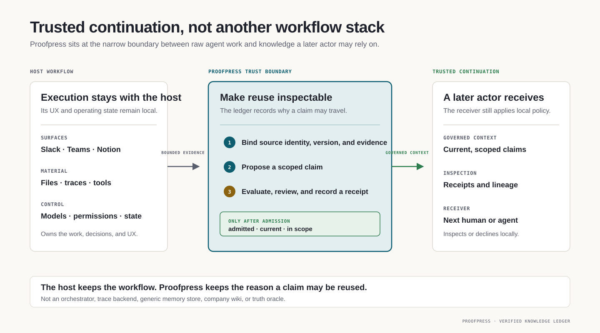

[//]: # (ob:6ec771b4)
<p align="center">
  
</p>

[//]: # (ob:de7999eb)
# Proofpress

[//]: # (ob:7542280e)
[](https://www.npmjs.com/package/proofpress)
[](https://www.npmjs.com/package/proofpress)
[](https://github.com/chenmingtang830/proofpress/actions/workflows/ci.yml)
[](LICENSE)

[//]: # (ob:e667d986)
**Verified knowledge infrastructure for autonomous AI agents.**

[//]: # (ob:0e0e9d9a)
Proofpress gives the next human or agent a checkable answer to: **which
conclusions may I rely on now, and why?** It binds selected conclusions to
evidence, scope, version, policy, and review, then excludes anything rejected,
unresolved, expired, superseded, or unauthorized from governed context.

[//]: # (ob:92fbc10e)
Your product keeps its models, tools, memory, workspace, permissions, and raw
telemetry. Proofpress governs only the narrower trust record that must survive a
handoff or fresh session.

[//]: # (ob:815b673d)
**Start here:** [run the 0.5 alpha quickstart](#quickstart-governed-context) ·
[see the integration boundary](docs/VERIFIED_KNOWLEDGE_LEDGER.md) ·
[bring us a real handoff workflow](https://github.com/chenmingtang830/proofpress/issues/new?template=design_partner.yml)

[//]: # (ob:6ef36a68)
> Git made code collaborative. Proofpress makes intelligence compound.

[//]: # (ob:df7a085e)
<p align="center">
  
</p>

[//]: # (ob:8fb4a17c)
## Choose the path that matches your workflow

[//]: # (ob:eac911f1)
| If you are… | Start here |
|---|---|
| Building an agent or multi-agent product | [Govern selected conclusions for a fresh session](#quickstart-governed-context) |
| Shipping a high-stakes review workflow | [Try the legal cold-handoff fixture](examples/verified-knowledge-ledger/legal/) |
| Handing documents across people or systems | [Try a portable artifact handoff](examples/portable-handoff/) |
| Evaluating the mechanism or claims | [Read the published handoff study](studies/agent-handoff-artifact-provenance/) |
| Integrating memory, traces, or a workspace | [See what Proofpress owns—and does not own](docs/VERIFIED_KNOWLEDGE_LEDGER.md) |

[//]: # (ob:8f7c2d11)
## How trusted continuation works

[//]: # (ob:9317a2bd)
Proofpress sits between raw agent work and the context a future human or agent
may inherit. A bounded evidence projection becomes candidate knowledge;
deterministic checks and policy evaluation inform review; only the configured
admission authority can authorize reuse.

[//]: # (ob:70d6d4b1)


[//]: # (ob:bf4b55ec)
Proofpress is not an orchestrator, trace backend, memory store, company wiki, or
truth oracle. It records the evidence, scope, review, and lifecycle that make a
selected conclusion eligible for reuse. See the
[ledger scope and integration boundary](docs/VERIFIED_KNOWLEDGE_LEDGER.md).

[//]: # (ob:4ccd51b9)
## Quickstart: governed context

[//]: # (ob:cc376e2b)
### Install the 0.5 alpha

[//]: # (ob:d6f9f208)
Proofpress 0.5 is published on npm's `next` channel. It requires Python 3.11+,
Git, and Node 22+:

[//]: # (ob:7b197ac1)
```sh
mkdir proofpress-quickstart && cd proofpress-quickstart
git init
npm init -y
npm install --save-dev proofpress@next
npx --no-install proofpress --version
npx --no-install proofpress setup --agent codex
```

[//]: # (ob:5ae48e1b)
`setup` installs the agent adapter and writes `.proofpress/manifest.json`. Use
`--agent claude`, `cursor`, or `all` for another supported harness.

[//]: # (ob:460f8108)
Import a bounded telemetry export or artifact, propose one scoped conclusion,
evaluate it, record an explicit human admission, and request context for the
next actor:

[//]: # (ob:8b9b3369)
```sh
npx --no-install proofpress evidence import \
  node_modules/proofpress/examples/verified-knowledge-ledger/demo.otlp.json

npx --no-install proofpress propose --statement "The current conclusion" \
  --evidence EVIDENCE_ID --scope demo --proposer agent:runner
npx --no-install proofpress evaluate CONCLUSION_ID
npx --no-install proofpress review CONCLUSION_ID \
  --admit --reviewer human:reviewer
npx --no-install proofpress context --scope demo --actor agent:successor
npx --no-install proofpress ui --scope demo
```

[//]: # (ob:20fbea6e)
Each command prints the identifier needed by the next step. `context` excludes
rejected, unresolved, expired, superseded, and actor-mismatched conclusions by
default. `ui` opens the local review queue, governed-context preview, and
lineage graph. The 0.4 `proofpress knowledge ...` command group remains only as
a temporary migration surface.

[//]: # (ob:9c6c7f6a)
## Evidence, with the boundary attached

[//]: # (ob:30685e8d)
In one preregistered controlled handoff task where a document had changed,
ordinary handoff continued incorrectly in 12/12 trials; Proofpress-assisted
handoff did so in 0/12. Both conditions continued correctly in all 12
unchanged-document trials.

[//]: # (ob:cf466876)
[](studies/agent-handoff-artifact-provenance/README.md)

[//]: # (ob:aea6ced7)
This supports the version-checking mechanism on that task. It does **not** show
that Proofpress generally improves agent capability or establish customer
demand. Read the [open study package](studies/agent-handoff-artifact-provenance/)
for methods, limitations, retained evidence, and checksums. Research plans and
retrospective packages remain under `studies/` with their own claim boundaries.

[//]: # (ob:cd8c1f66)
## Portable artifact provenance

[//]: # (ob:ec2e5323)
Proofpress also maintains an open portable-artifact path. Markdown and static
HTML can carry an inspectable record of admitted revision history even when Git
does not travel with the file. A format-agnostic evidence envelope can bind
provenance to the exact bytes of other files without pretending to understand
their semantics.

[//]: # (ob:20a32f50)
Start with the [portable handoff example](examples/portable-handoff/README.md),
then use the [Portable Artifact V1 contract](docs/PORTABLE_ARTIFACT_SPEC.md) or
[Artifact Provenance Protocol](docs/ARTIFACT_PROVENANCE_PROTOCOL.md) when you
need the implementation boundary. Think C2PA for knowledge work—not a claim of
C2PA compatibility, signed authorship, or complete capture.

[//]: # (ob:22a54f46)
The example includes portable [`strategy.md`](examples/portable-handoff/strategy.md)
and [`strategy.html`](examples/portable-handoff/strategy.html), plus a
[`proposal.docx`](examples/portable-handoff/proposal.docx) with its
[`proposal.provenance.json`](examples/portable-handoff/proposal.provenance.json)
evidence record.

[//]: # (ob:226a29fd)
## What is—and is not—recorded

[//]: # (ob:cfc1c3aa)
Proofpress records selected evidence, candidate conclusions, lifecycle state,
scope, stated actor roles, policy recommendations, and explicit admission or
rejection. Portable documents also record accepted versions and computed block
changes.

[//]: # (ob:5e0b34ed)
It does not automatically store raw prompts, transcripts, private reasoning,
casual brainstorming, or every save. External workflow dispositions never
become Proofpress admission decisions automatically. See the
[privacy boundary](docs/PRIVACY_AND_DISCLOSURE.md).

[//]: # (ob:32f0ea79)
## Current status

[//]: # (ob:4902cb38)
The implemented developer wedge is:
**bounded telemetry or artifacts → evidence-bound candidate knowledge →
verification and review → governed current context for the next human or
agent.** The local ledger, CLI, review UI, artifact provenance, and portable
Markdown/static-HTML carrier are available now.

[//]: # (ob:99c9f31b)
What is not established yet: a hosted service, production connectors,
general-purpose memory, or broad efficacy across long-horizon workflows. The
next proof point is a real design-partner handoff with a measurable fresh-session
decision. If that matches your workflow, [open a private-data-free integration
conversation](https://github.com/chenmingtang830/proofpress/issues/new?template=design_partner.yml).

[//]: # (ob:8deed5b3)
## Go deeper

[//]: # (ob:17d6b002)
- [Ledger scope and integration boundary](docs/VERIFIED_KNOWLEDGE_LEDGER.md)
- [Interactive verified-knowledge-ledger demo](examples/verified-knowledge-ledger/demo.partner-style.html)
- [Two-minute portable handoff demo](examples/portable-handoff/README.md)
- [Published controlled handoff study](studies/agent-handoff-artifact-provenance/README.md)
- [Documentation map](docs/README.md)
- [Privacy boundaries](docs/PRIVACY_AND_DISCLOSURE.md)
- [Agent adapters](skills/README.md)
- [Contributing](CONTRIBUTING.md) · [Changelog](CHANGELOG.md) ·
  [Security](SECURITY.md) · [Code of Conduct](CODE_OF_CONDUCT.md)

[//]: # (proofpress:meta:eyJhcnRpZmFjdF9pZCI6InBwXzU1NmIxMTVkZTcxMWIwY2QzM2VlZDI2MCIsInBvbGljeSI6InBvcnRhYmxlIiwicG9ydGFibGVfaGVhZCI6ImZjZmUyZDc3IiwicG9ydGFibGVfaGVhZF9ldmVudCI6InBwZV8zNjkyODQ5N2YwMDc5NDc4ZmVhOWJiMTEiLCJwb3J0YWJsZV9saW5lYWdlX2lkIjoicHBsX2VmM2MyZDU2NDRmOWRlZThmZmU5OWQ3ZCIsInByb29mcHJlc3MiOjF9)
[//]: # (proofpress:discovery:Verifiable revision history by Proofpress | https://github.com/chenmingtang830/proofpress)
[//]: # (proofpress:capsule:eNrtXdtyHLmR_RWYE-GVaHaz7hf6thyK1jAsS1qKMw6HWtFEAajuGlZXtauqSdEaRfhp933D4U_wL-z7fso8bMT-xWaiUJcmm8WrZ8dhPIymLwUggQQyT2biND9t0aJKYsqqacK39raWy6nrepFpulz4phkZjNu2ENzyjK2drSjnl1OezERZwbPlnFqut-dGhkMN4Rhh5ESuadHA4JbtU-7ELrSlselEZhCHcRBTk5u2x4Ubw4cWs0zDdi3olycly89Fcbm19wnfVNOKzmCElFY41A68iEQKH3wjiiROaJQKUojzpEzyjMzh-by4JNEleVvkebwsRFlCmyVlZ3QmcFJrHxf5twKmuyqww3lVLcu93d1ZUs1X0Zjli102F9kiyWYVzWaBbeyutS7EH1cJvJ6uSlFMWZ6VIoO1qIqV-LyzNRcUFzFmsbC472_Vn0zFuXwIFldMbS-0Aif0Y8PwQ8cPYkHDCNYbJcuLCqc2TZNMgOSNRtKpiG1mcddznDjkQgRxLMKQ-7yejpJuyuiyXKUwYQvlZHnBy62995-21PCftkDLeVHiq_prwacRLPn7rTdLke0fkYOci49bH2AizaaA8Y8P91_87nC8wMHus1doVRVJtKpARdOIlkmJO0ak8ZSWsHSVkP2tqnleoEBnSYZdlpdlJRbwTUYXqLk1wXagfYkq39rLVmkKYrI56EjUs4zSnJ1BE08w3zcjBx4H9VTiI07i2f_89T_-929_fQ4fqpEo56JeP9hH4gI--cWS0DSZZb-cbDFYMFFMtn41yQj5RbKYkbJg8DmKXpW7aT7Lx-X5bLIFLSr4XO076K66XModRwu69XmnkwpWKAxDEa1JtbZdb5Tri_VtrUbAjQWbdG0Q33UsKzDEAwZ5_5P32XJB4AziAn941pwLmPu4nCci5eU4yXfhmd3z3onAVXg-MG3heT4PA-8BEm1v14ddcHKW5Rep4DNBkiwuaAmnjVWrQpA4LwjsoTzLF_mqJLBT4NhkVTkgkSEMEfKQPkCi7ikyS85FSaq5IBn0QOarBc0ICoPDE0rAhoDxQTNFs_JCFGRAotCKI2Y-SGt_yFcFAW1wWA9yJsSyJElVkgUcl7TcIVWe4_8WYgH2cYdc5MVZCVZR7JClGNqsgelGnm_zB2ntXQVWgsxFIfa2t8n7YpXJdTLGLhyW5ZwSMKDsrMSnPjz7onszmg1I5IEF9KgXPECiX5GXSUUWlAvCcvlPCt4kL2gFOhz3zhY8cwZKTaD7FOyAyJgYOtCxT43AfYjW7m5o0N6yVJS7tQpH0j2MhjQXRw41fbYm1cE8z0shtbCk1RxeUFyQCjZpSS5xC-HOiNNBI_QFuWs3-cWwlRKUhaYZm08u43fkKMZnCS3E93_-G_mOdHuRfDfJvhuNRvI_eEm-XCUpigYHVJ3avBNbrvOVhfXBA5vrQn-VXxCwReCyOMFPk2xF0d_VJ-2W5by18cAShrbpUyviTyRN7wyUaD8iUV0IkZGCXqi1wS5gpbhUkBoSzFy8qgY2o29wjwP2eyIpf_L-pG43WmtHCzZPKiEdwp6Ub56XjTXEt9jxgJRRDKjVFezp1zIpSZZXRHoG3McV2Jy8ALNcgA0mEcBTkfHGPBMAsQNSOoxx14zCNSn_rTWee2SG-DlT4uLXw7vvlqYDe48x2_eEtY5kjjLoK03XLf2wCF-QmxoNDM49iCMsI3jc4D0d4fOgp-UqSpNyDmsAOgaQ8y8lOUXPfkoQYmYiHZOjiiD4H9rvkRn6lJmPE-709LScT7LFGU-kb1eSjjpPSX76U8L4xu866dDXrUnnUuEEwnyk3k7BL62Wp-AlZcP6hCnUw-kSnJk0ExcFHElYw3En5O5iaHt7RhyYj9Xr0QJDKLBLUb7K4EsCnlwsRAWnS3yUXyFEUzHMDi7gEp1OngkyBBmDKIxsiNueRK_Z8iMZjbJ8pFawp0YCj3KEHSSpJzKZICzIQJPTxYBmLSOOBPXE4-Q7pGwOFmCxQP0tC4BBtXJRpApxeAFYV-CqQqDdIl-wkMvxILplHvNjbx1vH6qJAiZNpLMXtcooaAriRpBECjdkwO7YxYAtsQ0P8FvAn1Syo0xuJ_igELMEVqdQdrUA2AkvwZrwPI5JRcszciGRCSU8Z6uFyAZWkcWO5wW-96SyQsx30EkmD_Goka-sVvxyD84LLBv213xuWrumBad_QFYKe5EJ7j-prCdzsNLlaonnot6XKlQdyVALgdxCoK1OygXacIkfcZHBcA-tKw-YGXtX4lOVh2lNBZ7Rc5HROiIY2pW3NB1CxcwSrm3ZTyJJz8HRtMwBSMNxhv9KCUaWAO2aXNOo6xlg95j8jg6slmVQ24pd40lkrLF5uxveNxK1W018pItlKj48Uy_K3VboIRktj1phvH6qf4-7ISm___Nf0LjVuAzeNFmwW5R6e-shuBQzk9mUPpU8PdWqHB8pwcsxRKqiPWQM-k04rSRYZ-kKT0q5M7BsrjAi2xFPtmyAlnguFABeVTmEcgkDfyRxLhg9DC1gnyyWVSkBcVayIpFvBtNosP0MQf11V3ywKgoEIODwqtVtYde1hwd054SGxSI7eOBoJ3PpyRGCZKgeLs5FCqcPYtk6mVXuTbLt7etgBVHKkEsNWRjbV5Dc3cVSWpWqgaCENsj3UkAsQGX0BO9KUZwnMlVUp5cw-GFDEUrAAR240boBe5nDrEWdbRrSSv-5AYWYPvciw7DuP8aIvN_vBYoSpGKmZ1bUcV3jjD48A2dc7u4fH3x1dHJ4cPL18eG4kwlWqtr6_GGnSalvKSc0ZYWgdUpbftPkx8U0ji07sg0jEAzCYd9krkMpd9CEwvrLhWzsnsr617nDZQ7SySJGIUfChHfzDvPdH7BckCbsstdDv4TQ60QWJx5YXSjzuJrGoAZRSEgoW5SRuUcDLzYMxwso8wUzfctnLOA8pMJ3bJOalgcHJ4wc2xChx2LOeOQBSo1iO6CWLZM_uFNlMaLW1p4dfIaFLqWfsbyREYws_8QI9gxjz7F_Bv8auGpqxTEWjNxARKEPO6T79NNTlC7kdqurCnNaztESxKZHPSdwmYjhAdlHr9CgduLjKwho1vE7-Pwi4dUcvgkCeDMXyWxeqXfQ5y92l7_acBaVtIHre7DQphcadiNtrwChpL29rqC6c2MRezz2GTfcprteqUF195gKQvf0xcXFGB75tpSlOFXC6z3-fJKpgTD8uPMou_g0DvVrWUn8Jb6996gHR12LO9ULd6m0m-Vukxgtd1kyvlykuxEFB3Bl6o_rshbxFZjsrBR7ZH-JkHpkjY0b10jKsJvWLUaqAbYYRemqEe7V0cHh63eHz2_ebII7cIq477g8aHZHr-yjdsdjqjnj7e2B4cH--B5lpsNZM3yvxnMtMX__0k2V75Ht7Yt5wiB878EpQNWX5AhQGIAazBrlFzt17mN--evtbcwXReCNevCs37bKJ1kH10oGsGCnOTvgc6Vpr7urXdgOSpwBJoYeuEAcf1nNMeopxLey951Jtspggnl6Dm8w35EU-AJiJugV4_YdnOUqq2uuyZ9AoBgA2LXs3_jmtTaZBSYziC3fbQ1Br3ql1voxRalFUtZQtZ46vZhkLSxaq9XUUpew8KnKRtCiyKW6MG2rsLEqI-AH5QrwzDkodZI1AQYsRwydzYkqKw_MnHp-aNLY8hwZg8uZ96pk7SZ_ePFLaWGktPCc_Pd_wYkuRV0TuStUWXDVMCpwc8AporAUNG2DqsZs3NfsgF5WAs3oxa8rAZgW0M4vYR-Cs5vCWlWZKKQRunkFuR-4HhPMFbbVedC2qqdW8DHFOkxeLXFthnaw4QqX-56IJJioPWNXybu3H99coAOVgnCjLg4eiWwGqEugUkawO_LxMut8_1EKVqFS2s1jUFnXkkhLibuaQvCAOpURMxatFKDpQQXTMow7wIPYdChjvmfZjt9u5q5w2MCDx1f8mkUPeOi6VswDt4UjvSKgGu-x1bsCznlaJaP6bWN_viPvX8qjtdkMS5ezbgVuO5dy_HfzZLmU45M5IDOlcWWr21XB0U-K2j6lYgbHEPYzb3NscfIR_V4vwXGufOSo9ZGjWv-7svmuGv0rjO5hcJU3BONKWZHDoViKHPrBtagv0pSNBLRN-HRpGiXGpvyK-qoZ7_Ccplj_giFxKr1EW0FYSpN6nGPQfL1X2mLKWjbxwzP8XwLjrKUa2wxU77w0Ax81Zk-m92qHIatnpXRmtPMeKMA7MJYXuEV7ZiK_yJr8RZuPgM9usp3fbaoBN6jaDGxA0EbkOWZ3bNqycHdsHlLZbcZwuOGEvmMKq7VPvWLvdTRz73otAq11zDPJEMgkGRy0pBqT_bZ60pYj1JU56XzAry5gHbsEU7tVfz6BVhX6cNgbYBZrJFVKMWpAAz3WGwk6AuyXFwt1Yn7e-XEQNk5mICWfZJQrPEAUaKkucWDSQhhovirFgL0PY079OOZRaIdt6NKVpdV6PqayjOf85_0d130NjrfEbnoWR2LGSMnNxx-etX6kG2q32iDMqP_ETbeu1KQtLjwITAUPLNFMulflvr6J7l2oLjDFCN4WUCg4n7METyMgtQL0Aq8oeERVL60TlLgY18Bug2txe6RJLNglNGtczJkEahtMNgEnOEvQjqHprtVP3tUoCWBPvErTNb3J7rt91A50gwEY2Eqe5waBHTEvdFoA06vKd8f__qX1ZgROHebHRhT6tBmhV21vR7hX5byFX5Ed267nMAlYa-DTFdOv74l7F8bxVix5C1EJPGiPTfNnEJEAmKsV_BrBnGX9bG8AmpmBH8Z-GAW8RQm9irqS8FHVcTB1gHbB9CQVFmIX8hUZXTZv6kUdjUrAWiMuznud_CtOerh6Oxqp-G34MVlAh29rQ40o9-Mkg2ltKPA2urMcgM7cDmjchl29an6zMo-ozIM3j-HYj78Fe3U6Jl-XcJZOWxFTCiHn6Q45ZauizItT6XtPYYzTGj-B7QDf0VTnpNuHPV-WA4fJtQQNfDcKDdH60t4dgKaG_Yh6PhqZvuHYwXhbeh-IpqqdJkCkGFMvwTklTSqgNRZN-P1HCHyq1onijKWtkdkDeaN6YFMLzxHc9bjhOVGLGbrrBOub-qFXAwDpSvTWKfQOgJKDMR_nVbqUSp_csmmbpR0h0q1kQYNMZIGDqbpDt9IQkNTSjUat1IffHL04fH1wOD16gX2gcghKAG9U1wqM7EHIDMHkbYuhFHnw5vXBq6_fHb15DR0Pt1HQfK1FKyfqHAzBqH4IZJFbYa95O9xzszOuzEtuDTWpcsUAs5b5LT2tkrVObjELlhFFrsEdj1lt4q13FaQpvD_iWsepmtppm3eaZG2-idyabpKuF1dhBCeqDhvXo6_oEiFjTCFug8FWyamsTdfypTmDeElpDY7gCiDD1WCMLHsgYpI1BRSIGJbzMTmRztEhp70V7nKP4_H4tF2XWZGDTS7EQtbIJRalMFdKMNcBgAYMziJp8i_lqgB7M4g6Pct0TRqZttnmJHv3YDqo8PBLLG3y1RMOFQYLvdZp9u61tHeBHn4pBeNETmqiBSYZr90IUShVYD0NTCrY1SrFcEJdFamKhKZlHyGPAPOiELzLxEEoQcocGxnQZky-BI-CHfNEJrt7Y6yNgMfHtDDxqeQbtULXww7oKPIN2zcshwZW61R7t2y6osaDr8goUVvh1xZBTrQH_1UaaT0yliOMGC34SJXEMG_0_D6BdFsCG4gXDMCYnAbcdGmLbHuXeNRSPOYGjroMsL0NUGF7m5TzHBO7V0J1mIso5BUB8HE4g1LBF0aXNEpSjP7AorYla3A9EIos0DyDtYQ1GJM2BfFeXnKR60dUOede6YcJRqcwH0CzvNyBsAH8gzz9JSIHvEqzdt0CbUgd7a4WJYpRCgxCyDKl8s4NR7sJu6hcYhh9LhqZSmVzCMIbwFSNhKetPQCUm19kdZalsQ3wxMDGdmwRG8zlDuVtqrp3zakzPve_q9Q4HsEZC2yPOkE7Qu_60vVY4t53kIozjrPGZUW8kbBJ9tXJ717J4B-OA1pHzCDI5VRkQInmMHmKrhxB6DV-IFbm0bplmGOGPdOkg-rUameB4wTD131EeuC0AARnuUxntGBGZPU9DikO1ngmWS9hW-V1vPsRJxRdItgGsWqIjF2XcqR8Jb1XJepMHjSSWwBmi93Vii9xV8PIQ9q2uekYRsxd5sQdCGivaSldPOauVZML7CzJjhQQNq3KDb9vd9J-o8hvzNq_wGsVab99c3yy_-Wrw-n-8cnRb_YPTqbv3h4eyKQbwqL3bdO33VLCyypnedoG66rl2-M33xy-3kc8CS9P3hy8eSU7ksq9zFcIzkVtCNr7N-u1E0QHSXZGDqy3UtE9YIBJne___BeZEFHnLo8nmXxS5jyqpDZGAHaSGdqBOh1VzpOljIzwoVTg1SuIujBbM1BWMgyHu74fOKwFCr0LbN1ZfdAVtMYgiCCmvmc5htPzdO2ttOvH9d73ynr5GxkewAZRSR75VqFAAl4UE7cqF4ijLEAzvLGrOLM2FutSNrg7atCJJbrOavWS32hemngOgPYSh1TOqU4_okpW-Km82TFRcGHoXHlmGDhOZHLXaM9V745cA6weccstOcdlrHOEoDFYM0bLFWDeqEArCe2xFCd3lEBqNMGsxJgcfgT4lsFjbZGBJyUEUAopZfjsJKvTtH3v2i0oFyxRS9MXuZ9Gk9KBjq6UGt8eH32zf_CH6f7rF9MXR-8OXr15d3veLBaRxYTpGcxsQ_3eNb5etekON_Maq-eYkQfIzYqDVju9y3otYnnE_Ttljkry_b__Z3sARvLZTclvfGyS1eE2U-njtngv--hSgV3E3M8orF9HgOADUcoY0NJJGw3VofsOOXh11ORPydfwcoMD31Fp9_qwTLLGp-7W_nSk3GlRYABIEfCf0ySVBwumNKBO4cbcYdz2YtdpY5vuQuL6zdEH3TEE4y156nAiFCQcLVeFTD80NSBYsajIAeuJGJcbdqoqgKU5FlixNqDKLfKKjIwFVcZGBoNE3oxDAVV5vC5lj1Qpu6uWy1orDAsns5CLI0uFI1UqROBZn6UxFi9vLo_uKEBKm3M_gt1DR9DZWmlfXi9BwyXf_Z1K9ENHNYSD5ftWYHTQsXetszuqt1zXbLxbKFx5ZwKgaNNd7wan6u4xNzPB8kwy6KC9W_Tb9jy-quvmeOjwnKjW3xweH_3m6PDF9Lev3_z-1eGLl4dT-e9x2xWWHBG2IEq_MXsm0zN3qtvKNJtafojnLgFazit5WwvGOrnIR6BM8EzkGiK7MsIAHJNdvW3z9Bvi-nuXX690_kK52lohC7pUq3lVhnWvAUPd6jdku_1-khralGdJml7rXcbh8gclstmHZwdvXp8cH3359cnR65fq1gs8It16muP3X-2_fnn46s3L9koMwQIx2F5Abh-evTs8-Pr46OQPXVMsUIBhgFHQEuEALw6nb34zhYFefH1wsh5Bq3vAn3Gzb_h1DcFhN2_-bQ35gx0wwo1fD_4yR_37I6Lsej9Q9oCcwNT_X3-6Q-6q7pc72D1-suPOvzewyLk8Z0O_OPE07PLrI13nhD-KOXyHqdz1tvv1rtp76vXtjJsW-3p7dSf9FcRGKoA6ONlvQlqAPQBVOyDS5SobLD6-SRV3Galv9IscjeIDx-3p5S7jrpWLy9VigT0_cOieym4c-hgs-3k753OaJhyw38WVsnUD6eQdTdQ4yeh5MpPLM6512-yJT1sXc-QBHMtFW-smhWmWzWRoClhHJhRvmxShMdYL5XmpyzMyEQMPpZhI7oQDzIiJX4DJvVBDXQmi4G2quuZIy6aCoC6d1tcjUsBVAhfw7nwKU_i2HVPX8jwDQjHD9UzPq39Eql7ePlGiTxLokyc-aSv0g1qhu3NiWk5I29ue83kz6eM2BsyT0FxYZEIby2Q0ZJ4dBYYIQatu7BuOz40YcLKITT9wLMsMYGP6NI65wd3YspgV2GZ885Q2EV2cPcvbRHSBvc6sUGiiiya6aKKLJrpooosmuvy9iC4B9SPmByZ1jR8b0WUwd6NZL5r18uNivQTCZZFj-XEUcs160ayXHw_rZdiQagqMpsD8w1NgIi9Guq5tA4b7J6PAKNdZXyO-pZg2aAk0F0ZzYTQXRnNhNBdGc2E0F0ZzYTQXRnNhNBdGc2E0F0ZzYTQXRnNhNBdGc2E0F0ZzYTQXRnNhNBfmFi5M5EWWZfsBrW3mzVyYV0-VvtfEGE2M0cSYf2xijGVR14mdp_nzNCd1JIbHBjMy9fW69ni9P5U1TzG7hGU5vXrArtrJzdSSnrhXpFDUh98CHlUIrh24V61SV0MAxam8VvN3oZW7UcSBVF0EUVq8gQwhatgpwxRYo7rPjhAh0803y1A2dbw2Fyyrf4zkWZTTQo7fRHUK3cyKWqME_2b1_VgNwoldP4ojMw5cGpgcQhLD4DJE2cxqaG6E385q-DFvobtzO67-rQjz8-YL8j8IKcBljIFkcWwa1LdDy3Msn4eeF9jCdzzfcp2QR_A-NlzHM4KQs4jGfgyw3wEYEJg3zGcTI8Dfs9wNjAAfJA1hypoRoBkBmhGgGQGaEaAZAZoRoBkBmhGgGQGaEaAZAZoRoBkBmhGgGQGaEaAZAZoRoBkBmhGgGQGaEaAZAZoRoBkBmhGgGQGaEaAZAZoRoBkBP25GAPgbymO8m9CVSnrXWXo3mx96J6Wvwd5zYODwcPXa4tXEu7WWlxgh2kqx5gSaO60RPE3HoKWPg32sPfm83pBJVa510h2lOhy9U39XGj3v6q_KNGhahqZlaFqGpmVoWoamZWhahqZlaFqGpmVoWsaNtIy_zx_muM_fjqCErxCGooNHSkMTV5cwmaE_VbGZKYF9yuZdpziVUfcXJ-pBLuYQoWNgLr2iugVz7a9J1DYSxoNA8l4sCNsLrcAJ_dgw_NDxg1jQMIokJNvIgmhvwd_Ognj6P2IwQNnY8Iv_63yF7vr-D8JXCLjjh0YQsdAPPeF6ph2HlMLKBtAVtSNuhYYdRsLlbhC4Lkwj8m3X8r3A47YInJuntIGyYFp7hrmBshCzWFjc9zVlQVMWNGVBUxY0ZUFTFjRlQVMWNGVBUxY0ZUFTFjRlQVMWNGVBUxY0ZUFTFjRlQVMWNGVBUxY0ZUFTFjRlQVMWNGVBUxY0ZUFTFjRlQVMWNGVBUxY0ZUFTFjRlQVMWNGVBUxb-6SgLIbWimIdBEDH7B6QsaJ6B5hncnWfw4fP_ATGzOtA)
