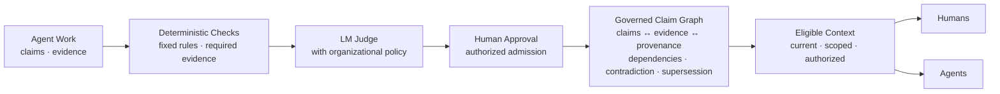
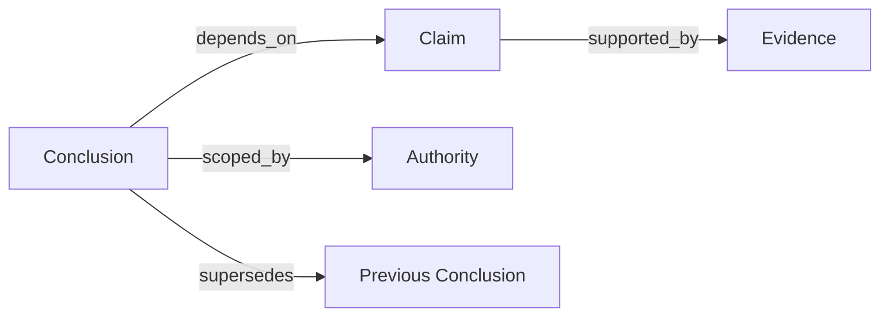

[//]: # (ob:6ec771b4)
<p align="center">
  
</p>

[//]: # (ob:de7999eb)
# Proofpress

[//]: # (ob:7542280e)
[](https://www.npmjs.com/package/proofpress)
[](https://www.npmjs.com/package/proofpress)
[](https://github.com/chenmingtang830/proofpress/actions/workflows/ci.yml)
[](LICENSE)

[//]: # (ob:e667d986)
**Proofpress — The Governance Layer for Agent-Produced Knowledge.**

[//]: # (ob:0e0e9d9a)
Agents don't just consume enterprise knowledge. They create a new knowledge
layer. Proofpress governs it.

[//]: # (ob:92fbc10e)
Proofpress gives a checkable answer to: **What may a future agent or human rely
on, why, and under whose authority?** It governs selected conclusions, claims,
and decisions produced through agent research, reasoning, and work—not the
enterprise knowledge agents start from.

[//]: # (ob:815b673d)
> Existing knowledge infrastructure organizes what agents reason from.
> Proofpress governs what their reasoning produces.

[//]: # (ob:2e6c722b)


[//]: # (ob:4ccd51b9)
## Quickstart

[//]: # (ob:d6f9f208)
Proofpress 0.5 is published on npm's `next` channel. It requires Python 3.11+,
Git, and Node 22+. Start with a clearly labeled synthetic ledger so the review
queue, admission boundary, and downstream context are visible immediately:

[//]: # (ob:7b197ac1)
```sh
mkdir proofpress-quickstart && cd proofpress-quickstart
git init
npm init -y
npm install --save-dev proofpress@next
npx --no-install proofpress setup --agent codex
npx --no-install proofpress demo
npx --no-install proofpress ui --scope demo
```

[//]: # (ob:33500636)
`demo` creates one admitted conclusion, one awaiting review, and one rejected
conclusion. It only runs when no Proofpress knowledge ledger exists, so synthetic
records cannot be mixed into an existing ledger by accident. To govern your own
agent output instead, replace the last two commands with the minimal real-data
flow:

[//]: # (ob:e719e2b5)
```sh
npx --no-install proofpress evidence import \
  node_modules/proofpress/examples/verified-knowledge-ledger/demo.otlp.json
npx --no-install proofpress propose --statement "The current conclusion" \
  --evidence EVIDENCE_ID --scope demo --proposer agent:runner
npx --no-install proofpress evaluate CONCLUSION_ID
npx --no-install proofpress review CONCLUSION_ID \
  --admit --reviewer human:reviewer
npx --no-install proofpress context --scope demo --actor agent:successor
npx --no-install proofpress ui --scope demo
```

[//]: # (ob:20fbea6e)
Each command prints the identifier needed by the next step. For the review UI,
agent adapters, legal fixture, and full walkthrough, see the
[verified-knowledge ledger guide](docs/VERIFIED_KNOWLEDGE_LEDGER.md).

[//]: # (ob:a62af198)
### What the quickstart creates

[//]: # (ob:f44cdb35)
This is a **local, Git-backed governance ledger**, not a hosted service or a
JSON database. Evidence, proposals, evaluations, and human decisions are
appended as auditable events on `refs/proofpress/knowledge`. The JSON fixture is
input; the `context` command returns a JSON projection containing only admitted,
current, in-scope conclusions eligible for the requested actor.

[//]: # (ob:c9727fd8)
`ui` starts a token-protected server on `127.0.0.1:7331`. Keep that command
running and open the complete URL it prints, including `?token=...`. The Local
UI exposes the review queue, admission receipts, trusted-context preview, and
claim lineage from the same Git event projection.

[//]: # (ob:e98261ca)
The screenshots below are the state created by `proofpress demo`. Repository
contributors can generate the same synthetic ledger in a disposable directory
with [`scripts/seed_local_ui_demo.py`](scripts/seed_local_ui_demo.py).

[//]: # (ob:08b34ea5)
**Review queue**

[//]: # (ob:e299976d)


[//]: # (ob:e463dbdd)
**Context projected for the next agent**

[//]: # (ob:2fb7d73d)


[//]: # (ob:0fc538bf)
**Expanded claim lineage**

[//]: # (ob:5810510f)


[//]: # (ob:1423b1c1)
## How it works

[//]: # (ob:821f22af)
Proofpress turns selected agent work into governed knowledge through five
steps: **extraction → evidence binding → verification → admission or review →
governed claim graph**. The three governance gates have distinct jobs:
**Deterministic Checks** enforce fixed requirements, **LM Judge** evaluates the
conclusion with organizational policy, and **Human Approval** is the only gate
that can admit it for downstream reuse.

[//]: # (ob:836f405e)


[//]: # (ob:09cd9aa3)
The governed claim graph is about agent-produced conclusions, not enterprise
entities. It preserves evidence and provenance, verification and review,
authority and scope, dependencies, and later contradiction or supersession.

[//]: # (ob:4fe9b290)
## Core objects

[//]: # (ob:9b060e32)


[//]: # (ob:b5752df0)
Proofpress does not turn a source or model output into truth. It makes the basis
and current eligibility for reliance inspectable. Rejected, unresolved,
expired, superseded, unauthorized, or dependency-blocked conclusions remain
auditable but stay out of default context.

[//]: # (ob:3ce2d48b)
## Current surfaces

[//]: # (ob:827e8ea8)
Available now: local ledger and CLI, local review and context UI, supported
agent adapters, artifact provenance, and portable Markdown/static-HTML
carriers. The `context` command projects admitted, current conclusions that
match the requested scope and actor.

[//]: # (ob:76acc27a)
A supported public API/SDK, MCP server, hosted service, and production
connectors are **planned, not shipped**. The local UI's endpoints are
implementation details, not a public integration contract.

[//]: # (ob:9c6c7f6a)
## Evidence, with the boundary attached

[//]: # (ob:30685e8d)
The strongest current product evidence is a frozen panel of **7 models, 3
Harvey LAB-derived legal task families, and 126 valid paired runs**. Across that
bounded panel, Proofpress governed handoffs raised rubric completion from
**89.3% to 93.4%** (+4.1 percentage points) and reduced observed unsafe
propagation from **8 to 0** across 63 controlled stress pairs.

[//]: # (ob:cf466876)
[](studies/long-horizon-eval/relaybench/PUBLIC_RESULTS.md)

[//]: # (ob:aea6ced7)
This is a descriptive product-mechanism result for frozen,
Proofpress-composed handoff episodes derived from public Harvey LAB Contracts
materials—not an official Harvey leaderboard score, a population-level causal
claim, statistical-significance result, or evidence of improved legal
intelligence. Read the [results, boundaries, and retained receipts](studies/long-horizon-eval/relaybench/PUBLIC_RESULTS.md).
Additional bounded evidence includes the [Athena/APEX working-set pilot](studies/apex-agent-eval/)
and the [artifact version-check study](studies/agent-handoff-artifact-provenance/).

[//]: # (ob:226a29fd)
## Product boundary

[//]: # (ob:cfc1c3aa)
Proofpress records selected evidence, candidate conclusions, lifecycle state,
scope, stated actor roles, policy recommendations, and explicit admission or
rejection. It does not automatically store raw prompts, transcripts, private
reasoning, casual brainstorming, or every save. Traces and external workflow
dispositions may supply evidence, but never become admission decisions
automatically. See the [privacy boundary](docs/PRIVACY_AND_DISCLOSURE.md).

[//]: # (ob:8deed5b3)
## Go deeper

[//]: # (ob:17d6b002)
- [Why agent-produced knowledge needs governance](docs/THESIS.md)
- [Ledger scope and integration boundary](docs/VERIFIED_KNOWLEDGE_LEDGER.md)
- [Two-minute portable handoff demo](examples/portable-handoff/README.md)
- [Results and evidence boundaries](studies/long-horizon-eval/relaybench/PUBLIC_RESULTS.md)
- [Documentation map](docs/README.md)

[//]: # (ob:fd00d6e6)
Portable fixture: [`strategy.md`](examples/portable-handoff/strategy.md),
[`strategy.html`](examples/portable-handoff/strategy.html),
[`proposal.docx`](examples/portable-handoff/proposal.docx), and
[`proposal.provenance.json`](examples/portable-handoff/proposal.provenance.json).

[//]: # (ob:44e3611e)
For a real handoff workflow, [open a design-partner conversation](https://github.com/chenmingtang830/proofpress/issues/new?template=design_partner.yml).

[//]: # (proofpress:meta:eyJhcnRpZmFjdF9pZCI6InBwXzU1NmIxMTVkZTcxMWIwY2QzM2VlZDI2MCIsInBvbGljeSI6InBvcnRhYmxlIiwicG9ydGFibGVfaGVhZCI6ImYwYTYyM2ZkIiwicG9ydGFibGVfaGVhZF9ldmVudCI6InBwZV82ZWI2MDcyY2QwNzk5NDBjMTE4YjQxYTUiLCJwb3J0YWJsZV9saW5lYWdlX2lkIjoicHBsX2VmM2MyZDU2NDRmOWRlZThmZmU5OWQ3ZCIsInByb29mcHJlc3MiOjF9)
[//]: # (proofpress:discovery:Verifiable revision history by Proofpress | https://github.com/chenmingtang830/proofpress)
[//]: # (proofpress:capsule:eNrtve1yG0eaLngr1eo4p202AdX3B3ume2mK7dZYtrWS7N4J0StlVWaRaIEABwWI5rQUMb9m_25sTJxLOLew__dS-sdG7F3s-2ZmZWUBVQWApGTLfj09NkmgMrPy8_14nif__oAtlpOSFctXE_7g6MHV1asoinPPi7hIPC93Cx4EQnA_dh8cPsjn_OYVn5yLagnfrS6YH8VHrCw5D5ibiJQXURaGsYgC4btFVHA38FJRiCQsAjd2sygIgohxPyr9uCzcrPQiv4By-aQq5m_F4ubB0d_xl-WrJTuHGqZsiVUdwg-5mMIfvheLSTlh-VQ4C_F2Uk3mM-cCvj9f3Dj5jfN0MZ-XVwtRVfDMFSvesHOBL9X682L-NwGvu1pggRfL5VV19PDh-WR5scrHxfzyYXEhZpeT2fmSzc7TwH3Yenoh_m01gZ9frSqxeFXMZ5WYQV8sFyvx_vDBhWDYiaXLYj8o-QP1l1firfwSdK54FYs8dhMfuibJstAtPC_NQ49F2LL5Yomv9mo6mQloeT0i01eiDAqfR3EYlhkXIi1LkWU84ep1dOteFeyqWk3hhX1sZzFf8OrB0cu_P9DV__0BjPJ8UeFP6mPBX-XQ5S8ffHslZsePnZM5Fz8--AFepJ4UUP-z0-NHX5-OL7GyfeYKWy4Xk3y1hCF6lbNqUuGMEdPyFaug65ZClrdaXswX2KA3kxkWWd1US3EJn8zYJY5cq2GH8HyFQ_7gaLaaTqGZxQWMkVBvmU_nxRt4JBZFknh5CF-H4VmKH_ElPvt__8f_8f_9z__xOfxR18Q4F6r_YB6Ja_jLP105bDo5n_3z2YMCOkwszh788WzmOP80uTx3qkUBf8emL6uH0_n5fFy9PT97AE8s4e963kFxy5srOePYgj14f9i0CnooyzKRt1rVmq697fpte1rrGnBiwSRtVZJEoe-nrrhFJS9_83J2denAGsQO_uGzel3Au4-ri4mY8mo8mT-E7zx8a60I7IXPB15bxHHCszS-RYsODtRiF9x5M5tfTwU_F85kVi5YBautWK4WwinnCwfm0Hw2v5yvKgdmCiyb2bIaaJErXJHxjN2iRc23nPPJW1E5ywvhzKAE52J1yWYONgard5gDewhsPrhNsVl1LRbOQIsyv8wL71aj9q_z1cKB0eDQH84bIa4qZ7KsnEtYLtPq0FnO5_ifS3EJ--Ohcz1fvKlgVxSHzpUYmqypF-VxEvBbjdrzJewSzoVYiKODA-flYjWT_eSOI1gsVxfMgQ20eFPht3747LfNL6PzgRbFsAPGLE5v0aI_Ol9Ols4l48Ip5vJfUzhN5gu2hDEcW2sLvvMGBnUCxU9hHxCzQgwt6DJhbhrdZtR232hwvy2monqohnAkj4fR0MiVeci8pGi16uRiPq-EHIUrtryAHxh2yBImaeXc4BTCmVFOBzeh3zq7FjO_Ht6lBCsyzyu9e2_jO-dxid912EL84z_-p_POaeai8-5s9m40Gsn_hx-dL1aTKTYNFqhetfOm2bKf1zo2gRPYazf6L_NrB_YiOLK4g3-dzFYMzzu10rZ059aHB7owC7yE-Tm_p9ZYa6DC_SMXy2shZs6CXeu-wSKgp7gcIF0lbHPlajkwGROXxzzM76vPfvPyhXpu1HqOLYqLyVLIA-FItu9iXtW7If6KBQ-0Mi_DPIpEcf99Oamc2XzpyJMB5_ES9pz5ArblBezBTg7mqZjxent2wIgdaGVYFDzy8qzVyv_VbJ5HzjnazzPdXPx4ePZteXRg7hVFkMTCb1syj2dQ1nTa3umHm_Bbp--hgcp5XGal76Z3q9waI_w-jNPVKp9OqgvoAxhjMHJ-Vzmv8WR_7aCJORPTsfN46aDxPzTfcy9LWOHdrXGvX7-uLs5ml2_4RJ7tuqWj5qR0_vt_dwre-VnTOjzrWq2LmAhT4d1x3F7DubS6eg2npHxQrTBt9XB2BYeZ3CauF7AkoQ_HTSMfXg5N79gtU--u4_r4El0o2Jfy-WoGHzpwkotLsYTVJX6UH6GJpn2YQ-zAKzx05jPhDJmMaZ7lQRBn9zKus6sfndFoNh_pHrSG0YGvcjQ7nIl6kbMzNAtmMJKvLgdG1nfLXLBY3K19p6y4gB3g8hLH72oBZpAaXGzSEu3wBdi6AnsVHG1j-cIOeTUetG6LuEjKuG1vn-oXBZt0Ig97oYaMwUiB3wgtkY0b2sB2LGJgLwncGOy3lN9ryx7P5HSCPyzE-QR6Z6H31QWYnfAj7CZ8XpbOklVvnGtpmTCHz4vVpZgN9GJRhnGcJvG9thV8vpOmZXIRj-r2VcsVvzmC9QLdhuXVf_f8h54Pq3-grQzmYiF4cq9tfXEBu3S1usJ1oealdlVH0tVCQ-5S4F49qS5xD5f2I3YybNxD_crTwivjNf9Ux2HMVoFr9K2YMeURDM3KLY8OWcWFL6LAD-6lJdYBx6bVHAxpWM7w_5U0Rq7AtKtjTaOmZDC7x87XbKC3fJcFfhm599JGZZub2fCybpGZauJHdnk1FT98pn-oHppGD7XRj5mfle1V_VecDZPqH__xX7i5KbsMfqmjYFsGdfvTQ-ZSWXhFwNh9tccaWh3jcyo45Qq0VIVZZAWUO-FsKY31YrrClVIdDnRbJNw8CMW9dRtYS3wutAG8Ws7BlZsUcB5JOxc2PXQtYJ5cXi0raRDPqmIxkb8MhtFg-rmCJe2j-GS1WKABAgfecrXN7dr48sDYhZnrF3mQ3rK2FxfyJEcTZIbDw8VbMYXVB76sCmZVR2ezg4NNYwWtlKEjNSuyMliz5HZvlh5VOTTglLDa8r0R4Asw6T3Bb5VYvJ3IUJEKL6HzUwx5KCkH6yDK2xvYl3N4a6GiTUOjYn9vYEC8hMe56_r71zFyXh5bjqI0UjHSc75Qfl19GP3wGRzG1cPjZyd_efzi9OTFd89Ox02boKeWD97_cFiH1B_oQ-hVsRBMhbTlJ3V8XLwqSz_IA9dNRQHucOIVUcgYD3ELhf6XHVnvezrqr2KHV3NonUxiLGRNGPCuf8N49w-YLphOihurBDuFYBUikxO3zC5U83L5qoRhEAtpEsonqtw7Ymlcum4Yp6xIROElflIUKecZE0kYeMzzY1g4WR4GrsjiouQFz2OwUvMySJkfyOAPzlSZjFCjdRSk76GjK3nO-PHITUd-8sJNj1z3KAx-D_92sdd0j6MvmEepyLMEZkjz17_fR-pCTjeVVbhg1QXuBKUXszhMo0KU8AVZhpVo0DPx7hkE3NbxM_j79YQvL-CTNIVfLsTk_GKpf4My_-nh1R871qJubRolMXS0F2duULfWSkDo1m7PK-jiolKUMS-TgrtRXZyVatDF3SWD0Hz7-vp6DF_5WyVTcTqFZ33987OZrgjdj51reYjfxqr-JDOJ_4y_7l3ryePmiZ3yhQ-Z3Derh3VgtHpYTMY3l9OHOYMDYO3V71akauIT2LJnlThyjq_QpB75Y7e3j2QbHk7VEyP9AD4xyqerunFPHp-cfvP89PP-ySZ4CKuIJ2HE03p2WGkfPTvuks0ZHxwMVA_7TxKzwgt5UVdv5Xg2AvP7p26W8yPn4OD6YlKA-26ZU2BV3ziPwQoDowajRvPrQxX7uLj508EBxotyOI0s88x-djk_mzXmWlWAWXBYrx04c-XWropTR9ghtngGNjGUwAXa8TfLC_R6FuJvsvTDs9lqBi84n76FXzDeMVngD-AzQanotx_iW65mKuc6-XdoUAkG2Eb0b9zf117hw5aZln4SmY3Ayl7pvr5LUupyUilTVb06uz6bGbOolatRra6g46c6GsEWi7kcLgzbattYpxHwD9UK7Jm3MKhns9rBgO4oobALR6eVB96cxUnmsdKPQ-mDyze3smRmkt8--aVHYaRH4XPn__m_YUVXQuVEdjVVLrl-MF_g5IBVxKAr2NQ4VfW2se-2A-OyEriNXv9pKcCmBWvnn2EewmH3CvpqORMLuQn19yBP0iguRBGJwG9OUJPV0z14l2QdBq-usG-GZrAbiYgnscilMaFOxiaTt_c53p2ggyGFxo0aP3gkZudgdQkclBHMjvn4atac_Y-nsCss9ejOSxiy5klH7pQ4qxk4Dzim0mPGpJU2aCxTwfNddwfzoPRCVhRJ7AdhYiZzkziszYO7Z_zqTk95FkV-ydPImCNWElDXd9fs3QLW-XQ5Galf6_3nnfPyS7m0urdheeS0d4Ft61LW__xicnUl63cuwDLTI673atMrWPuLhdqfpuIcliHMZ25ibOXkRzz3rADHW31GjswZOVLj_1A-_lDX_hf07qFyHTeEzZUVizksiisxh3KwLxSQpqpbwEzApwnT6GZ0xVf0R3V9p2_ZFPNfUCW-ihVoWzjFlE1UPc9g5NVcMcmUVjTxh8_wPxOopxVqNBEoa73UFT-utz0Z3lMHhsyeVfIwY83pgQ14DpvlNU5Ra5uYX8_q-IWJR8Df-vbOd1054Nqq9tIALGg3j0OvWTYmLdwsm9tkdus6Qu6GWRJ6wjf7k5Xs3bRm9s7XoqHVtnnOZmjITGaw0CbLsXNssicmHaEhc_LwgXP1EvqxCTCZqfqHM3hqiWc4zA3YFpUlVclmKIMGSlQTCQoC22--uNQr5g_NOQ6NLSfn0Ep-NmNc2wOONlqWN1ixY0wYeHxViYH9Pis5S8qS51mQGdelSUvr_rxLZhnX-R_sGdd8DAdvhcVYO460GXPdbj7-4TNzjjRVPVx2NGZkf6MPdaVf2uciBsdU8NQX9UtbWe7NSbR3onqBIUY4bcEKhcPnzQRXI1hqCxgX-InBiajzpSpAiZ2xYezWdi1Oj-mkFMUNPFYfMW-kodaxZTtwCJ5PcB_DrVsNv_NcWUlg9pSr6bQ1brL4Zh6Zino2gIGpFMdRmgZ5EWehMWCsrHyz_PdPrdc1cBYWSenmWcLqGqxsu6lhr8y5Mb_yoAyiOCykwaoMnyaZvjkn9k6MIyrWeQpeCXwxGHve78EjAWNODfA3aMz5_u-PBkwzL02yMsnylBsrwcqo6xbeKTsOWx1Yu7D1TJaYiL2UPzmjm_oX1amjUQW21oiLt1Yh_wu-9HD2djTS_tvw12QCHT5VGzVauT-ezeC1OhK89dj5IZjOPEhZadwuK5tf98wdMvNwmpew7Md_g_3q9dj5roK19No0ccrA5Xx96LwuVotqvngtz97XUMdrZT_B3gFnR52dk8c-zPmqGlhMkS9YmkR55gpzlloYgDqHfYd8Pm4y9sZxiP62PH3Am1oe1g4iQ5_6Cg6nSR0KMJtF7X7_Gzg-S3OI4hvLvUZGDySiemBSizgUPIq5G4e5sRkaOEF7Ut8WGgCWrrTemgHdwaDksJmP58vplRz0sy2Ttu7aEVq6S5nQcM5kgqPQeYemp8EhUa0bjUyrT79__Oj0m5PTV48fYRk4OA62AH7RRWtj5AhcZnAmt3WGHsiTb785efLd88fffgMFDz-jTfPWE6adOOawEYzUl6Atcioc1b8Ol1zPjLX3klNDv1S1KsBmreZbSlpNWoVs2RZ8N88jl4dx4ZvAmwUFqRPvd4B1vNav9trEnc5mJt7kbA03yaMXe2EEK0q5jW3vK79Bk7Fk4LdBZavJa5mbVu2bzgvwl_SowRJcgcmw7ow5V5YRcTarEyjgMVxdjJ0X8nAMnddWDzexx_F4_Nr0y_liDnvyQlzKHLm0RRm8K3Mw1gEGDWw4l5M6_lKtFrDfDFqdse9FHsu9wDMxSQsH05gKtwexmOBrLEIm3CKLzaFp4VoMFuj2oBT0E7mjiBYYZNxAhGgrVWA-DbZU2FeXU3QnNFRkuZiwaWVbyCOwebERvInEgSvhVHN8yIVnxs4XcKJgwXwig91WHa0acPl4PgY-dftGptGq2oExyhM3SFw_ZKlvDlULZdMkNW4NkdFNNY1vdYJ8Ucv812GktmcsaxgVbMFHOiWGcaPP93GkTQpswF9wwcbkLOVexIxla4F4dFfcBYGjwQAHB2AqHBw41cUcA7trrjq8i1hIiACccfgGlTZfCnbF8skUvT_YUU3KGo4ecEUucXuG3RL6YOyYEMRLCXKR_efodM5e4Ycz9E7hfcCa5dUhuA1wPsjVX6HlgFCaFtwC9xDl7a4uK2xGJdAJca6mTGJuOO6bMIuqK3Sj34q6TZXecxw0b8Cmqlv42uwHYOXOr2cqylLvDfCNgYkdBqJ0i4iHjJtQtQVzajaf_bFK9cEjeFGkQczC1NRgwZc2fYm9MUiLNxzfGrsV7Y1JcTb7y4uvn0jnH5YD7o4YQZDdqcmA0prD4Cke5WiEbvADMTOPu9sMY8wwZ-pwkAqtNjtwOUH39RgtPTi0wAiezWU4wxgzYqZwHLI5mOM5m1kB2-Vc-bs_4gvlN2hsQ7OUiYxFV7Km-UqeXkuhInnwkJwC8LZYnBr4Cmc11Dw02gH3QtcteVSEZWMEGJiWHou7YK3qWGCzkxzKBsKk1bHhl2YmHdcD-b2nzhf4WXvaT7999uL4iyenr46fvXj85-OTF6-ePz09kUE3NItemkefNl0JPy7nxXxqnHX95NNn335_-s0x2pPw44tvT759IguSg3szX6FxLtRGYPA37dwJWgeT2RvnxH8qB9oyDDCo84__-C8ZENHrbl6ezeQ3ZcxjOVGbERg7k3PcB1Q4qrqYXEnPCL80FQi9Aq8LozUDaSXXDXmUJGlYGEPBArA1a_VWELR6QxBpyZLYD93QOukMKm1zue6NK7PiN9I9gAmigzzyV20FOnCKYuBWxwKxlksYGV7vq_hmxhdrQjY4O5TRiSm6Zteygt-4vdT-HBjaV1ilPpxU-BGHZIV_lciOM20uDK2r2MvSMMw9HrlmXVkYudqwugPKbfIWu1HFCGHEoM8KVq3A5s0XuEvC85iKkzNKIDXawajE2Dn9Ecy3GXzNJBn4pAIHSltKM_zu2UyFae3TtelQLoqJ7hq7yXYYTbYOxmgt1fj02ePvj0_-9dXxN49ePXr8_OTJt8-3x81KkfuF8GKkOhsTtYHxWdmmHZB59a4XenkMlptfpmZ0LLCesVjugL_T21Hl_OM__y-zAEbyu13Bb_za2Uy524UOH5vkvSyjCQU2HrMdUWjDEcD5QCtlDNbSC-MNKdf90Dl58riOnzrfwY8dB_ihDrurxXI2q8_Uh-o8HenjdLFAB5Chwf-WTaZyYcErDQyniEoeFjyIyyg0vk0DSGwjR2-FMYTNW_LUYUVok3B0tVrI8EOdA4IeyxdzsPVEid0NM1UnwKZzTLBibkCnWyRERvqCOmIjnUFHIuOwgTo9rlLZI53KbrLlMtcK1cLKXMjOkanCkU4VouGp1tIYk5f96dFDbZCyet2PYPawERTWSu1LeAluXPK3D5SiH1qqGSysJPFTtzEdLVhns1S3wDXr0y0TkcRMgClaF2chOHVxd0Fmws5zNoMCDLboK7Men6i8OS46XCf66e9Pnz3-8-PTR6---ubbvz45ffTl6Sv572emKEw5otmCVnpv9EyGZ3bK28owm-5-8OduwLS8WEq0FtT14no-gsGEk8nZsMjWahgwx2RRT02cvsOv3zv9ulb4I33UqgG5ZFe6N9fb0D41oKqt54Z87tgOUsMz1ZvJdLpRuvTDpaDE7PyHz06-_ebFs8dffPfi8TdfatQLfEUe69M5fv6X42--PH3y7ZcGEuNgghj2XrDcfvjs-enJd88ev_jX5lFMUMDGALXgToQVPDp99e2fX0FFj747edH2oDUO-D1O9g51DcFhNndra0jBDqih9-NBZQ6lPyKqpvQTvR84L-DVf1LpDjmrGuWOYg_Jjp31Bi7nXK6zIcWJ-2GXb9a0yQm_E3N4h1fZFe2-WZTBqSt0Rl9nbz6vMelPwDfSDtTJi-PapQWzB0zVxhBpYpW1LT7uG4pdarI3_cUcN8Vb1muNyy71ttLF1eryEku-ZdXWkPVW_Qx29rfmnd-y6YSD7Xe9lrauTTqJ0cQRd2bs7eRcds9YjW09J_7-4PoCeQDPZKe1ipnCa1b1y7Ap2DoyoLjtpRxWYr5QrheVnpGBGPjSFAPJTePAZsTAL5jJlquhIUEMTpulyjmyqs4gaNCpgkdMwa4S2IG78yk8kQRBySI_jl1wxdwo9uI4iHzTvTZRwiYJ2OSJv9Mu9FF3od05MYYTYko7Ct93kz62MWDuheZS5B4843sFy4o4yFNXZDCqUZm4YcLdEuxkUXpJGvq-l8LETFALzeVR6fuFnwZe2f9KXUSX8MiPu4guMNcLPxNEdCGiCxFdiOhCRBciunwookvKkrxIUo9F7s-N6DIYuyHWC7Fefl6sl1RERR76SZlnnFgvxHr5-bBehjdSosAQBeaTp8DkcYl03SAAG-5XRoHRR6eCEW9Jpg3uBMSFIS4McWGIC0NcGOLCEBeGuDDEhSEuDHFhiAtDXBjiwhAXhrgwxIUhLgxxYYgLQ1wY4sIQF2YLFyaPc98PkpSpPbOfC_PkvsL3RIwhYgwRYz5tYozvsygsw_u5nuaF8sRw2WBERsHrzPJ6-VrmPMX5DXTL6_UFtr5PdlNLrOautUJTH74Ce1RbcKZiK1uloSFgxem4Vn0vtD5uNHFgqoEgehR7yBBCmZ3STYE-UmU2hAgZbu5vQ1Xn8UwsWGb_Cmc-y-dsIeuvvTpt3Zwv1Ig6eGf1fqwGEZZRkpe5V6YRSz0OLonrcumidLMaakT4dlbDz3kK7c7tWL8rwnvfDZD_KKSAqCgKaFlZei5LgsyPQz_hWRyngUjCOPGjMOM5_F66URi7acaLnJVJCWZ_CGZA6vW8TxcjIDnyow5GQAItzeCViRFAjABiBBAjgBgBxAggRgAxAogRQIwAYgQQI4AYAcQIIEYAMQKIEUCMAGIEECOAGAHECCBGADECiBFAjABiBBAjgBgBxAggRgAxAn7ejAA4bxgvEZvQpEosOIuFbL4tJsUeQet7sMHh4rKeRWjibk9LECN4W1PMOcHIvVYWPJuOYZR-HCyj9c3P1YScLKtWIc1SUu7oTuWtPfR5k3_VWwPRMoiWQbQMomUQLYNoGUTLIFoG0TKIlkG0jF5axoe5mGOfuyOYw1dohuIBj5SG2q-u4GWGrqroZkpgmfLxplB8lVFz44Sq5PoCPHR0zOWpqFEwG7dJqD0S6gNHci8WRBBnfhpmSem6SRYmaSlYlufSJOtkQRgU_HYWxP1fYjBA2ehQ_G_zFRr4_kfhK6Q8TDI3zYssyWIRxV5QZoxBz6ZQFAty7mdukOUi4lGaRhG8Rp4EkZ_EacwDkYb9r9RBWfD8I9froCyURSl8niREWSDKAlEWiLJAlAWiLBBlgSgLRFkgygJRFoiyQJQFoiwQZYEoC0RZIMoCURaIskCUBaIsEGWBKAtEWSDKAlEWiLJAlAWiLBBlgSgLRFkgygJRFoiyQJQFoiwQZYEoC786ykLG_LzkWZrmRfARKQvEMyCewb3yDIoegkHRwywo-igFiwkYHgu-_MCEAp0DeQWfydrvmVNg4dMsnX4b8tsLUR-6ksEqtpdU8ETdidDccaDSbgo3pJzftZ3c3klqt7CHXXD641UNRNqhkOaSB92UGgwk6QTqgNmPVOAL5oI9k_OChVkQRRFjOXfDoo9UYHDq20kF9zFku1MgtrIKGoT9x2EV-J5ICuEHWZwFRSgiz_d4wV3OihSOvCIDM9_neSD8MEsTEYDzFcKxFbAgz1Kee3uxCkLvKPA7WAVBFHIPTldiFRCrgFgFxCogVgGxCj4YqyAs_Jjji5bhp8cqKBQgnA1ZYWjx6RIfnT5__OU3r54eP3vxzemzV4-_eXH65bPjF4-__YaICkRUIKICERWIqEBEBSIqEFGBiApEVCCiAhEViKhARAUiKhBRgYgKRFQgogIRFYioQEQFIioQUYGICkRUIKICERWIqEBEBSIqEFGBiApEVCCiAhEViKhARIWfE1HhRAfNrOLXCrMvWqg3jBo7tQ6j24-kkAnfzeMMLHIwMl0vLeKQlSzz-0gKBvb-k5AUBigVW0kKDWD_F0hS8I_CrqsPmOtHsG0IIikQSYFICkRSIJICkRQ-FEkBppMoilzEQVL-4kkKQyX-tl3EyCpihEUQh4E4DMRhIA4DcRiIw0AcBuIwEIeBOAzEYSAOA3EYiMNAHAbiMBCHgTgMxGEgDgNxGIjDQBwG4jAQh4E4DMRhIA4DcRiIw0AcBuIwEIeBOAzEYSAOA3EYPkEOg4WqaUDxu6J4hiDzDf6hrsqKJzZV7Ri53ILMt2qxYm_3UMtsdZkLnEUvXz7wcJ9Ls3Hw32A66F-zYByqX3H80uYDd_zghx_6W2mFxT5gX6RFFJUiDO5QC-PKI9ERcm2IvTxGx509PH56-r810XScFAhXqwSczJPpfGntcVfixxE7H2hrCEalm6Xevbe1ElgX7OkvjWXVCjj2bccDbbXwf01bm3Ys4Kx4u9aSuwIEB1pjAVJ2bc1dECu7kZisfaWXxPRsvsKoloXqAfMNg1d17KtczP8dw6-4p48kGNmg9OSgjftGZePV6xrlHyrNjyo0ShQBg3PMG-Cf1d4NZ3Ulcx14dswxBwDOB8yMcV_P71Kj3b0quYTErXkL3-K8nUi_sc4h4WcVuNrDDbG21t7eBvfxcr7UTenoWRXk1j0Plu0lLjJz6Yxu3rhvr-0fZAHGa6GrNYF9lZJAn4U3S_svbPFW3DhPjr8YwSyAgUGXq1pNwW9TvTLu20N7a3-OIYuq9Uqy5t9V6CVI_x0nQLOpSDQRcusQGAemgEAPf9y3q65tPLrSY65BS7Uz-jVGOMWPYO5gElO6ORPozRsZ-IMRNVf92Nuq3EHHfXtkd83PxNLMmo1UlupyVlk4iCbRojq6hxD4NQKqeqZNx6DpmWT1uV5UTehJ5T5MO-QLW_2Cw9DepNdbqkNMKw3TaFaHBXDQy2R38mGS-zwowsgrPDdMgpgFeVDkLO0jHxo623byIdlZZGeRnUV21p3srN250oaqq8bqyD-0SLvhoWnskf--m5_7UTjJWeC6iDtJ4Snh55mX8CQQke8xkQRZGgqWRjwKszL0RcgR18njMPbTIInBbZYu814vusFUzo5c_8hNO5jKeZKGnh8UxFQmpjIxlYmpTExlYioTU5mYyj9jpvLHJul6URpHDPzjsrkFkEi6ny5Jt-7bbWTdvthh49rZifsRhncfwjnGbnKYyRcPn373BZz7r56dPv_uyYvnijZLzF1i7t4vc5dIrERiJRIrkViJxEokViKxEomVSKy_fBJrlPulHxZZ6BVpP4lV5qqWizmmaJdmxa4DHRScWLs6YOOBkzMvnYODxISagrNZR-5b-YOSAFuyy8l0InS4yfNjB1bqBOYdw9nhwNquDg7A7FY-Hhp9Z7N6b5c1Hm7GpBoUKSxiNqlkOfkCbW7FFsIxwcgbYuFlDhURHTJ7enDgfPb7cOxhJAwTCDg5JHK6-lzv7RIO6cxzRHLDD9A-VgrJSbti58wUDb2QYqkulKgd1Diwca7Qu3KbhPccJBiGRegzOPXyJmrSyZz9sxqFp60duEEBHSlXtAuJIMehHrDujnLavaQGa60PnI0uUB0w3iTeXshGjKwURJtpu6dr3N97BU9YmcZlyOJ4C9lWTmUb7qK7b7QOqpDnuZrzYCFYTGsZfaosCLO4mlRzDBXXPS17RYtFNwPhnGjyXoW-JlhdSKauSXGoXIeID2ZAJFMJ_8rniAqCnR89LIxwXK2mKgY4Rc4HOIKrik3PZjI0oVhJ0u1k0xHG7CRnQxG28J0050avaljDmhSsl-rZzA6z2cxfgzNp8NO1EaR5uzU86NajO6g8lXjMZSJ13Sbm0MAMrL3sthgBzL7LJsLyR8ASk_kHxZRHHM06SumoXuwYeFhez43hoZYZdI6EOT2HN3njeGPvbIYaVU6Q4vIqpSFxcGBAUIoMgnXBLrKcvxGa3BXGY_-_wdCgYaO_62BAFtqBOQhkN-PoWHvBEtE8aIPBuXExAaf4kv1NRgxGcgpxOC-Z5HyjOABOPC4KPBzHZzOb8dXQwacy0g_e_mg5HwlJOKvAezX14Fan8kqaGAQdhx0zkrsNuwSLdPLvNZ5RsrKRw6-4nHCWKv6JGIrkZlmYRF7ARFCaI9PCbdgH2S1BF4OUdVjaUwObk30-vWnR8o_Q_-1QgtgQT4AOubXUg5wOg2oPRubhsWT_NLtZE2eRvOwOPGMNdyP2O7Hfif1O7HdivxP7ndjvxH4n9jux34n9Tux3Yr8T-_2XyH5XGZg-Dvzap2tM-I1P23x48GMWRx-JFA_mXPkKQ6-LHka8PHsaRvxqhmthtisnvgEY3-6iOIs0YqGF7_OOQKuJ25iXyoNjeSX9yHVY9JKdYzCs8WoZn0ujU8dyYcgxbIJnzKHzZX3uN7ZCWaf11kiS1nv3NvBkyjRqWx43xqpYiOlEeq4KI10poJeRvp9OJAADw30axazigtcXEodaA4Z6uIzH-H4KcDQVYC0s6jetDU8MJPxu8E1_pwONOIJ47GPkQeKC1_qW1ck7ZL6MECDl6GBKDdDSGziT0Zw1J9tk1vZhMEZFlMZhkWSlG3tpyjJXRIJnvI_BaGguOzAYf2arYnfuZse9hW3aU0P2-Si0J56C75XFScSSoMjizAdDJQpEAQW5nHllXOaBx_wkT1kcRr6fRGEeumUQln7KYDT7X6lNcEpfeOlR5B75cQfBKSpCFiWMEcGJCE5EcPrpCE5uXrh5xF0WiiGC0_DRO8RhSrw48sHVFXkifnoO0_CZbVObOqGvUhpkf2rT2WyA2-TsS206mxG3ibhNxG0ibhNxm4jbRNwm4jYRt4m4TcRtIm4TcZuI20TcJuI2EbeJuE3EbSJuE3GbiNtE3CbiNhG3ibhNxG0ibhNxm4jbRNwm4jYRt4m4TcRtIm4TcZuI20TcJuI2EbeJuE0fh9v0gfhIu9B9nolyAU2u4TtwmMlOlqAPbU-CRWbuQpMRSEmuMWg5depi3gndekQWdnN8vtNupyoC9gPFJ8BQLphrOuLqmEE2R7tslAkzGhpS3cz9qDjQIcIL8EKbLOchAyMoS0tforw7qTiGkLGdivMB6DMDxKEOron3vptK8lHoM24uvCJzQ9_nLBV54oYeg0fiqCxkxMl1Y_hjkQZpFJV4w1Dg8iQO_SwNQvhZ9L9SF30mOPK77gcCs7jIk4ToM0SfIfrML5k-E8PGFLsJL8PU24M-00uT-WvNZTW-5NrxhnSZs9l89ifnrztzZe7zGiDiyhBXhrgyxJUhrgxxZYgrQ1wZ4soQV4a4MsSVIa4McWWIK0NcGeLKEFeGuDLElSGuDHFliCtDXBniyhBXhrgyxJUhrgxxZYgrQ1wZ4soQV4a4MsSVIa4McWWIK0NcGeLKEFfmQ3FldE71FXwmm9BFl5HNbegyqt0WWQZefhQlDz6Fu4CssixE7J3LsjCmdy7Lgjs2ZcGWYpkVU3YDK2qoVHvjNY1sEIy3L3ijuRZO8falmhxk01YDCmtK_evFjTaYpDde46jadwbt2ysWNOwea9roJgsxdY_VbPRbGYcMZnV0l2oYV86jzoK2cx-ThfK52LRBOWJWSAUImwAF_LiaIXNsoE-80A9yr1ibOhZ-cp6jh4e2oWEfnMjyv1ywofaCMbJrMVcXWxaN75W-z8p7b6Mdd18hRN441uocrw8UhUME22cOVWh3YWgnAhs8dCNx7-19_fr1pVhcsgkSEsB6xdNp6bz4Ak_gk5dnD04aUN1D402ePfhBfn6MXxiYtm5WwK7OgntvNZYh8_b1VWOKWIKP_s5CvygQQ-MmScNvoJfDUmS5n7mt9iJm1YKO1svsfJ04s2Xm7lqM2LKv5W7sKhT9_TbxuHl-Us9aWOhTBE_JAKtMRsjpuoGCHehSX8RF4ktE4v229-VvXn5ljqIm4GGiU0eqmU0j61qYUw1t6FES-by8_ylw2gB8C0lm0hGxPziTJf5Fh5Va6F3nmYLPDLQ3KITPw7Tdv48Q6I3puEuZiltdXmG9WyZo70OD22giUsHSO9b-Ys4ZePq8eVBZ5yoRI8sQHSsFnPDFfKBvkpgVhZ-wO7bu2MIq6gT-8dPHD58_-kpuMF-fPJXBDR1bOTgAb3w2Q0QTDOnQMRllReyFWat1uzJPtozlXQksZnyzQDA_Tu69jXclvXSREZpTJ4UNJ8vvvdF3IZjd5-2ly8lyqvNOymeEXpR7nWUNGhJnY3GYdbP_haStG1NloA5xQpinwYwnolKse1J7asXY9XIyK2rBgE6XrbcFzxVC10gPWK8KZ1IrQaH6VQVFm_i3liNA3GKzlY_73L3edhxzrrtBUsmvFpNKjCazq5XCFWCuSr7_fLXEv5k-MhnBPqdwt76vpvNzWAWms5fXczuKJT0y2I06OtlyE3ureiRKidtpXk2hMvtGVGVxZKaw9ZA0zQ4dWHxzaO9NJ91UosgMkUQmf65hXmF6c9znie7WR2p9y_Ccjul29pLOpzBo7OW4z0vdTbOjnE-hMNyhdNfjxbXXu7hn4z6ndYcJaDtt54v5Nbyq6kk27Vz_mxPe8l53qE_XUawWb4VhUM3msxFsoxdC55ZG6lvQydcw-d_Cmhv3ebJr--xGfV1enUHmKc-h6W9c611jabkg2-oz0LBmgl9NroS8BVrldyReS6Eu5F523mV4OhLxOO6zk7a1wtolDXuN8beTSmFLjBEpF6ZhkzcNGfeZQN0V18FiK1fFOy2kGsi8dp21ZcV0V4DJqH7DCdaJNpdw7l5I8Brsb7gLXCECrMcY6a7qmZCZWNWPJmUqtwPFwYYlUS5FnYG7lseGuFpiInaCYXidlxr3mRM7VGsxi9aTG4Xi2cwdpuesaYvdxB7lHnUl-I2yWzqY-DZQXok36KUiWh1rbdLWNq6-r9LTEqiqD88aplbPDH3C1SPWNzt2lwKKOU-DgAUsz8JUFAWLeB7w1N3YZ29n6DywVISMLs0ndqE3hbYptE2hbQptU2ibQtsU2qbQNoW2KbRNoW0Kbf-sQ9u7K74awVHVpiMvOrS1R9333dqiH0VPNfXiiOXw77JEQHPoBkWZxEEYu25QpsKNPC7A6g-K0IvgMAh5kYQ8SoO0zDyepuFur9fWVs1eeO6RHxx5XdqqKLmYFyIibVXSViVt1Z9MWzUKRRKmsZ8GjfJSl7aqNcP_8R__JR28Lxun9gnGGGT4Stqno6e1-2Rsv0H51TxOwNMTuVd6eb_86rEK7fH57HdL528rpUwjbY6uSKDEzt_oVBlYkxgjNR-ezWRUpFMHdDLEFOWwJ8JWG4o4cvt1S28hFGtU23qEYpHvvINQbP0SXUKJJpuoiGxNOtE4u2iorc4vdBvQZWOL4uLQIvsoIaWG7idpN0OBWBU-xjjsEP-28MOIe3kRNHp4m5qof3RO61RFU007jAL9ds5mYJlXSi9wMxo8Ppv9sWvU5dcVh9S8bd0xQ3yrDIx6VsI_MC_61UAxJNIdlBugDLtgs5dBHkRp2K_wedrV9xPF5s5h3GdSK3FRd4zOqbXynnq4wZNBXpGhp4Ghz8AAYZXhvklRBD6XLPcmH4ozQuVEx3r11_PpbNZqEqxAJJjdIBO2kokenEhH3QlvsGGwQ2Tqm01vsBFr07Zz8Ur9HASKL6TDZnT-FJe4mah203oyvFp-s5XolR3ZCAYOyXwVMCt4lBRgpfXrpXaHdZ48Q7Pj9KuXZ_bwmq30n_LFwz-ascVBQh5BQyuEX-rhkl9dGzH8XL2hjg9heEjtrfLr9bLH7-mFAz9hJ9Tff_pV_UTHRi_LsDM48LDWFYWf6mGV36pHVja_HlZdydOnL22zSn7fxAjg-y3GGvxuNkJVsgk0wEcm1qCL_vIY228iWSqistZ-nSSCp7WcWlMF6l2rgh5hz1mOKms6EWeq3MDr9zn9yhmN_ugcq38_Vb89fSr_Aw2S_310vEX3KoM5xYqUoWk-qE26a8x5gHwbeG4IDk6eJ1G_ROlxZXT25ld2Knc-m1-iyAMev5U4XBeX6DoxUEJkJTmomHbHTXvKdGgL1iE0EH5Qmh8SmVPAdEepmDVhrfp8qjl4y1quRoVvZNnO5Qqmd8lQyWLsfD2vT13UEpfs1xXuRPkC-g6F0ZHGW5-EDYRkOR_VxySS-lHPDPwiI5FjkeO1dIFSipTl4QvATDqfSO2Vpi-K-eJqJdOqspnqRHIqzBnimwxsNz5P_IinQRY0Rv6mAipMrqUUczy2eg_bLw0Tuxsf6k50nP8d__XO2eOfvgzmXgWNR7_b-fu7fneX78F35H__8Z__ZwuXdYH8yfmUHw2WUD9d_yPVFVpbVfdS7C20aXKnkeW8sv7BL_5-tO8_f1xfwQ-b9Yvv7ywnl2LbvsSDKIuyMMyZOeysXNimPNXeeawKvmlDc2B5KwTPlF0rvbt8vlxOYcmjDM7FpIRzUN1JYN0uVEmWfSUXmBWdnENhcqRrbWw7cmlciKGzPg55nIWlGxaGfmpl1ywb8I5psdoJifw0L4XrZ6y5QqDJlG06IXunuLgeAa0neCwJvnWCaaLZ-soHY44EFcFYYb1Hap9FenZV386E8gZaaBHq-NtKbgWwMqRJxjbCydIdQrcHdYcGnbEy9MvYDZgbsUYDv8nADdpY-6TOZFcc13_6wvzpi_psx2990Upj1J980feJNm9q2ZatFo3iGEtD6UrMsKSJMpy07GRlt1paEyfK1jg9tv70hfrTF_WfRs7TLUs7FDxxfTcrVHhZueZNvtBKFt420bcpO4AHLs6aQ0sQXOoaKW0Ouwf0iTy7kbphC62gwycKlYRyBHb_SPGoRsQIVgWmmearRSGU6rwSuNd4V7kkpMS39CXkPQ3q7JbMVCXQoQ1FJdItNW60TrfG9lqKSwMz2Y09Ly556QbCeJFWlrMtOn-H9GStheCVbpHB_wreqHQ2GUs73nLLVGOjJa8l9c7wi70TQUZHauFUKZRkNKkwEiKmXPeqlI6QhqQaiUZHvpkrY-dbKWOqSzisB-kQWqs1ZltSrLIP6zNgp9tr0iyN0qJknttsPFYGtQmp3jr1qTWca72OQxyBRoKvWSp1n9XC-jNH6knozbep1GirygHbeFVL2hJM3qWQRsnDBmZsChqZ1usI43Ztg4HYScBKP_V84QYm7GcldusIxx0ysm2tXrz0qEes177NqDU7tKgfW_GJgmHnK6n0coO7xNkMjz0Euiop312mju_7cRn4ZZGbqWMlh5uVvk-e11wtFJU5iwoviIvGLjCp33qvvkMWF4ODRqL4bKYlKbADpbTLhnqx0jBScjEo-NJkaFvy7JWWMTZSFJ2qL0YtRsu_KHkUS6q50XqWm0-FcdOujaB9f5bJMGp7pb4vslH1kP0zJCiXpl4Ctl-cRyaGbiW16-30DvnpGkSMEsJSEkb18nePf6duDlooR5IriV9ZwJqKG0cdUxTGVQa2aoDSQzWYXq0-ZwSVnI9yu0TXTUZW0v2j3GRkJdDpJiO6yeiXcZNR101zFuiCbpr7ud80R_fu0L07dO8O3btD9-7QvTt07w7du0P37tC9O3TvDt27Q_fu0L07dO8O3btD9-7QvTt07w7du0P37tC9O3TvDt27Q_fu0L07dO8O3btD9-7QvTt07w7du_OzuXdnhCYcLPGe63c6lci6WBFHLcCPYlDsrcPXJSl2H5XtJgZ2HzVtCHh1CmL9GYPFFlbcxv3aMPH99Pq6dK3uXNNuclT3X02nitT9V9Mp_oRIfr7OHTX428lu87pbed1aT71SyF8zLvqViVVUSLtW7Yk57ltNvVUpudeJjHJoSqPiimBnyCjbOoFTo_d6xF4xi7ycrIv3WquttyWnP16xWS1ObDGcarllHOvqAgbG5jF0slUsasphPy-lxT3pW7G7ieM3cVcjE63kY6VyOnqKkyZxtm32jvvW9PbpUoKVNMJcfctTsqLCetaM-9bzPtNEq1T3ClNjl0-KGl7Q1Z5x33rfohFuxvJmJB9egxGYwKnSix_ByTlqKAIyiLE2Pa09YLcBt_aGtRGvYVyGFNAjs_w1eyM6TpZDawxNP9U3DNRvbfW02QcmM_uaBnMbwAycQknU3k8uOUy9PEwSj2UZE26ZeHkaREkaWNckwNuD4yJJLbhWR2qtSoyH4aO0Zx6bMc2SMFrJRmdqu1Yy2SFkh5Adcks7ZHc1dKMj14jHpe-7peE-jjSeC8vQj0Iex4kIA555LA2TMheZyIXP_CL0mAuzWoQsy0UshO9BNwo3TJkoFAW755W65PBC-F-HHJ4bZ2GSgS9Gcngkh0dyeCSHR3J4JIdHcngkh0dyeCSHR3J4JIdHcngkh0dyeCSH9_OXw4tdlvHYzzIvKAbl8PaIQQ7YhRkvEu4VKWfeRxHDeyyFZWTDlNLK-n5rkkuV6jAVVQeDQzsJXamss5lmTRotuu0iek6_hh4SgXYU0eOFx_I48qO8oUH8ZCJ6NTvROVaid0qaTdk3tf3SpORskT3z5Bd7PPk9PPi9vR09rBXotGn3HVp2RoPu98r60R8-QWvHFuP7_e21-L5Xf1J1Nj8_kRJ9JyTR9zOQ6AvKKBDcz7248Acl-naN2_dvaYUXJ7kfh24o2S098nwv-nKe-grnSub5JK-6OpKsMMlxwE63IaqSFYJb_SYgFb9m46q70anN3iiJtrZoIAztLVUD_-C01f3OZtY8myIrCjcZLgMb9SaoRQTtTRR3QbndmvZKyOQWjbaA8yAO09znWT4o7_fY6v4OsTxb6q95-V-t3B8PwSbiSc6Yy35CuT9b6k-GMLbk-hW9ECdglwSgs7cCoOcVvAziIIgbqn6nAuAOmTnSAiQtQNICJC1A0gIkLUDSAiQtQNICJC1A0gIkLUDSAiQtQNICJC1A0gIkLUDSAiQtQNICJC1A0gIkLUDSAiQtQNICJC1A0gIkLUDSAiQtQNICJC1A0gIkLUDSAiQtQNICJC3Aj6EFCO4tWCpVnxigRdNqREp2JfD9bERxOoTZXq2z0OQXtKmhRZVg_1Dw_DpPZlODri9uRvgFhVdieP40pD7Vq0oW6xDNOlwoK9gT0E2XhMEbi3gysum-kjgkw8mKA9iQCaUJXTaUuDWuTBfR0EQJsCWLpQKidZOWHIuz1IzNq3UGit1NnWJ1tXibNBmu0fs17RqVk0WFVqGaIlCntHvgnWpideOeWPNLOzGHjRidpl9KX0N1bqFo_DXFGrqtcWR0i3p0ub6TUCYliQmv0oxhPcCTS3auzjITbTScolHN4bDnY9OSDuz5frJcrIhZgoABN2QeB_evEG4SJZ6tUgbmQWEmDuypb0XdUXAO3rSE9ezFaSS5jNbNdkmuX8xusLv6WYeWkP--Wyroo8gjJW6U-W4aZaVXsky4hRv7ceml0Ig0CFMWxV6Yu7wQSVrGSZhmBRNJ7gdpHIg85mH_K3XIIwXBked1yCPB6ZSGpS9IHonkkUgeieSRSB6J5JFIHonkkUgeieSRSB6J5JFIHmkfeaQ4BO8gccG3F2G_PNJvXv5VBySUj4_K-H3DIZuAH8L2yNW4qN63e36X8BHmYKdyJGSEa6fpItM3KtLUpVGE-IqF2EV3qIcY3263FeVXIRAJOB0480kNiNSAPhU1oJBFLEjdPGd59mtTA_rSnPNWEFg-32s-mCNfF_HMvIiJFyujytYJQhOnpYGDhfQoB71TTyIr5B10Xc_fVcdLa-Fdw4PLb97VikNfdH30hS5tPHK-bH58RmpDpDZEakOkNkRqQ6Q2RGpDpDZEakOkNkRqQ6Q2RGpDpDZEakOkNkRqQ6Q2RGpDpDZEakOkNkRqQ6Q2RGpDpDZEakOkNkRqQ6Q2RGpDpDZEakOkNkRqQ6Q2RGpDpDZEakOkNkRqQ6Q2RGpDpDZEakOkNvTx1YYs0ZSRjT_tkx-yyCL3qwTysTVHrJosNHdT067A8S0v1CF01O7Fzee1jsyJlouRcYAmGgcrDs-IQ8nfEqNztF0aVtehZhWsJa4tSGmD6nbs8R739X1v-2qdG0mqg1bBfmhhvcH8BxsZf6pPXgm6wyQ1NB16iI-ksdWpWGQ3zKmgIMmuWl3pV2jRIwx3SGFgrTfVKfyaY6gRtJIpN-4b_963fSTKyUy9bOMiyeyHUpr69zlY6dzIJ-H35ADZjLtzGVVcMBnFARMDrQi-QjdJ0vnslx5WSHp-IXWcpL3T06-t0mR2otfyXetBq8H6AJ_XCIqBHm2iz29q-N9GP4F9XMigOHaEzmZgh-2nwJSkSJVzhetzz01SP4nD1C_LvBmrU5x7LS5EuzsU7axrcGwVJiOps12FiTbFvTfF3WW1OsSRgvfd2kcfRe8pAjMYhZtg4vmeHwd-6Ikog0aXHitlhCaKSy_LS1aCaeHC_1wWlPg-4OfmEv_f80odek-hf-RHHXpPsReGYCqUpPdEek-k90R6T6T3RHpPpPdEek-k90R6T6T3RHpPpPdEek-k90R6T5kfeIInLAotM-gT1Hs6WY9WKh2RRmFelEs98XVoz6jQr8f4tCWkcRVGu1_FCWcS1a1IH6WkyZljq4mpj53n8liTiD0dTK-UAIiEcUD3rIehq2bvw-KVoAGGNQZmSlIWIS8iJqzQw65aU8oIqla5eq3vjMnRGkp9usL56t1WTgqe9W8rKAV2Cta7NrZG9go-9js-_sJqtS3bVL2D4uomrX_g4wcCUZGtfvn-JRLXuiLBppLvsYketl_xyWsjiQuYHpeTmcTeKwfVeggb7uNDT2U8UpuGGiaFfxcVbExQUfNIAI8E-NHxhjG2VNYkTjWrXdLq-d5X_wm6X_BL21azNhJTzInX1iNrOv_Eb3_S9PtX-MxxDZFdH7Sv_M1PrWeDzU9PzKfHcqIabaHft8TDYD48U2ZtDe38veEgWO-zIf_1ldf_kV-_6-ZHQf2ya3OpfuYrH_XA_viuUdCqmqdO9IeGAgefnXj1S0KJo41f_fod5a91o-tfe8b3EXSI2ozsLcfKyzQdgy7BqVTdmooasbRuroOjo6AbaLArtp6i6pli_gKl_EXuaHpOy4yXdkF4_WAzoOveUe0R2X5SjYe32ion9V9avx23euCpnv6ym5761i_fB3LAujbuegyGvyIH4kv5Db2_wx-fkuzbr0v2TWQcAb1-EmYJyb59KNk3aY3XFxTlAq0nzKRXelL1Z9HR-UL2hoqhttO7OXyZBOVIUI4E5UhQjgTlSFCOBOVIUI4E5UhQjgTlSFCOBOVIUI4E5UhQjgTlSFCOBOVIUI4E5UhQjgTlSFCOBOVIUI4E5UhQjgTlSFCOBOVIUI4E5UhQjgTlSFCOBOVIUI4E5UhQjgTlSFCOBOV2EJSDHb14M4LpN6rwgDVnXp-gnAs7S1AkQUtn6K8Se2WZKBUGyRTa15E1NCJDjCsrV6draqN4hwI6tqe6VXGQFaHai-6rVXDOVLV0AUYaFKcTrMRJWQp56stwrPTLWV7VOHF5QA0oQhV-UKZC-gj31dJ3WpHkHZSgwjyK0Ad_OEHTVc5T3CxscFwNkDvogik1olJwIvOY32Njv5WpBaY5BRj7QKgAIt21YfaHWpFA4Y1h8kM3K5NroFst-ErT0i3gm91lvCzoyd1L35DusvK0H6DtVlKkKX3HXOPutViRu6aWLbHB3Uu3HGmrdB3LrBs-VGLXnmE5zrcrdKOZlt_SlLjhC-1enmVh2epxjcHWW5Q6E-2iGthuU1RTwgKW3NvNbfmuuF4jg9eAeHet_a4o36FtzYJa7tqcu2Axh06DBtG3-7DsBfmra7IwYrvWdBcQ2dAqaaBdu7bkLtivIXXGBny1c5_cDZ01cApY2c1dG3OX9OfQADWptn1acttc3NC-3-Qgdm3JXZIUgyeQiafv0ye3DbgPtMQKXe68fO4Q2xxoiRUr2rUldwkm7SbVbPknazaoVps95hxTMvNZgZoVyv2pg654hFQ6PN3nX3SX-ucF6tYoQS7pMbCqVnjBQjtdhTVpYZObZTNcu-M-t6G7ASeYVEJNONu-PjRhtjUBMKnt1RI1s-x5pa0CzVhN2ULDEKRG9FsZo7cpjEaOw8ohjPtciJ6GG93sNvdCJcBUWsDuqIXSscYw-N9YIf0w2ePjPntnYzoaQWz8g6aWcTT3NAkX7ZnRYi6DG_V0cPSZOu6za3aoZaNszV8UiOhRX1FBAozbwn5VaYyBTt1jVrvPjNmh9ka5Wpkl0pCaYvoSBw7Fofoskx0KR5wuglqxoRb6vlrlnf1mGSN9hf8ZlY9qM0PB5BVRrqEalys4eM9XKGNgT5CmH8d9dsdgpa3O4vbryK1RbhRNI6yPJxjr0_vVuM_Q6Kv6a7E41-Ls9TnapOJqaKosT9WNU-McmisUUab9lXGfZdFbez2QMN3nyg1UdkVjzejet0i2EttTz1i2WEgBs3GfKbFH1W2z4W4tsEyILfNYFS-aVAsGYSVyQFrAGvBUNSJGXZPMshN2WDbGGtAMPwntgNpwo8UQyGBVliGwfVLNxLnsHJ1cxd2nzUrH-SSBCYUBA4_MN3BCKiB1nwEw3AJNmFV8AXXDQTtLA5-fr5hUONXrqm6LTrGNlPvc1xIr_NN7JcBjvTyVX4BSQJdsugkjV4tK-bvSjDSJbIn2gvVeSX9H4mRXS0zOjvuCRf2XRcBEmk9V4lG7EE2mcWPdV80QISNCzhhr3-lY8lZIaeuFEGbe11tIa7brvJk8KOx9V-de5PY77gs49db9lRBXLWCa9A2sGJTsBqiy2RTMNtBIDKp5inMZI5DgD17MuTRpxn2xqYEBudTQ6oGYFXYA1lTnMKU-2vXcvATMU1wsElQ-7gtgDYzHrLYhm0Vamx_y0gqZKBULYykaHFJfXGvodXO8H0MZvm_Vq5g9QkOOrNyRlrhRGjjqhNR6bUqNcHktxKwtiNPIr_XFyHpb9xQrmjXkBFm52kJqwoUMONt71vD-YEXSBvpfbg5KPgIDbKOFsl0cjKbh2JcY8YLBRnitlCFaG_Cuuz9OYfdgOjhu2_5TNIO1Il7LZjdqDjoMLrE03ZKV8JqWOc40wLtfprJGCFcXSM0zkoj6ANU7TD2Zmw3msG2Hool-aPp9HR1udw9vpSpxPVd73h1SMBFleemJMOQlS30Rs7wMhDVVtOfWJB8U3lPlsm6s97PvCjHXMWy_K4TyXZTvonwX5bso30X5Lsp3Ub6L8l2U76J8F-W7fpJ81-5XK5or65RFehQeWpfXZYemsUde-3K-5qK6j3I5Xy5iNw-LxM3dUKTg14eBm3hFEuVeVGQR97jIwjAqCi8IhF-mSeqWUVIGbuimvuuHe7_pxp198VEUHoVp1519eeBnHovpzj66s4_u7KM7--jOPrqzj-7sozv76M4-urOP7uzrubMvLYIk99M0bKQcrQyKzYK_XQKkpq6GYcByLy6TrLGXm5xIwxq-dUrjBjanyRTOsqtrtsDJvxUUhy23I9dtHfP68JS8NFSDulFq-QN6kXGexl7igtPpNRosTTrFyGHfJRty0MpPwBH9znkmLwSshZKX8zlKTk2nhta_9ubvlKLBBQOPFN_curXQXGsh-J8cXd_XcmGrinSyoxGiNwlEJZ2ubdG6iupivtL4rPr8h20iFwt1zQbj0mY3NX21Bnl8aDYYWfvp5sVlh3LYhIwEKMq3QmWgKIdphYwsqDsNmwNLHld4kwXerwKdAi89bd65meay5uOBBG19ujQ6DfrSQH2PBzZiIkUcm_mFc8m2zSpjnMl7JW_UZW3SLrq4-dOgMHXMwyjnkesVjSiPlRTTU-4uOa21xfEHdWYOJbit8tsX-HXaTj0I0qW9FeT1faF1BtzAWNcKP5vJS1l2sbLoslK6rJQuK6XLSumyUrqslC4rpctK6bJSuqyULiuly0rpslK6rJQuK6XLSumyUrqslC4rpctK6bLSD3RZ6Ye_ks_1PU_kWQ4nd3qv1-aZu8V2ujZPqo5XhsAqgep4xFdW0kAjgpV9VJ8GUk9AHo_1NWhGH7rztrN6_mvDqrHsWzq3Wt52II-Vi9Tz_MQPPDf7JC_z67yl7ye9oI2uZ_u0rmcLQ9gl0jyJ8rz8MNez_VkvyUZLWi9M63BUl3NprQG1xiWX-5pN3-hjGc5WIx2-OR1brO877td0Lxrdi0b3ot37vWhulGdJyWB-RyXdi_aJ3ot2Njvm5iayjSCKIdcs1_lQ-9x6pjJVsoh7uzvrJ71QKnODJOJpHJZlSBdKfYwLpZz7vREKb0pTOK52YY3DvutlUENuol-GZZEmuZ-ng_f0dDCj--de4Ya-n2R-GDTX7366F_Pc-S4cLM0A8ne6C-fFQmn6yfatXYsDi8K-FwdDvmt4s0MZV5MX5tS5945LcmSIueOWHOdnf0mOXwo4w4Urombz3Lwk5-Dg2L75BWnb9mUzTXzNvm9mPX6m15q9d7QvoHGG7p-BPeHg4KkVcTqb6ZATtma3u2LWolqHdVgLcw0Y12rB6mv8vNN9v4yGyCv3SF8Qozcehe1rX-mypkr2i7rChYeFy9Moy7Ms-ohXuNzjtSrPlOWlY1p1JsS63-SW5taO16rQjSP3c-OIjj-MpB5U3zUjH0BfpVsveBdxuKe28JkRSdwwE9ETlxurQmPCQzAjJIizPnHlKxsZPdQTsaKbul-qOhJsojwLIQ8_3M7ailom0t4tPWZE9rTely1taRpdC8xpZTD0mcqbBhdtaq7rUokOdXRvNl5nvCoNrJzircOwkcC39ZVbG3qWu4uBxZ4XiCgL3ITBPhYWLI5EEGWpreCm7JN6iDrapyadLQVWs7y3S4F9mDm5u-SZYbo3_HbvfTdj_aOQ9xORJEUel2EeJy7Li6wUfihSPwl4moQxi3KPC_hzEaZJHMR-woI0znnq5iJMeer3v1IXSz_uZumzJPHSEBpKLH1i6RNLn1j6xNInlj6x9ImlTyx9YukTS59Y-sTSJ5Y-sfSJpU8sfWLpE0ufWPrE0ieWPrH0iaVPLH1i6RNLn1j6xNInlj6x9ImlTyx9YukTS59Y-sTSJ5Y-sfSJpU8sfWLpE0ufWPrE0ieWPrH0iaVPLP17YekjXSBhLou81CWW_q-bpa-825qaZRbM8FWxdqus730Oe5714MXycrrbo_hN9bCym9l0DO3-cfDh1jc_VxvLBLdJq5BmVKU3sFt5aw9BZ5uJo2YpKRuQsgEpG5CyASkbkLLBT6xs0Kdp0KdmMKhj8CG1C-AkKl-hq7foES6QsalGuGAlST0zW7pgtppOe5QKrOi1jFvNlq9WM_VFKHu5WAmbLr4lrG3o4m_7oiV1tVZI-0NVa5ZtXacVDv5QdZqQXF2nFX_7aO9pgTGbojFZN1Ep9WqI2N81WBbecv8CN5pnIQD3L22jgy2Iyj20zYJiNKVJhotGhO7bdRbgYv8CN17WykbvX9rGy1pJXau02vhZLUq0_PafKyaHe7tCN5dtk528pxKt07Up0T6se4tSB4w9YUIRxJ4nthXFOJflXCkTD_6yafg4O9s9A-9msW6bBjXtWIh692hashct14xzw8HdtZ67kHQH3tjik-7akjsSToe2o4aHuEf335aoaAa9YSXuWutdaIsDg2FRB3dtyd24hV08s2bzNaSyXRtzF9bZ0JnXsLT2mha3pnGZLmg4W7tWfBdS10AXWHSkXVtyF77SQEssrs7uq-X2ZJ6BlligvV1bchdU39C6baLke0zQ_cPog2JUw_XdJag-ZAU1IaA93nyXGJGxEZqA0K413CVitJtwnOUk9ArHPROw0VxiCFOCGgpccEtRXMwwTmeslXGfr9Bb7skc4YyY0rN2N5MPHPd5CwPtvJoyRUDEpfGjRqjLlMElZokdG0c67vMf-ts7ZQqk0IlXNqGXcZ8r0VvwY0xb19zJxoqvVe3Gfa7E9p5ogtKwIivFQlUiGQr5rhHL4z73YoexM8j3JlfT514MtHcmJ5gF8KwV_ZZzg4-ojfxxn6exQ2t1tLOnLMvH6C3rK3EFG4oKoZpiTNB-3Odh9JZ3jC6B5IzDwYLCfo4SdkGL36ktfnj9jYnVuBxrzkWr4LWCMLKOfco6ZpZ1DG3sSWag5B8cvsLXlbbi5nnjgPl2rmUSG4nETmOkr56vZS3X-thni3MZ-9OJReiocZ-BN1ygtKFbUgty4NiM1XOtq3hr4-4tXizOVflwDCg0-_CstUz1XZqMG7BOkna10HI3dinNWltdpVme1HBpy-v5SLoOhvnQU6J1uG7pwaJ1oHbvgJaRsnWeSgixJRlqWSbdhVsO7fDL4-w_l2qmso6-V7dM_t0muzYdegdnQ-l1o7wnsIng6JgjWkLoKglNxYw3GKULcSWYFA9TrR_3WcbDbdZ09IK9Fax3dVq-4HBpaiqpYeopywprbJ2aG5GMbfPeck12em21zdmFdenXgvU0L1bVuhKt2hilFkKHUSX3ewWNU5Ji81q3t551-sDQ5CfY6eV2zI3y1X6qtCwTwo995gd-HoZukmR5Xrhlad4cUweW3qzRK92uN0uZBcosUGaBMguUWaDMAmUWKLNAmQXKLFBmgTILlFn4BWUWdr_kxNyVoQyWI-_QvjVD_oZtPQoPTbuPvPh992UZH-WCEBHnacnKOHKDmOdRESXc5ZkogtAr3CwqA9cH58UVKWyFDGyjAjcinkU89D0G_7nLS29cIZIc-cGRG3RdISJ84UZJTleI0BUidIUIXSFCV4jQFSKf4BUiJK1C0iokrULSKiSt8mlIq6RZnMWJy4MiSAZlwNdSJgNS35nr5WmYJlkjTba31Lel8D2gC4ealmezfUQtnV01LWt59U1RSyO_rMWWNXtTEoJFj6qgZADXUst_ULqKjZ6lJZta6P1_qdPKWrpSSZSiBmH_SMJ6Kf088VEN5XYy3X-tRXKdv0LvK01ec9lR3ZtnD35Q9_wYRWdp8X6JJ5t8ZGL6p7676aZ1p1F9cZEs5aRHF9qu_B__-V_NWOIvTQxJK2A3-rK1jG-jKYu3HlmSsrr2E1n7qS1FfNItRTxwZdKpUgc2SsStPzeKw_LPg_sSnMypiDw3CeN4i2hvF3IR447yOhk2cFtMW9NeGqlK1B7N5EYFeF_t38OWGOuQ6G-34G9rcAZNYvAykixkcVwOKu6uZTv796mkSNCjYnmcZf3CukPr5aQlTK4XRi3e_UqKd-M3cKT01PjK1vCW1NN3ahI2i8vMzndq5snvHNty5O0vWcLe6pYxGJb5qnJaDdsy_0rYOxiD_Zq5Yb9kqrVl92sy9ygyy1kmFZkdI8is3K69FJl_YgXW3dVXi8LLSxYykafD6qsdeer-KQt-TyySOGNu4fWrrbYjwz1x4d00UzeNl45A_g76BeDu7CiguoN0qtSBuoN2auHjfXBuyZIgvY126qElnHq4IbqgX0YLL0g_TysvbBdZdSyN1Za06tlsF21Vp1NalWT1SFaPZPVIVo9k9X7lsnokzUXSXB9Wmut-FZWKPHcjN49dVoaDikoIg1pzfZtYEYbqKgslpV_wxV9Onz9u5IlIlGk3USb7BoIkz1kY-SI34SYL7KpH5y4g1o8pC0ZiU3cQm1qjJuyECO-mM1sl9xIun1-gUzZTpEvHykvVzKtSzrmGjNPFYbQShmukiRZTyCo9F6W8YraXgmzl0nYssvZ9K5wdCsC5pQ4rWbFjHZgjYP1ldzGeTpQZrg4IzXOazJSWLJomrUuOJLMpv0FGbVFfRWpVP4EzmE9gFZqLLFssqGp1eakp13uQnSLw3dMoLN0kjhOUCi5EVkp8dzfZqUZW7U92uuXM3p2dZZBlFp7sfTcs7KOA5SIeQePS3I39OI1D4SVFGLhuyVkUgREWRYJl3M0yL0y5B1tS6ZdJ4QWRQMnmVF6k2_NKXVC48CjIuqBwWeJF0EMEhSMoHEHhCApHUDiCwn2CULgoLTIvzWF3jXeFwhHwjYBvBHwj4BsB3wj4RsA3Ar4R8I2AbwR8I-AbAd8I-EbANwK-EfCNgG8EfCPgGwHfCPhGwDcCvhHwjYBvBHz7aMC3dVHiPeBBQ5d4dIHRNlBvsIEv19FVMPQybQfbpKhl68FgWWAO2cDfKgx-zZSCfRfc6-kcs4Oy6OYhq5IGtqWxYDDfdFIVpuJ-0C0vLhMecHREvTzIfR6GXi5krK8bulUjgbZDt-5jbHYHmm3HbRkM00fBbYUFd2M3dwNRpDyCHs7ANMnh_wPYl2IvipMSCorK0PfCkCU8KVARtQzTVHAO1e2H24rgfx24rdIvoiQGz4lwW4TbItwW4bYIt0W4LcJtiSAIWFrGYJx494rbkl474bYIt0W4LcJtEW6LcFuE2yLcFuG2CLdFuC3CbRFui3BbhNsi3Bbhtgi3Rbgtwm0RbotwW4TbItwW4bYIt_Vrw22V3IUVLuL9L2E2F1jq6PeR8_I13nULa-0G3vz10MLYDfxltW2tFRr5BQsKd3IurU08cdUNo3DIzN5UaDuqvdmsWyvxpRtd5whl_H8h5PYsb6iV4eA-WJiOsNXVmderC4WNvsBNqr4L9_piArW_gS6tdcA0XgyPxkkl9kOKlVGZ-FkRCj_OgyyHtSs8l3thH1LMYI-2I8V-NrNhd3DcxgWU77txVx8Fa-bFPPbKgIfQicItShamXpIx5vEwdgOeRSV6zQnYU34ehx4TIvHBhhNRUbh-6LKe9-kCmiVHUdddmVniZdzLEgKaEdCMgGYENCOgGQHNCGhGQDMCmhHQjIBmBDQjoBkBzQhoRkAzApoR0IyAZgQ0I6AZAc0IaEZAMwKaEdCMgGYENCOgGQHNCGhGQLMPAzQrYl-EfhSGrrT95OhYmJN63d8BS2J973NY89aDF8vL6W6P4jfVwypozqZjeMMfBx9uffNzuXO0Cmi2W5kG2K2stYeGltGvEcKngv59QL61T9fgfBufboL6jsC8BPuP43t9ugA_X4Bv5vt5C9LVwrj0Yrp-8_K4b4PEkPN8tTxfzK87YQLObgg_q3HdCD-wp5S91LtVYxPAvQTHDyxhjBw16LoLsZg7M7bAHflt35WeT6dwksqnRJ0G362uyWyjLmVOqkMfP7vScTW0BJTP3hQ2ak7cxlR5O5FnfxOg0MkijDFJK3WxH1QwK9IoKsKAC5aHRc7dIi1YUBR9UEGDHtsOFfz5zKvd4ZHDWMEGOvdRsILCFV6aiDBx49gPQh5kWRnw2Odu4Akf9nEep2Bo56UIvSB3YTN33YjzMHe9CLxqvitWMD1yw6OwCyso0siL3aIkrCBhBQkrSFhBwgoSVvATxAoWYcoL308KOIBMiKqxTnTT72J0sMqpU1rzK5PLxujIbH55g4E9bLCwwsfNNfAP29akhQ9T1qQMKBMQkoCQBIQkICQBIQkISUBIAkISEJKAkASEJCAkASEJCElASAJCEhCSgJAEhCQgJAEhCQhJQEgCQhIQkoCQBIQkICQBIXcHQrLYZ6WXtW9B_avOOdvSgAqvMIhg-y1sw8OPdmzMRmQPHASeB9F9NKSxgw8OpPt76Hw5WY5yJuMzzb6tIxgHB7XPC453xxqqm1hkiZ-U_F766vVq8lphELCZy_kbMcOTZqnMFxUIwKTya89Pxi78n3eUBIH3eux8JQaaKLLUj72C3U8vgnEE3xOz6mIOzcwF7AOONAek_Y87hVpUMtZ9cFDdzKAWsAc6ITV1E900D0LB7mWg34EFL6NNsDxXwnlXB9zr0A-6KlZCW-eB3p3N3jmjUdNGBWXsQeNaK6QbjfsYXWEJx5AV4d4wegs2EnYKWodsps5C8EYaOIIOZ6KYZvci6K7rFMub6KCVrA7s27m6grkVlNNeIMfoOvQCTH8YrfJQi27-y_Nvv8GvrCrdQ5MZNsbGBqCJN-6b_lsbJzamtGwdBrac7x4ra2hZp4MPa9_qsI4Y6ui-ApSaOOa4b6p3N-fRpCqmEiphOgstXwRYcWwEmPEMO8FM27rSN5VunDW7KyHjgWiYj_umc3cznl_Mryt1qD7RobjWsqonaNOMhT2nJSIK9nMMs7BLE1JtRqkHwY3VyrmohgOdH3BlRdOG_oKVuasT0daUBd8JceAz4_OgC1O3-rDdX2oa7ofLZqUfRhHLs6jkYRbGbsYiHntZHy7bIHW347LpmKNjjo45c8ztTohYB9NH77ux8h9HSDjMw6hkIohKt2RxkOVJ4OYsgzUV89L10zIVIQuxVaVIvSgtI-HlKU95GLEsyHvep4Mc4AVHbteN9YEnUt_nGZEDiBxA5AAiBxA5gMgBRA4gcgCRA4gcQOQAIgcQOWAbOSBLSh9dtSIOzG5qRWfM7nyLGEu9X5cs5XEeZm6T67LCLhtYmf2DJxY4D20edjaTAVUMKOZwqI0tcFudrINhaID8Gjqgdt_GopGgPHYlAaVcnqAGNSod9kpGShaibG0jZpReK7yfbEp95xIiYmVs9w-yJzcxkguhqBJMPdeEFeWaYRNpUUhugQFRwlGiNpRD2GH1WrDxlObYKM3crAGV22CUfh4JWDFxqpx1BfxowlH1kXGHoJK4UtFg_f5nM9zMVFgTzmnMcKpoqUSNCee7Z0-QoaIW5aHG6ODXX_9J1vvP4_FY97sMrJ7NvnuM4VEddhatWO6hBaOo0USI-Fhh34yaAKwOisvmKUx-HQmXASkZLGbgQGBQX06MVjS430MXRRmX4LSkwpzHViDNBkzeMhxW7xMS0SmNjnrSOLb1AZ_YRBR2zSbSPrZeXH5noYHZtu0ydr4UcPjgyWL6QZ53FUqPYGz68mp5ozZ46-YybJFM9ytozUMM57-Sy_7VavJKHrNXN69_-Gzw80GcSiL8NBQuJtqNM9iEAHXn3imQN3L0v_HX37x8bvIFJqTfShzA8F3LiW3AzxK2MrJ7ue5he_0ak7zZdh_KnhitJvrhkaxBmuFOuyk9k9k0BofV7A8SqXY9dzqA84ONWKtEt2MjzkmENCKkESGNCGlESCNCGhHSiJBGhDQipBEhjQhpREgjQhoR0oiQRoQ0IqQRIY0IaURII0Lap05I08nwXwIjzYLWNMDpFlRH1wKGtcxTD4CwLbjJvmWZ8FFdVhBErhsH8dayOlDwuB--rpPXMgnSmxhbz4YNoeATLxN-Ht2mRQp1c1swy0A33R6a3zee3bQsa5psPq-pN1-bWFzNx2pINjJDKDlBOt5Vgru4HIFbrKBV6Iso-gyGAzA2hun9cd_06m2DuatBI3y5qlnyifC8M8m7KVvNGhxIhR5eM5bjvqm4CxPrYiHsN7ewDTpzWlvo9V0PGn7koPO5RDOzRJdn3Df5utvw1ITb5V0NGrZWz6rRcm7d9VBv6gh6UBEv8KYkP4tNpbWor6oYpH9t9v2JCkupMu2kNp_A9or0JX01hhkba_7LYdKj0cOxwvkln2_mTosuBf0GZu6FPKVwLsEhhlb32p0aioiW38g5If_qgBvAFtA8CRzHMBq4u1PpBjTDqMcoF6VMBsBZiM8uLxqK137sK84zzsOsDEVchkmRsDRmXtF_K4ahQmxnX9GWTlv6lvtJBrh_65Qd_7Ap9yh4303P-Sh8pLRM3bxkAfNZkYkkKsogz3wvLXLhZX4WenHoszRP8YYSsKwKWFlFUgZ-wYsk84tkl5frIiel3eSkLM04S8OAyElETiJyEpGTiJxE5CQiJ_2yyUlumcA6ibJQiOInJSc9l7NSps43_JdNr6WaW-jos9kGPLqORh_2yVQgzKB26ieXl-A4wZ40vRmgI3luVLJEME8w9uugIymCyv2xWbKgSLwYdhHmGRit5ULVPXgHz2gL9BtmpESVInZB-dXgTFtze4OwIh1t2KVhupkpiMkrlZyDfQI33ByjEz8KrpBcUt5E74m1iw1nSVFINg4cgTVY17mZrxYOzMwaP2TwYNUS1qnUQzG3aE5hQ5VYZxPeMSCTOjJiYh4Kgzcwk8HDgV0k42VQmr3dchzbM5n4asRXI74a8dWIr0Z8tU-LrxYxkaY550j22JevxvRd0_Jo0atQbkev1-yj14i5qmli0tpQ-U6EsqIfcb7JNlu3ZScyCS0hLHLuq-SCLE4e8sQ6I9YZsc6IdUasM2KdEeuMWGfEOiPWGbHOiHVGrDNinRHrjFhnxDoj1hmxzoh1RqwzYp0R64xYZ8Q6-wlYZ7e_rmMHzoLwsyxLYn4fd4HcJQUz1MQwDnjO76WJBwe7JJgGb0_xyzzhCqp4rz22b6ZoNy7a5h1Qm1ykZwoNVJl8LS59IVNR0Jrp6nJmpTEdtbNrNB2CH0YS_e7YmTCFrhv3zbTeS7HwBqyGZtV779RSgS7UElbg-3HflOmu6wm2T9XUgeCz3nYyq5O1MnII7Zuv1ihv1oTY_8U2R92gBnpes4vtpUcQpjBbjKp_WzF01ayRXLvXSw4eNITLofTiowyM1is8qZXJId8WW3vZ29e7k7cinH7CywK3DKKShRwcjzyVIJ5O8pahimwnb9HOSDvjbjvj7oTCddZTYLOevPfdpKaPQukq3Vx4XpkyEfhxnBciCBLBwzzOAnDoAxHl8CPzkjTxkxS-6mZQBXhRIvc9EaXRLi_XQenyvSMv66B0lUkqUsZionQRpYsoXUTpIkoXUbqI0kWULqJ0EaWLKF1E6SJKF1G6iNJFlC6idBGliyhdvwRKFy_K2PeKAnrK76d0HRzYlK7BqEHBfAwiFkluoB5W1N24Xj8PYtcA9C9OwyIPRZaFBgFjheZNv9w6wF5DuRgPWcaCLM-MT2HF3Dv66ydjnw0ER4l6RtQzop4R9YyoZ0Q9I-oZUc-IekbUM6KeEfWMqGdEPSPqGVHPiHpG1DOinhH1jKhnRD0j6tlPSz2zwugNon8tML87o8IKDu9fmgohdZOcrGb2kpy-gfdHGxUOPMTAoJXYCjFi-vEtWLJwTD752vnbip9fyiSuxurpsI7OSjcnHsMbmxC_U0i85RWcfSqohJHOvrffjYnF8koazNZZMjqXKCfEzCjPuP0-Kj-Abd54GR0oYPULXMn9YbHt9igr0y-vHkMzaYGpX3knFI6whC71NOMWHboftyj1QlFEUeIFCWcs9_wsDhMeeX3cIsNZ2M4t-jlO_d2ZVYbo0dA7_Pfd7I2Pwl1hPM1DGBgvzGOe-2niukmZuTzIeRFlYZmXMIiRz6A4niSFJ7I4YH7u-m7EQi9O-1-pi7HiH0V-B2MlCLwwTUNGjBVirBBjhRgrxFghxgoxVoixQowVYqwQY4UYK8RYIcYKMVaIsUKMFWKsEGOFGCvEWCHGygdhrAQZ87M89uIkF79ExsqjjnSQKvbGadgaDY3lD-hVPPn6bCYzVRtMFmeNyIL5oo0Ekk5o2YQW2znaidGS-knoJR5L02ZZfEBGyyP4crurTmRX9bFaNA7_kXz4X-DhJ187_4I9Jh8w2bY2Ekk_9C_yoWc1dcQ51v2lHjWECmSd1KOtn3xGvBnizRBvhngzxJsh3gzxZog3Q7wZ4s0Qb4Z4M8SbId4M8WaIN0O8GeLNEG_ml8ubWWO_SGANLGBRThFi_CHJLWAJzuCVXsFn0nfs4rdUN_DJZUNwWW_ep0t02Z0FwUrug3MUc7fwQx6VPEgZkxkvzSvJoftGoiwRxFLCwYJZ8frKlz84SIxyrP53GpKQYU4Y7PwvgjkxwBvZypxoWAQfhTnBeeKJiBUxL1I4oEUCzkocRG6U-iLiURAmUeBnomQJy1IouSgFLwPOishLAlYG-zEnwqMo6mBOuL5bhmHmEXOCmBPEnCDmBDEniDlBzAliThBzgpgTxJwg5gQxJ4g5QcwJYk4Qc4KYE8ScIOYEMSeIOfFBmBNRnAkwT8GUSJNfG3PCArVoasAab6K2NCu9cxvug9wsdLSFaahMzbzYZFSczXopFZPlTjyKkGdBkiah66XBT82j2Oy1YRpFf18Rk4KYFMSkICYFMSmISUFMCmJSEJOCmBTEpCAmBTEpiElBTApiUhCTgpgUxKQgJsWON5D03T3Sd-tI730jdNPIz-umkVM4cuH0k4dN990gN2j6dUWsD506Fq1ObzvCDCtq7_tEvqus9OLyYgFHIN4g4szkZSj2TRztbd_RzbfhiQ6us577Qr6bYYICn1AzTpodbNZETvmEwdFyiZ49ViG_qtqzggk1gnmJORQLayAvOjm6ZSftQZ0JYOFlYealblbkLA38sIxYWPZdIGKIEL8MGkw_cWgrDaahhHwUGoxwk9Irktz1Q7coyjiOkzSOgpgVrouYeCTICDfkgZsyjycsY3EZw8nMkjAA68nbjwaTHHluBw2GeWkaRnBEEQ2GaDBEgyEaDNFgiAZDNBiiwRANhmgwRIMhGgzRYIgGQzQYosEQDYZoMESDIRoM0WCIBvMhaDAZi7PIB5PUT9NfIg3mhUkPraeEnAtw7Zq02t_meXWE8MKuRNHBgSNmMN8KmYuXGCnpbaMlDPvswUGdR8Iv2twZcE8FM4dA73UkapkdHLQTUFDYRG318pQ8lwgZdcQ0V5M4azeTWA74NnJNEqLpksZ-xsKfmlyjuxUdGXxW9y-3C7nnG0vY1ObZ4P0vxLIhlg2xbIhlQywbYtkQy4ZYNsSyIZYNsWyIZUMsG2LZEMuGWDbEsiGWDbFsfq0sG5XL7-ParH26xrjZ-LTNu9F4g18C-8YtiyhI8zZXYTjdrqtlnMv26DSLTPqc_gi-DDexRJ2r7Ezz1A2IUs-NwHW-jwZ0Zs_qhGmdBsLzVgWXanNP7oIbk6yTBWR111orNO_mCcLylBEnWp0xqtuhwiOVJsJMwPo1TW2SreO-Puqu9Tm8W51khqKsPKqdLbbevL351xmfGsQrm9iZHOphAZ3USXJsQgOvxHeqs3DGzRedc6ROxcvIRtUMkGXJ2fab3VJliHW2dQ8-UJhLckqcx8yNOFi1mRdEoR_08YEMI2Q7H4jWWP8a252VZUg8qk1rpKSGoPNRSElFXsZ-koY5so7cOIyK2A1cEYsiRo5CnqY5ND8MkaXEkywok9D3siRjvpcmhSq74306GEmBdxR0MZISLw0LXsTESCJGEjGSiJFEjCRiJBEjiRhJxEgiRhIxkoiRRIwkYiQRI4kYScRIIkYSMZKIkUSMJGIkyRy7Jzwv5GHeADSt_ITprD2yDA0gU8BOWPhBaqaTlXgYmk47pg9umQca7D1dNfG4iMdFPC7icRGPi3hcxOMiHhfxuIjHRTwu4nERj4t4XMTjIh4X8biIx0U8LuJxEY-LeFzE4yIeF92i9MFvUVIWVB1uRsRBjVGYnbccf-l4auAq02ZZfdQzKANzfGC3wrfhQdy85TlqQtcqMD6fzmFP2PuaJYvuZVo60B59uZKVEhm4WumZhpQNNlnVpq6dmsK0WBkuFUZwsVENsgPdn-52XV9MpqIO9WI3qbxaYy6YQO5-pKpYwBmd-AV3kywL3cLz0jz0ZLq6k1RlSC2_iEuWBihlWy9Zaug9H4XPFHq-HyVpwEMvjpgfcU-wkEUs87Mgh20tLGIvKlgJb4GfZIUnCtdLMhHmeZZnYq9LloLkKMg6KE2ly2I_AI-DKE1EaSJKE1GaiNJElCaiNBGliShNRGkiShNRmojSRJQmojQRpYkoTURpIkoTUZqI0kSUJqI0_XwoTYWfQZf5RZwTpekDUJosxlF_jvH2lKbJcl8iU8jiPIh9l3nRJ05k6u9P4jIRl4m4TMRlIi4TcZmIy0RcJuIyEZeJuEzEZSIuE3GZiMtEXCbiMhGXibhMxGV6D__7_wEeiAru)
