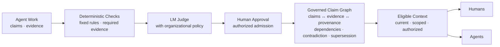
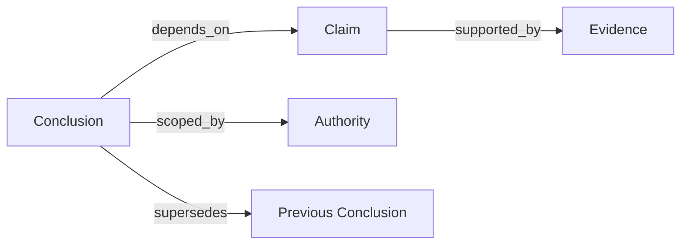

[//]: # (ob:6ec771b4)
<p align="center">
  
</p>

[//]: # (ob:de7999eb)
# Proofpress

[//]: # (ob:7542280e)
[](https://www.npmjs.com/package/proofpress)
[](https://www.npmjs.com/package/proofpress)
[](https://github.com/chenmingtang830/proofpress/actions/workflows/ci.yml)
[](LICENSE)

[//]: # (ob:e667d986)
**Proofpress — The Governance Layer for Agent-Produced Knowledge.**

[//]: # (ob:0e0e9d9a)
Agents don't just consume enterprise knowledge. They create a new knowledge
layer. Proofpress governs it.

[//]: # (ob:92fbc10e)
Proofpress gives a checkable answer to: **What may a future agent or human rely
on, why, and under whose authority?** It governs selected conclusions, claims,
and decisions produced through agent research, reasoning, and work—not the
enterprise knowledge agents start from.

[//]: # (ob:815b673d)
> Existing knowledge infrastructure organizes what agents reason from.
> Proofpress governs what their reasoning produces.

[//]: # (ob:2e6c722b)


[//]: # (ob:4ccd51b9)
## Quickstart

[//]: # (ob:d6f9f208)
Proofpress 0.5 is published on npm's `next` channel. It requires Python 3.11+,
Git, and Node 22+. Start with a clearly labeled synthetic ledger so the review
queue, admission boundary, and downstream context are visible immediately:

[//]: # (ob:7b197ac1)
```sh
mkdir proofpress-quickstart && cd proofpress-quickstart
git init
npm init -y
npm install --save-dev proofpress@next
npx --no-install proofpress setup --agent codex
npx --no-install proofpress demo
npx --no-install proofpress ui --scope demo
```

[//]: # (ob:33500636)
`demo` creates one admitted conclusion, one awaiting review, and one rejected
conclusion. It only runs when no Proofpress knowledge ledger exists, so synthetic
records cannot be mixed into an existing ledger by accident. To govern your own
agent output instead, replace the last two commands with the minimal real-data
flow:

[//]: # (ob:e719e2b5)
```sh
npx --no-install proofpress evidence import \
  node_modules/proofpress/examples/verified-knowledge-ledger/demo.otlp.json
npx --no-install proofpress propose --statement "The current conclusion" \
  --evidence EVIDENCE_ID --scope demo --proposer agent:runner
npx --no-install proofpress evaluate CONCLUSION_ID
npx --no-install proofpress review CONCLUSION_ID \
  --admit --reviewer human:reviewer
npx --no-install proofpress context --scope demo --actor agent:successor
npx --no-install proofpress ui --scope demo
```

[//]: # (ob:20fbea6e)
Each command prints the identifier needed by the next step. For the review UI,
agent adapters, legal fixture, and full walkthrough, see the
[verified-knowledge ledger guide](docs/VERIFIED_KNOWLEDGE_LEDGER.md).

[//]: # (ob:a62af198)
### What the quickstart creates

[//]: # (ob:f44cdb35)
The default quickstart is a **local, Git-backed governance ledger**, not a
Proofpress-operated cloud service or a JSON database. Evidence, proposals, evaluations, and human decisions are
appended as auditable events on `refs/proofpress/knowledge`. The JSON fixture is
input; the `context` command returns a JSON projection containing only admitted,
current, in-scope conclusions eligible for the requested actor.

[//]: # (ob:c9727fd8)
`ui` starts a token-protected server on `127.0.0.1:7331`. Keep that command
running and open the complete URL it prints, including `?token=...`. The Local
UI exposes the review queue, admission receipts, trusted-context preview, and
claim lineage from the same Git event projection.

[//]: # (ob:19441b49)
### Local service and Python SDK

[//]: # (ob:125385d7)
The supported integration boundary is the same versioned operation contract
used by the CLI. Start its loopback-only HTTP transport with an explicit Git
workspace and a token supplied through the environment:

[//]: # (ob:1522656b)
```sh
python -m pip install ./node_modules/proofpress
export PROOFPRESS_LOCAL_TOKEN="replace-with-at-least-16-random-characters"
npx --no-install proofpress service --workspace "$PWD"
```

[//]: # (ob:36d2266c)
The service binds to `127.0.0.1:7332`, rejects non-loopback hosts, caps request
bodies at 1 MiB, and exposes `/healthz`, `/readyz`, `/v1/capabilities`, and
`/v1/operations`. The Python SDK is a thin client over that contract:

[//]: # (ob:ca86b456)
```python
from proofpress_sdk import ProofpressClient

client = ProofpressClient.localhost(
    "http://127.0.0.1:7332",
    token="replace-with-at-least-16-random-characters",
)

evidence = client.import_evidence(
    "run.otlp.json", idempotency_key="import-run-001"
)
candidate = client.propose_conclusion(
    "The current conclusion",
    evidence["evidence"],
    scope="demo",
    proposer="agent:runner",
    idempotency_key="proposal-001",
)
client.evaluate_conclusion(candidate["conclusion"]["id"])
client.review_conclusion(
    candidate["conclusion"]["id"],
    "admit",
    reviewer="human:reviewer",
    review_request_id="review-001",
    idempotency_key="review-envelope-001",
)
context = client.context(scope="demo", actor="agent:successor")
```

[//]: # (ob:346d1b52)
`ProofpressClient.in_process(workspace)` provides the same methods for an
offline repository-local process. Both transports return the same results and
raise `ProofpressError` with a stable code, safe message, retryability, and
details. Transport authentication does not authorize admission: proposer,
deterministic verifier, advisory LM Judge, and Human Approval remain separate
roles, and only Human Approval can admit a candidate for reuse.

[//]: # (ob:979c37de)
[//]: # (ob:self-hosting-reference)

[//]: # (ob:4ec68d89)
### Self-hosting reference

[//]: # (ob:a8e55e66)
Proofpress also includes an experimental, single-owner self-hosting reference.
It lets one operator run the same governance lifecycle on infrastructure they
control and connect separately authenticated agents or devices. This is
open-source deployment software, not a Proofpress-operated cloud service, an
enterprise multi-tenant control plane, or an SLA-backed offering.

[//]: # (ob:511376cc)
Deploy [`render.yaml`](render.yaml) in your own Render account, or use the
examples under [`deploy/self-hosted/`](deploy/self-hosted/). Upstream pushes do
not automatically deploy into self-hosted instances; the operator chooses when
to adopt an update. After the first deploy, bootstrap the one-owner workspace
from a private Render shell and store the one-time owner credential and recovery
secret in a password manager:

[//]: # (ob:b7c24f21)
```sh
proofpress-self-hosted --database /var/data/proofpress.db \
  bootstrap --workspace-id workspace:personal \
  --owner-principal human:owner
```

[//]: # (ob:dcbc9415)
Do not paste the returned secrets into source control, deployment manifests,
logs, issues, or support requests. See the [self-hosting guide](docs/SELF_HOSTING.md)
for the authority boundary, deployment model, backup/export expectations, and
explicit limitations.

[//]: # (ob:08c573d5)
### Repository self-dogfood

[//]: # (ob:fff1b499)
Proofpress can use that same control plane to govern capability, boundary, and
limitation claims about one Git repository. First create a small JSON receipt
for each completed check. A receipt contains only allowlisted metadata and a
digest of any retained output; it does not capture raw prompts, credentials, or
full agent traces:

[//]: # (ob:9f34f9e6)
```json
{
  "name": "python tests",
  "status": "pass",
  "commit": "40-character-head-commit",
  "command": "python3 -m unittest discover -s tests",
  "output_digest": "sha256:64-lowercase-hex-characters"
}
```

[//]: # (ob:59cf6f0f)
Build a bounded bundle for one base-to-head change:

[//]: # (ob:10b4639c)
```sh
proofpress-repo bundle \
  --workspace "$PWD" \
  --base-ref origin/main \
  --head-ref HEAD \
  --check .proofpress/receipts/python-tests.json \
  --pr-number 72 \
  --pr-url https://github.com/chenmingtang830/proofpress/pull/72 \
  --output .proofpress/receipts/pr-72.bundle.json
```

[//]: # (ob:42ccc558)
The bundle binds repository identity, base and head commits, the exact Git diff
digest, changed paths, PR identity, and test or CI receipts. It fails closed for
credential-bearing remotes, mismatched commits, changed diffs, failed checks,
and unsupported receipt fields. Import and propose through the Python SDK; the
helper deliberately stops before Human Approval:

[//]: # (ob:297e9681)
```python
from proofpress_repo import propose_candidate
from proofpress_sdk import ProofpressClient

client = ProofpressClient.in_process(".")
prepared = propose_candidate(
    client,
    ".proofpress/receipts/pr-72.bundle.json",
    statement="The repository self-dogfood profile binds PR evidence.",
    claim_kind="capability",
    scope="repo:proofpress",
    proposer="agent:coder",
    idempotency_prefix="pr-72-repo-dogfood",
)
```

[//]: # (ob:f6f42549)
An independent reviewer uses `review_conclusion` to admit or reject the
candidate. Only admitted current claims enter `client.context(...)`. A later
admitted claim may explicitly supersede an older one. Claims classified as
`roadmap` remain auditable candidates but are deterministically ineligible for
admission, preventing planned work from appearing as a shipped capability.

[//]: # (ob:4d9cb39c)
This MVP is intentionally single-repository. It does not ingest Notion, scan
Git history into trusted knowledge, combine multiple repositories, or add MCP,
Cloud, customer-VPC packaging, and runtime-adapter ecosystems.

[//]: # (ob:e98261ca)
The screenshots below are the state created by `proofpress demo`. Repository
contributors can generate the same synthetic ledger in a disposable directory
with [`scripts/seed_local_ui_demo.py`](scripts/seed_local_ui_demo.py).

[//]: # (ob:08b34ea5)
**Review queue**

[//]: # (ob:e299976d)


[//]: # (ob:e463dbdd)
**Context projected for the next agent**

[//]: # (ob:2fb7d73d)


[//]: # (ob:0fc538bf)
**Expanded claim lineage**

[//]: # (ob:5810510f)


[//]: # (ob:1423b1c1)
## How it works

[//]: # (ob:821f22af)
Proofpress turns selected agent work into governed knowledge through five
steps: **extraction → evidence binding → verification → admission or review →
governed claim graph**. The three governance gates have distinct jobs:
**Deterministic Checks** enforce fixed requirements, **LM Judge** evaluates the
conclusion with organizational policy, and **Human Approval** is the only gate
that can admit it for downstream reuse.

[//]: # (ob:836f405e)


[//]: # (ob:09cd9aa3)
The governed claim graph is about agent-produced conclusions, not enterprise
entities. It preserves evidence and provenance, verification and review,
authority and scope, dependencies, and later contradiction or supersession.

[//]: # (ob:4fe9b290)
## Core objects

[//]: # (ob:9b060e32)


[//]: # (ob:b5752df0)
Proofpress does not turn a source or model output into truth. It makes the basis
and current eligibility for reliance inspectable. Rejected, unresolved,
expired, superseded, unauthorized, or dependency-blocked conclusions remain
auditable but stay out of default context.

[//]: # (ob:3ce2d48b)
## Current surfaces

[//]: # (ob:827e8ea8)
Available now: local ledger and CLI, the loopback local operation service,
Python SDK with in-process and localhost transports, a single-repository
self-dogfood evidence profile, local review and context UI, supported agent
adapters, artifact provenance, and portable
Markdown/static-HTML carriers. An experimental single-owner self-hosting
reference is also included for operators who want to run Proofpress on their
own infrastructure. The `context` command and SDK project admitted, current
conclusions that match the requested scope and actor.

[//]: # (ob:76acc27a)
A Proofpress-operated cloud service, multi-user organization management,
customer-VPC packaging, production connectors, and an SLA are **not shipped**.
The self-hosting reference is not evidence that those managed-product surfaces
exist. The local UI's endpoints remain implementation details; the localhost
operation service is the supported local integration contract.

[//]: # (ob:9c6c7f6a)
## Evidence, with the boundary attached

[//]: # (ob:30685e8d)
The strongest current product evidence is a frozen panel of **7 models, 3
Harvey LAB-derived legal task families, and 126 valid paired runs**. Across that
bounded panel, Proofpress governed handoffs raised rubric completion from
**89.3% to 93.4%** (+4.1 percentage points) and reduced observed unsafe
propagation from **8 to 0** across 63 controlled stress pairs.

[//]: # (ob:cf466876)
[](studies/long-horizon-eval/relaybench/PUBLIC_RESULTS.md)

[//]: # (ob:aea6ced7)
This is a descriptive product-mechanism result for frozen,
Proofpress-composed handoff episodes derived from public Harvey LAB Contracts
materials—not an official Harvey leaderboard score, a population-level causal
claim, statistical-significance result, or evidence of improved legal
intelligence. Read the [results, boundaries, and retained receipts](studies/long-horizon-eval/relaybench/PUBLIC_RESULTS.md).
Additional bounded evidence includes the [Athena/APEX working-set pilot](studies/apex-agent-eval/)
and the [artifact version-check study](studies/agent-handoff-artifact-provenance/).

[//]: # (ob:226a29fd)
## Product boundary

[//]: # (ob:cfc1c3aa)
Proofpress records selected evidence, candidate conclusions, lifecycle state,
scope, stated actor roles, policy recommendations, and explicit admission or
rejection. It does not automatically store raw prompts, transcripts, private
reasoning, casual brainstorming, or every save. Traces and external workflow
dispositions may supply evidence, but never become admission decisions
automatically. See the [privacy boundary](docs/PRIVACY_AND_DISCLOSURE.md).

[//]: # (ob:8deed5b3)
## Go deeper

[//]: # (ob:17d6b002)
- [Why agent-produced knowledge needs governance](docs/THESIS.md)
- [Ledger scope and integration boundary](docs/VERIFIED_KNOWLEDGE_LEDGER.md)
- [Run the single-owner self-hosting reference](docs/SELF_HOSTING.md)
- [Two-minute portable handoff demo](examples/portable-handoff/README.md)
- [Results and evidence boundaries](studies/long-horizon-eval/relaybench/PUBLIC_RESULTS.md)
- [Study catalog and evidence status](studies/README.md)
- [Documentation map](docs/README.md)

[//]: # (ob:fd00d6e6)
Portable fixture: [`strategy.md`](examples/portable-handoff/strategy.md),
[`strategy.html`](examples/portable-handoff/strategy.html),
[`proposal.docx`](examples/portable-handoff/proposal.docx), and
[`proposal.provenance.json`](examples/portable-handoff/proposal.provenance.json).

[//]: # (ob:44e3611e)
For a real handoff workflow, [open a design-partner conversation](https://github.com/chenmingtang830/proofpress/issues/new?template=design_partner.yml).

[//]: # (proofpress:meta:eyJhcnRpZmFjdF9pZCI6InBwXzU1NmIxMTVkZTcxMWIwY2QzM2VlZDI2MCIsInBvbGljeSI6InBvcnRhYmxlIiwicG9ydGFibGVfaGVhZCI6ImEyNzVkOTQ5IiwicG9ydGFibGVfaGVhZF9ldmVudCI6InBwZV8zOTg5Y2U2ZDk3YTM3N2ZkZTFlNTAyYTAiLCJwb3J0YWJsZV9saW5lYWdlX2lkIjoicHBsX2VmM2MyZDU2NDRmOWRlZThmZmU5OWQ3ZCIsInByb29mcHJlc3MiOjF9)
[//]: # (proofpress:discovery:Verifiable revision history by Proofpress | https://github.com/chenmingtang830/proofpress)
[//]: # (proofpress:capsule:eNrsve1yG0eaLngr1eo4p202AdX3B3ume2mK7dZYtrWS7N4J0StlVWaRaIEABwWI5rQcMb9m_25sTJxLOLew__dS-sdG7F3s-2ZmZWUBVQWApGTJfj09NkmgMrPy8_14nif__oAtlpOSFctXE_7g6MHV1asoinPPi7hIPC93Cx4EQnA_dh8cPsjn_OYVn5yLagnfrS6YH8VHRRh7XipSliV-6YYc_uuKgudMeKmflaIs04S7Io2LjEV-4bEy516eMzcTLos5h3L5pCrmb8Xi5sHR3_GX5aslO4capmyJVR3CD7mYwh--F4tJOWH5VDgL8XZSTeYz5wK-P1_cOPmN83Qxn5dXC1FV8MwVK96wc4Ev1frzYv43Aa-7WmCBF8vlVXX08OH5ZHmxysfF_PJhcSFml5PZ-ZLNztPAfdh6eiH-bTWBn1-tKrF4VcxnlZhBXywXK_HT4YMLwbATmZ9EPAuzB-ovr8Rb-SXoXPEqyNKsEDHPEhYkScmFJyLXZ9i7V_PFEl_t1XQyE9DyekSmr0QZFD6P4jAsMy5EWpYiy3jC1evo1r0q2FW1msIL-9jOYr7g1YOjl39_oKv_-wMY5fmiwp_Ux4K_yqHLXz749krMjh87J3MufnzwA7xIPSmg_menx4--Ph1fYmX7zBW2XC4m-WoJQ_QqZ9WkwhkjpuUrVkHXLYUsb7W8mC-wQW8mMyyyuqmW4hI-mbFLHLlWww7h-QqH_MHRbDWdQjOLCxgjod4yn86LN_BILIok8fIQvg7DsxQ_4kt89v_-j__j__uf_-Nz-KOuiXEuVP_BPBLX8Jd_unLYdHI---ezBwV0mFicPfjj2cxx_mlyee5UiwL-jk1fVg-n8_P5uHp7fvYAnljC3_W8g-KWN1dyxrEFe_DTYdMq6KEsy0TealVruva267ftaa1rwIkFk7RVSRKFvp-64haVvPzNy9nVpQNrEDv4h8_qdQHvPq4uJmLKq_Fk_hC-8_CttSKwFz4feG0RxwnP0vgWLTo4UItdcOfNbH49FfxcOJNZuWAVrLZiuVoIp5wvHJhD89n8cr6qHJgpsGxmy2qgRa5wRcYzdosWNd9yzidvReUsL4QzgxKci9UlmznYGKzeYQ7sIbD54DbFZtW1WDgDLcr8Mi-8W43av85XCwdGg0N_OG-EuKqcybJyLmG5TKtDZzmf438uxSXsj4fO9XzxpoJdURw6V2JosqZelMdJwG81as-XsEs4F2Ihjg4OnJeL1Uz2kzuOYLFcXTAHNtDiTYXf-uGz3za_jM4HWhTDDhizOL1Fi_7ofDlZOpeMC6eYy39N4TSZL9gSxnBsrS34zhsY1AkUP4V9QMwKMbSgy4S5aXSbUdt9o8H9tpiK6qEawpE8HkZDI1fmIfOSotWqk4v5vBJyFK7Y8gJ-YNghS5iklXODUwhnRjkd3IR-6-xazPx6eJcSrMg8r_TuvY3vnMclftdhC_GP__ifzjunmYvOu7PZu9FoJP8ffnS-WE2m2DRYoHrVzptmy35e69gETmCv3ei_zK8d2IvgyOIO_nUyWzE879RK29KdWx8e6MIs8BLm5_yeWmOtgQr3j1wsr4WYOQt2rfsGi4Ce4nKAdJWwzZWr5cBkTFwe8zC_rz77zcsX6rlR6zm2KC4mSyEPhCPZvot5Ve-G-CsWPNDKvAzzKBLF_fflpHJm86UjTwacx0vYc-YL2JYXsAc7OZinYsbr7dkBI3aglWFR8MjLs1Yr_1ezeR4552g_z3Rz8ePh2bfl0YG5VxRBEgu_bck8nkFZ02l7px9uwm-dvocGKudxmZW-m96tcmuM8PswTlerfDqpLqAPYIzByPld5bzGk_21gybmTEzHzuOlg8b_0HzPPbDqC-9ujXv9-nV1cTa7fMMn8mzXLR01J6Xz3_-7U_DOz5rW4VnXal3ERJgK747j9hrOpdXVazgl5YNqhWmrh7MrOMzkNnG9gCUJfThuGvnwcmh6x26Zencd18eX6ELBvpTPVzP40IGTXFyKJawu8aP8CE007cMcYgde4aEznwlnyGRM8ywPgji7l3GdXf3ojEaz-Uj3oDWMDnyVo9nhTNSLnJ2hWTCDkXx1OTCyvlvmgsXibu07ZcUF7ACXlzh-Vwswg9TgYpOWaIcvwNYV2KvgaBvLF3bIq_GgdVvERVLGbXv7VL8o2KQTedgLNWQMRgr8RmiJbNzQBrZjEQN7SeDGYL-l_F5b9ngmpxP8YSHOJ9A7C72vLsDshB9hN-HzsnSWrHrjXEvLhDl8XqwuxWygF4syjOM0ie-1reDznTQtk4t4VLevWq74zRGsF-g2LK_-u-c_9HxY_QNtZTAXC8GTe23riwvYpavVFa4LNS-1qzqSrhYacpcC9-pJdYl7uLQfsZNh4x7qV54WXhmv-ac6DmO2Clyjb8WMKY9gaFZueXTIKi58EQV-cC8tsQ44Nq3mYEjDcob_r6QxcgWmXR1rGjUlg9k9dr5mA73luyzwy8i9lzYq29zMhpd1i8xUEz-yy6up-OEz_UP10DR6qI1-zPysbK_qv-JsmFT_-I__ws1N2WXwSx0F2zKo258eMpfKwisCxu6rPdbQ6hifU8EpV6ClKswiK6DcCWdLaawX0xWulOpwoNsi4eZBKO6t28Ba4nOhDeDVcg6u3KSA80jaubDpoWsB8-TyallJg3hWFYuJ_GUwjAbTzxUsaR_FJ6vFAg0QOPCWq21u18aXB8YuzFy_yIP0lrW9uJAnOZogMxweLt6KKaw-8GVVMKs6OpsdHGwaK2ilDB2pWZGVwZolt3uz9KjKoQGnhNWW740AX4BJ7wl-q8Ti7USGilR4CZ2fYshDSTlYB1He3sC-nMNbCxVtGhoV-3sDA-IlPM5d19-_jpHz8thyFKWRipGe84Xy6-rD6IfP4DCuHh4_O_nL4xenJy--e3Y6btoEPbV88NMPh3VI_YE-hF4VC8FUSFt-UsfHxauy9IM8cN1UFOAOJ14RhYzxELdQ6H_ZkfW-p6P-KnZ4NYfWySTGQtaEAe_6N4x3_4DpgumkuLFKsFMIViEyOXHL7EI1L5evShgGsZAmoXyiyr0jlsal64ZxyopEFF7iJ0WRcp4xkYSBxzw_hoWT5WHgiiwuSl7wPAYrNS-DlPmBDP7gTJXJCDVaR0H6E3R0Jc8ZPx656chPXrjpkesehcHv4d8u9prucfQF8ygVeZbADGn--vf7SF3I6aayChesusCdoPRiFodpVIgSviDLsBINeibePYOA2zp-Bn-_nvDlBXySpvDLhZicXyz1b1DmPz28-mPHWtStTaMkho724swN6tZaCQjd2u15BV1cVIoy5mVScDeqi7NSDbq4u2QQmm9fX1-P4St_q2QqTqfwrK9_fjbTFaH7sXMtD_HbWNWfZCbxn_HXvWs9edw8sVO-8CGT-2b1sA6MVg-LyfjmcvowZ3AArL363YpUTXwCW_asEkfO8RWa1CN_7Pb2kWzDw6l6YqQfwCdG-XRVN-7J45PTb56fft4_2QQPYRXxJIx4Ws8OK-2jZ8ddsjnjg4OB6mH_SWJWeCEv6uqtHM9GYH7_1M1yfuQcHFxfTApw3y1zCqzqG-cxWGFg1GDUaH59qGIfFzd_OjjAeFEOp5FlntnPLudns8ZcqwowCw7rtQNnrtzaVXHqCDvEFs_AJoYSuEA7_mZ5gV7PQvxNln54NlvN4AXn07fwC8Y7Jgv8AXwmKBX99kN8y9VM5Vwn_w4NKsEA24j-jfv72it82DLT0k8isxFY2Svd13dJSl1OKmWqqldn12czYxa1cjWq1RV0_FRHI9hiMZfDhWFbbRvrNAL-oVqBPfMWBvVsVjsY0B0lFHbh6LTywJuzOMk8VvpxKH1w-eZWlsxM8tsnv_QojPQofO78P_83rOhKqJzIrqbKJdcP5gucHLCKGHQFmxqnqt429t12YFxWArfR6z8tBdi0YO38M8xDOOxeQV8tZ2IhN6H-HuRJGsWFKCIR-M0JarJ6ugfvkqzD4NUV9s3QDHYjEfEkFrk0JtTJ2GTy9j7HuxN0MKTQuFHjB4_E7BysLoGDMoLZMR9fzZqz__EUdoWlHt15CUPWPOnInRJnNQPnAcdUesyYtNIGjWUqeL7r7mAelF7IiiKJ_SBMzGRuEoe1eXD3jF_d6SnPosgveRoZc8RKAur67pq9W8A6ny4nI_Vrvf-8c15-KZdW9zYsj5z2LrBtXcr6n19Mrq5k_c4FWGZ6xPVebXoFa3-xUPvTVJzDMoT5zE2MrZz8iOeeFeB4q8_IkTkjR2r8H8rHH-ra_4LePVSu44awubJiMYdFcSXmUA72hQLSVHULmAn4NGEa3Yyu-Ir-qK7v9C2bYv4LqsRXsQJtC6eYsomq5xmMvJorJpnSiib-8Bn-ZwL1tEKNJgJlrZe64sf1tifDe-rAkNmzSh5mrDk9sAHPYbO8xilqbRPz61kdvzDxCPhb3975risHXFvVXhqABe3mceg1y8akhZtlc5vMbl1HyN0wS0JP-GZ_spK9m9bM3vlaNLTaNs_ZDA2ZyQwW2mQ5do5N9sSkIzRkTh4-cK5eQj82ASYzVf9wBk8t8QyHuQHborKkKtkMZdBAiWoiQUFg-80Xl3rF_KE5x6Gx5eQcWsnPZoxre8DRRsvyBit2jAkDj68qMbDfZyVnSVnyPAsy47o0aWndn3fJLOM6_4M945qP4eCtsBhrx5E2Y67bzcc_fGbOkaaqh8uOxozsb_ShrvRL-1zE4JgKnvqifmkry705ifZOVC8wxAinLVihcPi8meBqBEttAeMCPzE4EXW-VAUosTM2jN3arsXpMZ2UoriBx-oj5o001Dq2bAcOwfMJ7mO4davhd54rKwnMnnI1nbbGTRbfzCNTUc8GMDCV4jhK0yAv4iw0BoyVlW-W__6p9boGzsIiKd08S1hdg5VtNzXslTk35lcelEEUh4U0WJXh0yTTN-fE3olxRMU6T8ErgS8GY8_7PXgkYMypAf4GjTnf__3RgGnmpUlWJlmecmMlWBl13cI7ZcdhqwNrF7aeyRITsZfyJ2d0U_-iOnU0qsDWGnHx1irkf8GXHs7ejkbafxv-mkygw6dqo0Yr98ezGbxWR4K3Hjs_BNOZBykrjdtlZfPrnrlDZh5O8xKW_fhvsF-9HjvfVbCWXpsmThm4nK8PndfFalHNF6_l2fsa6nit7CfYO-DsqLNz8tiHOV9VA4sp8gVLkyjPXGHOUgsDUOew75DPx03G3jgO0d-Wpw94U8vD2kFk6FNfweE0qUMBZrOo3e9_A8dnaQ5RfGO518jogURUD0xqEYeCRzF34zA3NkMDJ2hP6ttCA8DSldZbM6A7GJQcNvPxfDm9koN-tmXS1l07Qkt3KRMazplMcBQ679D0NDgkqnWjkWn16fePH51-c3L66vEjLAMHx8EWwC-6aG2MHIHLDM7kts7QA3ny7TcnT757_vjbb6Dg4We0ad56wrQTxxw2gpH6ErRFToWj-tfhkuuZsfZecmrol6pWBdis1XxLSatJq5At24Lv5nnk8jAufBN4s6AgdeL9DrCO1_rVXpu409nMxJucreEmefRiL4xgRSm3se195TdoMpYM_DaobDV5LXPTqn3TeQH-kh41WIIrMBnWnTHnyjIizmZ1AgU8hquLsfNCHo6h89rq4Sb2OB6PX5t-OV_MYU9eiEuZI5e2KIN3ZQ7GOsCggQ3nclLHX6rVAvabQasz9r3IY7kXeCYmaeFgGlPh9iAWE3yNRciEW2SxOTQtXIvBAt0elIJ-IncU0QKDjBuIEG2lCsynwZYK--pyiu6EhoosFxM2rWwLeQQ2LzaCN5E4cCWcao4PufDM2PkCThQsmE9ksNuqo1UDLh_Px8Cnbt_INFpVOzBGeeIGieuHLPXNoWqhbJqkxq0hMrqppvGtTpAvapn_OozU9oxlDaOCLfhIp8QwbvT5Po60SYEN-Asu2JicpdyLmLFsLRCP7oq7IHA0GODgAEyFgwOnuphjYHfNVYd3EQsJEYAzDt-g0uZLwa5YPpmi9wc7qklZw9EDrsglbs-wW0IfjB0TgngpQS6y_xydztkr_HCG3im8D1izvDoEtwHOB7n6K7QcEErTglvgHqK83dVlhc2oBDohztWUScwNx30TZlF1hW70W1G3qdJ7joPmDdhUdQtfm_0ArNz59UxFWeq9Ab4xMLHDQJRuEfGQcROqtmBOzeazP1apPngEL4o0iFmYmhos-NKmL7E3BmnxhuNbY7eivTEpzmZ_efH1E-n8w3LA3REjCLI7NRlQWnMYPMWjHI3QDX4gZuZxd5thjBnmTB0OUqHVZgcuJ-i-HqOlB4cWGMGzuQxnGGNGzBSOQzYHczxnMytgu5wrf_dHfKH8Bo1taJYykbHoStY0X8nTaylUJA8eklMA3haLUwNf4ayGmodGO-Be6Lolj4qwbIwAA9PSY3EXrFUdC2x2kkPZQJi0Ojb80syk43ogv_fU-QI_a0_76bfPXhx_8eT01fGzF4__fHzy4tXzp6cnMuiGZtFL8-jTpivhx-W8mE-Ns66ffPrs2-9PvzlGexJ-fPHtybdPZEFycG_mKzTOhdoIDP6mnTtB62Aye-Oc-E_lQFuGAQZ1_vEf_yUDInrdzcuzmfymjHksJ2ozAmNnco77gApHVReTK-kZ4ZemAqFX4HVhtGYgreS6IY-SJA0LYyhYALZmrd4KglZvCCItWRL7oRtaJ51BpW0u171xZVb8RroHMEF0kEf-qq1AB05RDNzqWCDWcgkjw-t9Fd_M-GJNyAZnhzI6MUXX7FpW8Bu3l9qfA0P7CqvUh5MKP-KQrPCvEtlxps2FoXUVe1kahrnHI9esKwsjVxtWd0C5Td5iN6oYIYwY9FnBqhXYvPkCd0l4HlNxckYJpEY7GJUYO6c_gvk2g6-ZJAOfVOBAaUtpht89m6kwrX26Nh3KRTHRXWM32Q6jydbBGK2lGp8-e_z98cm_vjr-5tGrR4-fnzz59vn2uFkpcr8QXuwWnnH1LRiflW3aAZlX73qhl8dgufllakbHAusZi-UO-Du9HVXOP_7z_zILYCS_2xX8xq-dzZS7XejwsUneyzKaUGDjMdsRhTYcAZwPtFLGYC29MN6Qct0PnZMnj-v4qfMd_NhxgB_qsLtaLGez-kx9qM7TkT5OFwt0ABka_G_ZZCoXFrzSwHCKqORhwYO4jELj2zSAxDZy9FYYQ9i8JU8dVoQ2CUdXq4UMP9Q5IOixfDEHW0-U2N0wU3UCbDrHBCvmBnS6RUJkpC-oIzbSGXQkMg4bqNPjKpU90qnsJlsuc61QLazMhewcmSoc6VQhGp5qLY0xedmfHj3UBimr1_0IZg8bQWGt1L6El-DGJX97Tyn6oaWawcJKEj91G9PRgnU2S3ULXLM-3TIRScwEmKJ1cRaCUxd3F2Qm7DxnMyjAYIu-Muvxicqb46LDdaKf_v702eM_Pz599Oqrb77965PTR1-evpL_fmaKwpQjmi1opfdGz2R4Zqe8rQyz6e4Hf-4GTMuLpURrQV0vrucjGEw4mZwNi2ythgFzTBb11MTpO_z6vdOva4U_0ketGpBLdqV7c70N7VMDqtp6bsjnju0gNTxTvZlMpxulSz9cCkrMzn_47OTbb148e_zFdy8ef_OlRr3AV-SxPp3j5385_ubL0yfffmkgMQ4miGHvBcvth8-en5589-zxi39tHsUEBWwMUAvuRFjBo9NX3_75FVT06LuTF20PWuOAf8LJ3qGuITjM5m5tDSnYATX0fjyozKH0R0TVlH6i9wPnBbz6zyrdIWdVo9xR7CHZsbPewOWcy3U2pDhxP-zyzZo2OeF3Yg7v8Cq7ot03izI4dYXO6Ovszec1Jv0J-EbagTp5cVy7tGD2gKnaGCJNrLK2xcd9Q7FLTfamv5jjpnjLeq1x2aXeVrq4Wl1eYsm3rNoast6qn8HO_ta881s2nXCw_a7X0ta1SScxmjjizoy9nZzL7hmrsa3nxN8fXF8gD-CZ7LRWMVN4zap-GTYFW0cGFLe9lMNKzBfK9aLSMzIQA1-aYiC5aRzYjBj4BTPZcjU0JIjBabNUOUdW1RkEDTpV8Igp2FUCO3B3PoUnkiAoWeTHsQuumBvFXhwHkW-61yZK2CQBmzzxd9qFPugutDsnxnBCTGlH4U_dpI9tDJh7obkUuQfP-F7BsiIO8tQVGYxqVCZumHC3BDtZlF6Shr7vpTAxE1aW3OVR6fuFnwZe2f9KXUSX8MiPu4guMNcLPxNEdCGiCxFdiOhCRBciurwvokvKkrxIUo9F7sdGdBmM3RDrhVgvHxfrJRVRkYd-UuYZJ9YLsV4-HtbL8EZKFBiiwHzyFJg8LpGuGwRgw_3KKDD66FQw4i3JtMGdgLgwxIUhLgxxYYgLQ1wY4sIQF4a4MMSFIS4McWGIC0NcGOLCEBeGuDDEhSEuDHFhiAtDXBjiwmzhwuRx7vtBkjK1Z_ZzYZ7cV_ieiDFEjCFizKdNjPF9FoVleD_X07xQnhguG4zIKHidWV4vX8ucpzi_gW55vb7A1vfJbmqJ1dy1Vmjqw1dgj2oLzlRsZas0NASsOB3Xqu-F1seNJg5MNRBEj2IPGUIos1O6KdBHqsyGECHDzf1tqOo8nokFy-xf4cxn-ZwtZP21V6etm_OFGlEH76zej9UgwjJK8jL3yjRiqcfBJXFdLl2UblZDjQjfzmr4mKfQ7tyO9bsivJ-6AfIfhBQQFUUBLStLz2VJkPlx6Cc8i-M0EEkYJ34UZjyH30s3CmM3zXiRszIpwewPwQxIvZ736WIEJEd-1MEISKClGbwyMQKIEUCMAGIEECOAGAHECCBGADECiBFAjABiBBAjgBgBxAggRgAxAogRQIwAYgQQI4AYAcQIIEYAMQKIEUCMAGIEECOAGAHECCBGwMfNCIDzhvESsQlNqsSCs1jI5ttiUuwRtL4HGxwuLutZhCbu9rQEMYK3NcWcE4zca2XBs-kYRunHwTJa3_xcTcjJsmoV0iwl5Y7uVN7aQ583-Ve9NRAtg2gZRMsgWgbRMoiWQbQMomUQLYNoGUTL6KVlvJ-LOfa5O4I5fIVmKB7wSGmo_eoKXmboqopupgSWKR9vCsVXGTU3TqhKri_AQ0fHXJ6KGgWzcZuE2iOhPnAk92JBBHHmp2GWlK6bZGGSloJleS5Nsk4WhEHBb2dB3P8lBgOUjQ7F_zZfoYHvfxC-QsrDJHPTvMiSLBZR7AVlxhj0bApFsSDnfuYGWS4iHqVpFMFr5EkQ-UmcxjwQadj_Sh2UBc8_cr0OykJZlMLnSUKUBaIsEGWBKAtEWSDKAlEWiLJAlAWiLBBlgSgLRFkgygJRFoiyQJQFoiwQZYEoC0RZIMoCURaIskCUBaIsEGWBKAtEWSDKAlEWiLJAlAWiLBBlgSgLRFkgygJRFoiy8KujLGTMz0uepWleBB-QskA8A-IZ3CvPoOghGBQ9zIKij1KwmIDhseDL90wo0DmQV_CZrP2eOQUWPs3S6bchv70Q9aErGaxie0kFT9SdCM0dByrtpnBDyvld28ntnaR2C3vYBac_XtVApB0KaS550E2pwUCSTqAOmP1IBb5gLtgzOS9YmAVRFDGWczcs-kgFBqe-nVRwH0O2OwViK6ugQdh_GFaB74mkEH6QxVlQhCLyfI8X3OWsSOHIKzIw832eB8IPszQRAThfIRxbAQvyLOW5txerIPSOAr-DVRBEIffgdCVWAbEKiFVArAJiFRCr4L2xCsLCjzm-aBl-eqyCQgHC2ZAVhhafLvHR6fPHX37z6unxsxffnD579fibF6dfPjt-8fjbb4ioQEQFIioQUYGICkRUIKICERWIqEBEBSIqEFGBiApEVCCiAhEViKhARAUiKhBRgYgKRFQgogIRFYioQEQFIioQUYGICkRUIKICERWIqEBEBSIqEFGBiApEVPiYiAonOmhmFb9WmH3RQr1h1NipdRjdfiSFTPhuHmdgkYOR6XppEYesZJnfR1IwsPefhaQwQKnYSlJoAPu_QJKCfxR2XX3AXD-CbUMQSYFICkRSIJICkRSIpPC-SAownURR5CIOkvIXT1IYKvG37SJGVhEjLII4DMRhIA4DcRiIw0AcBuIwEIeBOAzEYSAOA3EYiMNAHAbiMBCHgTgMxGEgDgNxGIjDQBwG4jAQh4E4DMRhIA4DcRiIw0AcBuIwEIeBOAzEYSAOA3EYiMPwCXIYLFRNA4rfFcUzBJlv8A91VVY8salqx8jlFmS-VYsVe7uHWmary1zgLHr58oGH-1yajYP_BtNB_5oF41D9iuOXNh-44wc__NDfSiss9h77Ii2iqBRhcIdaGFceiY6Qa0Ps5TE67uzh8dPT_62JpuOkQLhaJeBknkznS2uPuxI_jtj5QFtDMCrdLPXuva2VwLpgT39pLKtWwLFvOx5oq4X_a9ratGMBZ8XbtZbcFSA40BoLkLJra-6CWNmNxGTtK70kpmfzFUa1LFQPmG8YvKpjX-Vi_u8YfsU9fSTByAalJwdt3DcqG69e1yj_UGl-VKFRoggYnGPeAP-s9m44qyuZ68CzY445AHA-YGaM-3p-lxrt7lXJJSRuzVv4FuftRPqNdQ4JP6vA1R5uiLW19vY2uI-X86VuSkfPqiC37nmwbC9xkZlLZ3Tzxn17bf8gCzBeC12tCeyrlAT6LLxZ2n9hi7fixnly_MUIZgEMDLpc1WoKfpvqlXHfHtpb-3MMWVStV5I1_65CL0H67zgBmk1FoomQW4fAODAFBHr4475ddW3j0ZUecw1aqp3RrzHCKX4EcweTmNLNmUBv3sjAH4youerH3lblDjru2yO7a34mlmbWbKSyVJezysJBNIkW1dE9hMCvEVDVM206Bk3PJKvP9aJqQk8q92HaIV_Y6hcchvYmvd5SHWJaaZhGszosgINeJruTD5Pc50ERRl7huWESxCzIgyJnaR_50NDZtpMPyc4iO4vsLLKz7mRn7c6VNlRdNVZH_qFF2g0PTWOP_J-6-bkfhJOcBa6LuJMUnhJ-nnkJTwIR-R4TSZCloWBpxKMwK0NfhBxxnTwOYz8NkhjcZuky7_WiG0zl7Mj1j9y0g6mcJ2no-UFBTGViKhNTmZjKxFQmpjIxlYmp_BEzlT80SdeL0jhi4B-XzS2ARNL9dEm6dd9uI-v2xQ4b185O3I8wvPsQzjF2k8NMvnj49Lsv4Nx_9ez0-XdPXjxXtFli7hJz936Zu0RiJRIrkViJxEokViKxEomVSKxEYv3lk1ij3C_9sMhCr0j7SawyV7VczDFFuzQrdh3ooODE2tUBGw-cnHnpHBwkJtQUnM06ct_KH5QE2JJdTqYTocNNnh87sFInMO8Yzg4H1nZ1cABmt_Lx0Og7m9V7u6zxcDMm1aBIYRGzSSXLyRdocyu2EI4JRt4QCy9zqIjokNnTgwPns9-HYw8jYZhAwMkhkdPV53pvl3BIZ54jkht-gPaxUkhO2hU7Z6Zo6IUUS3WhRO2gxoGNc4XeldskvOcgwTAsQp_BqZc3UZNO5uyf1Sg8be3ADQroSLmiXUgEOQ71gHV3lNPuJTVYa33gbHSB6oDxJvH2QjZiZKUg2kzbPV3j_t4reMLKNC5DFsdbyLZyKttwF919o3VQhTzP1ZwHC8FiWsvoU2VBmMXVpJpjqLjuadkrWiy6GQjnRJP3KvQ1wepCMnVNikPlOkR8MAMimUr4Vz5HVBDs_OhhYYTjajVVMcApcj7AEVxVbHo2k6EJxUqSbiebjjBmJzkbirCF76Q5N3pVwxrWpGC9VM9mdpjNZv4anEmDn66NIM3breFBtx7dQeWpxGMuE6nrNjGHBmZg7WW3xQhg9l02EZY_ApaYzD8opjziaNZRSkf1YsfAw_J6bgwPtcygcyTM6Tm8yRvHG3tnM9SocoIUl1cpDYmDAwOCUmQQrAt2keX8jdDkrjAe-_8NhgYNG_1dBwOy0A7MQSC7GUfH2guWiOZBGwzOjYsJOMWX7G8yYjCSU4jDeckk5xvFAXDicVHg4Tg-m9mMr4YOPpWRfvD2R8v5SEjCWQXeq6kHtzqVV9LEIOg47JiR3G3YJVikk3-v8YySlY0cfsXlhLNU8U_EUCQ3y8Ik8gImgtIcmRZuwz7Ibgm6GKSsw9KeGtic7PPpTYuWf4T-b4cSxIZ4AnTIraUe5HQYVHswMg-PJfun2c2aOIvkZXfgGWu4G7Hfif1O7HdivxP7ndjvxH4n9jux34n9Tux3Yr8T-53Y779E9rvKwPRx4Nc-XWPCb3za5sODH7M4-kCkeDDnylcYel30MOLl2dMw4lczXAuzXTnxDcD4dhfFWaQRCy18n3cEWk3cxrxUHhzLK-lHrsOil-wcg2GNV8v4XBqdOpYLQ45hEzxjDp0v63O_sRXKOq23RpK03ru3gSdTplHb8rgxVsVCTCfSc1UY6UoBvYz0_XQiARgY7tMoZhUXvL6QONQaMNTDZTzG91OAo6kAa2FRv2lteGIg4XeDb_o7HWjEEcRjHyMPEhe81resTt4h82WEAClHB1NqgJbewJmM5qw52Saztg-DMSqiNA6LJCvd2EtTlrkiEjzjfQxGQ3PZgcH4ka2K3bmbHfcWtmlPDdnng9CeeAq-VxYnEUuCIoszHwyVKBAFFORy5pVxmQce85M8ZXEY-X4ShXnolkFY-imD0ex_pTbBKX3hpUeRe-THHQSnqAhZlDBGBCciOBHB6ecjOLl54eYRd1kohghOw0fvEIcp8eLIB1dX5In4-TlMw2e2TW3qhL5KaZD9qU1nswFuk7MvtelsRtwm4jYRt4m4TcRtIm4TcZuI20TcJuI2EbeJuE3EbSJuE3GbiNtE3CbiNhG3ibhNxG0ibhNxm4jbRNwm4jYRt4m4TcRtIm4TcZuI20TcJuI2EbeJuE3EbSJuE3GbiNtE3CbiNn0YbtN74iPtQvd5JsoFNLmG78BhJjtZgj60PQkWmbkLTUYgJbnGoOXUqYt5J3TrEVnYzfH5TrudqgjYDxSfAEO5YK7piKtjBtkc7bJRJsxoaEh1M_ej4kCHCC_AC22ynIcMjKAsLX2J8u6k4hhCxnYqznugzwwQhzq4Jt5P3VSSD0KfcXPhFZkb-j5nqcgTN_QYPBJHZSEjTq4bwx-LNEijqMQbhgKXJ3HoZ2kQws-i_5W66DPBkd91PxCYxUWeJESfIfoM0Wd-yfSZGDam2E14GabeHvSZXprMX2suq_El1443pMuczeazPzl_3Zkrc5_XABFXhrgyxJUhrgxxZYgrQ1wZ4soQV4a4MsSVIa4McWWIK0NcGeLKEFeGuDLElSGuDHFliCtDXBniyhBXhrgyxJUhrgxxZYgrQ1wZ4soQV4a4MsSVIa4McWWIK0NcGeLKEFeGuDLviyujc6qv4DPZhC66jGxuQ5dR7bbIMvDyoyh58CncBWSVZSFi71yWhTG9c1kW3LEpC7YUy6yYshtYUUOl2huvaWSDYLx9wRvNtXCKty_V5CCbthpQWFPqXy9utMEkvfEaR9W-M2jfXrGgYfdY00Y3WYipe6xmo9_KOGQwq6O7VMO4ch51FrSd-5gslM_Fpg3KEbNCKkDYBCjgx9UMmWMDfeKFfpB7xdrUsfCT8xw9PLQNDfvgRJb_5YINtReMkV2LubrYsmh8r_R9Vt57G-24-woh8saxVud4faAoHCLYPnOoQrsLQzsR2OChG4l7b-_r168vxeKSTZCQANYrnk5L58UXeAKfvDx7cNKA6h4ab_LswQ_y82P8wsC0dbMCdnUW3HursQyZt6-vGlPEEnz0dxb6RYEYGjdJGn4DvRyWIsv9zG21FzGrFnS0Xmbn68SZLTN312LEln0td2NXoejvt4nHzfOTetbCQp8ieEoGWGUyQk7XDRTsQJf6Ii4SXyIS77e9L3_z8itzFDUBDxOdOlLNbBpZ18KcamhDj5LI5-X9T4HTBuBbSDKTjoj9wZks8S86rNRC7zrPFHxmoL1BIXwepu3-fYRAb0zHXcpU3OryCuvdMkF7HxrcRhORCpbesfYXc87A0-fNg8o6V4kYWYboWCnghC_mA32TxKwo_ITdsXXHFlZRJ_CPnz5--PzRV3KD-frkqQxu6NjKwQF447MZIppgSIeOySgrYi_MWq3blXmyZSzvSmAx45sFgvlxcu9tvCvppYuM0Jw6KWw4WX7vjb4Lwew-by9dTpZTnXdSPiP0otzrLGvQkDgbi8Osm_0vJG3dmCoDdYgTwjwNZjwRlWLdk9pTK8aul5NZUQsGdLpsvS14rhC6RnrAelU4k1oJCtWvKijaxL-1HAHiFputfNzn7vW245hz3Q2SSn61mFRiNJldrRSuAHNV8v3nqyX-zfSRyQj2OYW79X01nZ_DKjCdvbye21Es6ZHBbtTRyZab2FvVI1FK3E7zagqV2TeiKosjM4Wth6RpdujA4ptDe2866aYSRWaIJDL5cw3zCtOb4z5PdLc-Uutbhud0TLezl3Q-hUFjL8d9Xupumh3lfAqF4Q6lux4vrr3exT0b9zmtO0xA22k7X8yv4VVVT7Jp5_rfnPCW97pDfbqOYrV4KwyDajafjWAbvRA6tzRS34JOvobJ_xbW3LjPk13bZzfq6_LqDDJPeQ5Nf-Na7xpLywXZVp-BhjUT_GpyJeQt0Cq_I_FaCnUh97LzLsPTkYjHcZ-dtK0V1i5p2GuMv51UCltijEi5MA2bvGnIuM8E6q64DhZbuSreaSHVQOa166wtK6a7AkxG9RtOsE60uYRz90KC12B_w13gChFgPcZId1XPhMzEqn40KVO5HSgONiyJcinqDNy1PDbE1RITsRMMw-u81LjPnNihWotZtJ7cKBTPZu4wPWdNW-wm9ij3qCvBb5Td0sHEt4HySrxBLxXR6lhrk7a2cfV9lZ6WQFV9eNYwtXpm6BOuHrG-2bG7FFDMeRoELGB5FqaiKFjE84Cn7sY-eztD54GlImR0aT6xC70ptE2hbQptU2ibQtsU2qbQNoW2KbRNoW0KbVNo-6MObe-u-GoER1Wbjrzo0NYedX_q1hb9IHqqqRdHLId_lyUCmkM3KMokDsLYdYMyFW7kcQFWf1CEXgSHQciLJORRGqRl5vE0DXd7vba2avbCc4_84Mjr0lZFycW8EBFpq5K2Kmmr_mzaqlEokjCN_TRolJe6tFWtGf6P__gv6eB92Ti1TzDGIMNX0j4dPa3dJ2P7Dcqv5nECnp7IvdLL--VXj1Voj89nv1s6f1spZRppc3RFAiV2_kanysCaxBip-fBsJqMinTqgkyGmKIc9EbbaUMSR269beguhWKPa1iMUi3znHYRi65foEko02URFZGvSicbZRUNtdX6h24AuG1sUF4cW2UcJKTV0P0m7GQrEqvAxxmGH-LeFH0bcy4ug0cPb1ET9o3NapyqaatphFOi3czYDy7xSeoGb0eDx2eyPXaMuv644pOZt644Z4ltlYNSzEv6BedGvBoohke6g3ABl2AWbvQzyIErDfoXP066-nyg2dw7jPpNaiYu6Y3ROrZX31MMNngzyigw9DQx9BgYIqwz3TYoi8LlkuTf5UJwRKic61qu_nk9ns1aTYAUiwewGmbCVTPTgRDrqTniDDYMdIlPfbHqDjVibtp2LV-rnIFB8IR02o_OnuMTNRLWb1pPh1fKbrUSv7MhGMHBI5quAWcGjpAArrV8vtTus8-QZmh2nX708s4fXbKX_lC8e_tGMLQ4S8ggaWiH8Ug-X_OraiOHn6g11fAjDQ2pvlV-vlz1-Ty8c-Ak7of7-06_qJzo2elmGncGBh7WuKPxUD6v8Vj2ysvn1sOpKnj59aZtV8vsmRgDfbzHW4HezEaqSTaABPjKxBl30l8fYfhPJUhGVtfbrJBE8reXUmipQ71oV9Ah7znJUWdOJOFPlBl6_z-lXzmj0R-dY_fup-u3pU_kfaJD876PjLbpXGcwpVqQMTfNBbdJdY84D5NvAc0NwcPI8ifolSo8ro7M3v7JTufPZ_BJFHvD4rcThurhE14mBEiIryUHFtDtu2lOmQ1uwDqGB8IPS_JDInAKmO0rFrAlr1edTzcFb1nI1Knwjy3YuVzC9S4ZKFmPn63l96qKWuGS_rnAnyhfQdyiMjjTe-iRsICTL-ag-JpHUj3pm4BcZiRyLHK-lC5RSpCwPXwBm0vlEaq80fVHMF1crmVaVzVQnklNhzhDfZGC78XniRzwNsqAx8jcVUGFyLaWY47HVe9h-aZjY3fhQd6Lj_O_4r3fOHv_0ZTD3Kmg8-t3O39_1u7t8D74j__uP__w_W7isC-RPzqf8aLCE-un6H6mu0Nqqupdib6FNkzuNLOeV9Q9-8fejff_54_oKftisX3x_Zzm5FNv2JR5EWZSFYc7MYWflwjblqfbOY1XwTRuaA8tbIXim7Frp3eXz5XIKSx5lcC4mJZyD6k4C63ahSrLsK7nArOjkHAqTI11rY9uRS-NCDJ31ccjjLCzdsDD0Uyu7ZtmAd0yL1U5I5Kd5KVw_Y80VAk2mbNMJ2TvFxfUIaD3BY0nwrRNME83WVz4YcySoCMYK6z1S-yzSs6v6diaUN9BCi1DH31ZyK4CVIU0ythFOlu4Quj2oOzTojJWhX8ZuwNyINRr4TQZu0MbaJ3Umu-K4_tMX5k9f1Gc7fuuLVhqj_uSLvk-0eVPLtmy1aBTHWBpKV2KGJU2U4aRlJyu71dKaOFG2xumx9acv1J--qP80cp5uWdqh4Inru1mhwsvKNW_yhVay8LaJvk3ZATxwcdYcWoLgUtdIaXPYPaBP5NmN1A1baAUdPlGoJJQjsPtHikc1IkawKjDNNF8tCqFU55XAvca7yiUhJb6lLyHvaVBnt2SmKoEObSgqkW6pcaN1ujW211JcGpjJbux5cclLNxDGi7SynG3R-TukJ2stBK90iwz-V_BGpbPJWNrxllumGhsteS2pd4Zf7J0IMjpSC6dKoSSjSYWREDHluleldIQ0JNVINDryzVwZO99KGVNdwmE9SIfQWq0x25JilX1YnwE73V6TZmmUFiXz3GbjsTKoTUj11qlPreFc63Uc4gg0EnzNUqn7rBbWnzlST0Jvvk2lRltVDtjGq1rSlmDyLoU0Sh42MGNT0Mi0XkcYt2sbDMROAlb6qecLNzBhPyuxW0c47pCRbWv14qVHPWK99m1GrdmhRf3Yik8UDDtfSaWXG9wlzmZ47CHQVUn57jJ1fN-Py8Avi9xMHSs53Kz0ffK85mqhqMxZVHhBXDR2gUn91nv1HbK4GBw0EsVnMy1JgR0opV021IuVhpGSi0HBlyZD25Jnr7SMsZGi6FR9MWoxWv5FyaNYUs2N1rPcfCqMm3ZtBO37s0yGUdsr9X2RjaqH7J8hQbk09RKw_eI8MjF0K6ldb6d3yE_XIGKUEJaSMKqXv3v8O3Vz0EI5klxJ_MoC1lTcOOqYojCuMrBVA5QeqsH0avU5I6jkfJDbJbpuMrKS7h_kJiMrgU43GdFNRr-Mm4y6bpqzQBd009zHftMc3btD9-7QvTt07w7du0P37tC9O3TvDt27Q_fu0L07dO8O3btD9-7QvTt07w7du0P37tC9O3TvDt27Q_fu0L07dO8O3btD9-7QvTt07w7du0P37tC9O3Tvzkdz784ITThY4j3X73QqkXWxIo5agB_FoNhbh69LUuw-KttNDOw-atoQ8OoUxPozBostrLiN-7Vh4vvp9XXpWt25pt3kqO6_mk4VqfuvplP8CZH8fJ07avC3k93mdbfyurWeeqWQv2Zc9CsTq6iQdq3aE3Pct5p6q1JyrxMZ5dCURsUVwc6QUbZ1AqdG7_WIvWIWeTlZF--1VltvS05_vGKzWpzYYjjVcss41tUFDIzNY-hkq1jUlMN-XkqLe9K3YncTx2_irkYmWsnHSuV09BQnTeJs2-wd963p7dOlBCtphLn6lqdkRYX1rBn3red9polWqe4VpsYunxQ1vKCrPeO-9b5FI9yM5c1IPrwGIzCBU6UXP4KTc9RQBGQQY216WnvAbgNu7Q1rI17DuAwpoEdm-Wv2RnScLIfWGJp-qm8YqN_a6mmzD0xm9jUN5jaAGTiFkqi9n1xymHp5mCQeyzIm3DLx8jSIkjSwrkmAtwfHRZJacK2O1FqVGA_DR2nPPDZjmiVhtJKNztR2rWSyQ8gOITvklnbI7mroRkeuEY9Lf-qWhvsw0nguLEM_CnkcJyIMeOaxNEzKXGQiFz7zi9BjLsxqEbIsF7EQvgfdKNwwZaJQFOyeV-qSwwvhfx1yeG6chUkGvhjJ4ZEcHsnhkRweyeGRHB7J4ZEcHsnhkRweyeGRHB7J4ZEcHsnhkRzexy-HF7ss47GfZV5QDMrh7RGDHLALM14k3CtSzrwPIob3WArLyIYppZX1_dYklyrVYSqqDgaHdhK6UllnM82aNFp020X0nH4NPSQC7SiixwuP5XHkR3lDg_jZRPRqdqJzrETvlDSbsm9q-6VJydkie-bJL_Z48nt48Ht7O3pYK9Bp0-47tOyMBt3vlfWjP3yC1o4txvf722vxfa_-pOpsfn4iJfpOSKLvI5DoC8ooENzPvbjwByX6do3b929phRcnuR-HbijZLT3yfC_6cp76CudK5vkkr7o6kqwwyXHATrchqpIVglv9JiAVv2bjqrvRqc3eKIm2tmggDO0tVQP_4LTV_c5m1jybIisKNxkuAxv1JqhFBO1NFHdBud2a9krI5BaNtoDzIA7T3OdZPijv99jq_g6xPFvqr3n5X63cHw_BJuJJzpjLfka5P1vqT4YwtuT6Fb0QJ2CXBKCztwKg5xW8DOIgiBuqfqcC4A6ZOdICJC1A0gIkLUDSAiQtQNICJC1A0gIkLUDSAiQtQNICJC1A0gIkLUDSAiQtQNICJC1A0gIkLUDSAiQtQNICJC1A0gIkLUDSAiQtQNICJC1A0gIkLUDSAiQtQNICJC1A0gIkLcAPoQUI7i1YKlWfGKBF02pESnYl8H00ojgdwmyv1llo8gva1NCiSrB_KHh-nSezqUHXFzcj_ILCKzE8fxpSn-pVJYt1iGYdLpQV7AnopkvC4I1FPBnZdF9JHJLhZMUBbMiE0oQuG0rcGlemi2hoogTYksVSAdG6SUuOxVlqxubVOgPF7qZOsbpavE2aDNfo_Zp2jcrJokKrUE0RqFPaPfBONbG6cU-s-aWdmMNGjE7TL6WvoTq3UDT-mmIN3dY4MrpFPbpc30kok5LEhFdpxrAe4MklO1dnmYk2Gk7RqOZw2POxaUkH9nw_WS5WxCxBwIAbMo-D-1cIN4kSz1YpA_OgMBMH9tS3ou4oOAdvWsJ69uI0klxG62a7JNcvZjfYXf2sQ0vI_6lbKuiDyCMlbpT5bhplpVeyTLiFG_tx6aXQiDQIUxbFXpi7vBBJWsZJmGYFE0nuB2kciDzmYf8rdcgjBcGR53XII8HplIalL0geieSRSB6J5JFIHonkkUgeieSRSB6J5JFIHonkkUgeaR95pDgE7yBxwbcXYb880m9e_lUHJJSPj8r4fcMhm4AfwvbI1bio3rd7fpfwEeZgp3IkZIRrp-ki0zcq0tSlUYT4ioXYRXeohxjfbrcV5VchEAk4HTjzSQ2I1IA-FTWgkEUsSN08Z3n2a1MD-tKc81YQWD7faz6YI18X8cy8iIkXK6PK1glCE6elgYOF9CgHvVNPIivkHXRdz99Vx0tr4V3Dg8tv3tWKQ190ffSFLm08cr5sfnxGakOkNkRqQ6Q2RGpDpDZEakOkNkRqQ6Q2RGpDpDZEakOkNkRqQ6Q2RGpDpDZEakOkNkRqQ6Q2RGpDpDZEakOkNkRqQ6Q2RGpDpDZEakOkNkRqQ6Q2RGpDpDZEakOkNkRqQ6Q2RGpDpDZEakOkNkRqQ6Q29OHVhizRlJGNP-2TH7LIIverBPKhNUesmiw0d1PTrsDxLS_UIXTU7sXN57WOzImWi5FxgCYaBysOz4hDyd8So3O0XRpW16FmFawlri1IaYPqduzxHvf1fW_7ap0bSaqDVsF-aGG9wfwHGxl_qk9eCbrDJDU0HXqIj6Sx1alYZDfMqaAgya5aXelXaNEjDHdIYWCtN9Up_JpjqBG0kik37hv_3rd9JMrJTL1s4yLJ7IdSmvr3OVjp3Mgn4ffkANmMu3MZVVwwGcUBEwOtCL5CN0nS-eyXHlZIen4hdZykvdPTr63SZHai1_Jd60GrwfoAn9cIioEebaLPb2r430Y_gX1cyKA4doTOZmCH7afAlKRIlXOF63PPTVI_icPUL8u8GatTnHstLkS7OxTtrGtwbBUmI6mzXYWJNsW9N8XdZbU6xJGCn7q1jz6I3lMEZjAKN8HE8z0_DvzQE1EGjS49VsoITRSXXpaXrATTwoX_uSwo8X3Az80l_r_nlTr0nkL_yI869J5iLwzBVChJ74n0nkjvifSeSO-J9J5I74n0nkjvifSeSO-J9J5I74n0nkjvifSeMj_wBE9YFFpm0Ceo93SyHq1UOiKNwrwol3ri69CeUaFfj_FpS0jjKox2v4oTziSqW5E-SkmTM8dWE1MfO8_lsSYRezqYXikBEAnjgO5ZD0NXzd6HxStBAwxrDMyUpCxCXkRMWKGHXbWmlBFUrXL1Wt8Zk6M1lPp0hfPVu62cFDzr31ZQCuwUrHdtbI3sFXzsd3z8hdVqW7apegfF1U1a_8DHDwSiIlv98v1LJK51RYJNJd9jEz1sv-KT10YSFzA9Liczib1XDqr1EDbcx4eeynikNg01TAr_LirYmKCi5pEAHgnwo-MNY2yprEmcala7pNXzva_-E3S_4Je2rWZtJKaYE6-tR9Z0_onf_qTp96_wmeMaIrs-aF_5m59azwabn56YT4_lRDXaQr9viYfBfHimzNoa2vl7w0Gw3mdD_usrr_8jv37XzY-C-mXX5lL9zFc-6oH98V2joFU1T53oDw0FDj478eqXhBJHG7_69TvKX-tG17_2jO8j6BC1GdlbjpWXaToGXYJTqbo1FTViad1cB0dHQTfQYFdsPUXVM8X8BUr5i9zR9JyWGS_tgvD6wWZA172j2iOy_aQaD2-1VU7qv7R-O271wFM9_WU3PfWtX74P5IB1bdz1GAx_RQ7El_Iben-HPz4l2bdfl-ybyDgCev0kzBKSfXtfsm_SGq8vKMoFWk-YSa_0pOrPoqPzhewNFUNtp3dz-DIJypGgHAnKkaAcCcqRoBwJypGgHAnKkaAcCcqRoBwJypGgHAnKkaAcCcqRoBwJypGgHAnKkaAcCcqRoBwJypGgHAnKkaAcCcqRoBwJypGgHAnKkaAcCcqRoBwJypGgHAnKkaAcCcqRoBwJyu0gKAc7evFmBNNvVOEBa868PkE5F3aWoEiCls7QXyX2yjJRKgySKbSvI2toRIYYV1auTtfURvEOBXRsT3Wr4iArQrUX3Ver4JypaukCjDQoTidYiZOyFPLUl-FY6ZezvKpx4vKAGlCEKvygTIX0Ee6rpe-0Isk7KEGFeRShD_5wgqarnKe4WdjguBogd9AFU2pEpeBE5jG_x8Z-K1MLTHMKMPaBUAFEumvD7A-1IoHCG8Pkh25WJtdAt1rwlaalW8A3u8t4WdCTu5e-Id1l5WnfQ9utpEhT-o65xt1rsSJ3TS1bYoO7l2450lbpOpZZN3yoxK49w3Kcb1foRjMtv6UpccMX2r08y8Ky1eMag623KHUm2kU1sN2mqKaEBSy5t5vb8l1xvUYGrwHx7lr7XVG-Q9uaBbXctTl3wWIOnQYNom_3YdkL8lfXZGHEdq3pLiCyoVXSQLt2bcldsF9D6owN-GrnPrkbOmvgFLCym7s25i7pz6EBalJt-7Tktrm4oX2_yUHs2pK7JCkGTyATT9-nT24bcB9oiRW63Hn53CG2OdASK1a0a0vuEkzaTarZ8k_WbFCtNnvMOaZk5rMCNSuU-1MHXfEIqXR4us-_6C71zwvUrVGCXNJjYFWt8IKFdroKa9LCJjfLZrh2x31uQ3cDTjCphJpwtn19aMJsawJgUturJWpm2fNKWwWasZqyhYYhSI3otzJGb1MYjRyHlUMY97kQPQ03utlt7oVKgKm0gN1RC6VjjWHwv7FC-mGyx8d99s7GdDSC2PgHTS3jaO5pEi7aM6PFXAY36ung6DN13GfX7FDLRtmavygQ0aO-ooIEGLeF_arSGAOdusesdp8Zs0PtjXK1MkukITXF9CUOHIpD9VkmOxSOOF0EtWJDLfR9tco7-80yRvoK_zMqH9VmhoLJK6JcQzUuV3Dwnq9QxsCeIE0_jvvsjsFKW53F7deRW6PcKJpGWB9PMNan96txn6HRV_XXYnGuxdnrc7RJxdXQVFmeqhunxjk0VyiiTPsr4z7Lorf2eiBhus-VG6jsisaa0b1vkWwltqeesWyxkAJm4z5TYo-q22bD3VpgmRBb5rEqXjSpFgzCSuSAtIA14KlqRIy6JpllJ-ywbIw1oBl-EtoBteFGiyGQwaosQ2D7pJqJc9k5OrmKu0-blY7zSQITCgMGHplv4IRUQOo-A2C4BZowq_gC6oaDdpYGPj9fMalwqtdV3RadYhsp97mvJVb4p_dKgMd6eSq_AKWALtl0E0auFpXyd6UZaRLZEu0F672S_o7Eya6WmJwd9wWL-i-LgIk0n6rEo3YhmkzjxrqvmiFCRoScMda-07HkrZDS1gshzLyvt5DWbNd5M3lQ2Puuzr3I7XfcF3DqrfsrIa5awDTpG1gxKNkNUGWzKZhtoJEYVPMU5zJGIMEfvJhzadKM-2JTAwNyqaHVAzEr7ACsqc5hSn2067l5CZinuFgkqHzcF8AaGI9ZbUM2i7Q2P-SlFTJRKhbGUjQ4pL641tDr5ng_hjJ836pXMXuEhhxZuSMtcaM0cNQJqfXalBrh8lqIWVsQp5Ff64uR9bbuKVY0a8gJsnK1hdSECxlwtves4f3BiqQN9L_cHJR8BAbYRgtluzgYTcOxLzHiBYON8FopQ7Q24F13f5zC7sF0cNy2_adoBmtFvJbNbtQcdBhcYmm6JSvhNS1znGmAd79MZY0Qri6QmmckEfUBqneYejI3G8xh2w5FE_3Q9Ps6OtzuHt5KVeJ6rva8O6RgIsry0hNhyEuW-iJmeRkIa6poz61JPii8p8pl3VjvZ98VYq5j2H5XCOW7KN9F-S7Kd1G-i_JdlO-ifBfluyjfRfkuynf9LPmu3a9WNFfWKYv0KDy0Lq_LDk1jj7z25XzNRXUf5HK-XMRuHhaJm7uhSMGvDwM38Yokyr2oyCLucZGFYVQUXhAIv0yT1C2jpAzc0E191w_3ftONO_vioyg8CtOuO_vywM88FtOdfXRnH93ZR3f20Z19dGcf3dlHd_bRnX10Zx_d2ddzZ19aBEnup2nYSDlaGRSbBX-7BEhNXQ3DgOVeXCZZYy83OZGGNXzrlMYNbE6TKZxlV9dsgZN_KygOW25Hrts65vXhKXlpqAZ1o9TyB_Qi4zyNvcQFp9NrNFiadIqRw75LNuSglZ-AI_qd80xeCFgLJS_nc5Scmk4NrX_tzd8pRYMLBh4pvrl1a6G51kLwPzm6vq_lwlYV6WRHI0RvEohKOl3bonUV1cV8pfFZ9fkP20QuFuqaDcalzW5q-moN8vjQbDCy9tPNi8sO5bAJGQlQlG-FykBRDtMKGVlQdxo2B5Y8rvAmC7xfBToFXnravHMzzWXNxwMJ2vp0aXQa9KWB-h4PbMREijg28wvnkm2bVcY4k_dK3qjL2qRddHHzp0Fh6piHUc4j1ysaUR4rKaan3F1yWmuL4w_qzBxKcFvlty_w67SdehCkS3sryOv7QusMuIGxrhV-NpOXsuxiZdFlpXRZKV1WSpeV0mWldFkpXVZKl5XSZaV0WSldVkqXldJlpXRZKV1WSpeV0mWldFkpXVZKl5XSZaXv6bLS938ln-t7nsizHE7u9F6vzTN3i-10bZ5UHa8MgVUC1fGIr6ykgUYEK_uoPg2knoA8Hutr0Iw-dOdtZ_X814ZVY9m3dG61vO1AHisXqef5iR94bvZJXubXeUvfz3pBG13P9mldzxaGsEukeRLlefl-rmf7s16SjZa0XpjW4agu59JaA2qNSy73NZu-0ccynK1GOnxzOrZY33fcr-leNLoXje5Fu_d70dwoz5KSwfyOSroX7RO9F-1sdszNTWQbQRRDrlmu86H2ufVMZapkEfd2d9bPeqFU5gZJxNM4LMuQLpT6EBdKOfd7IxTelKZwXO3CGod918ughtxEvwzLIk1yP08H7-npYEb3z73CDX0_yfwwaK7f_XQv5rnzXThYmgHk73QXzouF0vST7Vu7FgcWhX0vDoZ81_BmhzKuJi_MqXPvHZfkyBBzxy05zkd_SY5fCjjDhSuiZvPcvCTn4ODYvvkFadv2ZTNNfM2-b2Y9fqbXmr13tC-gcYbun4E94eDgqRVxOpvpkBO2Zre7YtaiWod1WAtzDRjXasHqa_y8032_jIbIK_dIXxCjNx6F7Wtf6bKmSvaLusKFh4XL0yjLsyz6gFe43OO1Ks-U5aVjWnUmxLrf5Jbm1o7XqtCNI_dz44iOP4ykHlTfNSPvQV-lWy94F3G4p7bwmRFJ3DAT0ROXG6tCY8JDMCMkiLM-ceUrGxk91BOxopu6X6o6EmyiPAshDz_cztqKWibS3i09ZkT2tN6XLW1pGl0LzGllMPSZypsGF21qrutSiQ51dG82Xme8Kg2snOKtw7CRwLf1lVsbepa7i4HFnheIKAvchME-FhYsjkQQZamt4Kbsk3qIOtqnJp0tBVazvLdLgb2fObm75Jlhujf8du-nbsb6ByHvJyJJijwuwzxOXJYXWSn8UKR-EvA0CWMW5R4X8OciTJM4iP2EBWmc89TNRZjy1O9_pS6WftzN0mdJ4qUhNJRY-sTSJ5Y-sfSJpU8sfWLpE0ufWPrE0ieWPrH0iaVPLH1i6RNLn1j6xNInlj6x9ImlTyx9YukTS59Y-sTSJ5Y-sfSJpU8sfWLpE0ufWPrE0ieWPrH0iaVPLH1i6RNLn1j6xNInlj6x9ImlTyx9YukTS59Y-vfC0ke6QMJcFnmpSyz9XzdLX3m3NTXLLJjhq2LtVlnf-xz2POvBi-XldLdH8ZvqYWU3s-kY2v3j4MOtb36uNpYJbpNWIc2oSm9gt_LWHoLONhNHzVJSNiBlA1I2IGUDUjYgZYOfWdmgT9OgT81gUMfgfWoXwElUvkJXb9EjXCBjU41wwUqSema2dMFsNZ32KBVY0WsZt5otX61m6otQ9nKxEjZdfEtY29DF3_ZFS-pqrZD2-6rWLNu6Tisc_L7qNCG5uk4r_vbB3tMCYzZFY7JuolLq1RCxv2uwLLzl_gVuNM9CAO5f2kYHWxCVe2ibBcVoSpMMF40I3bfrLMDF_gVuvKyVjd6_tI2XtZK6Vmm18bNalGj57T9XTA73doVuLtsmO3lPJVqna1OifVj3FqUOGHvChCKIPU9sK4pxLsu5UiYe_GXT8HF2tnsG3s1i3TYNatqxEPXu0bRkL1quGeeGg7trPXch6Q68scUn3bUldyScDm1HDQ9xj-6_LVHRDHrDSty11rvQFgcGw6IO7tqSu3ELu3hmzeZrSGW7NuYurLOhM69hae01LW5N4zJd0HC2dq34LqSugS6w6Ei7tuQufKWBllhcnd1Xy-3JPAMtsUB7u7bkLqi-oXXbRMn3mKD7h9EHxaiG67tLUH3ICmpCQHu8-S4xImMjNAGhXWu4S8RoN-E4y0noFY57JmCjucQQpgQ1FLjglqK4mGGczlgr4z5fobfckznCGTGlZ-1uJh847vMWBtp5NWWKgIhL40eNUJcpg0vMEjs2jnTc5z_0t3fKFEihE69sQi_jPleit-DHmLauuZONFV-r2o37XIntPdEEpWFFVoqFqkQyFPJdI5bHfe7FDmNnkO9NrqbPvRho70xOMAvgWSv6LecGH1Eb-eM-T2OH1upoZ09Zlo_RW9ZX4go2FBVCNcWYoP24z8PoLe8YXQLJGYeDBYX9HCXsgha_U1v88PobE6txOdaci1bBawVhZB37lHXMLOsY2tiTzEDJPzh8ha8rbcXN88YB8-1cyyQ2EomdxkhfPV_LWq71sc8W5zL2pxOL0FHjPgNvuEBpQ7ekFuTAsRmr51pX8dbG3Vu8WJyr8uEYUGj24Vlrmeq7NBk3YJ0k7Wqh5W7sUpq1trpKszyp4dKW1_ORdB0M86GnROtw3dKDRetA7d4BLSNl6zyVEGJLMtSyTLoLtxza4ZfH2X8u1UxlHX2vbpn8u012bTr0Ds6G0utGeU9gE8HRMUe0hNBVEpqKGW8wShfiSjApHqZaP-6zjIfbrOnoBXsrWO_qtHzB4dLUVFLD1FOWFdbYOjU3Ihnb5r3lmuz02mqbswvr0q8F62lerKp1JVq1MUothA6jSu73ChqnJMXmtW5vPev0gaHJT7DTy-2YG-Wr_VRpWSaEH_vMD_w8DN0kyfK8cMvSvDmmDiy9WaNXul1vljILlFmgzAJlFiizQJkFyixQZoEyC5RZoMwCZRYos_ALyizsfsmJuStDGSxH3qF9a4b8Ddt6FB6adh958U_dl2V8kAtCRJynJSvjyA1inkdFlHCXZ6IIQq9ws6gMXB-cF1eksBUysI0K3Ih4FvHQ9xj85y4vvXGFSHLkB0du0HWFiPCFGyU5XSFCV4jQFSJ0hQhdIUJXiHyCV4iQtApJq5C0CkmrkLTKpyGtkmZxFicuD4ogGZQBX0uZDEh9Z66Xp2GaZI002d5S35bC94AuHGpans32EbV0dtW0rOXVN0UtjfyyFlvW7E1JCBY9qoKSAVxLLf9B6So2epaWbGqh9_-lTitr6UolUYoahP0jCeul9PPERzWU28l0_7UWyXX-Cr2vNHnNZUd1b549-EHd82MUnaXF-yWebPKRiemf-u6mm9adRvXFRbKUkx5daLvyf_znfzVjib80MSStgN3oy9Yyvo2mLN56ZEnK6tpPZO2nthTxSbcU8cCVSadKHdgoEbf-3CgOyz8P7ktwMqci8twkjOMtor1dyEWMO8rrZNjAbTFtTXtppCpRezSTGxXgfbV_D1tirEOiv92Cv63BGTSJwctIspDFcTmouLuW7ezfp5IiQY-K5XGW9QvrDq2Xk5YwuV4YtXj3Kynejd_AkdJT4ytbw1tST9-pSdgsLjM736mZJ79zbMuRt79kCXurW8ZgWOarymk1bMv8K2HvYAz2a-aG_ZKp1pbdr8nco8gsZ5lUZHaMILNyu_ZSZP6ZFVh3V18tCi8vWchEng6rr3bkqfunLPg9sUjijLmF16-22o4M98SFd9NM3TReOgL5O-gXgLuzo4DqDtKpUgfqDtqphY_3wbklS4L0Ntqph5Zw6uGG6IJ-GS28IP08rbywXWTVsTRWW9KqZ7NdtFWdTmlVktUjWT2S1SNZPZLV-5XL6pE0F0lzvV9prvtVVCry3I3cPHZZGQ4qKiEMas31bWJFGKqrLJSUfsEXfzl9_riRJyJRpt1EmewbCJI8Z2Hki9yEmyywqx6du4BYP6QsGIlN3UFsao2asBMivJvObJXcS7h8foFO2UyRLh0rL1Uzr0o55xoyTheH0UoYrpEmWkwhq_RclPKK2V4KspVL27HI2vetcHYoAOeWOqxkxY51YI6A9ZfdxXg6UWa4OiA0z2kyU1qyaJq0LjmSzKb8Bhm1RX0VqVX9BM5gPoFVaC6ybLGgqtXlpaZc70F2isB3T6OwdJM4TlAquBBZKfHd3WSnGlm1P9npljN7d3aWQZZZeLKfumFhHwQsF_EIGpfmbuzHaRwKLynCwHVLzqIIjLAoEizjbpZ5Yco92JJKv0wKL4gESjan8iLdnlfqgsKFR0HWBYXLEi-CHiIoHEHhCApHUDiCwhEU7hOEwkVpkXlpDrtrvCsUjoBvBHwj4BsB3wj4RsA3Ar4R8I2AbwR8I-AbAd8I-EbANwK-EfCNgG8EfCPgGwHfCPhGwDcCvhHwjYBvBHwj4NsHA76tixLvAQ8ausSjC4y2gXqDDXy5jq6CoZdpO9gmRS1bDwbLAnPIBv5WYfBrphTsu-BeT-eYHZRFNw9ZlTSwLY0Fg_mmk6owFfeDbnlxmfCAoyPq5UHu8zD0ciFjfd3QrRoJtB26dR9jszvQbDtuy2CYPghuKyy4G7u5G4gi5RH0cAamSQ7_H8C-FHtRnJRQUFSGvheGLOFJgYqoZZimgnOobj_cVgT_68BtlX4RJTF4ToTbItwW4bYIt0W4LcJtEW5LBEHA0jIG48S7V9yW9NoJt0W4LcJtEW6LcFuE2yLcFuG2CLdFuC3CbRFui3BbhNsi3Bbhtgi3Rbgtwm0RbotwW4TbItwW4bYIt0W4rV8bbqvkLqxwEe9_CbO5wFJHv4-cl6_xrltYazfw5q-HFsZu4C-rbWut0MgvWFC4k3NpbeKJq24YhUNm9qZC21HtzWbdWokv3eg6Ryjj_wsht2d5Q60MB_fBwnSEra7OvF5dKGz0BW5S9V241xcTqP0NdGmtA6bxYng0TiqxH1KsjMrEz4pQ-HEeZDmsXeG53Av7kGIGe7QdKfbRzIbdwXEbF1D-1I27-iBYMy_msVcGPIROFG5RsjD1kowxj4exG_AsKtFrTsCe8vM49JgQiQ82nIiKwvVDl_W8TxfQLDmKuu7KzBIv416WENCMgGYENCOgGQHNCGhGQDMCmhHQjIBmBDQjoBkBzQhoRkAzApoR0IyAZgQ0I6AZAc0IaEZAMwKaEdCMgGYENCOgGQHNCGhGQDMCmr0foFkR-yL0ozB0pe0nR8fCnNTr_g5YEut7n8Oatx68WF5Od3sUv6keVkFzNh3DG_44-HDrm5_LnaNVQLPdyjTAbmWtPTS0jH6NED4V9O8D8q19ugbn2_h0E9R3BOYl2H8c3-vTBfj5Anwz389bkK4WxqUX0_Wbl8d9GySGnOer5flift0JE3B2Q_hZjetG-IE9peyl3q0amwDuJTh-YAlj5KhB112IxdyZsQXuyG_7rvR8OoWTVD4l6jT4bnVNZht1KXNSHfr42ZWOq6EloHz2prBRc-I2psrbiTz7mwCFThZhjElaqYv9oIJZkUZREQZcsDwscu4WacGCouiDChr02Hao4Mczr3aHRw5jBRvo3AfBCgpXeGkiwsSNYz8IeZBlZcBjn7uBJ3zYx3mcgqGdlyL0gtyFzdx1I87D3PUi8Kr5rljB9MgNj8IurKBIIy92i5KwgoQVJKwgYQUJK0hYwU8QK1iEKS98PyngADIhqsY60U2_i9HBKqdOac2vTC4boyOz-eUNBvawwcIKHzfXwD9sW5MWPkxZkzKgTEBIAkISEJKAkASEJCAkASEJCElASAJCEhCSgJAEhCQgJAEhCQhJQEgCQhIQkoCQBIQkICQBIQkISUBIAkISEJKAkASE3B0IyWKflV7WvgX1rzrnbEsDKrzCIILtt7ANDz_asTEbkT1wEHgeRPfRkMYOPjiQ7u-h8-VkOcqZjM80-7aOYBwc1D4vON4da6huYpElflLye-mr16vJa4VBwGYu52_EDE-apTJfVCAAk8qvPT8Zu_B_3lESBN7rsfOVGGiiyFI_9gp2P70IxhF8T8yqizk0MxewDzjSHJD2P-4UalHJWPfBQXUzg1rAHuiE1NRNdNM8CAW7l4F-Bxa8jDbB8lwJ510dcK9DP-iqWAltnQd6dzZ754xGTRsVlLEHjWutkG407mN0hSUcQ1aEe8PoLdhI2CloHbKZOgvBG2ngCDqciWKa3Yugu65TLG-ig1ayOrBv5-oK5lZQTnuBHKPr0Asw_WG0ykMtuvkvz7_9Br-yqnQPTWbYGBsbgCbeuG_6b22c2JjSsnUY2HK-e6ysoWWdDj6sfavDOmKoo_sKUGrimOO-qd7dnEeTqphKqITpLLR8EWDFsRFgxjPsBDNt60rfVLpx1uyuhIwHomE-7pvO3c14fjG_rtSh-kSH4lrLqp6gTTMW9pyWiCjYzzHMwi5NSLUZpR4EN1Yr56IaDnR-wJUVTRv6C1bmrk5EW1MWfCfEgc-Mz4MuTN3qw3Z_qWm4Hy6blX4YRSzPopKHWRi7GYt47GV9uGyD1N2Oy6Zjjo45OubMMbc7IWIdTB_91I2V_zBCwmEeRiUTQVS6JYuDLE8CN2cZrKmYl66flqkIWYitKkXqRWkZCS9PecrDiGVB3vM-HeQALzhyu26sDzyR-j7PiBxA5AAiBxA5gMgBRA4gcgCRA4gcQOQAIgcQOYDIAdvIAVlS-uiqFXFgdlMrOmN251vEWOr9umQpj_Mwc5tclxV22cDK7B88scB5aPOws5kMqGJAMYdDbWyB2-pkHQxDA-TX0AG1-zYWjQTlsSsJKOXyBDWoUemwVzJSshBlaxsxo_Ra4f1kU-o7lxARK2O7f5A9uYmRXAhFlWDquSasKNcMm0iLQnILDIgSjhK1oRzCDqvXgo2nNMdGaeZmDajcBqP080jAiolT5awr4EcTjqqPjDsElcSVigbr9z-b4WamwppwTmOGU0VLJWpMON89e4IMFbUoDzVGB7_--k-y3n8ej8e632Vg9Wz23WMMj-qws2jFcg8tGEWNJkLExwr7ZtQEYHVQXDZPYfLrSLgMSMlgMQMHAoP6cmK0osH9HrooyrgEpyUV5jy2Amk2YPKW4bB6n5CITml01JPGsa0P-MQmorBrNpH2sfXi8jsLDcy2bZex86WAwwdPFtMP8ryrUHoEY9OXV8sbtcFbN5dhi2S6X0FrHmI4_5Vc9q9Wk1fymL26ef3DZ4OfD-JUEuGnoXAx0W6cwSYEqDv3ToG8kaP_jb_-5uVzky8wIf1W4gCG71pObAN-lrCVkd3LdQ_b69eY5M22-1D2xGg10Q-PZA3SDHfaTemZzKYxOKxmf5BIteu50wGcH2zEWiW6HRtxTiKkESGNCGlESCNCGhHSiJBGhDQipBEhjQhpREgjQhoR0oiQRoQ0IqQRIY0IaURII0IaEdI-dUKaTob_EhhpFrSmAU63oDq6FjCsZZ56AIRtwU32LcuEj-qygiBy3TiIt5bVgYLH_fB1nbyWSZDexNh6NmwIBZ94mfDz6DYtUqib24JZBrrp9tD8vvHspmVZ02TzeU29-drE4mo-VkOykRlCyQnS8a4S3MXlCNxiBa1CX0TRZzAcgLExTO-P-6ZXbxvMXQ0a4ctVzZJPhOedSd5N2WrW4EAq9PCasRz3TcVdmFgXC2G_uYVt0JnT2kKv73rQ8CMHnc8lmpklujzjvsnX3YanJtwu72rQsLV6Vo2Wc-uuh3pTR9CDiniBNyX5WWwqrUV9VcUg_Wuz709UWEqVaSe1-QS2V6Qv6asxzNhY818Okx6NHo4Vzi_5fDN3WnQp6Dcwcy_kKYVzCQ4xtLrX7tRQRLT8Rs4J-VcH3AC2gOZJ4DiG0cDdnUo3oBlGPUa5KGUyAM5CfHZ50VC89mNfcZ5xHmZlKOIyTIqEpTHziv5bMQwVYjv7irZ02tK33E8ywP1bp-z4h025R8FP3fScD8JHSsvUzUsWMJ8VmUiiogzyzPfSIhde5mehF4c-S_MUbygBy6qAlVUkZeAXvEgyv0h2ebkuclLaTU7K0oyzNAyInETkJCInETmJyElETiJy0i-bnOSWCayTKAuFKH5WctJzOStl6nzDf9n0Wqq5hY4-m23Ao-to9GGfTAXCDGqnfnJ5CY4T7EnTmwE6kudGJUsE8wRjvw46kiKo3B-bJQuKxIthF2GegdFaLlTdg3fwjLZAv2FGSlQpYheUXw3OtDW3Nwgr0tGGXRqmm5mCmLxSyTnYJ3DDzTE68aPgCskl5U30nli72HCWFIVk48ARWIN1nZv5auHAzKzxQwYPVi1hnUo9FHOL5hQ2VIl1NuEdAzKpIyMm5qEweAMzGTwc2EUyXgal2dstx7E9k4mvRnw14qsRX434asRX-7T4ahETaZpzjmSPfflqTN81LY8WvQrldvR6zT56jZirmiYmrQ2V70QoK_oR55tss3VbdiKT0BLCIue-Si7I4uQhT6wzYp0R64xYZ8Q6I9YZsc6IdUasM2KdEeuMWGfEOiPWGbHOiHVGrDNinRHrjFhnxDoj1hmxzoh1Rqyzn4F1dvvrOnbgLAg_y7Ik5vdxF8hdUjBDTQzjgOf8Xpp4cLBLgmnw9hS_zBOuoIr32mP7Zop246Jt3gG1yUV6ptBAlcnX4tIXMhUFrZmuLmdWGtNRO7tG0yH4YSTR746dCVPounHfTOu9FAtvwGpoVr33Ti0V6EItYQW-H_dNme66nmD7VE0dCD7rbSezOlkrI4fQvvlqjfJmTYj9X2xz1A1qoOc1u9heegRhCrPFqPq3FUNXzRrJtXu95OBBQ7gcSi8-ysBovcKTWpkc8m2xtZe9fb07eSvC6Se8LHDLICpZyMHxyFMJ4ukkbxmqyHbyFu2MtDPutjPuTihcZz0FNuvJ-6mb1PRBKF2lmwvPK1MmAj-O80IEQSJ4mMdZAA59IKIcfmRekiZ-ksJX3QyqAC9K5L4nojTa5eU6KF2-d-RlHZSuMklFylhMlC6idBGliyhdROkiShdRuojSRZQuonQRpYsoXUTpIkoXUbqI0kWULqJ0EaXrl0Dp4kUZ-15RQE_5_ZSugwOb0jUYNSiYj0HEIskN1MOKuhvX6-Mgdg1A_-I0LPJQZFloEDBWaN70y60D7DWUi_GQZSzI8sz4FFbMvaO_fjb22UBwlKhnRD0j6hlRz4h6RtQzop4R9YyoZ0Q9I-oZUc-IekbUM6KeEfWMqGdEPSPqGVHPiHpG1DOinv281DMrjN4g-tcC87szKqzg8P6lqRBSN8nJamYvyekbeH-0UeHAQwwMWomtECOmH9-CJQvH5JOvnb-t-PmlTOJqrJ4O6-isdHPiMbyxCfE7hcRbXsHZp4JKGOnse_vdmFgsr6TBbJ0lo3OJckLMjPKM2--j8gPY5o2X0YECVr_AldwfFttuj7Iy_fLqMTSTFpj6lXdC4QhL6FJPM27Roftxi1IvFEUUJV6QcMZyz8_iMOGR18ctMpyF7dyij3Hq786sMkSPht7h_9TN3vgg3BXG0zyEgfHCPOa5nyaum5SZy4OcF1EWlnkJgxj5DIrjSVJ4IosD5ueu70Ys9OK0_5W6GCv-UeR3MFaCwAvTNGTEWCHGCjFWiLFCjBVirBBjhRgrxFghxgoxVoixQowVYqwQY4UYK8RYIcYKMVaIsUKMFWKsvBfGSpAxP8tjL05y8UtkrDzqSAepYm-chq3R0Fj-gF7Fk6_PZjJTtcFkcdaILJgv2kgg6YSWTWixnaOdGC2pn4Re4rE0bZbFe2S0PIIvt7vqRHZVH6tF4_AfyYf_BR5-8rXzL9hj8gGTbWsjkfRD_yIfelZTR5xj3V_qUUOoQNZJPdr6yWfEmyHeDPFmiDdDvBnizRBvhngzxJsh3gzxZog3Q7wZ4s0Qb4Z4M8SbId4M8WZ-ubyZNfaLBNbAAhblFCHG75PcApbgDF7pFXwmfccufkt1A59cNgSX9eZ9ukSX3VkQrOQ-OEcxdws_5FHJg5QxmfHSvJIcum8kyhJBLCUcLJgVr698-YODxCjH6n-nIQkZ5oTBzv8imBMDvJGtzImGRfBBmBOcJ56IWBHzIoUDWiTgrMRB5EapLyIeBWESBX4mSpawLIWSi1LwMuCsiLwkYGWwH3MiPIqiDuaE67tlGGYeMSeIOUHMCWJOEHOCmBPEnCDmBDEniDlBzAliThBzgpgTxJwg5gQxJ4g5QcwJYk4Qc4KYE--FORHFmQDzFEyJNPm1MScsUIumBqzxJmpLs9I7t-E-yM1CR1uYhsrUzItNRsXZrJdSMVnuxKMIeRYkaRK6Xhr83DyKzV4bplH09xUxKYhJQUwKYlIQk4KYFMSkICYFMSmISUFMCmJSEJOCmBTEpCAmBTEpiElBTApiUux4A0nf3SN9t4703jdCN418XDeNnMKRC6efPGy67wa5QdOvK2J96NSxaHV62xFmWFF73yfyXWWlF5cXCzgC8QYRZyYvQ7Fv4mhv-45uvg1PdHCd9dwX8t0MExT4hJpx0uxgsyZyyicMjpZL9OyxCvlV1Z4VTKgRzEvMoVhYA3nRydEtO2kP6kwACy8LMy91syJnaeCHZcTCsu8CEUOE-GXQYPqJQ1tpMA0l5IPQYISblF6R5K4fukVRxnGcpHEUxKxwXcTEI0FGuCEP3JR5PGEZi8sYTmaWhAFYT95-NJjkyHM7aDDMS9MwgiOKaDBEgyEaDNFgiAZDNBiiwRANhmgwRIMhGgzRYIgGQzQYosEQDYZoMESDIRoM0WCIBkM0mPdBg8lYnEU-mKR-mv4SaTAvTHpoPSXkXIBr16TV_jbPqyOEF3Ylig4OHDGD-VbIXLzESElvGy1h2GcPDuo8En7R5s6AeyqYOQR6ryNRy-zgoJ2AgsImaquXp-S5RMioI6a5msRZu5nEcsC3kWuSEE2XNPYzFv7c5BrdrejI4LO6f7ldyD3fWMKmNs8G738hlg2xbIhlQywbYtkQy4ZYNsSyIZYNsWyIZUMsG2LZEMuGWDbEsiGWDbFsiGXza2XZqFx-H9dm7dM1xs3Gp23ejcYb_BLYN25ZREGat7kKw-l2XS3jXLZHp1lk0uf0R_BluIkl6lxlZ5qnbkCUem4ErvN9NKAze1YnTOs0EJ63KrhUm3tyF9yYZJ0sIKu71lqheTdPEJanjDjR6oxR3Q4VHqk0EWYC1q9papNsHff1UXetz-Hd6iQzFGXlUe1ssfXm7c2_zvjUIF7ZxM7kUA8L6KROkmMTGnglvlOdhTNuvuicI3UqXkY2qmaALEvOtt_slipDrLOte_CBwlySU-I8Zm7EwarNvCAK_aCPD2QYIdv5QLTG-tfY7qwsQ-JRbVojJTUEnQ9CSiryMvaTNMyRdeTGYVTEbuCKWBQxchTyNM2h-WGILCWeZEGZhL6XJRnzvTQpVNkd79PBSAq8o6CLkZR4aVjwIiZGEjGSiJFEjCRiJBEjiRhJxEgiRhIxkoiRRIwkYiQRI4kYScRIIkYSMZKIkUSMJGIkESNJ5tg94XkhD_MGoGnlJ0xn7ZFlaACZAnbCwg9SM52sxMPQdNoxfXDLPNBg7-mqicdFPC7icRGPi3hcxOMiHhfxuIjHRTwu4nERj4t4XMTjIh4X8biIx0U8LuJxEY-LeFzE4yIeF_G46Bal936LkrKg6nAzIg5qjMLsvOX4S8dTA1eZNsvqo55BGZjjA7sVvg0P4uYtz1ETulaB8fl0DnvC3tcsWXQv09KB9ujLlayUyMDVSs80pGywyao2de3UFKbFynCpMIKLjWqQHej-dLfr-mIyFXWoF7tJ5dUac8EEcvcjVcUCzujEL7ibZFnoFp6X5qEn09WdpCpDavlFXLI0QCnbeslSQ-_5IHym0PP9KEkDHnpxxPyIe4KFLGKZnwU5bGthEXtRwUp4C_wkKzxRuF6SiTDPszwTe12yFCRHQdZBaSpdFvsBeBxEaSJKE1GaiNJElCaiNBGliShNRGkiShNRmojSRJQmojQRpYkoTURpIkoTUZqI0kSUJqI0EaXp46E0FX4GXeYXcU6UpvdAabIYR_05xttTmibLfYlMIYvzIPZd5kWfOJGpvz-Jy0RcJuIyEZeJuEzEZSIuE3GZiMtEXCbiMhGXibhMxGUiLhNxmYjLRFwm4jIRl2knLlMfi6mPv9TLXPpYOEtyP2o4S6q9O948lfmuyGVi5c6X0rx8-PCHI-e3zmfz_EjlQSr-5v9v78x63Da2PP5VCM99iC9aau6Lgjw4TnJjXCc2Yk_mIQq6ucZC1KKgxUnPIN_9nlMbSxIptayOJw7-DwHiFkUWi1WHZ_v_ZPW1PT0i_fCyMPSKMNsZh6zj6J4Dtkqqg5AC42MD4T6KE9_teROYofhRkEbCfb58KCLMNLF9n6HXJQFRFlYeWS2q8semKyJnKhIVnsvHqHq8uIBPD_r1D69effOarPebm5evnj97efP21b-__v6L6RPViTbisHyUb8gNz9ebkdeT6dOjDOKKhhmXjzeT6ltcUlpz7LXb7ODfXqmCMDtVFCi07ZJbW5wjM1nmaVyEUfxYM7kUB04XMhIyJu2GtoJukOv80-fzGe3cKWdu-P-OTWUYV14R-Y8zzP0RjGdkWFctt4J9JkqMS3rQT29F3m2mQw-xQO-Oybe67GA3xp6c48MFYVam7JIzDvyKXGf6-n_PTXss8u7NJhamjTNxAzM_HjJs_VdRQkt5EXqd0BV2rMBBim3AVvWf_bV8grJ9VG8HPW5hlbdLnRcdD5mYE9OjT2dlEbk2kzf1Rvn66_GQXTg96m5irdhMOUHjoa18YsQz0TpVyvSUqSbxmiHHd7VqV_sD7nbf0IBlTUuMeLc22UlBjMkfD22bYYUrOcTWwvv27dvXe6tOdM6ZZLzeG-Oh7TR4pe_IdZTl6e-ev9YZ5yvnx9fPr3TqXqaYzTXYDqs884CGdncjySy0dTfdIrc31OYdbQr7_hou6ZnUtO5eE6XCe_6XiJCFgZXP9DyRrJ83sVv4ZepmlZskTRZ5TeVX-ZBI1sgkH_DLg_Cx4GPBx4KP9Tf3sR6OHdj_1c3kalCC38nRP4oEv_bzmg5z4yoomqhOaOHGbpMXZe2GWUovhLpKvbD2aE8UeVYXUZClXl4FXliG9NoIHnJzO2L8wHvrJpMwnXhBjxg_joTc1oUYH2J8iPEhxocYH2J8iPEhxocYH2J8iPEhxocYH2J8iPEhxocYH2L8T0CMnxZeULpeUcVlpzTvqiM6y_IBNQ5t7bLYy0qXLtM1iFplD2trn1-70O55lXlRFrlpWphYxipn2PKCD6xJ7FV8p4vtujO8z1--0J75bLM2Nd2R2CCiLtjVwaTrvuhaUf_FXqxJPssQSa5e2eo5s8Jbvli9eD9btQt-kR9xXljRlflxUNe1EbdZxZNd5-UDKyDxaMWNZ3cj7riiSaH5mj455VzLZzsadXc8ffKP1__zFX_z6EszcsMmz_PCd7tQ2yq02M_4A6slbMI515Av19o4seyDuysdsg2e893sS9NHLLby7TUtxvnm3f_SKW-v6SVU3cv_fe9d02lyIWejr9-qbSs-MKtprUyEVVAVbx5RZRWFEfJ230tK88YsvWMea9NQjFBGYVCabWDVebqHfkmxZuN8cfDh2BSOP2O3zKFnysm_yfX17sxPn1zJz6WVPG9l0Vef8iiMa_qFmqSxHPKN_sCMgYy45SY_uWLXiQ7dsALw5tf6ngYgvzqiI0eu6_EifMpaNd2Gbi6hfN2b7o1mrjLkS6tb1aP6afrEUlyrD8VrkoYhnEb9De1Xc9re9qz154d3od0JeQ9yotTAtcdtj9zcH43JHvHP9O8Zi5u7r8u3zuFtnzzFlZ4e4SCYsWvHnAa956nvHnGjNuDNrBLLRABC9N31T4I6iOxjPadZ3ZkL9RI1j1P94bO9-ZeeiJn3zvl_8vSEdUoiPwjCkF6akWl9t2qXeutdUICsacuSOWPvKadd0DYNv_45_FWMm5EUD6rTjZ0vWw599YtnrXy67oyrrrOc_B1WrDnW-L7mlptbnWlaS3-T7_pKdBHReNZrmiU2pZvVvbR098rMKXGikDao1x6nezlsUfpxW2MhFbqdEzQxG-BKnMqiGqgYZHXVEd81rEAa5r02H6nopRcCW0qhzZAaEZn_4Jfz7vE7v2JrjIBUIx8HPgBpBKQRkEZAGgFpBKQRkEZAGgFpBKQRkEZAGgFpdKIsE4V1ECZeQqFSfCHSaEdPIw85kDEwPKNLt4k3gSU8EXvaaCC62HkYl8SZfYuX5JyNS5ou-nhJzilcEv_Hd6CCgZ4yzAE2ybmMmlTHYe03bl6kRTRMTRIClfwAilSSj9-S0Rn9-Pq5I_scTVNWB0tydllJ7FWdDUtSIf8uLsmkJD5Xi2RY5qIrALvSMrtaoAJvoJWAVgJaCWgloJWAVgJaCWgloJWAVgJaCWgloJU-NbRSJ6Sl4JGdpMvU_Q8lm3QXU5iHH8QfWPFFZmaRC6f1Ll_9qjuAfuPeT9UhL96bM5n7rDeyL1QLNcSdLTaDP54ur7KwztVzRdNTuOL8Eodu8hkf_iI6H8SpiMq2eOeBHnI3SssyCarELdOCRXxx2eSZNwR6MBLcDwQ9PP4Tfzi5wkiR9aUn3h_98uKPIq520yKJ08ZrSvJdvTCtiiJp3CAsYvpm6sZNE1VR7vpR6gVhUtDRSe3TwbUXlJ4vrGj_HfUpqrOJ36eoDhIvj9IggqIaimooqqGohqIaimooqqGohqIaimooqqGohqIaimooqqGohqIaiupPQFENwTMEzxA8Q_AMwTMEzxA8Q_AMwTMEzxA8Q_AMwTMEzxA8Q_AMwTMEzxA8Q_AMwTMEzxA8Q_AMwTMEzxA8Q_AMwTMEzxA8Q_AMwTMEzxA8Q_AMwTMEz5cKni_4wezDXxWWKad-fbN1ocHfsScvSMaaItNk2qV0iK-re0q1Z4_q1I_Yv2t_YzGIs6WbWhvBgogtybrNd84lGj75dc9mz3yg8grn6ZZdN_LjqsnDrM68LPSzoHKbII-HdMtG6Hpat_znPLiH666NqLf7neRdnXIn2v04PwIdUBRZ5mUT1WHpp1mV177rVU0YFmVVcaIujsI0zjnadOsmzqIoydK6qOkijdckw7fUI1SOvInr9giVqyQuyRdNIFSGUBlCZQiVIVSGUBlCZQiVIVSGUBlCZQiVIVSGUBlCZQiVIVSGUBlCZQiV-xulIrJGeerHZXRSqCx1q87ozlnOlsa_HV8PeBBQNkPZDGUzlM1QNkPZDGUzlM1QNkPZDGUzlM1QNkPZDGUzlM1QNkPZDGUzlM1QNkPZDGUzlM1QNkPZDGUzlM1QNkPZDGUzlM1QNkPZDGXzX1fZLGvZQ_rmvU_3VM4Hn-5qnVk5O1GC59H_u-JZFFM6xfN2wZZq8dAfeU7LKAmqaEc621Vb-ZXajKr2l6Ztq041m1fV3u8Ac-Pb8Nd6LLIeQNM03EKXXToAyx3gdD89Ihn9i3qwilccDqtrx9RdHNWs1LNx9PCyJgibTNifi4Z3e3srm9D_jxN-U_Gwpk8m9H-qbW1DC2yt2jymQn67XasD6OGbD8qe1J8ea5SVTdyIst1FY_1yO5tz-572UaUsXMQLXPrkJt3Rph3x03TkmpocmUHPLcI4yMpHmEHR5dcFKtwDogenG90P--vMR0V-ZO5CvyzLKEovHeVbI6NXfXhdo4rqSOd2EZ5C2cQs5pDcyhk5fEcm0c-SOotT7xEmcagJTsym6oIzbV_ae5aHH5k_Wnj86r54Gz9bkJ-ks7sb0zfF-3nN3dt7bVm3vJllaa9dHZm_sMrK4hEWoQixv_vxNYfZM_HL8SKcY2eeDBu9pbvHvev5s9kbHp6V-e2G15NPHoQWmN9W76FNWCZ-574GrPDgMZYpHDzGMkGDx1gGYfAYazsOHmPtieH76pbl8LW6tTF4jPWA9p_BcdgGR0R5WdZLkRfeXyM7647X1ZVovd73ysli7HVscXH7aqfgRqHau_z9rF3txaX17zrqPQ_XUSdlHMd-0jR1mKdJSO5j3hRhPYTrMLiH07gO-BzwOeBzwOeAz_H38DkeDnoyVCF5l5PsahCZ1OGDPgoyKYzy3HOTJvB83_ODKqtc1y-r0ouLqoyLyHMD1y2aIqoity5Cv_b91I-Kkm6xLBuxh0_e3AE8KZ0E8SQMeuBJUR5lnCIAPAnwJMCTAE8CPAnwJMCTAE8CPAnwJMCTAE8CPAnwJMCTAE8CPAnwJMCTAE8CPAnwJMCTAE8CPAnwJMCTPhF4UhCUZZ5neRUUXkcGMr0xlld0VpeLdoiKIMx9comSwqQTrcaXw3Ti2S0ssq3ATu9NF_MZzYRylCTzQfIMOBPETqNdq_5mtlpvuhrE-o5f_CIWUC7qlCEiTq1iVOEWV7JWMHae6YN0tLBWscJ8TkHJTPj8tP5zjoykR8XKFyEDbRv6w30n7ZLZns_Z2zZrjG5RRDE76hwaqoiLRUzF4bqIZWXMuxGam2MvWq8pa8_13DQ2T9vq9OletI_TsyP6O-QHodu9E0UHzUh_ah3MT8-6TsCu4HbBYRfNWDUjo8dexWi9NwA5dzdyZuUJ1u9o2cWTOCTjQka65Nadd_Xvex7fH6dAGmwb07rO3W66rGYjNV2P0zakqxUJPRy3yEIv6KKUrpNoz2G-oCdozT0bDa0gilYX18Lc6A_F4-EPv_36WZeBktK9sRV66yDuWj6ukXgqwmcxX1quRovtXUFPLfHtP25Xc-e8uuySlvm1dRKVHu0fz2qU-GM5Gyp1ePQ5l3WZkj9OTzYxmWirMcpy0T-0xUmGTL-zFJItUDVrGm0KrtSiYA325h0d-voH63RCSikMxsp5_sLEzSJ53fDLikycEMo2bAs64zAq6nwlU-F35G3QaektJSgEtTUqfWUeD_2TT6itmy5CbhddrKqtXSNr3M4L6XIrkoBIv9ohYhcffC5za-_qOcUQTlXPZ4Wg5UkB4pJpfA3rEHdfa0e2SVIkvluFCb-oTGax6xU7HTE8oOvrUQIMy0-aPhkLf4w-5u7Uig4_uLL2UsWXjSv6wEWuXUyTAP9COvlDvb501mZmVjMtO-3nj82pxPvzhtuvuOfGvHK7Syk_lC8xsULzwZCAt15_REBfbGa_i6CAbkwYND1S7Q4f3cR-ypo99ls6T9bqztMtChf02anoW0HC9CMbO6_s_GAXUknXQ1SMnds9_308Hj-9ZQdCYIxop5lvi4QX9xvozMz8vsPQCA37vBL5Pbrwc3kJ-g45oJyzdvI1zdKqpdPly1vtRnZ5VDPotdDXctVzx1EVHX3kj1gpTDm2tSyycXKO7QtX3iUdRHLkxHbh1K20OfIHGyUxxHLUjmU-Sy-vqjwOktIkSazeRTtp_YFdiGxDv2834jbWJUcibIjphNJ-K7SQcNlMSpmJgXcFRyt3FHHMyPnr9pJQ53NMU1UOk1emi-fzdlsd561QQLyZ3dUjVZxw6rJd39M179bgm4JvCr4p-Kbgm4JvCr4p-Kbgm4JvCr4p-Kbgm34439SvK3JA05QbmP_CfNP8MHoln8RO1BgrozI2w0xUpweJyhE8mKhgooKJCiYqmKhgooKJCiYqmKhgooKJCiYqmKhgov59mKiqM_dvAUW1JFsdGue4JuwEJcemeyVZGSRVvXPyE7KXQTbQT9fXP0-c_3I-a4uJSFtwKMuO0apu6hVbsafHCEV1GadVugtQemOdxjGnOcVhG_zWEQxbntZRVMfxhZe3nB5yrtvOa5QSG_K5hfGlaFLlemgh8EuIL3RkciLPC5hBdOHovqqX8_ae7PGKE3q0e3NhVK1_PeXqvVYgk_8tABZ5WbbbI6MrktIPG9-7cHSHzYxmFdHrfTTSukLn-n2-uuZ_WcbqCJqrKgtOQ0SXTl4rXMRlvlbdD7IfXaSTaO9t1jJvq3K6KgIXGf15--ejr6wzWtmvRzqj5YJ1Z7Q9usFTSReinwVqKRoPvy-5jlwFEB3zKlXI066zyZbpm61VOkxQHXTZVDYjLe6tXMVIJtZEIajdmkTgeMgo7i0GNSgKE1U2rncR8XqQGsQB-9Z_1q_qhgLZteoQ7UxFj6XQl9Re6njIlA1cSfmAa5VnbFcjK2EkFuy90M1L-Ixu0nS2S3KPq3o9HrJNJy-3qEfc9-TIe-n6kou23bADtxwPGZZTp-46XoVvNNdaVvqfX1WhWuZU6e9Cvz1-KFPVXOwlQx-OPff8wMybjKbaduOhjTp40TdK-rHevSiz437jpi6xyLcL3WRHjkb-i6gJ8_IWEURHqtF7fzy0uY_cup7FnVGIiezUuNVObEH_QwGvTGqO-8m0cnffy71tvTpnYmUuRsqWyk6URig0zI1bwtVuus16Xm0XA0-J8Uzc7Hp0pn7Z0qTTP2uTuDdTfB65tiwTNy6rxqfIKSjywm-Sqgm8eIhca1h7p8m1cAzhGMIxhGP4iTuGD0d97zNNY5tpGv7Rjyz9KMDWNE_qJIpd36_ciKmsRRlVvttkbloHcZTHXu5WcVpmQenGfkkvATcIkiKjzVv5VZA-5OYsYGs2cr23bjzxoomf9gBbfbfwkjLNAWwFsBXAVgBbAWwFsBXAVgBbAWwFsBXAVgBbAWwFsBXA1r8csLX0vbx0kyIri-oYsHWoBHYuwnWnqbS_MCaE7Q6orqC6guoKqiuorqC6guoKqiuorqC6gur6KVBdizxxAwpSytA3cZzV2qELVB_Un6FLakUSBl5VR35oxNVWy4bleJ3TfaG9uihzw7zwwjAx69dqyDjMap7dW3EwnvF08WJDoZJsVzMdRZxr6hapHVQZpVK72E-Z0_GaodXOtTyblcTm2XPo0a1BrdReS9k9uwtCaS1kg7S5rJ4oq0tPt0TpX-Y4GdVdia1qZcQF1Wy0YbHCZhe0K9Fm5AW8fKYDStriNdPdjmXuiyxosppe-V0px-pUUY_tkqaThZQSSkQw10lUTkpVcH66lfNzbTWKXNO5e_76dOz891IllZfb9TuWUXK29EANJr-rejms_hPhT9JKUCJus2DKd63wxjg_ORUZRS4y8GRul5IX-KzZ1DKIlL1t8gpXXTekAuzoBWtMsXKRcq1A01NDo5_LdSala_rrVs-l1ScpI2TB0hWgAe5VkfA2pvfSxXQ74WpyrL7oJVlSlE3QmBDAavsZ5NSe0cEzrgqVTesmxvLUR7Oqm5kJcyyEgNPwYfm2RxzjlrMld4eK97v46ym8TFhVaRhUleebQoHVMqRX8QXdP3L_0njIhrCTP13M2184EhfCmyvFeRFvKuV4rC0d32Erpkpxvfn65Tc337568_bF9_-Swi-drOiYM11hxR4Ji7MZXVv-ul1eq_iLLWi5sVI7IjKTYWVH2F6DLQ62ONjiYIuDLQ62ONjiYIuDLQ62ONjiYIuDLQ62ONjiYIuDLQ62ONjiYIuDLQ62ONjiYIv_TdjiURBEZVJXTdBhjsEWv5At_mzxQAIOazg0fWW2W_2X4YWuxnIZtnV-4_o2rX-u5Vtbp11IedqUsWx7NfyzQed699gu0KOAzuOIG8GrkpbkEdD5s4eU_2W9f8vKCNuPUOXeO5kWHMox9HLR5QOWjQIiIfDPf-6S0aeLt8PgnJm0XGYJKtYT53oVpmVkINNqU7KBIb_qXOK60w9cF70VZxPXHQDXAVwHcB3AdQDXAVwHcB3A9U8PuB6Gvpt5eVpXWfJpAdd_0P24p1t6B9viwG0Htx3c9jO57UPE9iFW-yCl_WPx2S0t400u-vz-BEz7n4NIfgib1dCI6c1O70QhbmWXhv69yeftL-yri5xD29ptqc4ifz-TTv0AnfVrIScUVdLu1Pqk65YXNPmrsnSvJP_36tKyXVNTVQ0GVoS2rchCkmkWbRzCczZVfIfnfn0eYjXI0qysY3qB5UGSNFXt1ZHr5-4QYtXQ8U4jVh8fb3iEB2sIgB33z_ujH-v3UaCGgZf4cRi4kefFWZ5EjZ9mied6TZakcVrSDeR1kCUF3UFapmnkBlXklk0Wu3Hi-Uk5fEu7KEP_rZtOgnjiZz0ow9xPoioLM6AMgTIEyhAoQ6AMgTIEyhAoQ6AMgTIEyhAoQ6AMgTIEyhAoQ6AMgTIEyhAoQ6AMgTIEyhAoQ6AMgTIEyhAoQ6AMgTIEyhAoQ6AMgTIEyhAoQ6AMgTIEyhAoQ6AMgTIEyhAoQ6AMgTIEyhAoQ6AMgTIEyhAoQ6AMgTIEyhAoQ6AMgTIEyhAoQ6AMgTIEyhAoQ6AMgTIEyhAoQ6AMgTIEyvAviTL0KjeNg9gNsjAFyvAvjDJ8s0Mn27mE7I3qTr83LEAQAUH8CBDEn__4D7Gbg-4)
