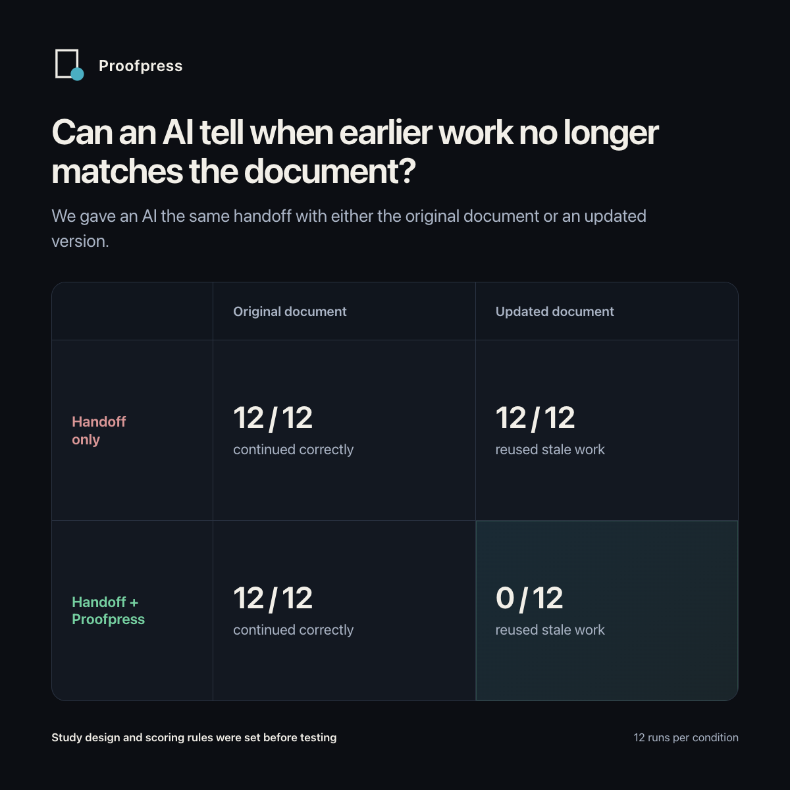
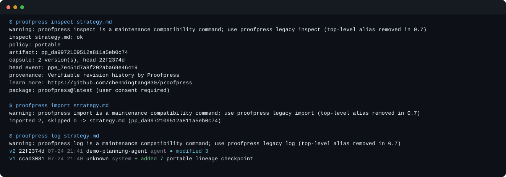
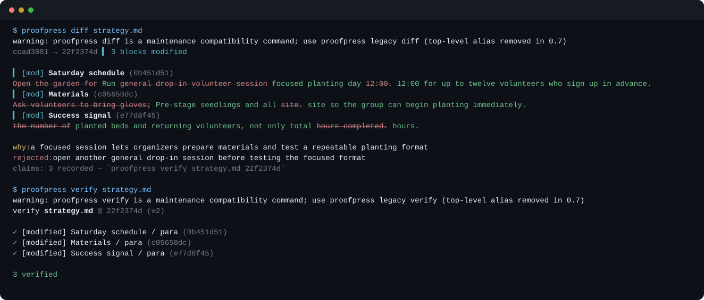
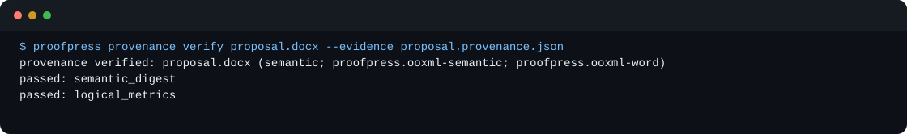

[//]: # (ob:6ec771b4)
<p align="center">
  
</p>

[//]: # (ob:de7999eb)
# Proofpress

[//]: # (ob:7542280e)
[](https://www.npmjs.com/package/proofpress)
[](https://github.com/chenmingtang830/proofpress/actions/workflows/ci.yml)
[](LICENSE)

[//]: # (ob:e667d986)
**Verified knowledge infrastructure for agent-native workflows.**

[//]: # (ob:0e0e9d9a)
Proofpress is the open Artifact Provenance Protocol for knowledge work. As
people and agents split work into atomic items, explore alternatives in
parallel, and reassemble results into documents or decisions, Proofpress keeps
the admitted history attached to the artifact: what changed, what was accepted,
who participated, and what evidence or reason supported the transition.

[//]: # (ob:92fbc10e)
Its native ledger travels with Markdown and static HTML artifacts—even when Git
does not. Its format-agnostic evidence envelope can also bind provenance to the
exact bytes of any file without pretending to understand that file's semantics.

[//]: # (ob:815b673d)
Proofpress also includes a **verified knowledge ledger** for long-horizon agent
work: it distills bounded telemetry and artifacts into candidate knowledge,
binds it to inspectable evidence, records deterministic, policy, and human
review gates, and projects only governed current context for the next human or
agent. It is not a trace backend, generic memory store, or truth oracle.

[//]: # (ob:6ef36a68)
> Git made code collaborative. Proofpress makes intelligence compound.

[//]: # (ob:df7a085e)
<p align="center">
  
</p>

[//]: # (ob:cd8c1f66)
Think C2PA for knowledge work: a portable, inspectable record of admitted
history—not a claim of C2PA compatibility, signed authorship, or complete
capture.

[//]: # (ob:9c6c7f6a)
## Evidence

[//]: # (ob:30685e8d)
We published a bounded evaluation of Proofpress for agent handoffs. In a preregistered controlled task where a document had changed, ordinary handoff continued incorrectly in 12/12 trials; Proofpress-assisted handoff did so in 0/12. Both conditions continued correctly in all 12 unchanged-document trials. This is evidence for the version-checking mechanism on that task, not a general claim that Proofpress improves agent capability.

[//]: # (ob:cf466876)
[](studies/agent-handoff-artifact-provenance/README.md)

[//]: # (ob:aea6ced7)
Read the [open study package](studies/agent-handoff-artifact-provenance/README.md) for the technical report, evidence, methods, limitations, and checksums.

[//]: # (ob:6a39b2e1)
## Why admitted history matters

[//]: # (ob:6c80c41a)
Agent-native work is not a linear document followed from start to finish. It
is a graph of hypotheses, source material, decisions, revisions, handoffs, and
evidence. Different tools can generate different views of that graph—a brief,
a research artifact, a design review, or an executable task—but the work only
compounds when collaborators can tell which changes became dependable shared
knowledge.

[//]: # (ob:6dfb284f)
Proofpress operates at that boundary. It does not attempt to orchestrate every
agent or capture every thought. It records meaningful, accepted transitions in
the artifacts that survive the workflow, so a later person or agent can inspect
and verify the history without needing the original session, workspace, or
orchestrator.

[//]: # (ob:cc376e2b)
## Install

[//]: # (ob:d6f9f208)
Requires Python 3.11+, Git, and Node 22+:

[//]: # (ob:7b197ac1)
```sh
npm install --save-dev proofpress
npx --no-install proofpress --version
npx --no-install proofpress setup --agent codex
```

[//]: # (ob:5ae48e1b)
`setup` installs the agent adapter and writes `.proofpress/manifest.json`. Use
`--agent claude`, `cursor`, or `all` for another supported harness.

[//]: # (ob:4ccd51b9)
## Verified knowledge ledger quickstart

[//]: # (ob:460f8108)
Bring a bounded OpenTelemetry-style JSON export. The sample below creates
candidate claims from the included fixture, checks them against the current
policy, records a human review, and exposes only admitted knowledge to a fresh
agent:

[//]: # (ob:8b9b3369)
```sh
npx --no-install proofpress knowledge ingest \
  node_modules/proofpress/examples/verified-knowledge-ledger/demo.otlp.json \
  -o /tmp/proofpress-ledger.json \
  --scope demo --proposer agent:experiment-runner

npx --no-install proofpress knowledge policy-review /tmp/proofpress-ledger.json \
  --claim CLAIM_ID
npx --no-install proofpress knowledge review /tmp/proofpress-ledger.json \
  --claim CLAIM_ID --decision accept --reviewer human:reviewer
npx --no-install proofpress knowledge context /tmp/proofpress-ledger.json --scope demo
npx --no-install proofpress knowledge verify /tmp/proofpress-ledger.json
```

[//]: # (ob:20fbea6e)
`context` excludes rejected, unresolved, expired, and superseded candidates by
default. `view` emits a stable graph read model, and `materialize` writes a
portable Markdown projection. See the repository's
[`examples/verified-knowledge-ledger/README.txt`](examples/verified-knowledge-ledger/README.txt)
for the complete local walkthrough.

[//]: # (ob:8fb4a17c)
## Try Proofpress in two minutes

[//]: # (ob:d61fe659)
Start with a real Markdown artifact that already carries two admitted versions.
`inspect` reads its portable capsule before any local Proofpress ledger exists;
`import` reconstructs that ledger from the file alone. The demo uses a
repository-local Git identity, so it also works on a clean machine:

[//]: # (ob:9a25e119)
```sh
mkdir proofpress-quickstart && cd proofpress-quickstart
git init
git config user.name "Proofpress Quickstart"
git config user.email "quickstart@example.invalid"
npm init -y
npm install --save-dev proofpress
curl -LO https://raw.githubusercontent.com/chenmingtang830/proofpress/main/examples/portable-handoff/strategy.md

npx --no-install proofpress inspect strategy.md
npx --no-install proofpress import strategy.md
npx --no-install proofpress log strategy.md
```

[//]: # (ob:862797da)


[//]: # (ob:66c93d16)
Review the accepted change and check that its recorded claims match the actual
document diff:

[//]: # (ob:d63d3ab4)
```sh
npx --no-install proofpress diff strategy.md
npx --no-install proofpress verify strategy.md
```

[//]: # (ob:399f86cf)


[//]: # (ob:07612948)
Static HTML carries the same native ledger. Download
[`strategy.html`](examples/portable-handoff/strategy.html) and substitute it for
`strategy.md` in the commands above.

[//]: # (ob:ec2e5323)
DOCX uses a sidecar evidence record rather than an embedded revision ledger:

[//]: # (ob:3ebf7611)
```sh
curl -LO https://raw.githubusercontent.com/chenmingtang830/proofpress/main/examples/portable-handoff/proposal.docx
curl -LO https://raw.githubusercontent.com/chenmingtang830/proofpress/main/examples/portable-handoff/proposal.provenance.json
npx --no-install proofpress provenance verify proposal.docx \
  --evidence proposal.provenance.json
```

[//]: # (ob:a528a698)


[//]: # (ob:4149c80a)
To continue the native-ledger demo, edit the visible Markdown or HTML content,
then admit the new version and inspect the updated history:

[//]: # (ob:9df616af)
```sh
npx --no-install proofpress snapshot strategy.md --kind human --author you \
  --why "accepted the revised volunteer plan"
npx --no-install proofpress log strategy.md
```

[//]: # (ob:20a32f50)
See the [complete portable handoff example](examples/portable-handoff/README.md)
for the files, expected behavior, and security boundary.

[//]: # (ob:4273537d)
## Create a portable document

[//]: # (ob:1160e434)
Run these commands on a Markdown or static HTML file:

[//]: # (ob:2b655d31)
```sh
npx --no-install proofpress policy proposal.md portable
npx --no-install proofpress anchor proposal.md
npx --no-install proofpress snapshot proposal.md --kind agent --author codex \
  --why "accepted the smaller launch scope"
npx --no-install proofpress verify proposal.md
```

[//]: # (ob:f46e6643)
Applications that need clause-, issue-, or work-item-level handoff context
can attach a host-defined admitted-decision register to the same portable
event:

[//]: # (ob:d7acbb2d)
```sh
npx --no-install proofpress snapshot proposal.md --kind agent --author codex \
  --decisions decisions.json \
  --why "accepted the revised implementation state"
```

[//]: # (ob:eb60d5b2)
The register uses `proofpress/admitted-decisions/v1` and travels inside the
portable capsule. Its target and evidence identifiers remain host-defined;
Proofpress validates the record shape and integrity, not the truth of the
decision.

[//]: # (ob:5796ae98)
The policy is sticky. Each accepted snapshot refreshes the hidden capsule in
the file. Source code stays in Git; the native Proofpress ledger manages only
Markdown and static HTML knowledge artifacts. Artifact evidence may reference
other file types without placing them in that ledger.

[//]: # (ob:d8a43a89)
## Verify documents and other artifacts

[//]: # (ob:b8c9468f)
Create a sidecar evidence record. Proofpress automatically selects the
strongest built-in adapter: semantic OOXML verification for Word documents,
format-aware byte verification for PDFs, and byte verification for other
files.

[//]: # (ob:989efad2)
```sh
npx --no-install proofpress provenance create proposal.docx \
  --output proposal.provenance.json
npx --no-install proofpress provenance verify proposal.docx \
  --evidence proposal.provenance.json
```

[//]: # (ob:227de120)
For DOCX, `semantic` verification canonicalizes the meaningful OOXML package:
document content, tables, styles, relationships, headers, footers, comments,
footnotes, and embedded media. Repacking the ZIP does not change the result,
while changing document content does. PDF evidence remains `byte` level; it
records format metadata but does not claim the document rendered correctly.
Use `--level byte` when exact DOCX package bytes are required.

[//]: # (ob:949eb6a5)
## Hand off a document

[//]: # (ob:2173502c)
Send the original file. The recipient does not need your repository, session,
or local ledger:

[//]: # (ob:af7113fa)
```sh
npx --no-install proofpress inspect proposal.md
npx --no-install proofpress import proposal.md
npx --no-install proofpress log proposal.md
```

[//]: # (ob:5e991c72)
### GitHub or a raw file

[//]: # (ob:398568bb)
| Route | What travels |
|---|---|
| GitHub | The file and capsule move through ordinary commits and pull requests |
| Outside Git | The raw file carries its own public history |

[//]: # (ob:a908fde7)
`refs/proofpress/ledger` remains the complete local working record. Portable
files do not depend on it: their capsule crosses the repository boundary with
the file. A team that also wants to share the complete ledger must run
`npx --no-install proofpress sync` explicitly; an ordinary `git push` does not
push the special ref.

[//]: # (ob:226a29fd)
## What is—and is not—recorded

[//]: # (ob:cfc1c3aa)
Proofpress records accepted versions, computed block changes, stated actor
roles, reasons, and consequential rejections. Claims are checked against the
actual document diff.

[//]: # (ob:5e0b34ed)
It does not automatically store raw prompts, transcripts, private reasoning,
tool traces, casual brainstorming, or every save. See the
[privacy boundary](docs/PRIVACY_AND_DISCLOSURE.md) for the complete rules.

[//]: # (ob:47f21d3a)
## Merge parallel copies

[//]: # (ob:55bcd98e)
Keep every original copy. First, ask Proofpress to find the common ancestor and
report only genuine block conflicts:

[//]: # (ob:8f498c01)
```sh
npx --no-install proofpress merge-plan proposal-alice.md \
  --from proposal-bob.md --json
```

[//]: # (ob:d4ed0d79)
After an agent or user resolves the visible body, record the reunion:

[//]: # (ob:74883804)
```sh
npx --no-install proofpress anchor proposal-alice.md
npx --no-install proofpress merge proposal-alice.md --from proposal-bob.md \
  --kind agent --author codex --why "resolved the parallel review copies"
npx --no-install proofpress verify proposal-alice.md
```

[//]: # (ob:1575e201)
Same-document branches become `parents`. Other source documents remain
`ingredients`; record those with `merge-lineage`.

[//]: # (ob:2a955c60)
## Go deeper

[//]: # (ob:8deed5b3)
- [Two-minute portable handoff demo](examples/portable-handoff/README.md)
- [Documentation map](docs/README.md)
- [Executable V1 contract](docs/PORTABLE_ARTIFACT_SPEC.md)
- [Artifact Provenance Protocol and adapter API](docs/ARTIFACT_PROVENANCE_PROTOCOL.md)
- [Privacy boundaries](docs/PRIVACY_AND_DISCLOSURE.md)
- [Agent adapters](skills/README.md)
- [Contributing](CONTRIBUTING.md) · [Changelog](CHANGELOG.md) ·
  [Security](SECURITY.md) · [Code of Conduct](CODE_OF_CONDUCT.md)

[//]: # (proofpress:meta:eyJhcnRpZmFjdF9pZCI6InBwXzU1NmIxMTVkZTcxMWIwY2QzM2VlZDI2MCIsInBvbGljeSI6InBvcnRhYmxlIiwicG9ydGFibGVfaGVhZCI6IjczYzc3YzE3IiwicG9ydGFibGVfaGVhZF9ldmVudCI6InBwZV9iZDJlZmMwNGUxMTM3NjhiNTZkN2Y0ZmIiLCJwb3J0YWJsZV9saW5lYWdlX2lkIjoicHBsX2UyOWYxODUxZTBiNDhhYTFkNDIxM2ZjMiIsInByb29mcHJlc3MiOjF9)
[//]: # (proofpress:discovery:Verifiable revision history by Proofpress | https://github.com/chenmingtang830/proofpress)
[//]: # (proofpress:capsule:eNrtvVuTI8e1LvZX6vSOOCKlBrrul6aOYo-G1NbYlIaeGVHneJoxnZWZ1V17gCpsFDDDlsSI_WS_OxznyX71X_C7f8p-cIT_hdfKWyUaQOHWA1JUPnDY3ShkZmWuXLku37fyrxdkvqgrQhfvanZxfTGbvUuStAyChPEsCEqfsijinIWpf3F5Ubbs4R2r73i3gGe7exIm6XVSsSKtYloQlsU0qPwkqrIyjin8OeFBRsOMpznL_cgP4jgL89xP4zwnWUY5q8oE2mV1R9sPfP5wcf1X_GXxbkHuoIcJWWBXl_BDySfwh2_5vK5qUk64N-cf6q5uG-8enm_nD1754H0zb9tqNuddB9-ZEfqe3HF8qZU_z9t_5fC6yzk2eL9YzLrrq6u7enG_LMe0nV7Re95M6-ZuQZq7PPKvVr495_-2rOHnd8uOz9_Rtul4A3OxmC_5D5cX95zgJGYRhZcLsgv5l3f8g3gIJpe_K1nIK-rHPAiiLM3LJGVZFVcljqydL_DV3k3qhsPI9YpM3vGwqII8CbhfxjkhAYvDIKpoKF9Hje4dJbNuOYEXDnGctJ2z7uL67V8vVPd_vYBVbucd_iQ_5uxdCVP-9oK2jH9_8R28gZYG6PjVV8--_MNX4ym7uDxISMhiMa_L5QLW5l1JurrDaSbzBocIn8GCctHkcnHfznEw7-sGW-0e4JMpfNKQKa6aHNTlRQdfhLYurpvlZAJDpPewMFy-Wjlp6Xt4NuUw40EZw-OwJgv-Pb7AZ__vf_9f_7__679_Dn9UXRDGRN8zFB7-Ef7y65lHJvVd819uLijMEp_fXPzmpvG8X9fTO6-bU_g76Tq-6K4m7V077j7c3VzANxbwdyVs0NziYSbEjMzJxQ-X_ahgdoqi4OXKqFZkdOu4_mlVllUPKE0gmSud8DTNWJGnR3TSP-XVnbe45x7IcbfwJuSBz72qnXvT5WRRz-Tvz15ce6Tx2hlvLj0y8No-93nBCnLEiH6_nJKmg26YBxugWXQehS5BxtmSco94rKXLKfzdg11I308eLj0QNDFyxgdGRCnsNR4esxBv7uvmvfc8_OaZ7Atn5X3Tfpxwdse9j-38PcyKp7fupVc33QzUi1BRAyNKeRWlJM2PGNFvvH-pF96UMO7hFoF_JqAe2zlZ1B_42JIbeOY9h6WF5icg47yhQ3MUpAXLkzBaGdHrBVkshwX1nzzz0ICUsrQqqtDPD2zdehl_HIx9Lad0OZ-jGHRyopvZFM6DCScdTACcEeJcGHrXIgz8Kll91xcNtDaZ7HjZ_qmBty1yeNmE00Pbt173PeczWDvYAX_h83bEOGw7BksIh9wDKM7G480dHBNyqzDWDb1uVgZFRmhw6HBub2-7-5sGZ7eWT3ujUUc-cBjOB68_efCR7-Gjph3p5-DDfkAopisDSgiPcx6UBw8INPFydqtH0-HOk6f8iHwkc5gNRmagxMWsfJzXcNjcNLdjOdIhRU38oGDVwet128_BPwv5vN0ioEo4PTy7Gj4Ze2_uB4YTh1mURBlbGY4wfR4sXeNBW6ytKpgNr4Kt74HRslzwHfK7bzM79nMQpD6Po_jJh_gGJu_t2vcZn7bffca_J9PZhHdX-vOR-vzqcw9HMTClYZkmCYuCpx9vi9sP2kBrVJwAizkcYTAAXH60ZbUxBOp4_t5bwPMgDrO2q4fGy-IiSOHUevLxmj29vmG16hGbDD4VJ7A4Y_DZkrC7oS2dFSnhRf5JBAL75l5HHnBzkUVv-8OowbglcLJ5YJB31uH3BejOIZ3IwUWpwDxbPZBAzEGqqhpGWu91HGz-xtBBmFNSlSw6pd9Vu414nfi6PhhEKx_Bn_GaFqarnrMRvP3iwZsvm0U9ZLeVSYlid8rQlHiBO-XRSQvn0yEO1oB4BWlasaSITxkbbFUQEpQLkD7StKCn53orggN56YEoMTDvLK0-nj3ceiBwQ1u1iMHET0myMrQ_o5j-x7__H1rw_-Pf_09vykEx7JCnoe8NSFUYwInhh_T0MbxZzhu1XetJDVIDEtXC_roeMq_juEqzR8bsUb0r8ZkJSY68lYWAUU1qsH_gj7BkZAKeqdErcMrf3g6IT1bEoE7j-AnmB9QRKMgFrABuvm4BfsjD2PuaCLODUg72BzMKqoOfKhj_PexS2g5MIanAkY4q8omnUHkn9hyuPjqk4XlRBDQLV4b45mOrDjwYozcn9WSHhP-Tt_krA8IdFXmS5mV5SsdgzNXgK4Hn9PtleSlMtD_Acczaj83V79_84WupNdFsrIXTKSIp2MEHPhlatsLPK3DzTxnay-VibWztvAbrnkzg2x_l0IyDrtodey8Wg0Z_WdEiCig5ZWgo7HouYACM0wmRfqbHyIJcwgmzkI660L_zJUVDp8OxDQ0tj4qK5iQ4ZWjfaIuCkvm8BpcPRkAnS4ZRgqZtRnN0l-a4S01wURhgsEs_DkYK_CIpWbzmp9bUE3KiutvDJV7_xmAUJ06jKuGn9GuZBWTStV63nOFcopIS7dyO7xfTya2QcvEz_Kjiet2QIOWkpOAdnTK0ffT6hCwbej-aTUgjBmqU-4BO8n04dvLQP2Vsb-5rbUeJL47sL3p_-PYbJeZeNSdTjhEf2J7e8z-8Bokb8jjClIRFxdY1-h1f4LkgI7D72AOPvzAgR7SiAY0IOaFXS4xUFLk_17S8gKkkgiydUFf1HA636Uwa8tvmI-F-GcX8lPkArcJasPLFciwX7RSXC4y-Bw8zAFwoSxCt6WzRKTeMzmv5y9DZy_Ioz0r_cXSw_kBAKqcgcruMtsfPDqxPwqogIrQ6rq-vCL3v1-CedB6a2HL_DBloUZmEPCqj43odgUWstuLttVctF0uMtGiR0JJgLB08pvi05NiOdQpMwBVeNenDtMhyEh43KA_6m4JaZ-MhjyYvfB4E8dHvXd81IFisf204DcX_0fR7X89mK_2vvSJN0zgMguy4_l-DE0fv8QirQKh7H3rRetA-GAeUNLgVYOugB0_bWc1R9c8xCzUQ_MyLIiHJkcLwO9B9BMVuhG68yr2NYOUxED0DJwpcrCFRrMLcTwJ-5AYYPEfohMtkgXEPRqN2uQC9JP84cI6UsKHykKx6MM9Rp6C-rybtxx0q4PGzAyog81NGOYmO62twBggcoLA-W637amAKooj7CTl2Cv4EjvXtCKwuzK3ChgEJAbWMyRKRI_23JdiINYgsgwnxyjkOlKtgTjV0aBRZWtBg1VL8A5_fgWpRWVJhzmCUDTej2gQ7FmuvBgZWMM6qMGDRowQXjH0y4WYftpXQhB3YDCZttcs12rONofMlKSkrcv6kQzO2Nnoi4Aa0nlQ7IhUuslGgkqY4qWPvf-R85nFhbgsnZsgNqOIip37wpGMd3B9ijMLCNHtkRODw5Kgsbm5u7KTR2gZhYLz4LCuedLjCw2qnU5TBBqcNplUmLmRWUzUx9p41ytHChCh8oxw0PrM4B6PGj883tY9Uj5lW8_xQcC_JEh4-sSA8gyOxbkD5d94Uk9ol70_QDU3eWhCH26FoX0ByxsunHeuf73kjTDmT3xaSiqF4EAlQm71NPgJRIai9unY5p7y7HDrpfZ-CSs_OvcG0YrWPYrG74EAeEoM4phFL_aefWiJsE7CaQA4wvjPlC4IBDKH6dYDjsxnphI_TeaAh6mYw6BuCENA4qc43tTXDI7QCd1kMc4RvJPbXcOSzzOBUp1H-tAPVg8FgQvdRRF_EXxYP3n_8-__u3VwslFMtTni9tW4uxKdtMwgfCUmRJPSRGLxezqGFnSe79djAIQlrx1nyyB3ap4fR49zA9Vp23krLP__6xfimGQl0wozQIVeIlHkaPvIK9xmQJ4wzdBG0TfWFpeWkYINLAKc0ru9sWYJW9mZ8jjmTISUX-llQldkxEwRu0WTSXcHUPJ8QjMc9B5G8FP9-D_9bzrt2finm55vakyAwHL8dHV-fnypjURAeMz8l7xYjXlUYVKxA6EtC33v3bfu-G3IcU9g0aZazIybgK-36Pl6HaxCCxf0IvqmkZWGyoa0IAQ9MQB76VVSQ8uDxvF7A5pPZQJSAt3p3E5GRxrF8_91n8MfuysD9Pkd0Arjw3z-en-8uNZTwQjn97yj4mhLOJz7R8ED-Li8yn6Q8SRiLclYWZUyKMBXeBdiOok09Pfq0AOml72dtLVSPzJ9LzJ_-DSF_3yFMEsMdVgs2dNJqRIAyj0RVdm21eFeBXPL5bF4r8GZXBteUZRWNs5RlQVKlPAvTIolpTgM_DTnJIsZ9mnP4MKnw0bIkrMoKEscBIz4VCTqMMgoQplyt67T4ASYaUZKhH6YjPxuF6Rs_u46j6zD9le9f-6gK1YxjUKNgLA54DALS__WvT4HcFNImgZX3pLtHT6cKUpLGeUKFxy7asLCWShBPB1FisBE_g79_rNniHj7Jc_jlntd39wv1G7T566vZbzZsWzXaPMnSKsqDtPAjPVoLg6lGuxtaqZpjRYo2f5aXAucimrPQlmugvcNBlGjQjxqZUBGAwvlNI05MmXjq-o2rl3G8_e2DDLSkTyq_KrkergXFVMM9BWFJVU5TDLG7J-Av3zRoT1UiVwXvOhVnzbJbyqgsRbzvHG0qOm9hgqj4osTzdpfe6wko40uwxjimUztxKtw0XTvlCDT_Bdpp03b-MBYuJkwu_55yMFtgcB_RqsNBiXC8DHmBfQfziHkgfP4LbwrW3k3TYzVNrkM5sCtQSQm3I_hWMN5LqYwUdAsD02Ai3TQm5qkgyJciYyDSvaQTb7Qa7JDREPmuOOEyVD7nE6F9YanblbVF05RPKjCRulbOsYa24xJJkeglAt98QBpA7BlJQSvlAnQppMGCweqk2wnoVjMxOJybRo-VsGm9wEmp8f1g4EZ0PZNpQfgFgf3-oFMrFAzuKTaFQ7lpMJsAcyQRCDDLoFtQiISx0N3Xs0uvlSmHCV-YmOzAZCRVQcusStOYk16NGQSumoxTgLUe7JrlRD45sCipH4Q8J2FBCz0OC3erFdQwpFa1RUgORlqYBaQy72ShbNe108EAWn8cjn1w5Gf3ZByAWyKNim5Fn5lTXOuN7lq0D7avkFpc54e_gOm55nHcNOjw6iQ8Lmhn5e200Fx6OHg-BwVZtiD5UspqrnaUkkGxsaz9CV9pJxJ0R3BXixGPFCZPWCqwnLXUIApAqvMYUrU8tMubpuEodKDcvpfSzO_m0mzqpOE1sNB5xVhOczhni8wsdA867hd6EE6sGvPTJMjBjOIhM4ewhTBeX-mDscMEcWKNkAKZhcWDaDZZdhY8SsECVbBqrJuKRCu4cVDzq5ggu94-NZTFVeGXUUaoOaYsgLJ6m9Ogx3oiRiO1qgcDHre51VqhpGFUsJKAljXa1QI165c4Ba6MI7uCqa4r8GDG_wrny63AVdTC157OwIqGwYrYtc7z34qh317CD8L1ur2E5qjwuG6FyryFUUArJp6rdfacTwkMEsySBcwPOoj7GBw5rfywiIQBaTRQj6TWk3ACRhqNjhmmtxZoadz6Y2jgFqMzlN-3EwbDrDEbDKYjWurKSqkI7HY950OHAquKEvEDYKjr4VvI636PngiZ1uZZkEcRS0KeZtSohB5FbQ7k4-HPcglhXzd8CdbCRJyj0yVYaA8i5t0INIy274QhgVBkMrns87UfAu8__pf_zfsQKnsURE6EzzC1dtPgNrcBk3ovWWt8eyljbSL_c9vBOEBvYqDqVkAFGkShwlIqQwJltZ7i-9xKhX77QUz2rVx9WPoajgsYLepiWGpeC9CmCFaJ-OdNY2mopp2voqeUqTkgBGUCNkFOqiCmRoYtrLhelRNA3jgw6ZANKcWExKSKSVbmRilaEPDHSvEY7Db3jFu4Q7kVHA6cOGTMT82cWPBuS1KPxWXXCsMBkmDhxoT1qZwSmEE0CyYtYai4-Pecwg7z0C9HzTnWByee0FKJdtgTvNnj2QHB6qQdatIniAKG__HvYeFwT8hsunpeHvGwmrB9ZH69q9HnwHQmX9B722gYECwCp38UsiSjoZlEC3NumXr7IshVw1UVpkXJcp4n5uixQOUbvdLDIOJToXalyQCW1oDYhmlFc5rFoPONCrVQ5KtiexwmvBvDU7AUbOXQ3xwiH43u-WS2Q7qjIsxL6rOEpkFvgxt0eb_jj8aKy52gH_0FDBeekUe13rEoQ1Oi0B3aChAoj7cmgPrdZ-qnzwfEjKV5xIsoIGCLGNuwB6T3YnYgsFxPFtg4oAiqrGTm0LKw5nqyDsCM68BSRIuSokYJzLgtGPmq5DwZHFxrWx-cPxZVeZSbwI6FELcU3LFIb3Bf0Xe5r-FQbVCRKAytRCEL40fhC3Erjr3XXIYH-qNLbFFxjvRuaDuXERIZR-j1mUZ1CwkTp6kw_lW4Xxt5uN9b8PFx6J3QsODlzPtD_XIlPCPsRTs6J8wBfEl9NFfGbFzIJLbwxm8aoU2vZKvonX2BeTcxiRZ8r24-kEnNYC5tuwpfWgYiRCMjNCKsyIJw-PS-Gk04xkMmbfseTjyV4gDd3pAPpJ5gcwPbJmORnyRRTMv-iLMg-PuI304ovfWoXJM9npy0d6uPDcoxWK_gGVZBmgW9F9Kj9M3mPwBzr02AKKNZFERJ1e97C4bfMySPBtXD0_N2eXcPYgadk_mDtFZrRGvqXJY0CWfLyUQ4luAHdWPvFiSvs86HKymZt0YayU3TcVzwRS-VWnxXRUjmP74ARwQEbDpCkRZH_FX30FDc83AEVEuwo1EiLcgLw81j5FfYA7YED8hdSqKg4lgAojBBG4tDoOb1FEaAnmXjEIjgnFIFBquJ5jS8BhpcSo7Flrdil_h98GqI_ECoHRmuvlvW-FXM9OOmlm6EOiCl5W8lk1XOZSgkxlkWMZYXLEz0jFjUBUsXH0tEwHkCx4nPR6CqMe120whDk1LxG4LSwOXQ5zNGcEHfYEsaiSM10rdBr71kuFKGJWFeTFzSkwiYBVf2LB7oH8FT5bCd8cCHNahbGVVBH1YgewaUFE05-ItJnMUmnWFRJ7SldwIRAtYOVMzeRVVudRTbU0VUvD-9-loeB2px0NiBE6ltEJdtddiW4nGs7NHZNtM_ywovtxa-aUoewDIXCAw86WD1LGcC-weHl89XrHW5QALl05Yo9bhxFfKwQeQPrDdsAu1Q4FwYn0IYYM0Dxr_uhsQ0qpIwZwUIZm-v9FyR1cjtXswPbc6DTo3yKspJFPRJJkMGWTfnD6Z2gMqU4KxbFWMSGlLKzC3unlG_HqNaQDcXpgcMCUif15PZQe8z9RKwLXCS7uZkdt9dwrFfC3ANn-J-wUe9f1u2YvdAy5gaIiIrIFsBnSZlloOBK9V8Vd9pgDVu3c_HNw0KloHqKJk1OZ7bX-NAfnP7hW1AWDpCSr9ZZJBzMpvBBhQSc_WhYVac7VcivCZUiRq7lBno5ApTUb-5HYojUZ4j2g7OTCMaFmfmAFN2KwNmB-ju8fe2Pd41MD337WK9o9EIEQRqB45GUqOp8IFGbn28f_BuLkR6RGStbAuYf_Rgq8-42Lmg5BY3F9sGIQM8G8Y8HJOg4DgnJGA0MCa7Rf7p01lHU3lMeN_O9KDSUDr_gQsLblqDWwiWS8NGCBnW6QkZNdA2zSsOG-_q2yVsmmU9YSDhOBDYdaSpF_VfQElfepyhDdJd6hHM6hnH4xIjJOIEfZCgZMtuk0cdTj4aADA2HDLjwpbHpLKypFYzKAJyZQG20GEAX0bYVLS9a2A4HnrYwuLW-V7hPvRqtz_42ilGfehQ5jHIU0YJIYEf9z5jT4Z65JLuwW3SxyFGSnMGjntcGhXc053WNeXB7CWlnUx696bR4uyJ0lmw7hMuv6RSvsKCEu6P-IrUZJuSwGgnMDAdpV3S5697AJTce6h2J7VE_07l0QrDB3ETdozISguT4w5tu4XaiIsl9GNejtVVNbA8fkb9jCeMBAnvnQbDzdKm_QlUq3aCf0FsKggbQgHAgJ6L8cIpAK8qRF5CxDGjA2f_KjJLvmYnkkogrUyY2RKyoFIGoFvI4r4ziX-Tc1YZdWntXypLCGcX2hopMo99Mr4QPYjcpkwy4jZCU_YjbnPY613PcFI7Q24kXCKZrpeRboKZG6uq2u0XK-7u3RIFEkxBOIJb5TMIIBesK0wGqNax93tZI82TUR9hR8nDXnOOQKuBpQ590z50KTwBdViZGCeqFhzepcgEisMP3GJVlg1e6B4xIMrqNa6SMFaFPGEbv-iMLTgkS2GeZCQGvzmgfSzSsOn6rb4HQ06HFIsS_dkkjAPfiGdPmlNNHkqE00d1EIFtVSVZ7htnw-LGqcZP4bspA0TgPm-FSoUmzFfgVEKnU8qoCZNIaf1iJSfWGzIbUIE6xFxmxPdTksSVCWJYpDr1NoNEOe2WxkXKQkIwp2xO154718_LkXw4PWAWlyQMqU-pOcQtipyGNZ5Ae8MsNSb3X_ERHF3g86LsmxY6BEN2Op3V838WK1OPBp_IGcxQaBd8hLYBnPATeQjgsWDwPlq5C2gnHuqILfBefKls2laqpZH8s1Djhj4DQxg6RQkPQprkVZGEfbqwZ-6puTqWjafXPYADNaEUsTC6E4ugt4_puot0h1wQ8czucFZEoyiOoqTMadSHAgwxr9cme5DttIJKgjjxE2i2t0Us_t0-L7iTU7duXq_Oxm7LWqHv2Ai8bZ2y02dJ_zf9tFVfcyTqa3qPq2uaRxFqCzY7RjXmM4wgG3P95gI-FmGMzrtaTGdX8meBM3hk8YsgEydTOJbbTh5d3RRTb9rxkKb_Tot__7gmy_I09IuYZH1Sw6InqlU7hXKolJcVWYcDF9ZuOWEq0DfjBPTIa5FklnAwVN49unA1wYa9GiiTRDFacYANGMSBnV8FZRn6mR_5PazC4kH22-BYGqO2p2EfxHj4-czEIi1moxU9Pp6WqPVMGQVFXJZZEhrT3WIqPo5kHUEzbETIciaTBKR7f9NYCwRfq2qDv8QwMwi5PmHRwelUakXEhsHREm6ATDBgWLqpwK5YDCVC86IK4qxMcsLMmln0xn30zG5uIuxIeSLqj8u2lCoGd-2OPVVlvCxzvwyrHgJpMRrtOOuRdETuWdQGmDbpROkFEd8XYTlpL5eYioIWlvjFjkOPuF3MXEMP1UIiPfC47drJB3TP4GgWAChpQsFxDu6jyhoZEx5tX6m0u0cYQWxp2YDeHFhJ2HRV5icJGlLmxOjZlEecGOtUyE0rv2HRtyy3loXt54rW3GbeJGRBbWIVr5F7eW-tbb3FsJwVke8n4JOXYWrslp7fqebvFHKmTAqZyJhOMaCvDLsbtU8H7YlIxa0ijtzq1uRUKwToGusS3CQEq6ADzSWyR4NaEUaqCZcCGHC7wnSUED_oGY34FmEo8Jp8LiBI8lsqOwUWdHMHBnQtRiWjUWqMAycCuEQB8yNeWUg1i4dqaqkcTyJd2STLGRwjeOCDh4PzgMPHIJKm-F2KSe7dYlwPWRT-UikNsYTMZG4HtlsVRlGUZizJLUR0T1vdX3EOcU7FNkL1QOb0fkSsvWX-WO6W7CzK84CTlNOkl-yesmqvwpF8U2gBV8IEyy_7iCH7_NKKbGwJ4mG2hoC9A6I3rRuMEFAdZbhpLDbTkEcQBuAHRnmchyYdYXFd90qMH0ZU1VHDxOdVEpdgjRgTweKu6o5PJp56U4LOJfcQQCrcw35aRTzIxGzmXIa6dCpMqvQPOngDb_qRdErgyUTwXGDBxHGnPsbU6EcRlb3TMUURaG7QdhfBNNOZAAONB6lNJU9pWvnMCJ9FlLXyT4MM2D69z_0iT5lfmcm2SLFWHORotivC464lrFxwf9CyWQiGkEaYy4RrD2V-DDWXMZQt2f5rK7WvAykjjCCiQayifyuhre1RCZ6lNIlCH4yjHhDWE3JNGOV4pq3Jlw5H02KaFn5AC7_o4RwWE7dflaMptg3GZTG0P1kOxJXKKA3KioUsiPu4Us_ANRNyGLXWgEsjPyxIUORJT8Xp2bbmJY-n0QpXYSAKFeSFX1ZZWJVBb6v3_Nq-iNzRxFlMOYohl_yefKgRZIGZJA4qGI3YB9micXee6Tjmt4FZI9X2Ny9fvXn226-_evfs1ZsXv3v2_M2719989Rz7AlUjBofHC-bZ4axBl3ZST0XsF9yBtzro-lvMVhEkzQg_da3fTnf26sW3z57_t3fP_vjluy9fvH7-9cvXf3olX2yNCvwDTuiGi0Uw9Pz4WhFxSYkIcDz---ZrSOQtKyKSoT54VYP6nLMf-4YSYWwfd0HJXvcfTFuGmQV2cqV6q6FmCRsJ1-bt2wtBv4C_CWLXxXffrfO7ZRRo28g3tC653H-aMRFbkokxSePoxMtZaQXkkXmKRKYTNQqGIAa0wivTZLRtL7_XUPSeRUO357k9JnwtWm-FogJDGcvJ0BP81wvwp3CaUKuriP9GEpx0L_QMoHUA_X2w6XRI2t6bRA-WZVGWRUaSlMRFFqU0juIqLMzb2ux4mxluM-b_-vcsj_tXFTCsetPXdfjDZtr8rhoCT1MoIALjKg-KgpC8gqOThaQiQUwJx6B7FSZFVYUs9GOSxiRPaJmVJYdTN6l4mJbC-N7ySo9LBQTBdZxd-_mGUgFhDjIDI3GlAlypAFcqwJUKcKUC_jFLBWRpWcUsLMss2rNUQLhfqYAXC0kgt_SWlW8_uCaA96gkwGoa7YiaAAa2oZIIJ9YE8GRJAAymuZoAriaAqwmwgREax1GSZmWV-fvWBAhdTQBXE8DVBHA1AVxNAFcTwNUEcDUBXE0AVxPA1QRwNQFcTQBXE8DVBHA1AVxNAFcTwNUEcDUBXE0AVxPA1QRwNQFcTQBXE8DVBHA1AVxNAFcTwNUEcDUBXE0AVxPA1QRwNQFcTQBXE8DVBHA1AVxNAFcTwNUEcDUBXE0AVxPA1QRwNQF-ojUBLIJoz51eIZzuz8O22Jsnt2Vx__bjdG84VAZ55nu0tTYoi0lzWkMWnaNv6Lmg4NuoASuGcdALW_SNU5tfG7pFQji1bWNqmfntwfxPPm4LfNy3_XuF27GIxIfOtYU6PrrddUHrwZJ9oxJ154nIugbbHTpaCyt5fMOyWIHdrAUVPL7ZdVHrk_N9qyI5X3dgNgszTVip8IuVqT9oQqxE_ZP0sWEpTQr703RghUb7Dv4gQzer8dFD58aKhJ7Q8nq5jj6695TNWsGcp2zWcmYs0W7BmwUzb37olFrOzIGtGWtRN2URwvum-hZUchVrisjA2omM8aGZ7ynh-45kB2fctNxTkw9oeZC7bM6Dnqi8b9OnMJkPLV8zPJJTuKuDO9Mw-_YeySnUvwFTwKKkHSJT-3LWzBv3BLUjpOBgBtuQ8dzT0w6c--P4awNzb7HO9h3KKbS0IS-gZ14dOClPRs3SQ7F4WHtPyglErYFJsVgIh4zkWJrCwEgs0P_eu-cEVsCgu2gg7wceQXth4ntv2QDgj1AXByPkh4SgB3I_5c7YivQe2BkW3Hl_eTweDz10fvUQvwOkYA8MoLGIe8Dfvh0cigg0nloP_9u3q1PwgQOGpgXd23ckg9g-Izc9kO-ANzwS6WcURQ_r27fTU3B_Q1ZzD5rbdyTHoup0lxaE7kmUxi6M3YDSsPBzB2zVPQB25rzu0XRP8q474XYDL2thxPYdyykgsqFoRI_XOmDajwV0GV-rxwTs2-spoIGhTden8J9EKnbn-Ifs7D5Jf9C0HJnFHwpy9Jn0J5mWA1PtRin0efW9h3Fy4n1IWvps6_4n3_Hp2KHodZ9uPeCsPDofO2QN9AnX_efksIysiXD16df9X_r4_OzAS1tp2L2thhPytBd7FcW2UndbK1G_4tKbW84V2k6AvQRVHoQQ8686TnKpZ0MKhASkEeUHbkvznbVfKyV41n73KT7-Kfq1so1n7ddKTp61XytredZ-rYzmede3z3aetV8rE3reee4zpeed5z6ZetZ-rVzrWfu1krHnXd8-XXvec6FP4Z5Zrkxm97z6uU_4nvd9-3Twec_fPl983vOoTyifdx_1Geez9mvlps_ar5XIXrOnP-Xy9lnrs3bbp7TP2a2V7j5nt-u35Zyn2z6Rfc5uraT1Wd-2T2Kfs1srY33efWuy0-fs1kpFn7NbK-18zm6tHPM5u7USymdd2z57fFZ10WeTz7q2fer4rOqiTxOfVzmanPA5u7Uyxefs1soan1Un9ynis4pUn0E-q7roc8hnneQ-YXzObq2k8XlPIJMgPut526eNz7pv-wzxWbVUnw4-qzPS54PPuoH65O9Zu-3TvOfs1srpnnXf9jncs05yn6o9qyT3edmzvm2fhD1nt1ZC9qxeQZ99_eTdbrpyF8kQstZ5VdVUoG5Wkrny26OqnneyWjcnHeIYsVoxJc1B1-0WIal8mlcBLDDNIkoJ5QWj_rbrds3tqruv23VUT0f1dFRPR_V0VE9H9XRUT0f1dFRPR_V0VE9H9XRUT0f1dFRPR_V0VE9H9XRUT0f1dFRPR_V0VE9H9XRUT0f1dFTP81M9H2UEQW0UZVlkJElJXGQReKZRXIUYLkGLWlS3NTHE6zC6NGO8jv0fLnXK0c4VYi_SLMU-erNf__hOaTk9iMk7HhZVkINB4ZdxTkjAwLKKKoqGYtdWi3dWEXfxja4MrvOwCOKC52VaVnHhJ3EUsqwqwyTzeZ6RKEh5UUQ-LdIgI0GUByxjOcnKsMySrCr8fV8Qn7gI_TAd-dkoTN8EwXWSXQfxr3z_2sdW-hnIEuZHVRFd2PPy16co3SuvjxX5Vl01uwpSksZ5QoUVJgtKc5plQWld2PHrGZiPYOj-l5sLyvE-r5uL3-Bp8ut6eud1cwp_J13HF93VpL1rx92HO9BnZLKAv1vuJn4Gf_9Ys8U9fJLn8Ms9r-_uF-o3aPPXV7PfDNZxTytYg7TwzR1X8J5FUXD7xjxvJcc7cFteFpKE8KrkxO9vDzb55_U7Me_E9bn2VUWefVMRkXcvik2u694LLS8vbe_UldH6ClJQ-LiL5HWW_2JdeDhQADwiURX6RQkngSm3bqW5rcudoD3R8Iy3M3WPvAioqKsJ-folROZ-au2iYdVtqmJBH8XtTv3tjupGjo5iyWdxL6QoVI-BXbzHcsr5Ql5zLPELU5iLoQL9FWM5zUFsi6y_INpk3PsC_YOhdHOvou_npR_GQWoqwVspd9XYK3kzUqcDpdElroEc7x8xGRHkvxq46oGyGHZ_GWWEmlu2sjIADUjX7yzCqv46ED0a4bWdI8Y_WDbKcMB6NFJq4OC49q6rwsI4SUFD5KQyNxdamAL9EqLhW_0GXX_PpQdm3myhLiNQNx3dWjdDX4ElXFdw1oqb0W7H3p_wdpdbM0RhBNxeerdUHP234m7TW-jjVngWOm7b36at6owPSBJLWBbziKeMh-Zerh7dYF2DN5TG3y5cJCzAc_ALGpL-ypUe3qCFaynuWOrMfVCdvD7DqA54O1tzoDoYEraQg9lBWFiGplML93DAJdmbI80_2t198qYlExI6w-14aR7HURbyJM_NgWfBPKybvNSMWYFyGTrTgzUvreJX6pav-xqsvf6CNLxLQCv8PW_Ek-5jJz3sDYfNTXPEvXh-HpVxyZM0jsxWtyAo_b7YDBXZviGSAqwMMHFTkhnVbWFQ9IUQXJ0t5r45OSFvxGXQtJ7V8sYodaFLAyaL9wCTtZKzUVcFXN40eG27CHXJ20oGtg44B36SRDEtU3NfBanANIoqsu-VPA3eHLzYZyPUU3ED3h5PgjF0yJ2OUQJqJ6vCigT9tdMGk2PdNrgF5LJ9_aI0A7s9A33Z34NroXJU03_zXoFTwr2_yXvHtUHzt5vmb6PRSPwHP-re_ybWVaQe7RDAVN7_I295N_eto4aUt86BSlqKS5nE_RWyde9lfy2Jale_lorPy7Q3bhHlvWrT62-bEEJaLJI8hKMvjHhmNKoFGtJiseX-HGX9qAz3ylU6xt2W2JmVS5Hg-Obymm1pK8mb0M29PaW8aURG1axzSbwrfOkD2OB4mffQvbe-H7Mky_KY7nF7_CDgZ0Bi4PRjZcbASfCPu0q-v0F-y93xQtMJoxJm5qZRN8ebi4O33RMvc4TP5cWsGNNQV7571o3vN4268t2YvTuufKdxmlUBqbhP2Ke48l1dlKzeDm94hxNj_Rp4b_gW-Necy7d7O1PpIy1OO--nEfK2IslzDAoNGVmgekiS8RyM9qHLT71tcKeB46RkpIrBpYN_t192uu0C07H3O8Q3X4o7MzffYapvMLVvLsWrLYXiFkeuvldTieTP4gLTMGJRRROfJbm__QJTeWso0beTwuSIO0fVTZhSYSE4QNzOJC767m8-9NztoJ_6dtCApjF4agSUbbb9dtDX4NOPjHIzqZjHl3qOvZfSuZImaX9ZpzzbYCj2ZZtf9CuN11iLMOKjWzyHLmUuojjIsjDfdf-ejTzcriOqJKNZHoaMcjp0Ad_b39XgaYO6RMvFHKc6yMr4tP3uM_49QaUHp7z6fKQ-t8KgeJXe2y9X4qVTMluLlorHvurvLzvkQjLx3W9WNTeI0E7dLb73zPbF4TsqzN6P7HEk2V1A9jO5gGwj5nZTW4Sx82BvKZgEQZWmR4zozX3dvPeeh988ExZJ79-iSX1tWcSX2iVTkFKQwqctRtlqgha8AhWx0vmyW4wm5EHcHrvgd2ivC8NdXEp5aOHJ5y14AlRHPNYaRHPFqKseqiPdml1lifS8Dr0OaLLlRCz0yF5WT2504b9O4bnxtpXdoyuxjATssvZO3eXKv5_BMYf30IvJNN4OBfuVLLbR2vQ9siI0tMALSe_wXt61Kft4j14SwqDR-cKnpXox7ywC4BYH7iDCG_jdWQjedxIEOfxYJSWHw0vc0b2R8GZSOH-_hDenWrarlv3pkCY3KMd0HV7aWcIfNqf9zpL4LMo4JDTy47gI4T8_IkFKqzJMqyrywfmqKK1S3weLvUjjtCjSvEw5T_IgRltOtr3r5daSnuG1H18HyYakJ2VpkAdR6ZKenzjpySkqMlJyfyjp-ctfYqRNaGpPHnu4b-DUWNQz-fuzF-Nf_nLgOuY84mnFojImyfZE5SPuQuO1M95cSs9r1EhAuLq0fS2RuhIav2lWErE6IL49xYpxOUmaMVEpHXySbQkk_B7xJm9Ry5genjmoTgb8oKQqaJmBCot5f31zr2fVpJyiPq2jfTAZUMQZ8cF9Ss0GsLSrSYIcrzQxhQAeybReiDyysl1gOSSMWthm-IhoHeNOMOSyntQLDPPDpsOYnbDfu_t6JoJdOjh10yiArUsnu3SySye7dLJLJ7t0sksnu3SySye7dLJLJ7t0sksnu3SySye7dLJLJ7t08k80nZwlcQjSy4_IZLz9T28x_KNMnu8-0yVW6unduLuv-YR147q9gmeuPlimJoanP3-KbM-2zNHmhKv1optzhs8ENQ5Ge-k9fyEtMVReYIsJm23ZIcn3fSdsCuXCz8UOFmGb4UzohryrWAtmDp620alOSaXvg6fCqgb7BbfOlswkYe1sYR5CXquIN4DogMLRzcMBfLc0HOXlHIQSHY0GLDO07meEvteflst6wtRbH5ScTCkLojShpMxpEvAyK3mVFzzflpw0qZbdycmfp6Dun9x9nOEK7AxX8MPmBNZZ0ncxzUuWkTTzfR7TglZVlCcRD4ogC5IgjqOgyFiY84xnsU9yFpQ5h1fIwcencVFl-7zchvRdUGxO3_l-SDnxuUvffeL0XRnHJCrDIpHcU2n09rtUNXfK5uuf_vjx4xge-ddOVO5Susp6HMwF6Oj5i_4b-xT66q5UIeMrXTiju6L1-GE6ucIabPzRIE5rUg7xa3mkXHvP4CXu-Sgc-1vnRIzhSh1CI_UF_MaonCz14L5-8fyrP77-6vPty-7SrD9empVleZKCMZ_wKPxUaVZjG7gkq0uyuiSrS7K6JKtLsrokq0uyuiSrS7K6JKtLsrokq0uyuiSrS7K6JKtLsv4dJlnnMsmKodZPmWjt-KR6h3H4-dNnWQ--Zq1ZTkuOk_r27UWEVXujcRDA5Ly9CLCRMLz47rsf5yIyy_s5-lKvtUat0-6EC4rWL6boT4enbPbUm4o2J6gtGRlg60oTS50bczjypdNiEtIq2YvrAUYJqeeiOLW4Z5HKGrbjbaJyxl4tITpjr5aUnbFXSwjP-a69jH7qXjchEuhRTZto1WofB0EQsrRIC_C2spjyPA_Aai3KIgi3Xghq0sW7IQhOizstvqLF90e_bCjMnP6wGbVwHsxGXGVhGpUMdkpUpDljfsoJSYsMdk4Yxn7ll0FKijRLKrCXWUUqkjCklkdJkVbh9ldaQ2pE1362GamRVxVhfpw6pIZDajikhkNqOKSGQ2ocgtQIMXKVEr8KyuwApAbYYL96jNYIQ4fWcGiNnwRaww-zlORgn_thsBOtMSQig5iNoS9uQm4MyuIZ8BtD_TsUh0NxDKI40iwKowKcyCILd6I4hiRtI5Zj8AsbEB1Dzztch8N1OFyHw3U4XMfPANeRRCxj4I74SVntxHUMnQr_EOiOys9T8MH93Cc70R0HWK8WOmLnFP-ISI8D7FuH9zgM75HxClwp0B9Fb-07vMcA3kM89RzHIjASzd13nz1_-cc3r1789k9vXvzxX8Th8P_83_CIOJbBZIXPf__sj__y1dcv9Ye4O96-hneb1ws4al5_9fxPr168-W_9V9H5wShT22CZZ-zgy6_evfzdO-joyz89f-O4_U-AOrEsVyvDtdkTOIpTb3WwPck8IUJ7iRjx-nW_0mUQGgI8CR1Q7h4aqu6AhG8hkV2X0jbGCDpiYOKNwBbX3wJ7VVf23pKW7ji-jr29tRMibC9x2At9385wocB80H2DrG6w6mXHB-WnK98HzZPGPAnCsozyJE7Az0ry9RkTgXFTqtyeGTTMOVc0d53INtm03YnspxWM_RPwG1KGq8z1PiN4lixowmlQhDzLYDoScI7iIogDFmZJWlUs4qWfhHmSRZGf5WFVJGAixUUUFiQreZSEQbj9ldayoPF1FF7Hm-7YDYLKZzR1d-y6LKjLgrosqMuCuiyoy4K6LKjLgrosqMuCuiyoy4K6LOiZs6CcpFUWx-ATZsGnzYJ-YzQxjrkDqRcyz_gMNwmcH_XiGtup52aeRI6Ub8-SouFt65ln3oKTqTTOyaRrvY8Ew9ZgDmNohz8apbTkp-hUzJcY1R7U-A8NvTURmsnDF8I_0Et3C-4XzHp3f2tlevF3qeFl-Ao1pkvcusStS9y6xK1L3LrErUvcusStS9z-oydun_LyXMujP5VFutY2y0kckbxYaftbqfRI82C88V-AWnpY8MEi3aAVhr-5QU_ocZQ5LeJUKImTx2GmBh0rcKLALIEfMHCtNKOEYX7z5e8uvZdVVVs69XJgqoq84BVh4VMMcZ-o1xzcyYaIeLt8IWkRjWcDjNgwzBiXmdqTx4i-KJaRX8Do0AKDVqiJncqxqLDOLbZ1K89KMLFhnw1M46cpvbDPRelf8gpL_dtWqKqz_0xfi_5NP-nw46KlYPTLy8DxeT7_oEEMq3kjEd0bb9u0O4AVtTLgjP9b8sVHLnNJl-udSV_LiDTKsgw4SzQxTNWjuwysLb752oQXcNoIfS1uRgA3aUTumhbjhEJI7HV9dD29tWs3N_0VeNYmkmDGrPelzleOt-2zzY3iIkELCBUxJ_j6bsFZUtabDmePt-2Vzf28Ro-3U0lBGP_jPWC8S0yRwY5oGPwRY-RgljU4e1JOD6_q8LW4pUKsPBc-qhREcem86vvZNy-M0tILswkuw7-f4dcskRc2tZIoHY-9EjFYZR6ia0akMz__IJ-zZncVyw4qS6sUKXoHAWmimBZhAh4qz6KU0yAlYRAH8dqWHd6f-H56aYS8ajmzoTUGorEbWuOObnd0u6P7Ex3d-0PpHl8oEtsXikQ_bMZfnQVzxrIoSohPCSupn9CAFn5aBXGSwDjSPCr9vKjSIo7yvMrTgpWhz9OUpGEZFQU41v4-L7eKPive-P51kl_70Qb0WZL7WZwmrgaHQ5859NkZ0WdlkvKk8iMSJHRf9JlIGs_Ath-0aNaxUAglQ7zNKlptG1DN2wundtNoA1blnLZA1bydSDUM1m-HquHQ1xwLc67zBt4BpgTvMRPZvZumxMCudYaqxvj3OF_i7BPQLzgThcujgecwyQuwwYWHBq0s0RyHoWsIOj77i84Y552D0DkInYPQOQidg9D9Q0PocnBBsiAmGSPkpwShs-J-tk2s0C0WqO6m2Xr0bwLV9ZaHOYKn5AHHzOf4203zOJrYH7ATQlX8E9WaPFbliAY2ZuqTquQBGOKV2ThW6KLfmAcHIAwIEvRxmfAw6dEgVkzicdDliMiCV09huuGImNN7WBDUVvY0DW1gmqYFD4KwoCadagUjDtjAW0MKrDJ7CBZptlyYT8xXxhKIsGf7agttaN-ass09DO40mgakyilJozTskVAm6GHttGNDF8219_r3z0ZhkkoIiYgGTjh4Lfcg5At6vxqG3lDIQ9k8EmqGwqDCumgewcPwjcUEjB-QohneHAybnON8UzKheNcvZ-IkA0v2kQgJraEsT4QgoXkq7WuGsNFW3FA8bzHWoKLGAiYItgo2ZhiE0oq2T9-bxn5_sYzwdnOHnXXYWYedddhZh5112FmHnXXYWYedddhZh539-8LO8ijkAQ25X2Txzwk7uxPMYWFcVIumoW9evfz2qz8---Pzr_DHNy-fv_zaYXLPg8lFrfljA3Lvl-BC94DcZYMRrmbfG7wG8DK9XhBOr1AZJmY2BGw4FBBzdEcHYVqO7uUgVMqJ77LlDq01tOI6Po5xNDdLbrKKH9E6NkA0OyKyA664oW19pBiz1-ijjk-kVb4DrrjeKOwd78uXz_9rDw1cidqIWCr3_m1Z0_dwis4XO3CK6x1wibN81IlA_n35O4mK69XiZqSg1vyedB7B7tTx59Wok1ztfnZW3qTk9-RD3c7Hh134lPAgKlhIQ5YEoCZCMMbBhOLbLnwyiJc9Lnxym_6ntun3B4FuqMwV_7AZ-nQW4Jdf4XVKGAsqwIfOGUnyIOVxECYJCeElImiT0CQJA-KDsVoljGRhFtIK2i_DgG5_pTW4V3rtF9dJvgHulcE-TGnCHNzLwb0c3MvBvRzcy8G9HNzLwb0c3MvBvRzcy8G9fmS4FwviFG-mzcqY7gP32uVPbt-iFSVRnjMGvhs5Hve1cnI_SnWKeE8nE5EKngPWo0EnKa143QdcXr78r7AOKxERVHB_xrPXvOjlTbMSt1rj2IrvfPPl75TttflzMVMKODBkVWR5RNMyDQJSPTEAzWw6eLPvH2PQzIcnotA2d2LWcHs3g1qAkyjyfZoTzuLtULTfwTRjQA0OLr3Cq3AzNGLbBqWl_ova_lNOMOldLSdKGJQvd43mtwqwiZgKwgqFQhYW94NCBExEu2hfwa8o82AQXMJ6twvxA54yRoTaBQbHlJDwacmRSgYDYDUZe684dqzZ6v_zi28siJsw9FV6E5TUAlqTHHfxCX7n8VDFl8cilmhtH4lzUTC8CTgbky889DM0QELFDad8ATtlQWDjbADaWRg5DbXzDNJufNOAKeGBJSGa92RXqqo-KjUR71RTrHwF3FIKO8ccDM7B4BwMzsHgHAzOweAcDM7B4BwMzsHgHAzOweAcDM7B4P6OYXAn1KW0EqMnF7d6ykJZRViVNBCJ9eG21osdYb7x2EzpwIhSEhUlqJ6VEf0ZDgWdQTNe1BTXar6rvtaOrw5Ai1Ka-zQOyJOM5Jl97RV6YspPAGdY6PZ5b0JX7WTSfoTmxRkKUzc0W6wqwzyunmSMlo3XwvEgqvCJGnzwjzaAV2mb2CZY4WAS7ocytLbBVkzdK17NYYPJo39B7nB6QGiw__W3Enmsx1M73rZdtvap6iVqe0MdB7-Ac7rF1DcGvma8namogeiwk8nlTq2mWCsCrgqIOei_x-UHrX22peihul-TqSQ8vB_66uB4E5kLXq0AuLLxutXSlDrXL3LhrYlBiKGMt-21zaN6JmKbxOukP4gNCj2OQ_s4IGX7rIu1vTZ3_qWCm7L1lrCAKPHu5mR2L8WTSiMfjxgNLuFoaWNAuAeogpg_Whdr_2wehK4VquANQ454X5ERPdJa4jR0VkftFJw4_v09WXbiXdo5mo2LubR3hOeIISh8H5XX34gZnestsl5SVa_ISK9ID7pZn8W1EqsoK2AlzEUMek306kPrTBZBksdFRSrGaEx8EgQ0q1i5DV9qIHa78aXuPHXn6T_aebo_enuwzGH4w2ZY63mgvCTN4GEWJVFB0zxNMSmapnkRZAELwVpPWVZlIQtJkMVgrUexn5aRH_hhEYYkL_d5uTVQb34d59dhsQHUG1ZpXoYFd6BeB-p1oF5MR5RllfgxT6qK7AL1HmJqDEJ8wxK1GE_CIGGfHuL7rLtp1o35bgaWjjpI0Gq2TflLkWbCxANsND6Xr9UJjJEOTco0CmYdOj6VyE9M8SsTvI_7wXgYp7VK2FivJFDBMnW2dtTAqYDLafC-Wg9dgwFHNLCAXcrfPpLeJBUIgxbjp2At1DNZKEeACfFJ4zC0c5UvsaCAwvkyduxQlixnYQhqG1SbSV9YVpDJ6Bxv3OyAVR-KfPY2A59vmoOQz54DPv_Egc9BwcooyEmcBP152xvDdvr2UItW98B5EGZgl5AgNz30Rq7OAJ1gqc4XKttWd_co5zdN3Tu-MHP3D7NWAGExyytzDDBwPq8JaCRL0aBJqn5UkXeZ-AWhV_tk7H1ZVwKciF22sDFxv4hCYJhPZeZD4URj30LqxUgw8e2V4B5WoHAIqj6OJdvM5sXCXYzjiqoMjq7WZV0ksSDde2gHsUqa0qBwl1qUO7n3-20AciEGiWKPriz0qFxFzMOAf6ygDKJ9gTeA9zUCPCQ5fhrBHiXwjwGfW47B-nl0sHVvOf5cpl5vGpMgVKKtUrIqIiBa0iGHHu122Ycf7KiDhr8a9SmH1S3Bzf_AzQyjyYGCg6KIYuPBe3QyEKEg5KTR2xoG2N_sIRG3cqdo9YhYKQ18M3lkDZUS3XVglegqfub927kjLzjygiMvOPKCIy848oIjLzjygiMvOPKCIy848oIjLzjygiMvOPKCIy848oIjLzjygiMvOPKCIy848sKnJC9spiN8OtpBxyfVOwQNzJ-ec5BXZUyCjK5g2d7AQWkjKRpv8bH15A7YBf3b9d0B7B9Lg4qnSfE0Y3ktMqNCxWC6EY78Pr5pQLjSbMfrgh6MSwPtD4E3SZjwIHiiQapza_qe1XNLtY_6crPef_7PHmUbPxuoEpqnYVZkjDzNKP_T22_W3PNL5XZL8xpdahmg--4zBT1TwxzCUaa0iFiQPs0gX8mjU-SWVuvmSQcAbXu54PVCOxn4CJr_Qze5p2AFEYG-e7r1HjrV0b_wZNb37mHVPhlY8Kgoqjyl1SdYcDEgK6-7eZ1BVK9EnmEIRJ2lQVjE-ZNtcJOhMHsXfV_M6q_giMbel7DtJy2ByXx7K-Z2YJQcYWZRGD3NKEUgcYkhhe3X28F40IYC4WwE4kGHXAcGGfGygtkMnlQs4ficeKOvX3oaPwhu6FiCFNGmVzHbx3jFAakkSZiTtMg_gVTKAO2jsL4On6-L6MBUxkFcUOldPMEg37TCXIMHuZV7G6nQD1qLlx6yH1f8InUyDR07rEqDlFRnU0MmC2mpIunYDBWn9kkUVon_RBtcBim8tybSsGZ9K7t73QAfmErLxu8HabsMW5kcyi7cyFqzDKmVF9pi4Gx9xrIvtj5jne5bn7EO14HxmLNt6zPWwbL1GUuvb33G0qrb--qV2tZnLJWy9RlrR2-f535DbX3GEufta9FL02O52UjLEi1I5OzHVnuVlrmHB60gp41Uluv51y-0mB_GrOJRUPAkjDjLAx6VlDNaMT9i25hVhuewm1nlvAbnNTivwXkNzmtwXoPzGpzX4LyGfbyG_Znvj-mrwQp_NfhhMz31LORcXhR-DqPNwrIgQRRkPE5YSbOgSsMkJ5QHhMdFkgcR9ROSQw9FSss8SyKeljyI93q7FXZu5L8Jo-skufaDDezcNC8i6Cdw7FzHznXsXMfOdexcx8517FzHznXsXMfOdexcx8517NyfEzs3oWXFCl4kZS8AVjKil6YjEgp61igDU5mV4OyXvYyZHIOGR56QJ-iPKo1sHwucpNikSHAgTBIrTOBCsxNKXgkbFuwayXhYp3SKqpDdF9igiLTfCpWDLMOlUSLqUXFELQxbZNI2gxziImMV5bysYjP1VlpjdUscl5oADYWsBjgrF3pXwa-jh7222HFhyMfuHIJWr7ajOVci7PvRmDYH5bfTmPZ-HrMnKw8PKoMoj3kURTyISqPRrHyPWr5TcjYmls-1Oyl81u0SVUQBT_yi4rw3X63sjtHmx2do0LBe0Hv1ZeRxWGxJNIgG5D2q8iguwgTpm70eMGmd_YHnA6mZ7aDu_Re2CniWIL8EtmdPIjN5nU0Le2BuBvYafGEkH96xpiVL_QzOzaRMDbnLSuD02vP4JAzOyv1iOrkdgl2vPPm5dEqXJfiVC8y312iogw1za03zraSiWxUXwEb9MGRkRhGIRxKWeZoaPLqVBlLvekoqRxv9u9mXFfFL2N9FEcbGkbGyPavSehZVuUKwPnefP0lyOBgRYRSnjIBzYoiPfa5r0049MF-lty0Oe2QNbnjP8jAqMx75YFyZPWult3QY4YQUlfBH5G5XFHXh3DTSEpLNgY5X5pDYrfr4xM-WM0Ysz36IWhWmRRSGLCx7sqGVBNtfaW9PZMEwlqAfel7PQ7scqj4i9jDaeu1kCe-OLtqENLu4PYcd7mFeFDEvQbpYX9-lz6oZavjxmbHNhBZNBRT0WhFjhSVDeia_Jx_qdi5Nhk7xMnqf2pXfceV3XPkdV37Hld9x5Xdc-R1XfseV33Hld1z5HVd-x5XfceV3XPkdV37Hld9x5Xdc-Z2fd_kdhF0lYIdESVIMlt950_MkXfUdV33nUfWd5z969R2RDuir7zw_oPrOKbTQdaKJ1DSbSMcCgoqazoJh4HuN8El5pylGPSYczpHnL9A4bhA5eQjbuEwCVoYVD2K_LIIi8-Mq8pMs3cY2NryN3WzjTzRL-9OlDWFlGwenJ6GchYMTBTkNwZ4jrIrDggZg0eRB5cc0R_VcFmjdREFKK1KCei4jtCDy0CeUlIFPBXZ2yyttIt4U10m6gXgTF0mV8DxxxBtHvHHEG0e8ccQbR7xxxBtHvHHEG0e8ccQbR7xxxBtHvHHEmycg3vCgyMMQXH0wfc5BvMGfMI9S34lUwhjjWt6Ki_w_9d-7WH8eI88T-ELf-j-rAO24bj6Ah85kZN3Rexy9x9F7HL3H0XscvcfRexy9x9F7HL3H0XscvcfRexy9x9F7HL3H0XscvcfRexy9x9F7HL3H0XscvcfRexy9x9F7HL3H0XscvcfRe9zl2j_9y7VPuZpunbgiN-zm2yfXb5a0vi_5Nxdfga0LSsNDDfmICyThG8u5yGL2hvlIGv7ooGD0YAHLP96fYATtzFsQCHE2nUovInESJkHog3qKIppkPiFZ7mfRNnqRYafsphd9olXanx-1k17UU23OQi9KcxIUflqyNC2SPPZpApZKyFgOLqVPgyDifsLSOKzAwiqpX-QB2FucVGFYhEFWlPvSi4I3glV0nSQb6EUUDtCI5tzRixy9yNGLHL3I0YscvcjRixy9yNGLHL3I0YscvcjRixy96CB6UVZENA7hlImy7B-OXiQRChhOVVh1mWXZGuYRqqfWSVdUEBIhKWM4U7B5a8dZcpwlx1lynCXHWXKcJcdZcpwlx1lynCXHWXKcJcdZcpwlx1lynCXHWXKcJcdZcpwlx1lynCXHWXKcJcdZcpwlx1lynCXHWXKcJcdZcpylnxFnCXMMjy8kuryQ7Jf1v2--wAj_Lixt8wEqzZ_SxUZLgdBr9uQ-VXHKU_B4V1g1gxFyzbdi0n6cSc2H58kMDV4ZrpB2tfBREYfU8dElWJ_dEv8PGhXt_REiw5UXf79BdxjeT0ZoWYbsCUZ4SPZmLXy9QS_rIfIyhbO2DJ9giNLbvwNB5nOZ-7212Q6aMGCQqVcfgluhHEDR7MdBs1b80SgUAe1LcxTYWHrTpdGgS0xykI6Pty3X5uafMaZS9nqqVaZEp5CgYfQFiYHfmgkZb5v1zT0hVkDZMWtQLpkoXPC7lfSSMJHhhFvA21bivi0z0VsYdXqydswVfIc3fYZS0hoedT4-iGmX58iGCtM0C2jOWJgllCUh4duYdoaotZtp53TCz1on7E_ZNPRAOabr6IfN1L-z0B2zJK8YHJkhS7IoIEkUZpyW0EwI_mhWxWXhp1UUVmVZ0aIIs9IHCUEwKUkLOG3JlvexuI75yC_eBMV1El9Hm65Sy9Ic9lhQOK6j4zo6rqPjOjquo-M6Oq6j4zo6rqPjOjquo-M6Oq6j4zo6rqPjOjquo-M6Oq6j4zo6rqPjOjquo-M6Oq6j4zo6rqPjOv74XEcWJ1VSIEkuNQ6nle3XMcgTkvZqh6iUN0ZeG5WRAMFYQVasgyVMjltlLoSd06-cyFsPyE8cxkEYFmB5ciO0FlDgCK126LKaGKoFG8ETbx_FV6Mi6RGGAhiP6z-8nhkrQjgpSRaa9bSABxZ39Vj8gMi6wBzVTOHOHwcKZEIFztM7vpC8M33-S8e9quG4UqDSFQH44qaxjnDh0Bq4jjL4unsyewTVuRSxUZlvgiWQoWUYlh78YHjQEX0d0dcRfR3R1xF9HdHXEX0d0dcRfR3R1xF9HdHXEX0d0dcRfR3R1xF9HdHXEX1_ZkRfuoXoS7cQfemPRfRVkLR3CPzsPsEth1VG_DzhK4S0FULOVgLa_jQjwR3AbTaFXTd_GMmttufliP0AtzJHlTbWSOMVZD4ouRY8TQwHqASCXHGxkeVCCS2JGIc5LJTSbjAZtO4EW8PDWdlC9ETfShybck3qv2Dn6FJ19zrUsmtUCjmxNqovdBx5M1VVW3O9tV1L-xHn7TDSKDizSZTFZZ4VISmjLI_CKCIC4b42x9bAiWLQoDGlJlKNQQraF2ByM2kpM4zV40nhKVGQTQjj03BRDZFuj1sff1JSuz8H9zHVcPWmyJ5J-PdKnQweUycD_40fXEfRtV9soE7mQVklUZw76qSjTjrqpKNOOuqko07-o1AnAz_hCctSXvp9kKY3aw4-jzZbKzBDMDgLzjjimNDjHCyBuxEac-NZ059hLyaTpUDOCYgkZrishVqRHFwGST7p-SbWkReEvr_HMef4o44_6vijjj_q-KOOP-r4o44_6vijjj_q-KOOP-r4o44_6vijjj_q-KOOP-r4o44_6vijjj_q-KOOP-r4o44_6vijjj_q-KOOP-r4o44_6vijjj_q-KOOP-r4o44_6vijjj_q-KOOP-r4o44_-un5oy_BlHz2wtt2X-zjjx-xSdc_XiWVPldZWO8NvPrf7zWyBU1pVqVkhab3lfL3h0h6sJetxzZsZd1D5Kd5AgbGwT38mWueJtp9Urg5hpnJZGng75ZpYGg1oAEGrqCkVZymeZYePB6kROFWaOE4UCeI1iVgGi7Zw3XvAui_B-FVEHr2fZNr4yHgdIFUZgeP5xVMtkxYCpqPGIKOi8Behl9BEVytjHNkZHQvYq8lHEPEXqJdTItSsoBJmLW1QKvPe7jn6oSNtwnKlmthl9MpkQRebFALBMyITnIITAiGt8xtrSKdNt4mAMNvpaiyE6Q26MyUPcnjbeu4udmvoR0xQBHh0y2KtVtwei9iip4yX1fyKX13m_jNfyDvpS9rbZb1qQbfCKYCzBJxchlUpqI0e_dgOczUK-3PSk6DkCYZ4Uns-1UcpiUBS6WIom1X2Roy6W76sNNLTi9tpG4PMOEfU53jHzYzmc9C3U4oj4oyLYo8ZlkZkKzCkI6fZDSjRUFjGgR-kgZ-zMDVZmkYhCVNA_TH4e14ybe8zyp1O3oTRNdJch1vom6DJxvHYemo24667ajbjrrtqNuOuu2o2466_fOhbkdpkNCKR6SydmfvN_RBx2GHQAsujbMyjIK46Emklo-gWjvF-JeMatjSjVh622ulvQGPFGfUBKiR-9TWPWG9Llwz5zXyHPFyBkiB-C1p5y-Q6d19YY1rBHKNfbM-WlozwbNrPB--MvZ-28oSW0xxhfsuVjrAuDf0gNBVMbg-Li07RXRDLQ41o7R0QEBZQiOR2kOJn3JspO6mmP8Vegfn4lKx4CXJfGJAJGSxQr6cir3UGUbyjEhBG5CfMvOjzA9jkodJn_40Xlhvtx3tXqmpMpO3sgZiog09wWiYVcdI9DCiZM5GyupHlfL5Lj_K0klWOHdAVUR5THie5j41AXfLATRcs-M9u80jMsLwOAJyaeTlEsFE9y0Dk2JSg6aRaKnLnt3WLaedK_DgCjy4Ag-uwIMr8OAKPLgCD67Agyvw4Ao8uAIPrsCDK_DgCjy4Ag-uwIMr8OAKPLgCD67Agyvw4Ao8uAIPrsCDK_DgCjy4Ag-uwIMr8OAKPLgCD67Agyvw4Ao8uAIPrsCDK_DgCjy4Ag-uwIMr8OAKPLgCDz_xAg9ij19vuyb80aePyjusfbpa3UGkuK7nNVg5czZafOISD_tcIH5SlQeL5TZ8GfO0ZRjXZQO84DxISvA32REXO9tBuYkgG9DJkglkwC9_KWMwoJT7iKe02X_5SzR7BkYEFjRLgrJYGdG325rz-jzxDh75nk0McMzj1K_yQMBKn25kv0V2kcU9wUolbzimGBbzh5EIO3n_w-uXf0T3BVSiDD90Qkl6Q-taFmUUpU87i3vYBn3LtQzFynO8ga35bsNBqocb-lUJ3ix_2uGqptD1U6Ip3RVk3SwbbTeITC-GolR-dzlboQgMldSwduL6llOFIv4k0v3ardclGoQ_XAu3A43kDdulbqo5kRhNQZzasms3V6d4gRQX1J-am7NlIntmjXx3zGZaie0t-3JroQ1PIstRKMSR-_LN19-MFu3oDmtVNJyN1IpYCzjetsU2d6KPfZ37IQbBYAw-meIeb9sOO9qFkw_tMTPSDhzQxYNNltwit9vLhOg8aYVxITsG6H0kk_cqlLSlHogZFzbgj-OxP7CaH2VmSdB7paAJX4FxySudP5r2_UuDlCzkFfVjHgRRluZlkuJ99VW5rTSIKVawuzSIO8zcYeYOs7MfZvvX_nlctyS57LfidfDD5holZynKgkOOYcczSsMiTpOY0TLkJUKuCh6nRRaBamEFzVhF0wIUQxpGKaGZX-Z5ysJqn5dbqdASRm_8-DqJroNwQ4WWLKJZRoPMVWhxFVpchRZck4wSjrvCD_lQhZZvdxm_mwu1iHd01VpctRZXrUVTkGB3RX4UZZybfLBlE6_L-8GmLhwGWAulndd_aVWeAkRBlBapMaEHU4R8UW3_LbTtJ3eE4S0L4YV5YwJL2PcFcoWTiMlwnAq7QklfQEBnNRnMGubksFN6qRzCy94jxOSScAnviMHgwOr8qwCMyYSTcku106fhsCYx1-Av0r3EdKh4X8HZNmR_kSv0SjgXYAUvJbUepEQWlpEpSJEyVChIeHrCXb0dV2_H1dtx9XZcvR1Xb8fV23H1dly9HVdvx9XbcfV2_j7q7cSM-RxcEtjaPQaxT3M8Yg8dlaMw7mwMQhCVRchM2NBKW6ieTsk5lODBf1RkmU6QIJVHquptmHI4ykeGM6X-HtXKpTo8JfPKQrlqVxIJeNIfNSDclTylooTAkDrFGutPz36-MF7kCeqa0mwD-yUHc4ySLI6IVQepT5zsD-8bynpMW7YU6KxeAg1iS4cORqYBRae_QmjXuF1MZissy9a7WkxnVlPq8VUqpkxJi_JDo5EE6HGlWK-RoT2v8dAfzZdNg2SrfV9Nrs5IRQj2GYi0nJ9__ezFH969-HLffo7uwKKpqtMJ_iJbg_dXiCb1676D0eGNodHYM75vu-o8G2h2Fz62ZEHCaAJWYN4z_k0WTcvuCSkwLqro6P0Nts0DclErspyARrjFaYRWJYMDTUY0dqR9iKW3PBB7HYq91aZh_RfkOUmVTCy-rQk5qlgTRjk1StwiQvyiwxIwe2weZe4v4L0teOQ-z1slDR7TO2zcgaus5iqrucpqrrKaq6zmKqu5ymquspqrrOYqq7nKaq6ymqus5iqrucpqrrKaq6zmKqu5ymquspqrrOYqq7nKaq6ymqus5iqrucpqrrKaq6zmKqu5ymquspqrrOYqq7nKaq6ymqus9mNUVvvuh_8fhnrDng)
