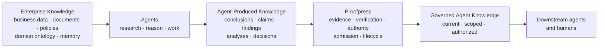
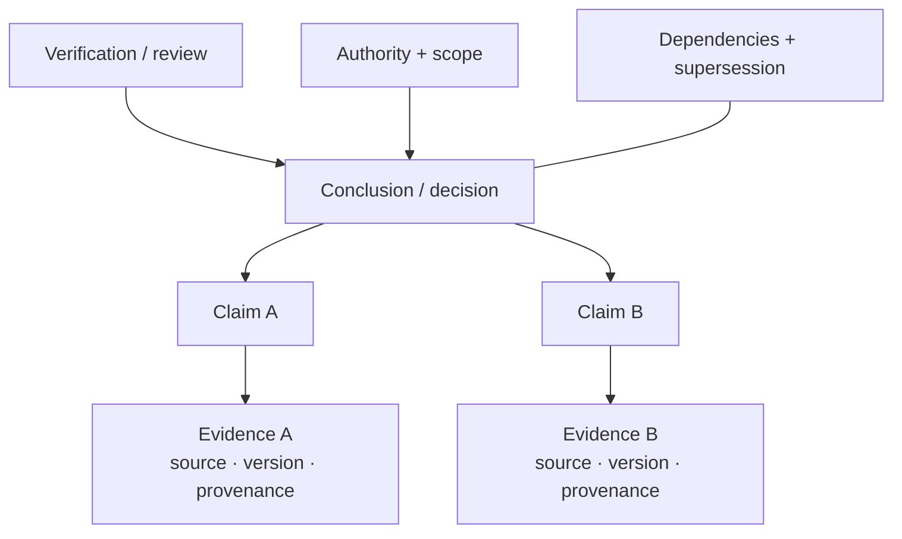

[//]: # (ob:6ec771b4)
<p align="center">
  
</p>

[//]: # (ob:de7999eb)
# Proofpress

[//]: # (ob:7542280e)
[](https://www.npmjs.com/package/proofpress)
[](https://www.npmjs.com/package/proofpress)
[](https://github.com/chenmingtang830/proofpress/actions/workflows/ci.yml)
[](LICENSE)

[//]: # (ob:e667d986)
**Proofpress — The Governance Layer for Agent-Produced Knowledge.**

[//]: # (ob:0e0e9d9a)
Agents don't just consume enterprise knowledge. They create a new knowledge
layer. Proofpress governs it.

[//]: # (ob:92fbc10e)
Proofpress gives a checkable answer to: **What may a future agent or human rely
on, why, and under whose authority?** It governs selected conclusions, claims,
and decisions produced through agent research, reasoning, and work—not the
enterprise knowledge agents start from.

[//]: # (ob:815b673d)
> Existing knowledge infrastructure organizes what agents reason from.
> Proofpress governs what their reasoning produces.

[//]: # (ob:6ef36a68)
## Two knowledge layers

[//]: # (ob:8fb4a17c)
Enterprise knowledge is the business or organizational knowledge an agent uses:
documents, databases, policies, domain ontology, and memory. Agent-produced
knowledge is newly synthesized work: conclusions, claims, findings, analyses,
and decisions. Proofpress governs the latter; it is not another enterprise
knowledge graph, ontology, memory system, workspace, or orchestrator.

[//]: # (ob:eac911f1)


[//]: # (ob:8f7c2d11)
## Why governance becomes infrastructure

[//]: # (ob:9317a2bd)
As agent adoption and autonomy increase, the underlying enterprise knowledge
usually grows relatively steadily while the accumulated conclusions and work
generated from it can grow much faster. More agents, more runs, branching
research, and agent-to-agent reuse all add derived knowledge without requiring
the original enterprise corpus to grow at the same rate.

[//]: # (ob:bf4b55ec)
```text
Accumulated reusable conclusions / work
  ^
  |                                            agent-produced knowledge
  |                                        .-'
  |                                    .-'
  |                                .-'
  |                            .-'     ← governance threshold:
  |                        .-'             when verification becomes infrastructure
  |                    .-'
  |  enterprise knowledge  ____________
  +-------------------------------------------------> agent adoption / autonomy over time
```

[//]: # (ob:f64abc15)
This is a directional product model, not a claim of a universal mathematical
growth law. The bottleneck shifts from giving agents access to knowledge to
governing the knowledge they create.

[//]: # (ob:1423b1c1)
## Governed Claim Graph: the product object

[//]: # (ob:821f22af)
Proofpress turns selected agent-produced work into a governed claim graph. Its
objects are conclusions and the claims they depend on—not enterprise entities.
Each conclusion carries the record needed to judge whether a downstream actor
may rely on it.

[//]: # (ob:836f405e)


[//]: # (ob:09cd9aa3)
The graph preserves a claim's evidence and provenance, verification and review
record, authority and scope, dependencies, and any later contradiction or
supersession. It does not turn a source or a model output into truth; it makes
the basis and current eligibility for reliance inspectable.

[//]: # (ob:4fe9b290)
## From agent work to governed knowledge

[//]: # (ob:9b060e32)
The implemented mechanism follows five steps: **extraction → evidence binding →
verification → admission or review → governed claim graph**. Agent work is
selectively extracted into a bounded evidence projection; the configured
authority alone decides whether a checked conclusion may enter governed
context.

[//]: # (ob:2e6c722b)
[](docs/VERIFIED_KNOWLEDGE_LEDGER.md)

[//]: # (ob:b5752df0)
Evaluation can recommend; it cannot authorize reuse. Rejected, unresolved,
expired, superseded, unauthorized, or dependency-blocked conclusions remain
auditable but stay out of the default context.

[//]: # (ob:3ce2d48b)
## How downstream agents consume it

[//]: # (ob:827e8ea8)
Today, downstream actors can consume governed knowledge through the local
ledger and CLI, the local review and context UI, supported agent adapters, and
portable Markdown/static-HTML artifact carriers. The `context` command projects
only admitted, current conclusions that match the requested scope and actor.

[//]: # (ob:76acc27a)
A supported public API/SDK and MCP server are **planned, not shipped**. The
local UI's internal endpoints are implementation details, not a public
integration contract. See the [ledger scope and integration boundary](docs/VERIFIED_KNOWLEDGE_LEDGER.md).

[//]: # (ob:159c6149)
## Choose the path that matches your workflow

[//]: # (ob:893ea267)
| If you are… | Start here |
|---|---|
| Building an agent or multi-agent product | [Govern selected conclusions for a fresh session](#quickstart-governed-context) |
| Shipping a high-stakes review workflow | [Try the legal cold-handoff fixture](examples/verified-knowledge-ledger/legal/) |
| Handing documents across people or systems | [Try a portable artifact handoff](examples/portable-handoff/) |
| Evaluating the product mechanism or claims | [Read the frozen seven-model study](studies/long-horizon-eval/relaybench/PUBLIC_RESULTS.md) |
| Integrating memory, traces, or a workspace | [See what Proofpress owns—and does not own](docs/VERIFIED_KNOWLEDGE_LEDGER.md) |

[//]: # (ob:09822b9b)
**Start here:** [run the 0.5 alpha quickstart](#quickstart-governed-context) ·
[see the integration boundary](docs/VERIFIED_KNOWLEDGE_LEDGER.md) ·
[choose a design-partner integration path](docs/VERIFIED_KNOWLEDGE_LEDGER.md#design-partner-integration-path) ·
[bring us a real handoff workflow](https://github.com/chenmingtang830/proofpress/issues/new?template=design_partner.yml)

[//]: # (ob:4ccd51b9)
## Quickstart: governed context

[//]: # (ob:cc376e2b)
### Install the 0.5 alpha

[//]: # (ob:d6f9f208)
Proofpress 0.5 is published on npm's `next` channel. It requires Python 3.11+,
Git, and Node 22+:

[//]: # (ob:7b197ac1)
```sh
mkdir proofpress-quickstart && cd proofpress-quickstart
git init
npm init -y
npm install --save-dev proofpress@next
npx --no-install proofpress --version
npx --no-install proofpress setup --agent codex
```

[//]: # (ob:5ae48e1b)
`setup` installs the agent adapter and writes `.proofpress/manifest.json`. Use
`--agent claude`, `cursor`, or `all` for another supported harness.

[//]: # (ob:460f8108)
Import a bounded telemetry export or artifact, propose one scoped conclusion,
evaluate it, record an explicit human admission, and request context for the
next actor:

[//]: # (ob:8b9b3369)
```sh
npx --no-install proofpress evidence import \
  node_modules/proofpress/examples/verified-knowledge-ledger/demo.otlp.json

npx --no-install proofpress propose --statement "The current conclusion" \
  --evidence EVIDENCE_ID --scope demo --proposer agent:runner
npx --no-install proofpress evaluate CONCLUSION_ID
npx --no-install proofpress review CONCLUSION_ID \
  --admit --reviewer human:reviewer
npx --no-install proofpress context --scope demo --actor agent:successor
npx --no-install proofpress ui --scope demo
```

[//]: # (ob:20fbea6e)
Each command prints the identifier needed by the next step. `context` excludes
rejected, unresolved, expired, superseded, and actor-mismatched conclusions by
default. `ui` opens the local review queue, governed-context preview, and
lineage graph. The 0.4 `proofpress knowledge ...` command group remains only as
a temporary migration surface.

[//]: # (ob:9c6c7f6a)
## Evidence, with the boundary attached

[//]: # (ob:30685e8d)
The strongest current product evidence is a frozen panel of **7 models, 3
Harvey LAB-derived legal task families, and 126 valid paired runs**. Across that
bounded panel, Proofpress governed handoffs raised rubric completion from
**89.3% to 93.4%** (+4.1 percentage points) and reduced observed unsafe
propagation from **8 to 0** across 63 controlled stress pairs.

[//]: # (ob:cf466876)
[](studies/long-horizon-eval/relaybench/PUBLIC_RESULTS.md)

[//]: # (ob:aea6ced7)
This is a descriptive product-mechanism result for frozen,
Proofpress-composed handoff episodes derived from public Harvey LAB Contracts
materials—not an official Harvey leaderboard score, a population-level causal
claim, statistical-significance result, or evidence of improved legal
intelligence. Read the [results, boundaries, and retained receipts](studies/long-horizon-eval/relaybench/PUBLIC_RESULTS.md).

[//]: # (ob:8c55fe43)
The [Athena/APEX governed-working-set pilot](studies/apex-agent-eval/) adds a
conditional efficiency signal: across its two evaluated tasks, Muse Spark 1.1
used 38.3% fewer **executor-generation** tokens and 46.2% less executor latency
under the Proofpress treatment, while majority-scored quality did not decline.
It does not establish lower end-to-end cost: treatment construction and
cross-task amortization remain incompletely measured.

[//]: # (ob:41600981)
The separate [artifact version-check study](studies/agent-handoff-artifact-provenance/)
isolates the underlying mechanism: on one preregistered changed-document task,
ordinary handoff continued incorrectly in 12/12 trials and Proofpress-assisted
handoff in 0/12. It is mechanism evidence, not the primary product result.

[//]: # (ob:cd8c1f66)
## Portable artifact provenance

[//]: # (ob:ec2e5323)
Proofpress also maintains an open portable-artifact path. Markdown and static
HTML can carry an inspectable record of admitted revision history even when Git
does not travel with the file. A format-agnostic evidence envelope can bind
provenance to the exact bytes of other files without pretending to understand
their semantics.

[//]: # (ob:20a32f50)
Start with the [portable handoff example](examples/portable-handoff/README.md),
then use the [Portable Artifact V1 contract](docs/PORTABLE_ARTIFACT_SPEC.md) or
[Artifact Provenance Protocol](docs/ARTIFACT_PROVENANCE_PROTOCOL.md) when you
need the implementation boundary. Think C2PA for knowledge work—not a claim of
C2PA compatibility, signed authorship, or complete capture.

[//]: # (ob:22a54f46)
The example includes portable [`strategy.md`](examples/portable-handoff/strategy.md)
and [`strategy.html`](examples/portable-handoff/strategy.html), plus a
[`proposal.docx`](examples/portable-handoff/proposal.docx) with its
[`proposal.provenance.json`](examples/portable-handoff/proposal.provenance.json)
evidence record.

[//]: # (ob:226a29fd)
## What is—and is not—recorded

[//]: # (ob:cfc1c3aa)
Proofpress records selected evidence, candidate conclusions, lifecycle state,
scope, stated actor roles, policy recommendations, and explicit admission or
rejection. Portable documents also record accepted versions and computed block
changes.

[//]: # (ob:5e0b34ed)
It does not automatically store raw prompts, transcripts, private reasoning,
casual brainstorming, or every save. External workflow dispositions never
become Proofpress admission decisions automatically. See the
[privacy boundary](docs/PRIVACY_AND_DISCLOSURE.md).

[//]: # (ob:32f0ea79)
## Current status

[//]: # (ob:4902cb38)
The implemented developer wedge is:
**bounded telemetry or artifacts → evidence-bound candidate knowledge →
verification and review → governed current context for the next human or
agent.** The local ledger, CLI, review UI, artifact provenance, and portable
Markdown/static-HTML carrier are available now.

[//]: # (ob:99c9f31b)
What is not established yet: a hosted service, production connectors,
general-purpose memory, or broad efficacy across long-horizon workflows. The
next proof point is a real design-partner handoff with a measurable fresh-session
decision. If that matches your workflow, [open a private-data-free integration
conversation](https://github.com/chenmingtang830/proofpress/issues/new?template=design_partner.yml).

[//]: # (ob:8deed5b3)
## Go deeper

[//]: # (ob:17d6b002)
- [Ledger scope and integration boundary](docs/VERIFIED_KNOWLEDGE_LEDGER.md)
- [Interactive verified-knowledge-ledger demo](examples/verified-knowledge-ledger/demo.partner-style.html)
- [Two-minute portable handoff demo](examples/portable-handoff/README.md)
- [Published controlled handoff study](studies/agent-handoff-artifact-provenance/README.md)
- [Documentation map](docs/README.md)
- [Privacy boundaries](docs/PRIVACY_AND_DISCLOSURE.md)
- [Agent adapters](skills/README.md)
- [Contributing](CONTRIBUTING.md) · [Changelog](CHANGELOG.md) ·
  [Security](SECURITY.md) · [Code of Conduct](CODE_OF_CONDUCT.md)

[//]: # (proofpress:meta:eyJhcnRpZmFjdF9pZCI6InBwXzU1NmIxMTVkZTcxMWIwY2QzM2VlZDI2MCIsInBvbGljeSI6InBvcnRhYmxlIiwicG9ydGFibGVfaGVhZCI6IjA2OTQ3OTYwIiwicG9ydGFibGVfaGVhZF9ldmVudCI6InBwZV80ODFiNDc3MWE5OWFlMGY3MWI4MzU3ODMiLCJwb3J0YWJsZV9saW5lYWdlX2lkIjoicHBsX2VmM2MyZDU2NDRmOWRlZThmZmU5OWQ3ZCIsInByb29mcHJlc3MiOjF9)
[//]: # (proofpress:discovery:Verifiable revision history by Proofpress | https://github.com/chenmingtang830/proofpress)
[//]: # (proofpress:capsule:eNrtfety3EaW5qug2TFjm2YVcb-we9xLUWw1w7KklWj3TohaMgEkSFhVQA1QRYpjO6J_zf7d2OiYR5hX2P_7KP1jI_Yt9pzMBJBVLIDFi2W55zi6bVYVkHnyZObJc_tO_rDFqnmesWR-mqdbe1uz2ann-bFleSkPLCs2k9RxOE9t39za2YrL9Po0zc95PYdn6wtme_5ekNmm5Thm4ge-mSWWxe3Acy3XDy0nSHgaMT9y0jBNWGg7dpp4LHAyNwoSi5lmzCNoN83rpLzk1fXW3g_4YX46Z-fQw4TNsasd-CPmE_jiO17lWc7iCTcqfpnXeVkYF_B8WV0b8bXxqirLbFbxuoZ3Zix5z845Dmrp66r8nsNwFxU2eDGfz-q93d3zfH6xiMdJOd1NLngxzYvzOSvOQ8fcXXq74v-yyOHv00XNq9OkLGpeAC_m1YL_tLN1wRky0fQjN4gEx_CbU34pHgLm8lM3tGI3CCwWRYybWWDFoeMFoYOUldUch3Y6yQsOlDczMjnlmZPYqee7bhalnIdZxqMoDVI5HEXdacJm9WICA7aRzqSs0npr7-0PW6r7H7Zglsuqxr_kzzw9jYHlb7deznixf2QclCn_sPUOBtIsCuj_9eH-028Ox1Ps7C5rhc3nVR4v5jBFpzGr8xpXDJ9kp6wG1s25aG8xvygrJOh9XmCT9XU951P4pWBTnLklwnbg_RqnfGuvWEwmQGZyAXPE5SjjSZm8h1d8ngB7Yxceh-mZ8w84iM__77__j__3H__-BXypemJpyiX_YB3xK_jm9zODTfLz4p9OthJgGK9Otr46KQzj9_n03KirBL5H0uf17qQ8L8f15fnJFrwxh-_VuoPm5tczseJYxbZ-2umoAg5FUcTjJaqWlmsvXb9dXtaqB1xYsEiXOoFtZ9uhye_RydvfvC1mUwP2IDL43efNvoCxj-uLnE_SepyXu_DM7qW2I5ALXwwMm_t-kEahfw-KtrflZuep8b4oryY8PedGXmQVq2G3JfNFxY2srAxYQ2VRTstFbcBKgW1TzOsBikxu8ghk0j0o6p4yzvNLXhvzC24U0IJxsZiywkBisHuDGSBDQPigmGJFfcUrY4CiyM7ixLrXrP1zuagMmI0U-GG853xWG_m8NqawXSb1jjEvS_zPlE9BPu4YV2X1vgapyHeMGR9arKHlxX7gpPeatTdzkBLGBa_43va28bZaFIJP5tiDzTK7YAYI0OR9jU-9-_y33YfR-QBFPkhAn_nhPSj6yniWz40pS7mRlOJfEzhNyorNYQ7H2t6CZ97DpObQ_ATkAC8SPrShs4CZoXefWdtc0KC8TSa83pVTOBLHw2ho5rLYZVaQLFF1cFGWNRezMGPzC_iDIUPmsEhr4xqXEK6MbDIohH5rbNpMeTUspThLIsvKrEen8UfjKMNnDVbxv_3lP4wfjW4tGj-eFD-ORiPxf_jTeLLIJ0gabFC1a8uObMHnFcYGcAJby0T_qbwyQBbBkZUa-G1eLBied3Kn3cLOW18eYGHkWAGz4_SRqNH2QI3yI-bzK84Lo2JXijfYBHAqFROkugQxly3mA4sxMFM_dePH4tlv3h7L90ZL77EqucjnXBwIe4K-i7JupCF-xIYHqIwzN_Y8njw-L_PaKMq5IU4GXMdzkDllBWK5AhlsxKCe8iJtxLMBSuwAlW6SpJ4VR0tU_tdWeO4Z56g_F4pc_Hl49d3y6sDaSxIn8Lm9rMkcFdDWZLIs6YdJ-K3R99JA56mfRWBuhA_rXJsjfB7mabaIJ3l9ATyAOQYl57PaOMOT_cxAFbPgk7FxNDdQ-R9a77EVBSyxHkbc2dlZfXFSTN-nuTjbFaWj7qQ0_vEfjSRd-1tHHZ51S9R5jLshtx44b2dwLi1mZ3BKihflDlNaT8pmcJgJMXFVwZYEHo47InenQ8sbLMfQeui8Hk3RhAK5FJeLAn404CTnUz6H3cU_iJ9QRVM2zA4ycIaHTllwY0hlDOModhw_epR5LWYfjNGoKEeKg9o0GvBoimqHkcuBnJygWlDATJ5OB2bWNrOYM58_jL5DllyABJhOcf5mFahBcnKRpDnq4RXouhy5CoZ2q_mChJyNB7XbxE-CzF_Wtw_VQEEnzcVhz-WUMZgpsBuBEkHckADbsIkBWeKYPuhvYfqolB0VYjnBFxU_z4E7lZKrFaid8CdIk7TMMmPO6vfGldBMmJGWyWLKiwEuJpnr-2HgPyqtYPMddJSJTTxq6Kvni_R6D_YLsA3ba7637F3Lht0_QCuDtZjwNHhUWo8vQErXixnuC7kulak6EqYWKnJTjrI6r6cow4X-iEwGwT3E1zRMrMxfsU-VH6YVFbhHL3nBpEUwtCpveXVIK05s7jm28yiUaAccm9QlKNKwneH_tVBGZqDaNb6mUdcyqN1j4xs2wC3bZI6deeaj0Ch183Y1vG0oapca_8Cmswl_97n6o95tiR6i0faZHWXLu_rPuBry-m9_-SsKN6mXwYfGC3bLpN7-9pC6lCVW4jD2WPRoU6t8fEYNp1yCmipvN1kC7eYpmwtlPZkscKfUOwNs87gZOy5_NLaBtpSWXCnAi3kJplyewHkk9FwQemhawDqZzua1UIiLOqly8WHQjQbLz-QsWD6KDxZVhQoIHHjzxW1m142HB-bOjUw7iZ3wnr0dX4iTHFWQAqcn5Zd8ArsPbFnpzKr3Tort7ZvKCmopQ0dqlESZs6LJbU6WmlUxNWCUsEbzveZgCzBhPcGnmleXuXAVSfcSGj_JkIUSpqAdePGyAHtWwqi59DYNzYr-3MCEWEHqx6Zp372PkfF2XzMUhZKKnp7zStp1zWH07nM4jOvd_dcHfzo6Pjw4_vb14bijCTg13_rp3U7jUt9Sh9BpUnEmXdril8Y_zk-zzHZixzRDnoA5HFiJ5zKWuihCgf-CkY3cU15_6TuclUCdCGJUoid0eDef0N_9DsMFkzy51lrQQwhaIyI4cc_oQl1m89MMpoFXQiUUb9SxtcdCPzNN1w9ZEvDECuwgScI0jRgPXMdilu3Dxoli1zF55CdZmqSxD1pqnDkhsx3h_MGVKoIRcrb2nPAnYHQtzhnbH5nhyA6OzXDPNPdc50v4t4lcUxxHWzD2Qh5HAayQ7tsfHiN0IZabjCpcsPoCJUFm-cx3Qy_hGTwg2tACDWolPjyCgGIdf4Pvr_J0fgG_hCF8uOD5-cVcfYI2f787-2rNXlTUhl7gA6MtPzKdhlotAKGovT2uoJrzMp75aRYkqek1zWmhBtXcQyII3dNXV1djeOT7WoTiVAhPe_yLk0J1hObHxr3s4tPY1R9EJPGf8OOdez046t7YKF64y4TcrHcbx2i9m-Tj6-lkN2ZwAKwM_WFNShKfg8guar5n7M9QpR7ZY7OXR4KG3Yl8Y6RewDdG8WTREPf86ODwxZvDL_oXG09d2EVp4Hpp2KwOLeyjVsdDojnj7e2B7kH-BD5LLDdNmu61GM8Nx_zdQzfzcs_Y3r66yBMw3zV1CrTqa-MItDBQatBrVF7tSN_HxfUftrfRXxTDaaSpZ_q78_Kk6NS1OgG1YKfZO3DmCtEum5NH2A5SXIBODC2kHPX46_kFWj0V_160vnNSLAoYYDm5hA_o78gr_ANsJmgV7fYdHOWikDHX_F-BoAwUsBvev3E_r63EBpEZZnbgtYJAi14pXj8kKDXNa6mqyqGzq5OiVYuWYjWS6hoYP1HeCFZVpZgudNsq3ViFEfCLegH6zCVM6knRGBjAjgwauzBUWHlg5MwPIotltu8KG1yMXIuStYv8_sEvNQsjNQtfGP_nf8OOrrmMiWyqqkxT9WJc4eKAXcSAFWzSGlWN2Lir2IF5WXAUo1d_mHPQaUHb-SdYh3DYnQKv5gWvhBDq52AahJ6f8MTjjt2doG1UT3HwIcE6dF7NkDdDK9j0uJcGPo-FMiFPxi6Sd-dzfH2ADqYUiBt1dvCIF-egdXGclBGsjnI8K7qz_2gCUmGuZrfMYMq6Nw0hKXFVMzAecE6FxYxBK6XQaKqCZZvmBupBZrksSQLfdtygXcxd4LBRDx4e8WuYHqaR59lZGnqtOqIFAVV_D43eVbDPJ_N8JD828udH4-0zsbXWi2Fx5CxLgdv2pej_zUU-m4n-jQvQzNSMK1ndcgV7P66kfJrwc9iGsJ7T1seW5R_w3NMcHJfqjBy1Z-RIzv-ueH1X9f4ntO6hc-U3BOHKkqqETTHjJbSDvJCJNHVDAWsdPp2bRpGxzr-ifmr6O7xkE4x_QZc4FM3RVhnJhOWyn9cw83KttMGUJW_iu8_xPzn0s-RqbD1Q2n5pOj5qxJ5w78kDQ0TPanGYse70QALegLC8wiWqiYnyqmj8F60_Ar7rk50_rosBN1q1FTqgQZux71rdtmnDwt22uU9kt-nDTU03ClyL26180oK9N7WZO8drUdFa1nlOClRk8gI2Wj4fG_tt9KQNR6iUOXH4wLk6BT52DqZ2qf7uBN6a4xkOawPEotSkakGGVGigRbmQoCHQ_cpqqnbM77pzHIjN8nOgMj0pWKr0AUMpLfNr7NhoVRh4fVHzAXkfZSkLsiyNIydqTZcuLK34-ZDIMu7z3-krrvsZDt4am9EkjtAZY0V3On73eXuOdF3tztcQM9Kf6Mu6UoO2U-6DYcrT0ObNoLUo981FdOdAdYUuRjhtQQuFw-d9jrsRNLUK5gX-YnAiqnipdFAiM24ou41ei8tjkmc8uYbXmiPmvVDU1ohsAw7B8xzlGIpuOf3GG6klgdqTLSaTpXkTzXfrqO2oRwAMLCXf98LQiRM_clsFRovKd9v_7qH1poeUuUmQmXEUsKYHLdre9nCnyHmrfsVO5ni-mwiFVSo-XTD95pq4c2Acs2KNV2CVwIPO2LK-BIsElDk5wS9QmbPtL_cGVDMrDKIsiOIwbbUELaKuKHxQdBxEHWi7IHryOQZip-IvY3TdfJBMHY1q0LVGKb_UGvkvOOjh6O1opOy34cdEAB1-lYIatdwPJwUMa02At5k72wXVOXVClrVmlxbNbzjzgMg8nOYZbPvx9yCvzsbGtzXspbOWxAkDk_NsxzhLFlVdVmfi7D2DPs6k_gSyA86OJjonjn1Y83U9sJk8m7Mw8OLI5O1ZquUANDHsB8TzUcjogmMH7W1x-oA1Nd9pDESGNvUMDqe8cQW0wqIxv_8FDJ95e4jiiIWsEd4DkVE9sKi57_LU81PTd-NWZ-jSCZYX9X1TA0DTFdpbN6EbKJQpCPNxOZ_MxKSf3LJoG9aOUNOdi4CGcSICHImKO3ScBoNEUjcatVQffnf09PDFweHp0VNsAyfHQArgg2paKSN7YDKDMXkbM9REHrx8cfD82zdHL19Aw8PvKNV86Y2WTpxzEAQj-RDQIpbCXvNxuOVmZayMSywNNah6kYDOWpe3tLTIlxq5RSzYZhx7Zur6id063rRUkCbw_oC0jjM1tLPW73RStP4m41Z3kzh6kQsj2FHSbFy2vuJrVBkzBnYbdLbIz0RsWtI3KROwl9SswRZcgMqwaowZM02JOCmaAApYDLOLsXEsDkfXONM43Pkex-PxWcuX86oEmVzxqYiRC12UwViZgb4OUGhA4Ezzxv9SLyqQN4Nap29bnsViy7Fan6SWB9OpCvdPYmmdrz53GTeTyG8PTS2vpc0Fun9SCtqJqSGBFuhkvJERorRUjvE0EKkgV-cTNCdUqsi8ytmk1jXkEei8SETaeeLAlDDqEl8y4Z2x8QROFGw4zYWzW-tjqQfcPpaNjk9F36glWnY7MEdxYDqBabsstNtDVcuy6YIa906RUaS2xC8xQQxUU_-VG2nZMhY9jBJWpSMVEkO_0Rd3MaTbENiAvWCCjpmyMLU81mq2WhKPYsVDMnBUMsD2NqgK29tGfVGiY3fFVIex8EqkCMAZhyOolfqSsBmL8wlafyBR25A1HD1gikxRPIO0BB6MjdYF8VYkuQj-GSqccyf3wwlapzAe0GbTegfMBjgfxO6vUXPAVJqldAuUIdLaXUxrJKPmaIQYswkTOTcpyk1YRfUMzehL3tBUK5ljoHoDOlVD4VkrD0DLLa8K6WVpZAM8MbCwXYdnZuKlLktbV7WW5tQJn7vnKjUHD0-TJHR85oZtD1r60k1b4s45SNX7FEeNbEV9I09Oij8df_NcGP-wHVA6ogdBsFOBAYU2h85TPMpRCb2BD8TIPEq3An3MsGYad5B0rXYSOMvRfN1HTQ8OLVCCi1K4M1plhhcyj0OQgzGek0Jz2M5Lae9-wAHF16hsA1lSRcama9FTuRCn15xLTx68JJYAjBabkxNf46qGnodm20kt1zSz1EvcrFMC2jQtNRcPybVqfIGdJNkRBMKiVb7ht-1K2m8m8jtLni_wt7K0X718fbz_5Pnh6f7r46M_7h8cn755dXggnG6oFr1tX33VsRL-nJdJOWmNdfXmq9cvvzt8sY_6JPx5_PLg5XPRkJjc63KByjmXgqDNv1mOnaB2kBfvjQP7lZhoTTFAp87f_vJX4RBR-67MTgrxpPB5zHMpjEDZyc9RDkh3VH2Rz4RlhA9NOKZegdWF3pqBsJJpuqkXBKGbtIqClsDW7dV7paA1AoGHGQt82zVd7aRrs9Jubtc755Vp_hthHsACUU4e8VFpgQacoui4Vb5A7GUKM5M2chVH1tpincsGV4dUOjFE10ktzfmN4qWx50DRnmGX6nCS7keckgV-KzI7TpS6MLSvfCsKXTe2Us9s95WWI9coVg_IcssvkY3SRwgzBjxLWL0AnTeuUErC-xiKEyuKIzTaQK_E2Dj8AOpbAY-1QYY0r8GAUppSgc-eFNJNq5-uHUNTnuSKNTrJuhtNUAdztBJqfPX66Lv9g38-3X_x9PTp0ZuD5y_f3O43y3hsJ9zyzcRqTX0tjU-LNm2QmddIPdeKfdDc7CxsZ0dL1ms1lgfk3ylxVBt_-7f_1W6AkXh2nfMbHzsppLmdKPdxG7wXbXSuwM5i1j0Ky-kIYHygljIGbem4tYak6b5jHDw_avynxrfw55oDfEe53eVmOSmaM3VXnqcjdZxWFRqADBX-S5ZPxMaCIQ1MJ_ey1E1Sx888t7VtuoTE5czRe-UYgvAWOHXYEUolHM0WlXA_NDEg4FhclaDr8QzZDStVBcAmJQZYMTagwi0iRUbYgspjI4xBQ2TGIYEqPC5D2SMVyu6i5SLWCt3CzqwEc0SocKRChah4yr00xuBlf3h0RymkrNn3I1g9bASNLYX2RXoJCi7x6WcK0Q9t1Qg2VhDYodmpjlpaZ7dVb0nXbE63iHsiZwJU0aY5LYNTNfeQzEyQPCcFNNDmFn3d7sfnMm6Omw73iXr7u8PXR388Onx6-vWLl39-fvj02eGp-PfrtikMOaLaglp6r_dMuGc2itsKN5tiP9hz16BaXsxFthb0dXxVjmAy4WQybmhkKz0MqGOiqVetn36NXX_n8OtK40_VUSsnZMpmipurNCyfGtDVreeGeG9fd1LDO_X7fDK50bqww0VBieL83ecHL18cvz568u3x0YtnKusFHhHH-qTE3_-0_-LZ4fOXz9qUGAMDxCB7QXN79_mbw4NvXx8d_3P3KgYoQDBALyiJsIOnh6cv_3gKHT399uB42YJWecA_4WJfU12Dp7Ca19fWEAU7oIfenwcrc8j6I7zuWj9Q8sA4hqH_oqU7xKrqKnckdyjZsXG9gWmZin02VHHicdDlN3u6iQl_EHJ4g6Fsmu1-s6k2T11mZ_Qx--b7Kif9OdhGyoA6ON5vTFpQe0BV7RSRzlfZ6OLjvqnYpCdd6FclCsV79qvNyyb9LoWL68V0ii3fs2ttynq7fg2S_bId8yWb5CnoflcrYetGpRM5mjjjRsEu83PBnrGc22ZN_LB1dYE4gNeCaUvNTGCYdTMYNgFdRzgUbxuUwTKMF4r9IsMzwhEDD03QkdwRBzojOn5BTdZMDZUSxOC0mcuYI6ubCIJKOpXpERPQqzgycHM8hcUDx8mYZ_u-CaaY6fmW7zue3bJXB0roIAEdPPEDSaGPKoU2x8S0mJC2tT33p_Wgj9sQMI8Cc0liC96xrYRFie_EockjmFUvC0w3SM0M9GSeWUHo2rYVwsIMWJalZupltp3YoWNl_UNaB3Rx92x_HdAF1npiR5yALgR0IaALAV0I6EJAl58L6BKyIE6C0GKe-akBXQZ9N4R6IdTLp4V6CbmXxK4dZHGUEuqFUC-fDuplWJASBIYgML96CEzsZwjXdRzQ4f6TQWDU0SnTiG8Jpg1KAsLCEBaGsDCEhSEsDGFhCAtDWBjCwhAWhrAwhIUhLAxhYQgLQ1gYwsIQFoawMISFISwMYWEIC3MLFib2Y9t2gpBJmdmPhXn-WO57AsYQMIaAMb9uYIxtM8_N3Me5nuZYWmK4bdAjI9Pr2u319kzEPPn5NbDlbHWDrcrJ9dASjdwVKhT04WvQR5UG13asRatUaghoccqv1dwLrY4bBRyYqEQQNYs9YAgu1U5hpgCPZJsdIEK4m_tpqJs4XusLFtG_xCiLuGSV6L-x6pR2c17JGTXwzuq7oRq4m3lBnMVWFnostFIwSUwzFSbKelRDkxF-O6rhU15Cm2M7Vu-KsH5anyD_UUABXpIkQFmWWSYLnMj2XTtII98PHR64fmB7bpTG8DkzPdc3wyhNYpYFGaj9LqgBodUznnWIgGDP9tYgAgKgNIIhEyKAEAGECCBEACECCBFAiABCBBAigBABhAggRAAhAggRQIgAQgQQIoAQAYQIIEQAIQIIEUCIAEIEECKAEAGECCBEACECCBFAiABCBHzaiAA4b1iaYW5CFyrR0lm0zOb75qToM6g9BwION5f2LqYmbva2SGIEa2uCMSeYuTOpwbPJGGbpw2AbS09-IRdkPq-XGum2kjRHN2pv5aUvuvirEg0EyyBYBsEyCJZBsAyCZRAsg2AZBMsgWAbBMnphGT_PxRx3uTuCGekC1VA84BHS0NjVNQxm6KqK9UgJbFO83jWKQxl1N07ITq4uwEJHw1yciioL5sZtElJGQn9gSN4JBeH4kR26UZCZZhC5QZhxFsWxUMnWoiDaLPjbURCPf4nBAGRjTcX_ZbxCl77_UfAKYeoGkRnGSRREPvd8y8kixoCzITTFnDi1I9OJYu6lXhh6HgwjDhzPDvzQTx0euv1DWgNZsOw901oDWciSjNtpEBBkgSALBFkgyAJBFgiyQJAFgiwQZIEgCwRZIMgCQRYIskCQBYIsEGSBIAsEWSDIAkEWCLJAkAWCLBBkgSALBFkgyAJBFgiyQJAFgiwQZIEgCwRZIMgCQRYIskCQBYIs_KeDLETMjrM0CsM4cT4iZIFwBoQzeFScQdIDMEh6kAVJH6SgykHxqNL5zwwoUDGQU_hN9P7ImAItP02r06-n_PamqA9dyaA12wsqeC7vROjuOJBhN5k3JI3fFUmuS5LGLOxBFxx-mDWJSBs00l3yoEhpkoEEnEAeMHcDFdicmaDPxGnC3MjxPI-xODXdpA9U0Oap3w4qeIwp2xwCcSuqoMuw_zioAtviQcJtJ_IjJ3G5Z9lWmqRmypIQjrwkAjXfTmOH224UBtwB48uFY8thThyFaWzdCVXgWnuOvQZV4HhuasHpSqgCQhUQqoBQBYQqIFTBz4YqcBPbT3GgmfvrQxUkMiGcDWlhqPGpFp8evjl69uL01f7r4xeHr0-PXhwfPnu9f3z08gUBFQioQEAFAioQUIGACgRUIKACARUIqEBABQIqEFCBgAoEVCCgAgEVCKhAQAUCKhBQgYAKBFQgoAIBFQioQEAFAioQUIGACgRUIKACARUIqEBABQIqEFCBgAqfElDhQDnNtOZXGtMvWmgERpM7tZpGdzeQQsRtM_Yj0MhByTStMPFdlrHI7gMptGnvvwhIYQBScStIoUvY_zsEKdh77rqrD5hpeyA2OIEUCKRAIAUCKRBIgUAKPxdIAZYTT5KY-06Q_d2DFIZa_O1yEyOtiRE2QRgGwjAQhoEwDIRhIAwDYRgIw0AYBsIwEIaBMAyEYSAMA2EYCMNAGAbCMBCGgTAMhGEgDANhGAjDQBgGwjAQhoEwDIRhIAwDYRgIw0AYBsIwEIaBMAyEYfgVYhi0rJouKX7TLJ6hlPku_6HpSvMndl1t6Lm8JTNf60XzvT1CL8ViGnNcRW_fblko58Jo7PwDLAf1MXLGrvyI8xd2P5jjrXfv-qnU3GI_Iy_CxPMy7joP6IWl0iJRHnKliL3dR8Od7e6_OvxvnTcdFwWmq9UcTuZ8Us41GTfjH0bsfIBWF5RKMwqtR6e15tgXyPS3rWa15HDsE8cDtGr5fx2tHR0VnBWXK5Q8NEFwgBotIWVTah6SsbIZiEmTK70gptflAr1aWlYPqG_ovGp8X1lV_iu6X1Gmj0QycpulJyZt3DcrN4be9Ci-qBU-KlFZopgwWGLcAL-WshvO6lrEOvDsKDEGAMYHrIxxH-c36VFnrwwuIXCrXMpvMS5zYTc2MST8rQZTe5gQTbT2chvMx2k5V6Ss4ax0civOg2Y7xU3WXjqjyBv3ydr-SeagvCaq29axL0MSaLOk3db-E6su-bXxfP_JCFYBTAyaXPViAnab5Mq4T4b29v4GXRb10pBEz5_VaCUI-x0XQCdURDYRYuswMQ5UAY4W_rhPqq4IHtXpfqqSlhpj9Bv0cPIPoO5gEFOYOTlw81o4_mBG26t-dLEqJOi4T0au7_k1n7er5kYoS7Kc1VoeRBdokYzuAQR-gwlVPctmzaSplaTxXG2qzvUkYx8tHWLAGl9wGpaF9CqlysW0UGka3e7QEhzUNtkcfBjEduokrmcllukGjs-c2EliFvaBD1s42-3gQ9KzSM8iPYv0rAfpWZtjpVuorpyrPXtHA-26Oy2xe_ZP6_G5HwWTHDmmiXknIbzF7TiygjRwuGdbjAdOFLqchV7quVHm2txNMa8z9V3fDp3AB7NZmMx3GugNpHK0Z9p7ZrgGqRwHoWvZTkJIZUIqE1KZkMqEVCakMiGVCan8CSOVPzZI1_JC32NgH2fdLYAE0v31gnQb3t4G1u3zHXamnR64H6F7dxfOMXYdw0q-2H317RM4909fH7759vnxGwmbJeQuIXcfF7lLIFYCsRKIlUCsBGIlECuBWAnESiDWv38Qqxfbme0mkWslYT-IVcSq5lWJIdp5u2NXEx1kOrEydUDHAyOnzIzt7aB1NTknxZrYt7QHBQA2Y9N8knPlbrJs34CdmsO6Y7g6DNjb9fY2qN3SxkOl76RoZLvoceemT6rLIoVNzPJatBNXqHNLtBDOCXreMBdexFAxo0NET7e3jc-_dMcWesIwgICLQ2RO118o2S7SIY0yxkxu-APoYxkXmLQZO2dt08CFEFs1oUVloPqOnucK3BViEsY5CDB0E9dmcOrFnddkLXL2j3IWXi1J4C4LaE-aousyEcQ8NBO2nlHGMpfkZK3wwLjBAsmA8U3g7YUgYqSFIJaRtnc0jfu5l6QBy0I_c5nv3wK2FUtZT3dR7ButJlWI81yuedAQNKS18D7VWgozn-V1ia7ihtOCK6pYdDcRxoEC79Voa4LWhWDqBhSHlesw44O1SSQTkf4Vl5gVBJIfLSz0cMwWE-kDnCDmAwzBRc0mJ4VwTUhUkjA72WSEPjuB2ZCALRyTwtyoXQ17WIGC1VY9KXQ3m478bfNMuvzpRglSuN0mPejesztYeSqwmMl4aJqdz6FLM9Bk2X1zBDD6LkiE7Y8JS0zEHyRSHvNoVrOU9prNjo6H-VXZKh5ymwFzRJrTGxjJe8MaWycF1qgynBC3VyYUie3tNglKgkGwL5Ai8_I9V-Au1x_b_wBTg4qNetZAhyzQgTEIRDfj7GiyYI7ZPKiDwblxkYNRPGXfC4_BSCyhFM5LJjDfWBwAF17KEzwcxyeFjvjq4OAT4ekHa380L0dcAM5qsF7bflDUybiSAgYB45AxIyFt2BQ00vxfm3xGgcpGDL_EcsJZKvEnfMiTG0Vu4FkO407WHpla3oZ-kN0z6WIQsg5be9KmzQmeT66XYPl7aP-uqQRxo3gCMOTepR7Echis9tCWeTgS6J9OmnV-FoHLXpPP2KS7Efqd0O-Efif0O6HfCf1O6HdCvxP6ndDvhH4n9Duh3wn9_veIfpcRmD4M_MqvK0j4G78u4-HBjqn2PhIoHtS57BRdr1UPIl6cPR0iflHgXig2xcR3Ccb3uyhOA41o2cKPeUegRuJtyEtpwbG4Fnbkalr0nJ2jM6yzallaCqVT-XJhytFtgmfMjvGsOfc7XSFrwnorIElt3L0EHkyYytoWx02rVVR8kgvLVeZI1zLRqy19P8lFAga6-1QWs_QLXl2IPNQmYagHy7iP45MJRxMO2kLVjLRRPNGR8NngSD9TjkacQTz20fMg8oJXeMua4B0iX0aYIGUoZ0qToKUEOBPenBUju42s3QXB6CVe6LtJEGWmb4Uhi0zu8TRK-xCMLcxlAwTjJ7YrNsdurrm3cBn21IF9PgrsKQ3B9or8wGOBk0R-ZIOi4jk8gYbMlFmZn8WOxewgDpnverYdeG7smpnjZnbIYDb7h7QMcAqPrXDPM_dsfw3AyUtc5gWMEcCJAE4EcPrlAE5mnJixl5rM5UMAp-GjdwjDFFi-Z4Opy-OA__IYpuEzW4c2rU19FaVB7g5tOikGsE3GXaFNJwVhmwjbRNgmwjYRtomwTYRtImwTYZsI20TYJsI2EbaJsE2EbSJsE2GbCNtE2CbCNhG2ibBNhG0ibBNhmwjbRNgmwjYRtomwTYRtImwTYZsI20TYJsI2EbaJsE2EbSJsE2GbCNv0cbBNPxMeaRO4z2ueVUByk74Dh5lgskj6UPokaGTtXWjCAynANW22nDx1Me6EZj1mFq7H-HyrzE7ZBMgDiSdAVy6oa8rjarST3B7tgqjWzdjCkBoy7wbFAYZwy8ELbaI4dRkoQVGY2SLLey0UpwVk3A7F-RngMwPAoTVYE-un9VCSjwKfMWNuJZHp2nbKQh4HpmsxeMX3skR4nEzThy-T0Ak9L8MbhhwzDXzXjkLHhb95_5DWwWecPXvd_UCgFidxEBB8huAzBJ_5e4bP-CCYfDNIMze07gCf6YXJ_LnBsra25MrxhnCZk6Is_mD8eWOszGNeA0RYGcLKEFaGsDKElSGsDGFlCCtDWBnCyhBWhrAyhJUhrAxhZQgrQ1gZwsoQVoawMoSVIawMYWUIK0NYGcLKEFaGsDKElSGsDGFlCCtDWBnCyhBWhrAyhJUhrAxhZQgrQ1gZwsr8XFgZFVM9hd8ECevgMoLcDi4j6dbAMjD4kRds_RruAtLa0jJiH9yWlmP64La0dMeuLRApmloxYdewo4Za1QVvS2SXwXj_hm-Qq-Up3r_VNgbZ0domhXWt_vniWilMwhpv8qiW7wy6K1e01LBH7OkGm7SMqUfs5gbfMt9lsKq9h3TDUmk8qijocuwjr6TNxSZdliNGhaSDsHNQwJ-LApFjAzyxXNuJrWRl6Wj5k2WMFh7qhi364EC0_6xiQ_SCMrJpM7OLWzaNbWW2zbJHp1H3uy8wRb41rOU53hwoMg8RdJ8SulDmwpAkAh3cNT3-6PSenZ1NeTVlOQISQHvF02luHD_BE_jg7cnWQZdUt9takydb78Tv-_jAwLI1owSkOnMenWpsQ8Ttm6vGJLAEX_1My36RSQydmSQUvwEuuxmPYjsyl-jFnFUtdbTZZuerwJlbVu6mzfBb5Fps-qbMon9cEve79_Nm1cJGn2DylHCwimCEWK43smAHWGpzPwlskZH4uPS-_c3br9ujqHN4tN6pPUlmR2TTCzPqIYHuBZ6dZo-_BA67BN9EgJmUR-x3Rj7Hb5RbaSl713gt02cG6HUSbqduuMzfp5jojeG4qQjFLaYz7PeWBdr70qAYDXjIWfjA3o_LlIGln3YvSu1cBmJEG3zNTgEjvCoHeBP4LEnsgD2Qun0tV1EF8PdfHe2-efq1EDDfHLwSzg3lW9neBmu8KDCjCaZ06Jj0osS33GiJuk2RJ7fM5UMBLO38Rg5nth88Oo0PBb2sAyN0p04IAieKH53ohwDMHvP20nk-n6i4k7QZgYtC1mnaYAvi7DSOdt_c_ULSpRtThaMO84QwToMRT8xK0e5J7ekVfdfzvEiaggFrTbZeCt7IDN229IA2VDiTlgIUkq_SKdr5v1U5Asxb7ET5uM_c66VjP00VGwSUfFblNR_lxWwh8wowViXGXy7m-F3LozYi2GcUbsb7elKewy5omT2_KnUvlrDIQBqtYbJmJvZ29ZRnIm-nG5rMyuybURnFEZHCpZeEarZjwOYrgd7rtXBTkUXWAklE8OcK1hWGN8d9luhmPJL7W7jnlE93LZdUPIUBsdNxn5W6Wc2OrJxAYyihFOvx4tqrTcyzcZ_RusEC1I2286q8gqFKTrLJ2v1_c8Fr1usG_ak-kkV1yVsEVVEWIxCjF1zFlkbyKWDyFSz-S9hz4z5LdkXO3uhvnVXXZuZJy6HjN-71dXOpmSC39demhnULfJbPuLgFWsZ3RL6WzLoQsux8neJpiIzHcZ-edBsVmpRs0WssvcxrmVvSKpFiY7Zo8o6QcZ8KtL7jxlmsxarStRpSk8i8cp21psWs7wCDUf2KE-wTpS7h2r0QyWsg31AKzDADrEcZWd_Vay4isZKPbchUiAOJwYYtkc15E4G7EscGn80xEJujG17FpcZ96sQG3WrIotXgRiJxNqXB1JptadFJ7KncI68Ev5Z6yxokvp4oL4s3qK3ClxirCWlNjMvnZXhaJKqqw7NJU2tWhjrhmhnrWx2blwLy0zR0HOawOHJDniTMS2MnDc0bcvZ-is6WVkWorUvzK7vQm1zb5Nom1za5tsm1Ta5tcm2Ta5tc2-TaJtc2ubY_adf25hVf24KjkqY9y9vRa4-aP62vLfpR6qmGlu-xGP6dZZjQ7JpOkgW-4_qm6WQhNz0r5aD1O4lreXAYuGkSuKkXOmEWWWkYupsNb7m2anRsmXu2s2etq62KJRfjhHtUW5Vqq1Jt1V-stqrn8sANfTt0uspL62qraiv8b3_5qzDwnnVG7XP0MQj3ldBPR68a86nV_QbLr8Z-AJYej63MivvLr-5L115aFp_Nje8XsjKN0DnWeQJF7vy1CpWBNok-0vbHk0J4RdbWAc2HkKIpyEQQtS73PbO_buk9CsW2Vdt6CsUi3nmDQrHNINYVSmyjiRLI1oUTW2MXFbXF-YWiAU02ViUXOxrYRxZS6uB-AnYz5IiV7mP0ww7hbxPb9VIrTpyuHt7NmqhfGYdNqKLrZtmNAnw7ZwVo5rWsF3jTGzw-Kb5aN-vicYkhbUfbMGYIbxWBUs8y-AfWRX81UHSJrHfKDUCGTdDZMyd2vNDtr_B5uI73uURzxzDvhaiVWDWMUTG1pbinmm6wZBBX1MLTQNFnoICwusW-iaIIaSlQ7l08FFeEjImO1e5v1tNJsUQS7EAEmF0jErYWgR5cSHvrA96gwyBDROibTa6RiJVlu3bzivo5mCheCYOtrfMnscTdQtVJ64nwqvKbS4FewciuYOBQma8EVkXqBQloaf31Ute7dZ6_RrXj8Ou3J_r0tqL093G1-1U7tzhJiCPoYIXwoZku8ejKjOHvcoTKP4TuISlbxePNtsfn1MaBv5AJzfOvvm7eWCPoRRt6BAdeVnVF4a9mWsVTzcwK8ptpVZ28evVWV6vE862PAJ5fQqzB51YQypZbRwP81PoaVNPP9pH-1pMlPSor9KsgEbytyql1XWC9a9nQU-ScZqiyjom4UoUAb8Zz-LUxGn1l7Mt_v5KfXr0S_wGCxH-f7t9S9yqCNcWSkKFqPlibdFOf8wD41rFMFwycOA68_hKl-3VbZ6-c6aHcsiinWOQBj9-a76wWl1h3YmAJkYXAoGLYHYX2hCnXFuxDIBD-kDU_RGZOAssdS8WsFNZqzqcGgzdvytVI941o25guYHlnDCtZjI1vyubUxVriAv26QEkUV8A7LIyOMN7mJOxSSOblqDkmEdSP9czALmpL5GjgeFW6QFaKFO3hAGAlneei9krHi6SsZgsRVhVkyhPJqDFmiCMZEDd2GtheGjqR0yn5NyugwuKai2KO-xr3kH6hmOhs3FVMNIz_jv_60bjDP30RzDs1NB59tvHzmz67yXPwjPjv3_7tfy7lZV0gfrKcpHuDLTRvN_-I6gpLomr9VuxttCN5rZJlnGr_4INfju76z1erO3i32784fmOeT_ltcil1vMiLXDdm7WGnxcJulqe6cxyrhif11BzY3jKDZ8KuZL27uJzPJ7DlsQzORZ7BOSjvJNBuF6oFyr4WG0zzTpbQmJjppja27rlsTYihs953Uz9yM9NNWvipFl3TdMAHhsUaI8Szwzjjph2x7gqBLlJ20wi5c4grVTOg6gnuC4BvE2DKFVpf2mDMEElFMFfY756UswjPrpvbmbC8gSq0CH18vxCiAHaGUMnYDXeyMIfQ7MG6Q4PGWObamW86zPRYVwO_i8AN6lh3CZ0JVuw3Xz1pv3rSnO341JOlMEbzy5O-X5R605RtuVWjkRhjoSjNeIEt5VJxUmUna51qoU0cSF3jcF_76on86knz1ch4dcvWdnkamLYZJdK9LE3zLl6oBQvvG-i7WXYAD1xcNTtaQXBR10jW5tA5oE7k4lrUDatUBZ00l1lJWI5A548oHtUVMYJdgWGmclElXFadlwXuVb6r2BKixLewJcQ9DfLsFshUWaBDKYqySLeocaPqdKvcXq3i0sBKNn3L8rM0Mx3eWpFalHO56PwDwpNNLQQrM5MI_pekXZXOLmKp-1vuGWrsasmrknon-GDvQhDekaZwqiiU1NakQk8In6SKq6J0hFAk5Ux0deS7tTI2XooypqqFnWaSdoBaVWN2qRSr4GFzBmx0e00YhV6YZMwyO8GjRVA7l-q9Q5-qhnNTr2MHZ6ArwddtlYZnTWH9whD1JJTw7Tpta6uKCbsxVK20Jai8cy6Ukt0uzbhtaNRSrzyMt9c2GPCdOCyzQ8vmptO6_bTAbuPheEBEdrlWL1561FOsV7_NaGl1qKJ-bJHmMg07XohKL9coJU4KPPYw0VWW8t1k6di27WeOnSVxu3S04HC30-8S522vFvKymHmJ5fhJpxe0od9GVj8giovOwbZE8UmhSlIgA0VplxvVi2UNI1kuBgu-dBHapfLstSpj3JaiWFv1pa0Wo8q_yPIoWqnmrtazED41-k3XCYLl-7PaCKPSV5r7IruqHoI_QwXlwtAKQPfzY6_1oWtB7UacPiA-3SQRYwlhURJGcvnbo8_kzUGVNCRTWeJXNLBSxS3FOqZYGFcq2JIAWQ-1zelV1efagkrGR7ldYt1NRlrQ_aPcZKQF0OkmI7rJ6O_jJqN1N81pSRd009ynftMc3btD9-7QvTt07w7du0P37tC9O3TvDt27Q_fu0L07dO8O3btD9-7QvTt07w7du0P37tC9O3TvDt27Q_fu0L07dO8O3btD9-7QvTt07w7du0P37tC9O3Tvzidz784IVTjY4j3X76ytRLYOFbG3lPAjERR3rsO3rqTYY3S2WTGwx-jpRgGvtQWx_ojOYi1XXM_71dPE71avb11dqwf3tFk5qsfvZm0VqcfvZm3xJ8zkT1exo23-bb7Zul5feV3bT72lkL9hKe-vTCy9Qsq0Wl6Y477d1NuVLPeaCy-HgjRKrAgyQ3jZVgGcKnuvp9grRpHn-WrxXm239VJy-GHGiqY4sYZwasot41zXFzAxOo5hLVpFg6bs9ONSlrAnfTt2s-L4nd-1LRMty8eKyuloKeZd4Oy21Tvu29O3L5cMtKQRxuqXLCXNK6xWzbhvP99lmagq1b2FqZHledKkF6yjZ9y332-pEd7O5fVIvLySRtA6TmW9-BGcnKMOIiCcGCvLU5MBm024JhtWZrxJ42pBAT1llr9h7_mak2VHm8OWT80NA82oNU63ciAv9Gsa2tsACjAKBVD7buWS3dCK3SCwWBQxbmaBFYeOF4SOdk0CjB4MFwFqwb06kntV5Hi0eJTllccKplASba3kts7U7bWSSQ8hPYT0kHvqIZtXQ2_ryHXF48Kf1peG-zil8UzYhrbnpr4fcNdJI4uFbpDFPOIxt5mduBYzYVVzl0Ux9zm3LWAjN92Q8URCsHuGtK4cngv_W1MOz_QjN4jAFqNyeFQOj8rhUTk8KodH5fCoHB6Vw6NyeFQOj8rhUTk8KodH5fCoHB6Vw_v0y-H5JotS344iy0kGy-HdwQc5oBdGaRKkVhKmzPooxfCORGEZQZistLIqb9vgUi0ZJr3qoHAoI2FdKOukUKjJthbd7UX0jP4aeggE2rCIXppYLPY924s7GMQvVkSvQSca-7LonSzNJvWbRn_pQnJ6kb32zSd3ePM7ePE7XRztNhXolGr3LWp2bQ26L6X2o358jtqOXozvy_vX4vtOfiX77P5-Lkr0HVCJvk-gRJ-TeQ5P7djyE3uwRN-mfvt-kZZYfhDbvmu6At3SU57vuC_mqa5wrkWcT-Cq6z2BChMYB2S6nqIqUCEo6m8mpOJjel71-uzUTjYKoK1eNBCm9p5VA39nLFf3Oym0dTZBVBQKmVQ4NhohqIoI6kIUpaAQty29ImXylhptTpo6vhvGdhrFg-X9jjT2rymWp5f66wb_n7bcX-qCTpQGMWMm-wXL_eml_oQL45ZYv4QX4gJcVwLQuHMFQMtK0szxHcfvoPprKwBuEJmjWoBUC5BqAVItQKoFSLUAqRYg1QKkWoBUC5BqAVItQKoFSLUAqRYg1QKkWoBUC5BqAVItQKoFSLUAqRYg1QKkWoBUC5BqAVItQKoFSLUAqRYg1QKkWoBUC5BqAVItQKoFSLUAqRbgnWsBvvvp_wPNZGj7)
