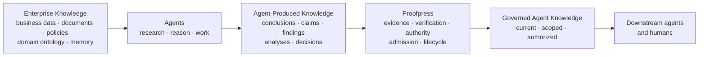
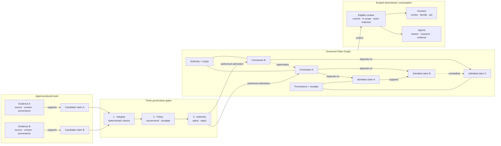

[//]: # (ob:6ec771b4)
<p align="center">
  
</p>

[//]: # (ob:de7999eb)
# Proofpress

[//]: # (ob:7542280e)
[](https://www.npmjs.com/package/proofpress)
[](https://www.npmjs.com/package/proofpress)
[](https://github.com/chenmingtang830/proofpress/actions/workflows/ci.yml)
[](LICENSE)

[//]: # (ob:e667d986)
**Proofpress — The Governance Layer for Agent-Produced Knowledge.**

[//]: # (ob:0e0e9d9a)
Agents don't just consume enterprise knowledge. They create a new knowledge
layer. Proofpress governs it.

[//]: # (ob:92fbc10e)
Proofpress gives a checkable answer to: **What may a future agent or human rely
on, why, and under whose authority?** It governs selected conclusions, claims,
and decisions produced through agent research, reasoning, and work—not the
enterprise knowledge agents start from.

[//]: # (ob:815b673d)
> Existing knowledge infrastructure organizes what agents reason from.
> Proofpress governs what their reasoning produces.

[//]: # (ob:6ef36a68)
## Two knowledge layers

[//]: # (ob:8fb4a17c)
Enterprise knowledge is the business or organizational knowledge an agent uses:
documents, databases, policies, domain ontology, and memory. Agent-produced
knowledge is newly synthesized work: conclusions, claims, findings, analyses,
and decisions. Proofpress governs the latter; it is not another enterprise
knowledge graph, ontology, memory system, workspace, or orchestrator.

[//]: # (ob:eac911f1)


[//]: # (ob:0f933c73)
## Where Proofpress sits in the stack

[//]: # (ob:639c4002)
These layers operate at different levels of abstraction. They build upward
from granular execution events to the governed conclusions that future actors
may reuse:

[//]: # (ob:c23f8ecc)
| Layer | Primary object | Core question |
|---|---|---|
| **Observability** | Runs, traces, tool calls, and execution events | What happened while the agent worked? |
| **Memory** | Retrieved context and prior interactions | What should the agent remember or read next? |
| **Knowledge graph / ontology** | Enterprise entities, concepts, and relationships | What does the organization know about its world? |
| **Proofpress** | Agent-produced conclusions, claims, evidence, and authority | Which conclusions may future agents or humans rely on—and why? |

[//]: # (ob:9bcacd6d)
Observability can supply evidence; memory can retrieve governed conclusions;
and enterprise knowledge graphs can supply the knowledge agents reason from.
Proofpress complements these layers by governing the reusable knowledge agent
work produces.

[//]: # (ob:8f7c2d11)
## Why governance becomes infrastructure

[//]: # (ob:9317a2bd)
As agent adoption and autonomy increase, the underlying enterprise knowledge
usually grows relatively steadily while the accumulated conclusions and work
generated from it can grow much faster. More agents, more runs, branching
research, and agent-to-agent reuse all add derived knowledge without requiring
the original enterprise corpus to grow at the same rate.

[//]: # (ob:bf4b55ec)


[//]: # (ob:f64abc15)
This is a directional product model, not a claim of a universal mathematical
growth law. The bottleneck shifts from giving agents access to knowledge to
governing the knowledge they create.

[//]: # (ob:1423b1c1)
## Governed Claim Graph: the product object

[//]: # (ob:821f22af)
Proofpress turns selected agent-produced work into a governed claim graph. Its
objects are conclusions and the claims they depend on—not enterprise entities.
Candidate claims enter from the left, cross three distinct governance gates,
and become reusable graph nodes only after authorized admission. Scoped
projections then flow to downstream humans and agents on the right.

[//]: # (ob:836f405e)


[//]: # (ob:09cd9aa3)
The graph preserves a claim's evidence and provenance, verification and review
record, authority and scope, dependencies, and any later contradiction or
supersession. It does not turn a source or a model output into truth; it makes
the basis and current eligibility for reliance inspectable.

[//]: # (ob:4fe9b290)
## From agent work to governed knowledge

[//]: # (ob:9b060e32)
The implemented mechanism follows five steps: **extraction → evidence binding →
verification → admission or review → governed claim graph**. Agent work is
selectively extracted into a bounded evidence projection; the configured
authority alone decides whether a checked conclusion may enter governed
context. The diagram below zooms into the three governance gates shown in the
architecture above.

[//]: # (ob:2e6c722b)
[](docs/VERIFIED_KNOWLEDGE_LEDGER.md)

[//]: # (ob:b5752df0)
Evaluation can recommend; it cannot authorize reuse. Rejected, unresolved,
expired, superseded, unauthorized, or dependency-blocked conclusions remain
auditable but stay out of the default context.

[//]: # (ob:3ce2d48b)
## How downstream agents consume it

[//]: # (ob:827e8ea8)
Today, downstream actors can consume governed knowledge through the local
ledger and CLI, the local review and context UI, supported agent adapters, and
portable Markdown/static-HTML artifact carriers. The `context` command projects
only admitted, current conclusions that match the requested scope and actor.

[//]: # (ob:76acc27a)
A supported public API/SDK and MCP server are **planned, not shipped**. The
local UI's internal endpoints are implementation details, not a public
integration contract. See the [ledger scope and integration boundary](docs/VERIFIED_KNOWLEDGE_LEDGER.md).

[//]: # (ob:4ccd51b9)
## Quickstart: governed context

[//]: # (ob:d6f9f208)
Proofpress 0.5 is published on npm's `next` channel and requires Python 3.11+,
Git, and Node 22+. This minimal path binds evidence, proposes and evaluates one
conclusion, records human admission, and projects eligible context for the next
agent:

[//]: # (ob:7b197ac1)
```sh
mkdir proofpress-quickstart && cd proofpress-quickstart
git init
npm init -y
npm install --save-dev proofpress@next
npx --no-install proofpress setup --agent codex
npx --no-install proofpress evidence import \
  node_modules/proofpress/examples/verified-knowledge-ledger/demo.otlp.json
npx --no-install proofpress propose --statement "The current conclusion" \
  --evidence EVIDENCE_ID --scope demo --proposer agent:runner
npx --no-install proofpress evaluate CONCLUSION_ID
npx --no-install proofpress review CONCLUSION_ID \
  --admit --reviewer human:reviewer
npx --no-install proofpress context --scope demo --actor agent:successor
npx --no-install proofpress ui --scope demo
```

[//]: # (ob:20fbea6e)
Each command prints the identifier needed by the next step. For the review UI,
agent adapters, legal fixture, and full walkthrough, see the
[verified-knowledge ledger guide](docs/VERIFIED_KNOWLEDGE_LEDGER.md).

[//]: # (ob:9c6c7f6a)
## Evidence, with the boundary attached

[//]: # (ob:30685e8d)
The strongest current product evidence is a frozen panel of **7 models, 3
Harvey LAB-derived legal task families, and 126 valid paired runs**. Across that
bounded panel, Proofpress governed handoffs raised rubric completion from
**89.3% to 93.4%** (+4.1 percentage points) and reduced observed unsafe
propagation from **8 to 0** across 63 controlled stress pairs.

[//]: # (ob:cf466876)
[](studies/long-horizon-eval/relaybench/PUBLIC_RESULTS.md)

[//]: # (ob:aea6ced7)
This is a descriptive product-mechanism result for frozen,
Proofpress-composed handoff episodes derived from public Harvey LAB Contracts
materials—not an official Harvey leaderboard score, a population-level causal
claim, statistical-significance result, or evidence of improved legal
intelligence. Read the [results, boundaries, and retained receipts](studies/long-horizon-eval/relaybench/PUBLIC_RESULTS.md).
Additional bounded evidence includes the [Athena/APEX working-set pilot](studies/apex-agent-eval/)
and the [artifact version-check study](studies/agent-handoff-artifact-provenance/).

[//]: # (ob:cd8c1f66)
## Portable artifact provenance

[//]: # (ob:ec2e5323)
Proofpress also maintains an open portable-artifact path. Markdown and static
HTML can carry an inspectable record of admitted revision history even when Git
does not travel with the file. A format-agnostic evidence envelope can bind
provenance to the exact bytes of other files without pretending to understand
their semantics. Start with the [portable handoff example](examples/portable-handoff/README.md)
or read the [portable artifact contract](docs/PORTABLE_ARTIFACT_SPEC.md). The
fixture includes [`strategy.md`](examples/portable-handoff/strategy.md),
[`strategy.html`](examples/portable-handoff/strategy.html),
[`proposal.docx`](examples/portable-handoff/proposal.docx), and its
[`proposal.provenance.json`](examples/portable-handoff/proposal.provenance.json)
evidence record.

[//]: # (ob:226a29fd)
## Product boundary

[//]: # (ob:cfc1c3aa)
Proofpress records selected evidence, candidate conclusions, lifecycle state,
scope, stated actor roles, policy recommendations, and explicit admission or
rejection. It does not automatically store raw prompts, transcripts, private
reasoning, casual brainstorming, or every save. Traces and external workflow
dispositions may supply evidence, but never become admission decisions
automatically. See the [privacy boundary](docs/PRIVACY_AND_DISCLOSURE.md).

[//]: # (ob:32f0ea79)
## Current status

[//]: # (ob:4902cb38)
**Available now:** local ledger and CLI, review UI, agent adapters, artifact
provenance, and portable Markdown/static-HTML carriers. **Planned, not
shipped:** hosted service, production connectors, public API/SDK, and MCP
server. Proofpress is not a general-purpose memory system. For a real handoff
workflow, [open a design-partner conversation](https://github.com/chenmingtang830/proofpress/issues/new?template=design_partner.yml).

[//]: # (ob:8deed5b3)
## Go deeper

[//]: # (ob:17d6b002)
- [Ledger scope and integration boundary](docs/VERIFIED_KNOWLEDGE_LEDGER.md)
- [Two-minute portable handoff demo](examples/portable-handoff/README.md)
- [Results and evidence boundaries](studies/long-horizon-eval/relaybench/PUBLIC_RESULTS.md)
- [Documentation map](docs/README.md)

[//]: # (proofpress:meta:eyJhcnRpZmFjdF9pZCI6InBwXzU1NmIxMTVkZTcxMWIwY2QzM2VlZDI2MCIsInBvbGljeSI6InBvcnRhYmxlIiwicG9ydGFibGVfaGVhZCI6ImE3NzE4NDdkIiwicG9ydGFibGVfaGVhZF9ldmVudCI6InBwZV82MTEzZTU5MzA3YWQ4NTRjYTY1ZTM1OTgiLCJwb3J0YWJsZV9saW5lYWdlX2lkIjoicHBsX2VmM2MyZDU2NDRmOWRlZThmZmU5OWQ3ZCIsInByb29mcHJlc3MiOjF9)
[//]: # (proofpress:discovery:Verifiable revision history by Proofpress | https://github.com/chenmingtang830/proofpress)
[//]: # (proofpress:capsule:eNrtfetyG0eW5qtUq2PGtkyAdb-wZ9xLUbTMsGxrJdm9E6KXyqrKImGBKA4KEM1uOaJ_zf7d2JiYR5hX2P_7KP1jI_Yt9pzMrMwEUFUEL5IvfRzdNgFU5T1Pntv35V8esPliUrFicTIpH-w9uLg4iaI497yo5Inn5W5RBgHnpR-7D3Ye5HV5dVJOTnmzgGebM-ZH8V4YsdjlfhgnmccT7les9Cu_8JKgcossLIuSZywP0qwKcp6kSVZmPPCZn1Vp4mdBCOWWk6ao3_L51YO9v-CHxcmCnUINU7bAqnbgj5xP4Yvv-HxSTVg-5c6cv500k3rmnMHz9fzKya-cZ_O6ri7mvGngnQtWvGGnHDu18vW8_oFDd5dzLPBssbho9nZ3TyeLs2U-Lurz3eKMz84ns9MFm52mgbu78vac_-tyAn-fLBs-PynqWcNnMBaL-ZL_tPPgjDMcRJYkXhom5QP5zQl_Kx6CweUnsecFPMoCN2FlGoUFiyMeRFmKLavnC-zayXQy49DydkamJ7wKCr-M4jCsspLztKp4lpWiAtO6k4JdNMspdNjHdhb1vGwe7L36ywNV_V8ewCzX8wb_kj_z8iSHIX_14JsLPts_cg7qkv_44HvoSLsooP7nh_uPvzocn2NlN1krbLGYT_LlAqboJGfNpMEVw6fVCWtg6BZclLdcnNVzbNCbyQyLbK6aBT-HX2bsHGdupWE78H6DU_5gb7acTqGZxRnMEZe9zKd18QZeiXkBw5_jsoLpWfAfsRMf_9__-B__7z__4xP4UtXEypLL8YN1xC_hm3-6cNh0cjr75-MHBQwYnx8_-Ox45jj_NDk_dZp5Ad9j0xfN7rQ-rcfN29PjB_DGAr5X6w6KW1xdiBXH5uzBTzumVTBCWZbxfKVVK8u1t12_X13WqgZcWLBIVypJotD3U5ffopJXv3s1uzh3YA_iAH__cbsvoO_j5mzCp2UzntS78MzuW2tH4Ch8MtBtHsdJmaXxLVr08KHc7Lx03szqyykvT7kzmVVz1sBuKxbLOXeqeu7AGqpn9Xm9bBxYKbBtZotmoEUudzlIIHaLFpmnnNPJW944izPuzKAE52x5zmYONgard5gDMgSED4opNmsu-dwZaFHmV3nh3WrW_qVezh2YjRLGw3nD-UXjTBaNcw7bZdrsOIu6xv-c83OQjzvOZT1_04BU5DvOBR9arKkX5XESlLeatRcLkBLOGZ_zvYcPnVfz5UyMkzuOYLNcnDEHBGjxpsGnvv_49-bD6HSgRTFIwJjF6S1a9JnzZLJwzlnJnaIW_5rCaVLP2QLmcGztLXjmDUzqBIqfghzgs4IPbegqYW4a3WbWthc0KG-LKW925RSOxPEwGpq5Kg-ZlxQrrTo4q-uGi1m4YIsz-IPhgCxgkTbOFS4hXBnVdFAI_d7Ztpj6clhKcVZknld5997Gd85Rhc86bM7_9tf_dN45Zi06745n70ajkfg__Ok8Wk6m2DTYoGrX1qbZYpzXBjaBE9hbbfQX9aUDsgiOrNLBbyezJcPzTu60a4bz2pcHhjALvIT5eXlPrbH2QIPyI-eLS85nzpxdqrHBImCkSjFBqkoQc9VyMbAYE7eMyzC_rzH73auX8r3RyntsXpxNFlwcCHuifWd100pD_IgFD7Qyr8I8inhx_2M5aZxZvXDEyYDreAEyp56DWJ6DDHZyUE_5rGzFswNK7EArw6IoIy_PVlr5X7Xw3HNOUX-eqebiz8Or75pXB9ZeUQRJzP1VTeZoBmVNp6uSfrgJv3f6XhqovIyrrPLd9G6VW3OEz8M8XSzz6aQ5gzGAOQYl56PGeY0n-2sHVcwZn46do4WDyv_Qes-9LGGFd7fGvX79ujk7np2_KSfibFctHZmT0vnHf3SKsvM30zo861ZaFzEepty747y9hnNpefEaTknxotxhSusp2QUcZkJMXM5hS8IYjk0jd8-HlnfsVql313k9OkcTCuRSXi9n8KMDJzk_5wvYXfxH8ROqaMqG2cEBvMBDp55xZ0hlTPMsD4I4u5d5nV386IxGs3qkRtCaRgceLVHtcCayI8fHqBbMYCZPzgdm1nernLOY3619h6w4Awlwfo7zdzEHNUhOLjZpgXr4HHRdjqMKhrbWfEFCXowHtdsiLpIqXtW3D1VHQSediMOeyyljMFNgN0JLROOGBNiWRQzIksCNQX9Ly3tt2dFMLCf4Ys5PJzA6cyVX56B2wp8gTcq6qpwFa944l0IzYU5ZF8tzPhsYxaIK4zhN4nttK9h8B6ZlYhOP2vY1i2V5tQf7BYYNy2u_9_xdz4fdP9BWBmux4GVyr219eQZSulle4L6Q61KZqiNhaqEid85RVk-ac5ThQn_EQQbBPTSuZVp4Vbxmnyo_jBYVuEff8hmTFsHQqrzm1SGtuPB5FPjBvbTEOuDYtKlBkYbtDP9vhDJyAapd62samZJB7R47X7GB0fJdFvhV5N5LG6VurlfDq7ZFeqnxH9n5xZR__7H6o9nVjR5qox-ja3F1V_8JV8Ok-dtf_x2Fm9TL4EPrBbtmUq9_e0hdqgqvCBi7r_ZYU6t8fE4Dp1yBmirXm6yAciclWwhlvZgucac0OwPDFnE3D0J-b8MG2lJZc6UALxc1mHKTAs4joeeC0EPTAtbJ-cWiEQrxrCnmE_Fh0I0Gy8_lLFk9ig-W8zkqIHDgLZbXmV0bDw_MXZi5fpEH6S1re3kmTnJUQWY4PSV_y6ew-8CWlc6sZu949vDhprKCWsrQkZoVWRWsaXLbN0vNqpgaMEpYq_lecbAFmLCe4FPD528nwlUk3Uto_BRDFkpagnYQ5asC7EkNvebS2zQ0K_ZzAxPiJWWcu65_8zpGzqt9y1AUSip6ek7n0q5rD6PvP4bDuNndf37wxdHLw4OX3z4_HJs2wUgtHvz0_U7rUn-gDqGTYs6ZdGmLX1r_OD-pKj_IA9dNeQHmcOIVUchYGaIIhfEXA9nKPeX1l77DixpaJ4IYc1ETOrzbT-jv_h7DBdNJcWWVYIcQrEJEcOKW0YWmrhYnFUwDnwuVULzR5N4eS-PKdcM4ZUXCCy_xk6JIyzJjPAkDj3l-DBsny8PA5VlcVGVR5jFoqXkVpMwPhPMHV6oIRsjZ2gvSn2CgG3HO-PHITUd-8tJN91x3Lww-hX-7OGpqxNEWzKOU51kCK8R8-5f7CF2I5SajCmesOUNJUHkxi8M0KngFD4gyrECDWol3jyCgWMff4PvLSbk4g1_SFD6c8cnp2UJ9gjL_affis469qFqbRkkMA-3FmRu0rbUCEKq118cVVHFRxau4rJKidKO2OCvUoIq7SwTBPH15eTmGR35oRChOhfCsxz85nqmK0PzYupZdfBqr-qOIJP4zfrxxrQdH5o2t4oW7TMjNZrd1jDa7xWR8dT7dzRkcAGtdv1uRsolPQWTPGr7n7F-gSj3yx27vGIk27E7lGyP1Ar4xyqfLtnFPjw4Ov35x-En_YuNlCLuoTMKoTNvVYYV91Oq4SzRn_PDhQPUgf5KYFV5YFm31VoxnwzF_89DNot5zHj68PJsUYL5b6hRo1VfOEWhhoNSg16i-3JG-j7OrPz58iP6iHE4jSz2z313UxzOjrjUFqAU77d6BM1eIdlmcPMJ2sMUz0ImhhJKjHn-1OEOrZ85_EKXvHM-WM-hgPX0LH9DfMZnjH2AzQalot-9gL5czGXOd_BkaVIECtuH9G_ePtVf4IDLTyk8iLQis6JUa67sEpc4njVRVZdfZ5fFMq0UrsRrZ6gYGfqq8EWw-r8V0odtW6cYqjIBfNEvQZ97CpB7PWgMDhqOCws4cFVYe6DnD5AZW-XEobHDRcytKphf57YNfahZGahY-cf7P_4Yd3XAZE9lWVTkv1Yv5HBcH7CIGQ8Gm2qhqxcZNxQ7My5KjGL3844KDTgvazj_DOoTD7gTGajHjcyGE-kewTNIoLngR8cA3J6iO6qkRvEuwDp1XFzg2QyvYjXhUJjHPhTIhT0YTybvxOd4doIMphcaNjB084rNT0Lo4TsoIVkc9vpiZs_9oClJhoWa3rmDKzJuOkJS4qhkYDzinwmLGoJVSaCxVwfNddwv1oPJCVhRJ7AdhohezCRy26sHdI37toKdlFkV-VaaRVkesIKCq767Ruzns8-liMpIfW_nzznn1RGytbjEsjpxVKXDdvhT1vzibXFyI-p0z0MzUjCtZrUcFa385l_Jpyk9hG8J6LrWPrZr8iOee5eB4q87IkT4jR3L-d8Xru6r2L9C6h8qV3xCEKyvmNWyKC15DOTgWMpGmaVvAtMPHuGlUM7r8K-qntr7Dt2yK8S-oErtiOdrmTjFlE1nPc5h5uVZ0MGXFm_j9x_ifCdSz4mrUHihrv7QVH7ViT7j35IEhomeNOMyYOT2wAS9AWF7iErXERH05a_0X2h8B3_XJznddMeBWq_bSADRoN49Dz2wbHRY22-Y2kd22jrB0wywJPe5r-WQFeze1mRvHa1HRWtV5jmeoyExmsNEmi7Gzr6MnOhyhUubE4QPn6jmMo3Ew6aX6h2N4a4FnOKwNEItSk2pEM6RCAyXKhQQFge5Xz8_VjvmDOcehsdXkFFpZHs9YqfQBRyktiyus2NEqDLy-bPiAvM-qkiVVVeZZkGnTxYSl1XjeJbKM-_wP9oozP8PB22AxlsQROmOu2l2Ov_9YnyOmqt1FR2NG9hN9WVeq037JYzBMeZn6vO20FeXeXEQ3DlTP0cUIpy1ooXD4vJngbgRNbQ7zAn8xOBFVvFQ6KHEwNpTdVq_F5TGdVLy4gtfaI-aNUNQ6RLYDh-DpBOUYim45_c4LqSWB2lMtp9OVeRPFm3WkK-oRAANLKY6jNA3yIs5CrcBYUXmz_W8eWm9rKFlYJJWbZwlra7Ci7bqGG0XOtfqVB1UQxWEhFFap-Jhg-uaauHFgHLNinWdglcCDwdjzPgWLBJQ5OcFfozLn-5_uDahmXppkVZLlaam1BCuirlp4p-g4iDrQdkH0TBYYiD0Xfzmjq_aDHNTRqAFda1Tyt1Yh_wU7PRy9HY2U_Tb8mAigw69SUKOW--PxDLrVEeBt584PQXUug5RV2uyyovntyNwhMg-neQXbfvwDyKvXY-fbBvbSa93EKQOT8_WO87pYzpt6_lqcva-hjtdSfwLZAWdHG50Txz6s-aYZ2EyRz1maRHnmcn2WWjkAbQz7DvF8FDK24NhBe1ucPmBNLXZaA5GhTX0Bh9OkdQVoYdGa3_8Khs9CH6LYYyFrhPdAZFQPLGoeh7yM4tKNw1zrDCadYHVR3zY1ADRdob2ZCd1CoSxBmI_rxfRCTPrxNYu2HdoRaroLEdBwjkWAo1BxBzPSYJDI1o1GutWH3x09Pvz64PDk6DGWgZPjYAvggypaKSN7YDKDMXndYKiJPPjm64On3744-uZrKHj4HaWar7yh24lzDoJgJB-CtoilsNd-HC65XRlr_RJLQ3WqWRagszb1NSUtJyuFXCMWfDfPI7cM48LXjjcrFaQNvN8hreO16tpr7Xc6nml_k3Otu0kcvTgKI9hR0mxctb7yK1QZKwZ2G1S2nLwWsWnZvmldgL2kZg224BJUhnVjzLmwlIjjWRtAAYvh4mzsvBSHY-i8tkbY-B7H4_FrPS6n8xpk8pyfixi50EUZ9JU56OsAhQYEzvmk9b80yznIm0GtM_a9yGO5F3jaJ2nlwRhV4fZJLNr5GvOQcbfIYn1oWnktOhfo9kkpaCeWjgRaoJNxIyNEaakc42kgUkGuLqZoTqhUkcV8wqaNrSGPQOfFRpTGEwemhNPU-JIL74ydR3CiYMHlRDi7rTpWasDt4_no-FTtG-lGy2oH5ihP3CBx_ZClvj5UrSwbE9S4dYqMaqpu_MogiI5a6r9yI61axqKGUcHm5UiFxNBv9MlNDGkdAhuwF1zQMUuWll7EtGZrJfGoobhLBo5KBnj4EFSFhw-d5qxGx-6aqQ594XORIgBnHPagUepLwS5YPpmi9QcSVYes4egBU-QcxTNISxiDsaNdEK9EkosYP0eFc27kfjhG6xT6A9ps2eyA2QDng9j9DWoOmEqzkm6BMkRau8vzBpvRcDRCnIspEzk3JcpNWEXNBZrRb3nbpkbJHAfVG9Cp2ha-1vIAtNz6cia9LK1sgCcGFnYY8MotojJkpXZVW2lORvjcPFepPXh4WRRpELMw1TVY6UubtsSNc5Dmb0rsNQ4r6huT4nj2xcuvngrjH7YDSkf0IIjhVGBAoc2h8xSPclRCN_CBGJlH6TZDHzOsmdYdJF2rRgJXEzRf91HTg0MLlOBZLdwZWpnhM5nHIZqDMZ7jmeWwXdTS3v0RO5RfobINzZIqMhbdiJrqpTi9Flx68uAlsQSgt1icnPgGVzXUPDTbQemFrluVURFWRgnQaVpqLu6Sa9X6Ao0k2RENhEWrfMOv9ErabyfyO0-eL_C3srSfffP85f6jp4cn-89fHn2-f_Dy5MWzwwPhdEO16JV-9ZkZSvhzURf1VBvr6s1nz7_57vDrfdQn4c-X3xx881QUJCb3ql6ics6lIND5N6uxE9QOJrM3zoH_TEy0pRigU-dvf_134RBR-66ujmfiSeHzWEykMAJlZ3KKckC6o5qzyYWwjPChKcfUK7C60FszEFZy3bCMkiQNC60oWAlsZq_eKgWtFQg8rVgS-6EbWiedzkrb3K43ziuz_DfCPIAFopw84qPSAh04RdFxq3yBWMs5zEzZylXsmbbFjMsGV4dUOjFEZ6SW5fxG8dLac6BoX2CV6nCS7keckiV-KzI7jpW6MLSvYi9LwzD3ysjV-8rKkWsVqztkuU3e4jBKHyHMGIxZwZol6Lz5HKUkvI-hOLGiOEKjHfRKjJ3DH0F9m8FjOshQThowoJSmNMNnj2fSTWufrmZAS15M1NDYTbbdaKJ1MEdrocZnz4--2z_4l5P9rx-fPD56cfD0mxfX-80qnvsF92K38LSpb6XxWdGmLTLzWqkXenkMmptfpXp2rGQ9rbHcIf9OiaPG-du__S-9AUbi2S7nNz52PJPmdqHcxzp4L8owrkBjMdsehdV0BDA-UEsZg7b0UltD0nTfcQ6eHrX-U-db-LPjAN9Rbne5WY5n7Zm6K8_TkTpO53M0ABkq_G_ZZCo2FnRpYDp5VJVhUQZxFYXatjEJiauZo7fKMQThLXDqsCOUSji6WM6F-6GNAcGI5fMadD1e4XDDSlUBsGmNAVaMDahwi0iREbag8tgIY9ARmXHYQBUel6HskQplm2i5iLVCtbAz52JwRKhwpEKFqHjKvTTG4GV_eHRHKaSs3fcjWD1sBIWthPZFegkKLvHpPYXoh7ZqBhsrSfzUNaqjldZptuo16Zrt6ZbxSORMgCraFmdlcKri7pKZCZLneAYF6NyiL_V-fCrj5rjpcJ-ot787fH70-dHh45Mvv_7mT08PHz85PBH_fq6LwpAjqi2opfd6z4R7Zqu4rXCzqeEHe-4KVMuzhcjWgrpeXtYjmEw4mZwNjWythgF1TBT1TPvpO-z6G4df1wp_rI5aOSHn7EKN5nobVk8NqOrac0O8t287qeGd5s1kOt0oXdjhglBidvr9xwfffP3y-dGjb18eff1EZb3AI-JYn9b4-xf7Xz85fPrNE50S42CAGGQvaG7ff_zi8ODb50cv_8W8igEKEAxQC0oirODx4ck3n59ARY-_PXi5akGrPOCfcLF3sGvwElZzN7eGIOyAGnp_HmTmkPwjvDGlHyh54LyErv-s1B1iVRnmjuIGlB1b8w2c16XYZ0OME_eDLt-saRMTfifk8BZd2TbbfbMonacuszP6BnvzfZWT_hRsI2VAHbzcb01aUHtAVTWKiPFVtrr4uG8qtqnJFvrzGoXiLeu15mWbelfCxc3y_BxLvmXV1pT1Vv0cJPtb3ee3bDopQfe7XAtbtyqdyNHEGXdm7O3kVAzPWM5tuyb-8uDyDHEAz8WgrRQzhW42bWfYFHQd4VC8rlMOqzBeKPaLDM8IRww8NEVHsmkc6Izo-AU12TI1VEoQg9NmIWOOrGkjCCrpVKZHTEGv4jiA2-MpPJ4EQcUiP45dMMXcKPbiOIh8Pbw2UMIGCdjgib-QFPqgUmh7TIzGhOjS9sKfukEf1yFg7gXmUuQevON7BcuKOMhTl2cwq1GVuGFSuhXoybzykjT0fS-FhZmwqirdMqp8v_DTwKv6u9QFdAn3_LgL6AJrvfAzTkAXAroQ0IWALgR0IaDL-wK6pCzJiyT1WOT-0oAug74bQr0Q6uWXhXpJeVTkoZ9UeVYS6oVQL78c1MuwICUIDEFgfvUQmDyuEK4bBKDD_Z1BYNTRKdOIrwmmDUoCwsIQFoawMISFISwMYWEIC0NYGMLCEBaGsDCEhSEsDGFhCAtDWBjCwhAWhrAwhIUhLAxhYQgLcw0WJo9z3w-SlEmZ2Y-FeXpf7nsCxhAwhoAxv25gjO-zKKzC-7me5qW0xHDboEdGptfp7fXqtYh58tMrGJbX6xtsXU52Q0us5q61QkEfvgR9VGlwumIrWqVSQ0CLU36t9l5oddwo4MBUJYKoWewBQ3CpdgozBcZIlmkAEcLd3N-Gpo3jaV-wiP4VTj3LazYX9bdWndJuTudyRh28s_pmqAYeVlGSV7lXpRFLvRJMEtcthYnSjWpoM8KvRzX8kpfQ9tiO9bsivJ-6E-Q_CCggKooCWlZVnsuSIPPj0E_KLI7TgCdhnPhRmJU5fK7cKIzdNCuLnFVJBWp_CGpA6vX0pwsRkOz5UQciIIGWZtBlQgQQIoAQAYQIIEQAIQIIEUCIAEIEECKAEAGECCBEACECCBFAiABCBBAigBABhAggRAAhAggRQIgAQgQQIoAQAYQIIEQAIQIIEUCIgF82IgDOG1ZWmJtgQiVWOouV2XzbnBR7Bq3nQMDh5rLexdTE7d4WSYxgbU0x5gQz91pq8Gw6hln6cbCMlSc_kQtysmhWCjFbSZqjW5W39tInJv6qRAPBMgiWQbAMgmUQLINgGQTLIFgGwTIIlkGwjF5Yxvu5mOMmd0cwp1yiGooHPEIaWru6gc4MXVXRjZTAMsXrplDsysjcOCEruTwDCx0Nc3EqqiyYjdskpIyE-sCQvBEKIogzPw2zpHLdJAuTtOIsy3OhknWiIHQW_PUoiPu_xGAAstHB-L-KVzDp-x8Er5CWYZK5aV5kSRbzKPaCKmMMRjaFoliQl37mBlnOozJK0yiCbuRJEPlJnMZlwNOwv0sdkAXP33O9DshCVVTcL5OEIAsEWSDIAkEWCLJAkAWCLBBkgSALBFkgyAJBFgiyQJAFgiwQZIEgCwRZIMgCQRYIskCQBYIsEGSBIAsEWSDIAkEWCLJAkAWCLBBkgSALBFkgyAJBFgiyQJAFgiwQZOHvDrKQMT-vyixN8yL4gJAFwhkQzuBecQZFD8Cg6EEWFH2QgvkEFI95uXjPgAIVAzmB30Tt94wpsPLTLJ5-O-W3N0V96EoGq9heUMFTeSeCueNAht1k3pA0ftckuS1JWrOwB11w-ONFm4i0RSHmkgfVlDYZSMAJ5AFzM1CBz5kL-kxeFizMgiiKGMtLNyz6QAU6T_16UMF9TNn2EIhrUQUmw_7DoAp8jycF94MszoIi5JHne2VRuiUrUjjyigzUfL_MA-6HWZrwAIyvEI6tgAV5lpa5dyNUQejtBX4HqiCIwtKD05VQBYQqIFQBoQoIVUCogveGKggLPy6xo1X460MVFDIhnA1pYajxqRIfH744evL1ybP95y-_Pnx-cvT1y8Mnz_dfHn3zNQEVCKhAQAUCKhBQgYAKBFQgoAIBFQioQEAFAioQUIGACgRUIKACARUIqEBABQIqEFCBgAoEVCCgAgEVCKhAQAUCKhBQgYAKBFQgoAIBFQioQEAFAioQUIGACr8koMKBcppZxa8VZl-00AqMNndqPY3uZiCFjPtuHmegkYOS6XppEYesYpnfB1LQae8_C0hhAFJxLUjBJOz_BkEK_l7YdfUBc_0IxAYnkAKBFAikQCAFAikQSOF9gRRgOfGiyHkcJNVvHqQwVOLvV4sYWUWMsAjCMBCGgTAMhGEgDANhGAjDQBgGwjAQhoEwDIRhIAwDYRgIw0AYBsIwEIaBMAyEYSAMA2EYCMNAGAbCMBCGgTAMhGEgDANhGAjDQBgGwjAQhoEwDIRhIAzDrxDDYGXVmKT4bbN4hlLmTf5DW5XlTzRVbem5vCYz36rF8r3dQy2z5XnOcRW9evXAQzmXZuPgH2A5qI9ZMA7lR5y_1Pzgjh98_31_Ky232Hsci7SIooqHwR1qYaW0SJSHXClir_bRcGe7-88O_5vxpuOiwHS1hsPJPJnWC0vGXfAfR-x0oK0hKJVulnr33taGY10g019pzWrF4dgnjgfaauX_mbaadszhrHi71pK7JggOtMZKSNm2NXfJWNkOxGTJlV4Q0_N6iV4tK6sH1Dd0XrW-r2pe_xndryjTRyIZWWfpiUkb983KRtfbGsUXjcJHFSpLFBMGa4wb4NdSdsNZ3YhYB54dNcYAwPiAlTHuG_ltarSHVwaXELhVr-S3OG8nwm5sY0j4WwOm9nBDLNHaO9pgPp7XC9WUjpGVTm418qDZnuMm05fOqOaN-2Rt_yRzUF4LVa127MuQBNospdnaX7D5W37lPN1_NIJVABODJleznILdJkdl3CdDe2t_gS6LZqVLouaPGrQShP2OC8AIFZFNhNg6TIwDVYCjhT_uk6prgkdVul-qpKXWGP0KPZz8R1B3MIgpzJwJjOaVcPzBjOqrfmyxKiTouE9Gdtf8nC_0qtkIZckhZ42VB2ECLXKgewCBX2FCVc-y6Zg0tZKsMVebyrieZOxDt0N02BoXnIZVIb3eUuViWqo0DbM7rAQHtU22Bx8muV8GRRh5heeGSRCzIA-KnKV94EMNZ7sefEh6FulZpGeRnnUnPWt7rLSG6sq52vN3LNBuuKMbu-f_1I3P_SCY5CxwXcw7SeEt7ueZl5RJwCPfYzwJsjTkLI3KKMyq0OdhiXmdZRzGfhokMZjNwmS-UUc3kMrZnuvvuWkHUjlP0tDzg4KQyoRUJqQyIZUJqUxIZUIqE1L5F4xU_tAgXS9K44iBfVyZWwAJpPvrBem2Y3sdWLfPd2hMOztwP0L37i6cY-wqh5V8tvvs20dw7p88P3zx7dOXLyRslpC7hNy9X-QugVgJxEogVgKxEoiVQKwEYiUQK4FYf_sg1ij3Kz8sstAr0n4Qq4hVLeY1hmgXeseuJzrIdGJl6oCOB0ZOXTkPHyba1RQczzpi39IeFADYip1PphOu3E2eHzuwUyew7hiuDgf2dvPwIajd0sZDpe941sp2UePOpk_KZJHCJmaTRpSTz1HnlmghnBP0vGEuvIihYkaHiJ4-fOh8_Gk49tAThgEEXBwic7r5RMl2kQ7p1DlmcsMf0D5WcYFJu2CnTBcNo5BiqS6UqAzUOLDzXGF0hZiEfg4CDMMi9BmcernxmnQiZz-Xs_BsRQKbLKA9aYp2ZSKIeWgnrHugnNVRkpO1NgbOxhDIARhvAm_PRCNGVghiFWl7Q9O4f_SKMmFVGlchi-NrwLZiKdvpLmr4RutJFeI8l2seNAQLaS28T42VwswvJk2NruJ2pMWoKLJoMxHOgQLvNWhrgtaFYOoWFIfMdZjxwXQSyVSkf-U1ZgWB5EcLCz0cF8up9AFOEfMBhuCyYdPjmXBNSFSSMDvZdIQ-O4HZkIAt7JPC3KhdDXtYgYLVVj2e2W42G_mr80xM_nSrBCncbpsedOvZHWSeSjzmMp66rvE5mDQDS5bdNkcAo--iibD9MWGJifiDRMpjHs16ltJeu9nR8bC4rLXiIbcZDI5Ic3oBPXnjeGPveIYcVU6Q4vaqhCLx8KFOgpJgEKwLpMiifsMVuCuMx_4_wNSgYqOeddAhC-3AGASim3F2LFmwwGwe1MHg3DibgFF8zn4QHoORWEIlnJdMYL6RHAAXXskLPBzHxzMb8WXg4FPh6Qdrf7SoR1wAzhqwXnU9KOpkXEkBg2DgcGBGQtqwc9BIJ39u8xkFKhsx_BLLCWepxJ_wIU9uloVJ5AWMB5U-Mq28Dfsgu2XSxSBkHbb2VKfNiTGfXq3A8vfQ_u1ggtggT4ABuTXVg1gOg2wPmubhSKB_jDQzfhaBy-7IZ2zT3Qj9Tuh3Qr8T-p3Q74R-J_Q7od8J_U7od0K_E_qd0O-Efv8tot9lBKYPA7_26xoSfuPXVTw82DHzvQ8Eigd1rjpB1-u8BxEvzh6DiF_OcC_MtsXEmwTj210UZ4FGrGzh-7wj0GridchLacGxvBF25Hpa9IKdojPMWLWsrIXSqXy5MOXoNsEzZsd50p77Rleo2rDeGkjS6ndvAw-mTGVti-NGaxVzPp0Iy1XmSDcy0UtT308nIgED3X0qi1n6BS_PRB5qmzDUg2Xcx_7JhKMpB21h3va0VTzRkfDRYE8_Uo5GnEE89tHzIPKC18aWtcE7RL6MMEHKUc6UNkFLCXAmvDlrRraOrN0EwRgVURqHRZJVbuylKctcHvEyK_sQjBrmsgWC8Re2K7bHbnbcW7gKezJgnw8CeypTsL2yOIlYEhRZnPmgqEQBL6Agt2ReFVd54DE_yVMWh5HvJ1GYh24VhJWfMpjN_i6tApzSl166F7l7ftwBcIqKkEUJYwRwIoATAZx-PoCTmxduHpUuC_kQwGn46B3CMCVeHPlg6vI84T8_hmn4zLahTZ2pr4Ia5ObQpuPZALbJuSm06XhG2CbCNhG2ibBNhG0ibBNhmwjbRNgmwjYRtomwTYRtImwTYZsI20TYJsI2EbaJsE2EbSJsE2GbCNtE2CbCNhG2ibBNhG0ibBNhmwjbRNgmwjYRtomwTYRtImwTYZsI20TYJsI2fRhs03vCI20D93nOqzk0uU3fgcNMDLJI-lD6JGhk-i404YEU4BqdLSdPXYw7oVmPmYXdGJ9vldkpiwB5IPEE6MoFdU15XB09yfpoF43SbkYNQ2qbeTMoDgwI9wK80CbLy5CBEpSllS-yvDuhOBqQcT0U5z3AZwaAQx1YE--nbijJB4HPuDn3iswNfb9kKc8TN_QYvBJHVSE8Tq4bw5dFGqRRVOENQ4FbJnHoZ2kQwt-8v0td8Jlgz--6HwjU4iJPEoLPEHyG4DO_ZfhMDIIpdpOyClPvBvCZXpjMn1osq7Yl1443hMscz-rZH50_bY2Vuc9rgAgrQ1gZwsoQVoawMoSVIawMYWUIK0NYGcLKEFaGsDKElSGsDGFlCCtDWBnCyhBWhrAyhJUhrAxhZQgrQ1gZwsoQVoawMoSVIawMYWUIK0NYGcLKEFaGsDKElSGsDGFlCCtDWJn3hZVRMdUT-E00oQsuI5pr4DKy3RZYBjo_ipIHv4a7gKyyrIzYO5dl5ZjeuSwr3dGUBSLFUium7Ap21FCptuDVjTQZjLcveKO5Vp7i7UvVMUjTVp0UZkr909mVUpiENd7mUa3eGXTTUbFSw-6xpo1hsjKm7rGajXGr4pDBqo7uUg0rpfGooqCrsY_JXNpcbGqyHDEqJB2ExkEBfy5niBwbGBMv9IPcK9aWjpU_Wedo4aFuqNEHB6L8J3M21F5QRrYt5uLsmk3je5Xvs-re22j73ZeYIq8Na3mOtweKzEME3aeGKpS5MCSJQAcP3Yjfe3tfv359zufnbIKABNBe8XRaOC8f4Ql88Or4wYFJqtvV1uTxg-_F7_v4wMCydbMCpDoL7r3VWIaI27dXjUlgCb76kZX9IpMYjJkkFL-BUQ4rnuV-5q60F3NWrdTRdpudrgNnrlm52xbDr5FruRu7Mov-fpu4b96ftKsWNvoUk6eEg1UEI8Ry3ciCHRhSn8dF4ouMxPtt76vfvfpSH0XG4aG9U3uymaaRbS3MaYYEepREflnd_xI4NAm-hQAzKY_YH5zJAr9RbqWV7F3nuUyfGWhvUHC_DNPV8X2Mid4YjjsXobjl-QXWe80C7X1pUIwmPOUsvWPtL-uSgaVfmheldi4DMaIM3rFTwAif1wNjk8SsKPyE3bF1-1auogrg7z872n3x-EshYL46eCacG8q38vAhWOOzGWY0wZQOHZNRVsRemK20blvkyTVzeVcAi57fLODMj5N7b-NdQS9dYARz6qQgcLL83ht9F4DZfd5eupgspiruJG1GGEUh6yxtUIM4jcah983NLyRduTFVOOowTwjjNBjxxKwU657UnlrRd72YzIqWMKDTZOttwQuZoaupB6yuwpm0EqCQ4yqdosb_regIMG_RiPJxn7nX2479slTDIKDkF_NJw0eT2cVS5hVgrEr0v14u8Ds9Rjoi2GcUbjf2zbQ-hV2gB3txWdteLGGRgTTqGGTLTOyt6jGvRN6O6ZrMyuybURnFEZHClZeEarbjwOarob1XnXBTkUWmgSQi-HMJ6wrDm-M-S3S7MZL7W7jnlE-3c5RUPIVBY8_HfVbqdpwdVT2FwlBCqaHHi2svtzHPxn1G6xYL0DbaTuf1JXRVjiSbdu7_zQVvWa9b1KfqKJbzt1wjqGb1bARi9Iyr2NJIPgWDfAmL_y3suXGfJbsmZzfq67LqdGaetBzMeONe75pLywS5rj6dGmYW-MXkgotboGV8R-RryawLIctOuxRPR2Q8jvv0pOtaYUlJjV5j5dtJI3NLtBIpNqZGk5uGjPtUoO6KW2exFasqOzWkNpF57TprS4vprgCDUf2KE-wTpS7h2j0TyWsg31AKXGAGWI8y0l3Vcy4isXIcdchUiAOJwYYtUS14G4G7FMcGv1hgIHaCbngVlxr3qRNbVGshi9aDG4XE2dQOU2tWt8VuYg9zj7wS_ErqLR1IfDtRXpI3qK3CVwbWEtKWGJfPy_C0SFRVh2ebptauDHXCtTPWtzq2pwKKyzINAhawPAtTXhQsKvOgTN0NOXs7ReeBxSKkeWl-ZRd6k2ubXNvk2ibXNrm2ybVNrm1ybZNrm1zb5Nom1_Yv2rW9PeOrJhyVbdrzoh2be9T9qZtb9IPwqaZeHLEc_l1VmNAcukFRJXEQxq4bVCl3I6_koPUHRehFcBiEZZGEZZQGaZV5ZZqG23VvlVs1e-m5e36w53VxqyLlYl7wiLhViVuVuFV_Nm7VKORJmMZ-GhjmpS5uVWuF_-2v_y4MvCfGqH2KPgbhvhL66ehZaz5p3W-QfjWPE7D0eO5VXt5Pv7ovXXtlPfto4fywlMw0Qufo8gSK3PkrFSoDbRJ9pPrH45nwinTygE6GkKIlyEQQtSGPI7eft_QWRLGata2HKBbxzlsQxbad6CJK1NFECWQz4URt7KKitjw9U21Ak43Ni7MdC-wjiZQM3E_AboYcsdJ9jH7YIfxt4YdR6eVFYPjwNjlRP3MO21CFqWbVjQLjdspmoJk3ki9w0xs8Pp591jXr4nGJIdW9bQdmCG-VgVLPKvgH1kU_Gyi6RLqdcgOQYRd09irIgygN-xk-D7vGfiLR3DnM-0xwJc7bgVExtZW4p5pusGQQV6ThaaDoM1BAWKOxb4IUoawFyt3EQ3FFyJjoWO3-dj0dz1aaBDsQAWZXiIRtRKAHF9Jed8AbdBgcEBH6ZtMrbMTasu3cvII_BxPF58Jg0zx_EktsFqrdtJ4Ir6LfXAn0ioE0hIFDNF8FrIoySgrQ0vr5UrvdOk-fo9px-OWrY3t6tSj9p3y--5meW5wkxBEYWCF8aKdLPLo2Y_i77KHyD6F7SMpW8Xi77fE5tXHgLxyE9vlnX7ZvdAh6UYYdwYGXFa8o_NVOq3iqnVnR_HZaVSXPnr2y1SrxvPYRwPMriDX4rAWhLFk7GuAn7WtQRT_Zx_ZrT5b0qKy1XwWJ4G1Fp2aqQL5rWdBjHDnLUGVmEHGlCgHe9ufwS2c0-szZl_9-Jj89eyb-Aw0S_328fw3vVQZrihUpQ9V8kJt0W5_zAPg28NwQDJw8T6J-itL9RvPs1Rd2KLee1edI8oDHb8N31skluk4MpBBZCgwqht1RaE-Zcm3BPoQGwh-S80Nk5hSw3JEqZo1Yqz2fWgzeoqWrke4bUbZzvoTlXTFkshg7X9XtqYtc4gL9ukRJlM9h7JAYHWG87UloUkgW9ag9JhHUj3xmYBdpihwLHK-oCyRTpCgPOwAr6XQiuFfMWBT1_GIpwqqimfJEchqMGWJPBsSNXyZ-VKZBFhglf5MBFRbXQpA57lujh-0Xiok9jLtqEB3nv-O_3jk3-Kcvgnmjgsajj7Z-fttnt3kOnhH__du__c-VvKwzxE_W03JvsIT27fYfwa6wIqq6t2JvoabJnUqWc2L9gw9-OrrpP5-t7-Bds3-x_85ics6vk0tlEGVRFoY504edFQvbpKe6cRyrgSft1BzY3jKDZ8ouJd9dXi8WU9jySINzNqngHJR3Eli3CzUCZd-IDWZ5J2soTMx0y41tey61CTF01sdhGWdh5YaFhp9a0TVLB7xjWKw1QiI_zSvu-hkzVwiYSNmmEXLjEFepZkDxCe4LgG8bYJootL60wZgjkopgrrDePSlnEZ7dtLczIb2BIlqEOn5YClEAO0OoZGzDnSzMITR7kHdo0BirQr-K3YC5ETMc-CYCN6hj3SR0JoZiv_3qkf7qUXu241OPVsIY7S-P-n5R6k1L23KtRiMxxkJRuuAzLGkiFSdFO9nYrRbaxIHUNQ73ra8eya8etV-NnGfXbO2Ql4nru1kh3cvSNDfxQitYeNtA3ybtAB64uGp2LEJwwWskuTnsEVAn8uxK8IbNFYNOOZFZSUhHYI-PII8yJEawKzDMVC_nBZes85LgXuW7ii0hKL6FLSHuaZBnt0CmSoIOpShKkm7BcaN4ulVur8W4NLCS3djz4qqs3IBrK9KKcq6Szt8hPNlyIXiVW2Twv6I0LJ0mYmn7W24ZajRc8opS7xgf7F0IwjvSEqcKoiTNSYWeED4t1agK6gihSMqZMDzyZq2MnW8EjakqYaedpB1oreKYXaFiFWPYngFb3V6TZmmUFhXzXCN4rAiqcaneOvSpOJxbvo4dnAFDwWe2SjtmLbH-zBF8Ekr4mko1t6qYsI2uWtSWoPIuuFBKdk2asS5opFuvPIzXcxsM-E4CVvmp53M30G4_K7DbejjuEJFd5erFS496yHrt24xWVoci9WPLciLTsPOlYHq5QilxPMNjDxNdJZXvNkvH9_24CvyqyPXSsYLDZqffJM6rrxaKqpxFhRfEhdELdOi3ldV3iOKic1BTFB_PFCUFDqCgdtlgL5YcRpIuBglfTIR2hZ69UTTGmoqik_VFs8Uo-hdJj2JRNRuuZyF8GvSbdgmC1fuzdIRR6SvtfZGG1UOMzxChXJp6Ceh-cR5pH7oV1G7F6R3i020SMVIIC0oYOcrfHn0kbw6aS0OylBS_ooA1FrcSeUyRGFcq2LIBkg9V5_Qq9jlNqOR8kNslum4ysoLuH-QmIyuATjcZ0U1Gv42bjLpumrOSLuimuV_6TXN07w7du0P37tC9O3TvDt27Q_fu0L07dO8O3btD9-7QvTt07w7du0P37tC9O3TvDt27Q_fu0L07dO8O3btD9-7QvTt07w7du0P37tC9O3TvDt27Q_fu0L07v5h7d0aowsEW77l-p5OJrAsVsbeS8CMRFDfm4euiFLuPyrYjA7uPmjYIvDoJsT5HZ7GVK27n_dpp4jfj6-vitbpzTdvRUd1_NZ0sUvdfTSf5E2byl-vYUZ1_O9luXXczr1v7qZcK-StW8n5mYukVUqbV6sIc9-2m3qok3etEeDkUpFFiRXAwhJdtHcCpsvd6yF4xiryYrJP3WruttyWHP16wWUtObCGcWrplnOvmDCbGxjF0olUsaMpOPy5lBXvSt2O3I8c3fldNEy3pYwVzOlqKExM4u271jvv29PXLpQItaYSx-hVLyfIKq1Uz7tvPN1kmiqW6l5gah3xStOkFXe0Z9-33azjC9VxejcTLa2kE2nEq-eJHcHKODERAODHWlqclA7abcEs2rM14m8alQQE9NMtfsTe842TZseZQj1N7w0Dba2uktRyYzOxrGvRtADMwCgVQ-2Z0yWHq5WGSeCzLGHerxMvTIErSwLomAXoPhosAteBeHcm9KnI8NB5ldeWxGVMoCc2VrHmmrudKJj2E9BDSQ26ph2zPhq555Ax5XPpTNzXch6HGc2Eb-lFYxnHCw6DMPJaGSZXzjOfcZ34ResyFVc1DluU85tz3YBi5G6aMFxKC3dOlLjq8EP7XQYfnxlmYZGCLER0e0eERHR7R4REdHtHhER0e0eERHR7R4REdHtHhER0e0eERHR7R4f3y6fBil2Vl7GeZFxSDdHg38EEO6IVZWSSlV6Ql8z4IGd6RIJYRDZNMK-vyVgeXGjlg0qsOCocyErpCWcczhZrUXHTXk-g5_Rx6CATakkSvLDyWx5Ef5QYG8bOR6LXoRGdfkt5Jajap37T6iwnJ2SR7-s1HN3jzO3jxO1sc7bYMdEq1-xY1O81B96nUftSPT1Hbscn4Pr09F9938itZp_n7qaDoOyCKvl8ARV9QRQEv_dyLC3-Qom9bv32_SCu8OMn9OHRDgW7poed72RfzVFc4NyLOJ3DVzZ5AhQmMAw66naIqUCEo6jcTUvExO6-6OzvVyEYBtLVJA2Fqb8ka-Adnld3veGatsymiolDIlMKx0QpBRSJoC1GUgkLc6vaKlMlrONqCsgziMM39MssH6f2OrOHvIMuzqf5M5_9u6f7KEHSiMskZc9nPSPdnU_0JF8Y1sX4JL8QF2EUB6NyYAdDzirIK4iCIDVS_kwFwi8gccQESFyBxARIXIHEBEhcgcQESFyBxARIXIHEBEhcgcQESFyBxARIXIHEBEhcgcQESFyBxARIXIHEBEhcgcQESFyBxARIXIHEBEhcgcQESFyBxARIXIHEBEhcgcQESFyBxARIX4IfgAgTzFjSVpo8M0IJpGZKSbQF8vxhSnA5itpN1FJp4QKkailQJ5IdMz2_jZDY06PLsaoQPyHwlhuePAfXJUZW0WDuo1uFGWYJMQDNdAAavLODJyIb7CuCQcCdLDKABEwoVujKQuDWsTBfQUHsJsCXzhUxE6wYtORZmyczNyToCxR6mTrK6lrxNqAyXaP3qdo2qybxBrVAuEahT6D3QpxZYbcwTa30pI2bHkNEp-KWwNeTgFhLG30KsYdiMIaNa1MPL9a1IZZKUmNAVM4ftBE_O2ak8y7S3UWOKRi2Gw16PpiUduec3o-ViRcwSTBhwQ-aVYP4V3E2ixLNZykA9KPTCAZn6lrcDBefg1Qqxnr05NSWX5rq5npLrNyMNtmc_6-AS8n_qpgr6IPRIiRtlvptGWeVVLONu4cZ-XHkpNCINwpRFsRfmblnwJK3iJEyzgvEk94M0Dngel2F_lzrokYJgz_M66JHgdErDyudEj0T0SESPRPRIRI9E9EhEj0T0SESPRPRIRI9E9EhEj3QTeqQ4BOsgccG252E_PdLvXv1JOSSkjY_M-H3TIZqAP4J4LOW8yNG3R34b9xHGYKdiJoSHa6vlIsI30tPUxVGE-RVzvg3vUA8wfrXdlpdfukBEwunAmU9sQMQG9GthAwpZxILUzXOWZ39vbEBP9DlvOYHF-73qgz7yVRHPdUe0v1gqVTZPEKo4Kxw4WEgPc9A7-SaiQt7B0PV8LwdeaAvvDA4uv3rXMg496vrpkSptPHKemD-fE9sQsQ0R2xCxDRHbELENEdsQsQ0R2xCxDRHbELENEdsQsQ0R2xCxDRHbELENEdsQsQ0R2xCxDRHbELENEdsQsQ0R2xCxDRHbELENEdsQsQ0R2xCxDRHbELENEdsQsQ0R2xCxDRHbELENEdsQsQ0R2xCxDX14tiGLNGVk55_20Q9ZYJH7ZQL50JwjVk1WNrepadvE8Ws61EF0tDqKm-8rHpkDRRcj_ADGGwc7Ds-IHYHf4qNT1F0MqmtHoQrWAtdWSqnJ6nbs-R73jX1v-1qeGwGqg1aBPLRyvUH9Bx0Z_2pPXpF0h0FqaDqMUDkSylYnY5HdMKeBggS6anmhurACj9DYIZkDa_VUhfBbjKHKoBVIuXHf_Pf29jGvJjPZWWMiieiHZJr6cw1aeqnpk_A5MUE24u5UeBXnTHhxQMVALaJcopkk4Hx2p4cZkl6cCR4noe_0jOtKaSI60av5ro2g1WB1gNdtBsXAiBrv85s2_W9jnEA_LoRTHAdCRTNwwG7GwJSkCJVzueuXnpukfhKHqV9VuZmrQ1x7K1iI1eGQsLOuybFZmDSlzvUsTCQUbywUt6fV6iBHCn7q5j76IHxPEajBSNwEC8_3_DjwQ49HGTS68lglPDRRXHlZXrEKVAsX_ueyoML-gJ2bi_z_ni518D2F_p4fdfA9xV4YgqpQEd8T8T0R3xPxPRHfE_E9Ed8T8T0R3xPxPRHfE_E9Ed8T8T0R3xPxPWV-4PEyYVFoqUG_Qr6ng3VvpeQRMQzzvFqoha9ce5qFft3HpzQhlVehufuln3Amsrol6KMSMDl9bBmf-th5IY41kbGnnOmNJAARaRwwPOtu6MbIPixeEhqgW2NgpSRVEZZFxLjletiWa0oqQc0yl936VqscK1OpTlc4X73b0knBu_5tCaVAT8F61-ZW017Bz37Hz4-sVtu0Tc07KK5t0voPPv7AMStyZVy-e4XAtS5PsK7kO2yih-2XePJWSSo5LI_zyUzk3ksD1XoJG-7jS8-EP1KphipNCr_nDQgmqMi8EsArAf60v6GMLaQ2iUvNapfQer7z5X-C7g4-sXU1S5DoYg68VT4yM_gH_uovZty_xHf22xTZ9Un70t_81Xo32Pz1QP-6Lxaq5hb6dIU8DNbDc6nWtqmdn2oMgtWfDfqvL73-n_y2r5s_BW1n19ZS-86XPvKBffbOMGg15q0D9aOGwMFvB17bSShxtPHRb_soPraNbj_2zO9jGBApjGyRY8VlzMCgSXAoWLemvM1YWlfXwdCRqRuosEu0noTq6WK-gFK-EBJNrWkR8VImSNm-aCZ03TpqLSLbTmrz4a22ikX9xcqn_ZUReKaWvximZ7714btATFiX4G7nYPgRMRFPxBNKvsOXz4j27e-L9o1nJSb0-kmYJUT79r5o34Q23l5QlHPUnjCS3qhF1R9FR-ML0RvSh7oa3s3hYSKUI0I5IpQjQjkilCNCOSKUI0I5IpQjQjkilCNCOSKUI0I5IpQjQjkilCNCOSKUI0I5IpQjQjkilCNCOSKUI0I5IpQjQjkilCNCOSKUI0I5IpQjQjkilCNCOSKUI0I5IpQjQjkilCNCOSKU24JQDiR68WYEy2_U4AGrz7w-QjkXJEtQJMEKz9CfRO6VpaI06CST2b6OqMGQDLFSarkqXNMqxVsU0CGe2lbFQVaEUhbdV6vgnGla6gL0NEhMJ2iJk6ri4tQX7lhhl7O8afPExQE1wAhV-EGVcmEj3FdL3ylGkndQgnTzSEAffHGAqqtYpygs7OS4NkHuYVeakiGVghO5jMt7bOw3IrTAFKYAfR-YKoCZ7kox-0PLSCDzjWHxwzBLlWtgWK30FdPSa5JvtqfxslJP7l76BnWXFad9D223giKm9C1jjdvXYnnuTC3X-Aa3L90ypK3SlS-zbfhQiV0ywzKcb1foRjMtu8WUuGELbV-epWHZ7HFGYestSp6JdlEmbdcUZUqYw5Z7uymW75rXq2nwTBLvtrXfNct3SKxZqZbbNucuuZhDp4HJ6Nt-Wm6U8tfWZOWIbVvTXZLIhnaJSe3atiV3yf0aYmc0yVdbj8ndsrMGTgErurltY-4S_hyaIBNqu0lLbhuLG5L7JgaxbUvuEqQYPIG0P_0mY3Jbh_tASyzX5dbb5w6-zYGWWL6ibVtyF2fSdlTNln2ypoMqttn9ssSQTD0rkLNCmj-t0xWPkEa5p_vsi-5SP58jb40k5BIWA2tahhcstNNUWKMW1rFZNsO9O-4zG7obcIBBJeSEs_XrHe1mWyMAE9xeK6Rmlj4vuVWgGcspm6s0BMER_Vb46G0Io6bjsGII4z4Toqfhmjd7FXshA2AyLGAP1FzyWKMb_AdWCDtMjPi4T9_ZWI6aEBu_UNCyEtU9BcJFfWY0r4Vzo10OjjpTx316zRa1bJSt8IscM3rkI9JJgH5bkFeNyjFQoXuMavepMVvUbpirpVoiFKkphi9x4pAcqk8z2aJwzNPFpFZsqJV93yzzznGzlJG-wj9H5qNWzZBp8hIoZ6DG1RIO3tMl0hjYC8SM47hP7xisdGWwSrs7QjQKQWEaYf08QV-fklfjPkWjr-qv-PxUkbO356gJxbWpqaI8WTcujVNoLpdAmdVHxn2aRW_t7UTCcq-lGSj1CqPNqNG3QLYit6ddsWw-FwRm4z5V4gZVr6oNd2uBpUJcs45l8dyEWtAJKzIHhAasEp4aQ2LUtcgsPWGLbaO1AYXwE6kdUBsKWnSBDFZlKQLXL6oZPxWDo4KrKH1WUem4nkRiQqGTgUf6CVyQMpG6TwEYboECzEq8gLzhYDVKA7-fLplgOFX7qm2LCrGNpPnc1xLL_dN7JcCR2p7SLkAqoHM23Uwjl5tK2rtCjdSBbJHtBfu9EfaOyJNdLjA4O-5zFvVfFgELqZ7KwKMyIUykcWPfN2aKEBEhVowldzq2vOVSuvZCCL3uWxGystpV3EwcFLbcVbEXIX7HfQ6n3rq_5PxiJTFN2AaWD0oMA1RphIIWA4ZiUK5TXMvogQR78KwuhUoz7vNNDUzIuUqtHvBZ4QBgTW0MU_CjXda6E7BOcbOIpPJxnwNrYD5mrQ5pNmmrfohLK0SglM-1pqjzkPr8WkPdzfF-DKn4vpVd0TJCpRxZsSNFcSM5cOQJqfjaJBvh4pLz2SohjqFf6_OR9bbuGVY0M-AEUbkUIS3gQjicbZk1LB8sT9rA-AvhIOkj0ME2mkvdxUFvGs59hR4vmGxMrxU0RGsT3nX3xyFID6ac47buP0U1WDHirejsms1BucFFLk03ZSV001LHmUrw7qepbDOEmzOE5mlKRHWAKgnTLmYjYHZW9VBU0Xf0uK9nh9vDU66EKnE_Nze8O6RgPMryyuNhWFYs9XnM8irg1lJRlpsJPsh8TxnLurL6Z98Voq9juP6uEIp3UbyL4l0U76J4F8W7KN5F8S6Kd1G8i-JdFO_6WeJd21-tqK-skxrpXrhjXV6X7ejG7nmrl_OZi-o-yOV8OY_dPCwSN3dDnoJdHwZu4hVJlHtRkUWlV_IsDKOi8IKA-1WapG4VJVXghm7qu354455u3NkX70XhXph23dmXB37msZju7KM7--jOPrqzj-7sozv76M4-urOP7uyjO_vozr6eO_vSIkhyP01DQ-VoRVBsFPztAiAtdDUMA5Z7cZVkRl82MRGDGr51SOMKhNNkCmfZxSWb4-K_NikOW257rld5zNvDU-DSkA3qSrLlD_BFxnkae4kLRqdnOFhMOEXTYd8lGvJwJT4BR_Q757m4ELAlSl7UNVJOTaca1r_W83eS0eCMgUWKPbduLdTXWvDyj46q7yuxsWVFKthhiOh1AFFSpytdtK2iOauXKj-rPf9BTOR8Lq_ZYKXQ2XVNX66lPO5qASNqP9y8uGxHTBsXngAJ-ZZZGUjKoVshPAvyTkNzYInjCm-ywPtVYFCg01PTZ7PMRc37AwHa9nQxPA3q0kB1jwc2YiJIHM36wrVk62aNVs7EvZJX8rI2oRedXf1xkJg6LsMoLyPXKwwpjxUUU0vuLjGttc3xB3lmDgW4rfJXL_Dr1J16MkgXtijI2_tC2wi4TmNdK_x4Ji5l2UbLostK6bJSuqyULiuly0rpslK6rJQuK6XLSumyUrqslC4rpctK6bJSuqyULiuly0rpslK6rJQuK6XLSt_TZaXv_0o-1_c8nmc5nNzpvV6bp-8W2-raPME63mgAq0hUxyO-sYIGKiNY6kftaSD4BMTx2F6DpvmhO287a9e_UqyMZr_Cc6vobQfiWDlPPc9P_MBzs1_lZX6dt_T9rBe00fVsv67r2cIQpESaJ1GeV-_nerbP1ZY0XNJqY1qHo7ycS3ENyD0usNyXbPpGHctwtmrq8M3luIL6vqO8pnvR6F40uhft3u9Fc6M8SyoG6zuq6F60X-m9aMez_VLfRLbhRNHgmsU6Huomt57JSJUo4t7uzvpZL5TK3CCJyjQOqyqkC6U-xIVSzv3eCIU3pck8rtXCjMG-7WVQQ2aiX4VVkSa5n6eD9_R0IKP7117hhr6fZH4YmOt3f70X89z5LhwsTSfkb3UXzsu55PQT7Vu7Fgc2hX0vDrp81_LNdoRfTVyY08beOy7JES7mjltynF_8JTl-xeEM5y6PjPDcvCTn4cN9--YXhG3bl80Y_5p938y6_0ztNVt2rF5A4wzdPwMy4eHDZ5bH6XimXE7Ymu3uilnzau20bi2MNaBfayWtvs2fd7rvl1Ep8tI8UhfEKMEjc_tWr3RZYyX7TV3hUoaFW6ZRlmdZ9AGvcLnHa1WeS81L-bTaSIh1v8kt1a0tr1WhG0fu58YR5X8YCT6ovmtG3gO_Sjdf8DbkcM9s4jNNkrihJqIlLgSrzMaEl2BFiCTO9sQVXdY0esgnYnk31bg0rSdYe3nmXBx-KM5WGbW0p72bekyT7Cm-L5vaUje6JZhTzGBoM1VXJi9a19zWJQMd8ujebLyKeDUqsXKKtw6DIIGn1ZVbG3yW25OBxZ4X8CgL3ISBHAsLFkc8iLLUZnCT-kk7RR3tk4vOpgJrUd7XU4G9nzW5PeWZRrobfLv3Uzdi_YOA9xOeJEUeV2EeJy7Li6zifshTPwnKNAljFuVeyeHrIkyTOIj9hAVpnJepm_MwLVO_v0tdKP24G6XPksRLQ2goofQJpU8ofULpE0qfUPqE0ieUPqH0CaVPKH1C6RNKn1D6hNInlD6h9AmlTyh9QukTSp9Q-oTSJ5Q-ofQJpU8ofULpE0qfUPqE0ieUPqH0CaVPKH1C6RNKn1D6hNInlD6h9AmlTyh9QukTSp9Q-oTSJ5Q-ofTvBaWPcIGEuSzyUpdQ-n_fKH1p3bbQLL1hhq-KtVtlPfcJyDzrxbPF-XS7V_FJ-bLUm9l0DO3-cfDllSc_kYJlgmLSKsTMqrAGtitv7SUYbL1w5ColZgNiNiBmA2I2IGYDYjZ4n8wG3__0_wE6f5kJ)
