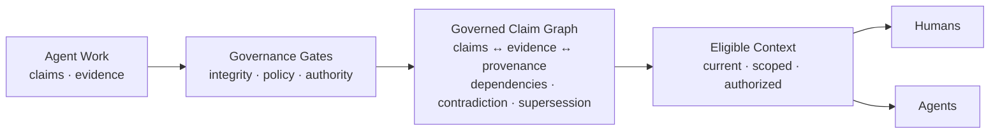
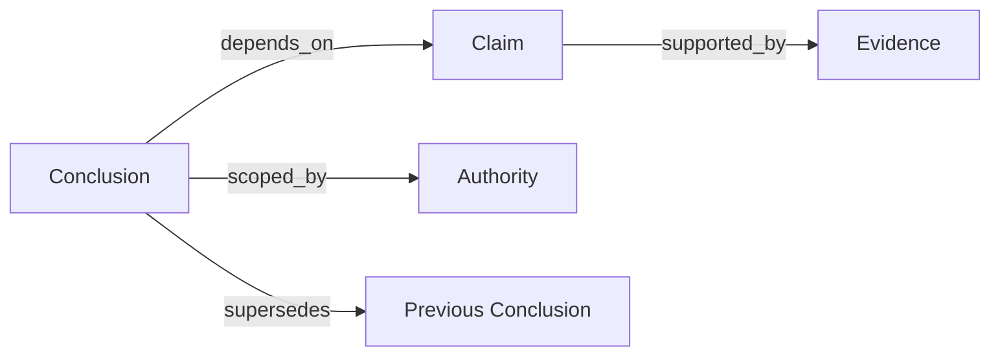

[//]: # (ob:6ec771b4)
<p align="center">
  
</p>

[//]: # (ob:de7999eb)
# Proofpress

[//]: # (ob:7542280e)
[](https://www.npmjs.com/package/proofpress)
[](https://www.npmjs.com/package/proofpress)
[](https://github.com/chenmingtang830/proofpress/actions/workflows/ci.yml)
[](LICENSE)

[//]: # (ob:e667d986)
**Proofpress — The Governance Layer for Agent-Produced Knowledge.**

[//]: # (ob:0e0e9d9a)
Agents don't just consume enterprise knowledge. They create a new knowledge
layer. Proofpress governs it.

[//]: # (ob:92fbc10e)
Proofpress gives a checkable answer to: **What may a future agent or human rely
on, why, and under whose authority?** It governs selected conclusions, claims,
and decisions produced through agent research, reasoning, and work—not the
enterprise knowledge agents start from.

[//]: # (ob:815b673d)
> Existing knowledge infrastructure organizes what agents reason from.
> Proofpress governs what their reasoning produces.

[//]: # (ob:2e6c722b)


[//]: # (ob:4ccd51b9)
## Quickstart

[//]: # (ob:d6f9f208)
Proofpress 0.5 is published on npm's `next` channel. It requires Python 3.11+,
Git, and Node 22+. This minimal path binds evidence, proposes and evaluates one
conclusion, records human admission, and projects eligible context for the next
agent:

[//]: # (ob:7b197ac1)
```sh
mkdir proofpress-quickstart && cd proofpress-quickstart
git init
npm init -y
npm install --save-dev proofpress@next
npx --no-install proofpress setup --agent codex
npx --no-install proofpress evidence import \
  node_modules/proofpress/examples/verified-knowledge-ledger/demo.otlp.json
npx --no-install proofpress propose --statement "The current conclusion" \
  --evidence EVIDENCE_ID --scope demo --proposer agent:runner
npx --no-install proofpress evaluate CONCLUSION_ID
npx --no-install proofpress review CONCLUSION_ID \
  --admit --reviewer human:reviewer
npx --no-install proofpress context --scope demo --actor agent:successor
npx --no-install proofpress ui --scope demo
```

[//]: # (ob:20fbea6e)
Each command prints the identifier needed by the next step. For the review UI,
agent adapters, legal fixture, and full walkthrough, see the
[verified-knowledge ledger guide](docs/VERIFIED_KNOWLEDGE_LEDGER.md).

[//]: # (ob:a62af198)
### What the quickstart creates

[//]: # (ob:f44cdb35)
This is a **local, Git-backed governance ledger**, not a hosted service or a
JSON database. Evidence, proposals, evaluations, and human decisions are
appended as auditable events on `refs/proofpress/knowledge`. The JSON fixture is
input; the `context` command returns a JSON projection containing only admitted,
current, in-scope conclusions eligible for the requested actor.

[//]: # (ob:c9727fd8)
`ui` starts a token-protected server on `127.0.0.1:7331`. Keep that command
running and open the complete URL it prints, including `?token=...`. The Local
UI exposes the review queue, admission receipts, trusted-context preview, and
claim lineage from the same Git event projection.

[//]: # (ob:e98261ca)
The screenshots below come from a reproducible **synthetic** ledger with one
admitted conclusion, one conclusion awaiting review, and one rejected
conclusion. Generate the same states in an empty demo repository with
[`scripts/seed_local_ui_demo.py`](scripts/seed_local_ui_demo.py).

[//]: # (ob:08b34ea5)
| Review queue | Context projected for the next agent |
| --- | --- |
|  |  |

[//]: # (ob:1423b1c1)
## How it works

[//]: # (ob:821f22af)
Proofpress turns selected agent work into governed knowledge through five
steps: **extraction → evidence binding → verification → admission or review →
governed claim graph**. Integrity checks and policy evaluation can recommend or
escalate; only configured authority can admit a conclusion for reuse.

[//]: # (ob:836f405e)


[//]: # (ob:09cd9aa3)
The governed claim graph is about agent-produced conclusions, not enterprise
entities. It preserves evidence and provenance, verification and review,
authority and scope, dependencies, and later contradiction or supersession.

[//]: # (ob:4fe9b290)
## Core objects

[//]: # (ob:9b060e32)


[//]: # (ob:b5752df0)
Proofpress does not turn a source or model output into truth. It makes the basis
and current eligibility for reliance inspectable. Rejected, unresolved,
expired, superseded, unauthorized, or dependency-blocked conclusions remain
auditable but stay out of default context.

[//]: # (ob:3ce2d48b)
## Current surfaces

[//]: # (ob:827e8ea8)
Available now: local ledger and CLI, local review and context UI, supported
agent adapters, artifact provenance, and portable Markdown/static-HTML
carriers. The `context` command projects admitted, current conclusions that
match the requested scope and actor.

[//]: # (ob:76acc27a)
A supported public API/SDK, MCP server, hosted service, and production
connectors are **planned, not shipped**. The local UI's endpoints are
implementation details, not a public integration contract.

[//]: # (ob:9c6c7f6a)
## Evidence, with the boundary attached

[//]: # (ob:30685e8d)
The strongest current product evidence is a frozen panel of **7 models, 3
Harvey LAB-derived legal task families, and 126 valid paired runs**. Across that
bounded panel, Proofpress governed handoffs raised rubric completion from
**89.3% to 93.4%** (+4.1 percentage points) and reduced observed unsafe
propagation from **8 to 0** across 63 controlled stress pairs.

[//]: # (ob:cf466876)
[](studies/long-horizon-eval/relaybench/PUBLIC_RESULTS.md)

[//]: # (ob:aea6ced7)
This is a descriptive product-mechanism result for frozen,
Proofpress-composed handoff episodes derived from public Harvey LAB Contracts
materials—not an official Harvey leaderboard score, a population-level causal
claim, statistical-significance result, or evidence of improved legal
intelligence. Read the [results, boundaries, and retained receipts](studies/long-horizon-eval/relaybench/PUBLIC_RESULTS.md).
Additional bounded evidence includes the [Athena/APEX working-set pilot](studies/apex-agent-eval/)
and the [artifact version-check study](studies/agent-handoff-artifact-provenance/).

[//]: # (ob:226a29fd)
## Product boundary

[//]: # (ob:cfc1c3aa)
Proofpress records selected evidence, candidate conclusions, lifecycle state,
scope, stated actor roles, policy recommendations, and explicit admission or
rejection. It does not automatically store raw prompts, transcripts, private
reasoning, casual brainstorming, or every save. Traces and external workflow
dispositions may supply evidence, but never become admission decisions
automatically. See the [privacy boundary](docs/PRIVACY_AND_DISCLOSURE.md).

[//]: # (ob:8deed5b3)
## Go deeper

[//]: # (ob:17d6b002)
- [Why agent-produced knowledge needs governance](docs/THESIS.md)
- [Ledger scope and integration boundary](docs/VERIFIED_KNOWLEDGE_LEDGER.md)
- [Two-minute portable handoff demo](examples/portable-handoff/README.md)
- [Results and evidence boundaries](studies/long-horizon-eval/relaybench/PUBLIC_RESULTS.md)
- [Documentation map](docs/README.md)

[//]: # (ob:fd00d6e6)
Portable fixture: [`strategy.md`](examples/portable-handoff/strategy.md),
[`strategy.html`](examples/portable-handoff/strategy.html),
[`proposal.docx`](examples/portable-handoff/proposal.docx), and
[`proposal.provenance.json`](examples/portable-handoff/proposal.provenance.json).

[//]: # (ob:44e3611e)
For a real handoff workflow, [open a design-partner conversation](https://github.com/chenmingtang830/proofpress/issues/new?template=design_partner.yml).

[//]: # (proofpress:meta:eyJhcnRpZmFjdF9pZCI6InBwXzU1NmIxMTVkZTcxMWIwY2QzM2VlZDI2MCIsInBvbGljeSI6InBvcnRhYmxlIiwicG9ydGFibGVfaGVhZCI6IjMxZTgyMmQ5IiwicG9ydGFibGVfaGVhZF9ldmVudCI6InBwZV9hZjI0NTVhYjk1ZmQ0OTQ2MDlhNWQ2MTkiLCJwb3J0YWJsZV9saW5lYWdlX2lkIjoicHBsX2VmM2MyZDU2NDRmOWRlZThmZmU5OWQ3ZCIsInByb29mcHJlc3MiOjF9)
[//]: # (proofpress:discovery:Verifiable revision history by Proofpress | https://github.com/chenmingtang830/proofpress)
[//]: # (proofpress:capsule:eNrtvd1yHEeWJvgqUSybKYmFTMb_D6q7aiAQRXFFSVySkraN0IIeER5AFhOZmIxMQugizfqq93ZtrW0eYV5h7-dR6mLM5i3mHHcPd4_MiMhMAKSkqqOulgBkhruH_xw_fs73ff7XB2yxnFSsWJ5NygeHD66uzqIozj0vKnnieblblEHAeenH7oODB_m8vDkrJ-e8XsJ36wvmR_FhyqLCTbPKLd0sKOLIy8og84KIuSyLyipIiyR10zyt4spz3TIuA_hy4bGCF2WaliWUW07qYv6OL24eHP4Vf1meLdk51DBlS6zqAH7I-RT-8D1fTKoJy6fcWfB3k3oynzkX8P354sbJb5zni_m8ulrwuoZnrljxlp1zfKnWnxfzv3B43dUCC7xYLq_qw0ePzifLi1U-LuaXj4oLPruczM6XbHaeBu6j1tML_l9XE_j5bFXzxVkxn9V8Bn2xXKz4h4MHF5xhJwYeT32_zB7Iv5zxd-JL0Ln8jFV-GEUsz6KqDLMwdjMWlbGH372aL5b4amfTyYxDy5sRmZ7xKij8MorDsMpKztOq4llWJqV8HdW6s4Jd1aspvLCP7Szmi7J-cPj6rw9U9X99AKM8X9T4k_yYl2c5dPnrB99e8dnRU-d4XvKfHvwIL9JMCqj_xcnR469PxpdY2T5zhS2Xi0m-WsIQneWsntQ4Y_i0OmM1dN2Si_JWy4v5Ahv0djLDIuubeskv4ZMZu8SRazXsAJ6vccgfHM5W0yk0s7iAMeLyLfPpvHgLj8S8SBIvD-HrMDxL_hO-xGf_87_9P__rv_-3z-GPqiZWllz2H8wjfg1_-acrh00n57N_Pn1QQIfxxemDP57OHOefJpfnTr0o4O_Y9GX9aDo_n4_rd-enD-CJJfxdzTsobnlzJWYcW7AHHw5Mq6CHsizjeatVrena267ftqe1qgEnFkzSViVJFPp-6vJbVPL6N69nV5cOrEHs4B8_a9YFvPu4vpjwaVmPJ_NH8J1H76wVgb3w-cBr8zhOyiyNb9Gihw_lYuel83Y2v57y8pw7k1m1YDWstmK5WnCnmi8cmEPz2fxyvqodmCmwbGbLeqBFLnd5VmbsFi0y33LOJ-947SwvuDODEpyL1SWbOdgYrN5hDtgQMD5optisvuYLZ6BFmV_lhXerUfuX-WrhwGiU0B_OW86vameyrJ1LWC7T-sBZzuf4n0t-CfbxwLmeL97WYBX5gXPFhyZr6kV5nATlrUbt5RKshHPBF_zw4UPn9WI1E_3kjiNYLFcXzAEDWryt8Vs_fvZb88vofKBFMVjAmMXpLVr0R-fJZOlcspI7xVz8awq7yXzBljCGY2ttwXfewqBOoPgp2AE-K_jQgq4S5qbRbUZtd0OD9raY8vqRHMKR2B5GQyNX5SHzkqLVquOL-bzmYhSu2PICfmDYIUuYpLVzg1MIZ0Y1HTRCv3V2LWZ-PWylOCsyz6u8e2_je-dphd912IL_7d_-u_PeMXPReX86ez8ajcT_w4_OF6vJFJsGC1St2rlptujntY5NYAf22o3-cn7tgC2CLat08K-T2YrhfidX2pbu3PrwQBdmgZcwPy_vqTXWGqjRfuR8ec35zFmwa9U3WAT0VCkGSFUJZq5aLQcmY4LOXpjfV5_95vUr-dyo9RxbFBeTJRcbwqFo38W8bqwh_ooFD7Qyr8I8inhx_305qZ3ZfOmInQHn8RJsznwBZnkBNtjJwT3ls7Ixzw44sQOtDIuijLw8a7Xy_9TG89A5R_95ppqLHw_Pvi2PDsy9ogiSmPttT-bpDMqaTtuWfrgJv3X6HhqovIyrrPLd9G6VW2OE34dxulrl00l9AX0AYwxOzu9q5w3u7G8cdDFnfDp2ni4ddP6H5nvuZQkrvLs17s2bN_XF6ezybTkRe7tq6cjslM5__s9OUXZ-ZlqHe12rdRHjYcq9O47bG9iXVldvYJcUD8oVpryekl3BZibMxPUCliT04dg08tHl0PSO3Sr17jquTy_xCAV2KZ-vZvChAzs5v-RLWF38J_ERumjqDHOAHXiFm858xp0hlzHNszwI4uxexnV29ZMzGs3mI9WD1jA68NUS3Q5nIl_k9BTdghmM5NnlwMj6bpVzFvO7te-EFRdgAS4vcfyuFuAGycHFJi3RD1-Ar8uxV-GgrT1fsJBX40HvtoiLpIrb_vaJelHwSSdis-dyyBiMFJwboSWicUMGbMciBmxJ4Mbgv6Xlvbbs6UxMJ_jDgp9PoHcWyq4uwO2EH8GalPOqcpasfutcC8-EOeW8WF3y2UAvFlUYx2kS32tb4cx3bFomFvGoaV-9XJU3h7BeoNuwvObvnv_I82H1D7SVwVwseJnca1tfXYCVrldXuC7kvFRH1ZE4aqEjd8nRVk_qS7Thwn_ETgbDPdSvZVp4Vbx2PlVxGG0qcI2-4zMmTwRDs3LLo0NeceHzKPCDe2mJtcGxaT0HRxqWM_x_LZyRK3DtmljTyJQMbvfY-ZoN9JbvssCvIvde2ih9cz0bXjct0lON_8Qur6b8x8_UD_Uj3eihNvox87Oqvap_wNkwqf_2b_-Bxk36ZfBLEwXbMqjbnx5yl6rCKwLG7qs91tCqGJ9Twy5XoKfK9SIroNxJyZbCWS-mK1wp9cFAt0XczYOQ31u3gbdUzrlygFfLORzlJgXsR8LPBaOHRwuYJ5dXy1o4xLO6WEzEL4NhNJh-LmdJeys-Xi0W6IDAhrdcbTt2bXx5YOzCzPWLPEhvWdurC7GTowsyw-Ep-Ts-hdUHZ1kZzKoPT2cPH246K-ilDG2pWZFVwZont3uz1KiKoYFDCWs83xsOZwEmTk_wW80X7yYiVCTDS3j4KYZOKGkJ3kGUtw3Ykzm8NZfRpqFRsb83MCBeUsa56_r71zFyXh9ZB0XhpGKk53whz3XNZvTjZ7AZ14-OXhx_-fTVyfGr716cjE2boKeWDz78eNCE1B-oTeisWHAmQ9rikyY-zs-qyg_ywHVTXsBxOPGKKGSsDNGEQv-Ljmzsnor6y9jh1RxaJ5IYC1ETBryb3zDe_SOmC6aT4sYqwU4hWIWI5MQtswv1vFqeVTAMfCFcQvFEnXuHLI0r1w3jlBUJL7zET4oiLcuM8SQMPOb5MSycLA8Dl2dxUZVFmcfgpeZVkDI_EMEfnKkiGSFH6zBIP0BH12Kf8eORm4785JWbHrruYRj8Hv7tYq-pHsezYB6lPM8SmCHmr3-9j9SFmG4yq3DB6gu0BJUXszhMo4JX8AVRhpVoUDPx7hkENOv4Gfz9elIuL-CTNIVfLvjk_GKpfoMy_-nR1R871qJqbRolMXS0F2du0LTWSkCo1m7PK6jioopXcVklRelGTXFWqkEVd5cMgvn29fX1GL7yl1qk4lQKz_r656czVREeP3au5RF-G6v6k8gk_jP-unetx0_NEzvlCx8xYTfrR01gtH5UTMY3l9NHOYMNYO3V71akbOIzMNmzmh86R1foUo_8sdvbR6INj6byiZF6AJ8Y5dNV07hnT49Pvnl58nn_ZONlCKuoTMKoTJvZYaV91Oy4SzZn_PDhQPVgf5KYFV5YFk31Vo5nIzC_f-pmOT90Hj68vpgUcHy33Cnwqm-cp-CFgVODUaP59YGMfVzc_OnhQ4wX5bAbWe6Z_exyfjoz7lpdgFtw0Kwd2HOFaZfFyS3sAFs8A58YSig5-vE3yws89Sz4X0TpB6ez1QxecD59B79gvGOywB_gzASl4rn9AN9yNZM518m_QoMqcMA2on_j_r72Ch9MZlr5SaQNgZW9Un19l6TU5aSWrqp8dXZ9OtNuUStXI1tdQ8dPVTSCLRZzMVwYtlW-sUoj4B_qFfgz72BQT2fNAQO6o4LCLhyVVh54cxYnmccqPw7FGVy8uZUl05P89skvNQojNQqfO__j_4cVXXOZE9nVVbks1YP5AicHrCIGXcGm-lDVmI19zQ6My4qjGb3-05KDTwvezj_DPITN7gz6ajnjC2GE-nuwTNIoLngR8cA3O6jO6qkevEuyDoNXV9g3QzPYjXhUJjHPhTMhd0aTydt7H-9O0MGQQuNG5hw84rNz8Lo4DsoIZsd8fDUze__TKViFpRrdeQVDZp50hKXEWc3g8IBjKk7MmLRSDo3lKni-6-7gHlReyIoiif0gTPRkNonDxj24e8av6fS0zKLIr8o00u6IlQRU9d01e7eAdT5dTkby18b-vHdePxFLq9sMiy2nbQW2rUtR_8uLydWVqN-5AM9Mjbiy1bpXsPZXC2mfpvwcliHM51LH2KrJT7jvWQGOd2qPHOk9ciTH_5F4_JGq_Us83UPlKm4IxpUVizksiis-h3KwLySQpm5awHTAx4RpVDO64ivqo6a-k3dsivkvqBJfxQq0LZxiyiaynhcw8nKu6GRKK5r442f4nwnU0wo16giUtV6aip82Zk-E9-SGIbJntdjMmNk9sAEvwVhe4xS1zMT8etbEL3Q8Av7WZzvfd-WAG6_aSwPwoN08Dj2zbHRa2Cyb22R2mzrC0g2zJPS4r-2Tlezd9Gb2zteio9X2eU5n6MhMZrDQJsuxc6SzJzodoSBzYvOBffUS-tEEmPRU_cMpPLXEPRzmBphF6UnVohnSoYES5USCgsD3my8u1Yr5g9nHobHV5BxaWZ7OWKn8AUc5LcsbrNjRLgw8vqr5gL3PqpIlVVXmWZDpo4tJS6v-vEtmGdf5H-wZZz6GjbfGYiyLI3zGXLW7HP_4md5HTFWPlh2NGdnf6ENdqZf2Sx7DwZSXqc-bl7ay3JuTaO9E9QJDjLDbghcKm8_bCa5G8NQWMC7wE4MdUeVLZYASO2PD2W38Wpwe00nFixt4rNli3gpHrcNkO7AJnk_QjqHplsPvvJReErg91Wo6bY2bKN7MI11RjwEYmEpxHKVpkBdxFmoHxsrKm-W_f2q9qaFkYZFUbp4lrKnByrbrGvbKnGv3Kw-qIIrDQjis0vExyfTNObF3YhxRsc5zOJXAF4Ox5_0eTiTgzMkB_gadOd___eGAa-alSVYlWZ6W2kuwMuqqhXfKjoOpA28XTM9kiYnYS_GTM7ppfpGdOhrV4GuNSv7OKuS_4EsPZ29HI3V-G_6aSKDDp9JQo5f70-kMXqsjwduMnR-C61wGKav0scvK5jc9c4fMPOzmFSz78V_AXr0ZO9_VsJbe6CZOGRw53xw4b4rVop4v3oi99w3U8Ub6T2A7YO9osnNi24c5X9cDiynyOUuTKM9crvdSCwPQ5LDvkM9HI2MbjgM8b4vdB05Ty4PmgMjwTH0Fm9OkCQVoY9Ecv_8rHHyWehPFNxa2RkQPBKJ6YFLzOORlFJduHObaZzBwgvakvi00ADxd4b2ZAd3BoSzBmI_ny-mVGPTTLZO26doRerpLkdBwTkWCo1B5B9PTcCCRrRuNdKtPvn_6-OSb45Ozp4-xDBwcB1sAv6iilTNyCEdmOExu6ww1kMfffnP87LuXT7_9Bgoefka55q0ndDtxzMEQjOSXoC1iKhw2vw6X3MyMtfcSU0O9VL0qwGet51tKWk1ahWwxC76b55FbhnHh68CbBQVpEu93gHW8Ua_2RsedTmc63uRsDTeJrRd7YQQrSh4b26ev_AZdxorBuQ0qW03eiNy0bN90XsB5SY0aLMEVuAzrhzHnynIiTmdNAgVODFcXY-eV2BxD543Vwyb2OB6P3-h-OV_MwSYv-KXIkQtflMG7MgdjHeDQgMG5nDTxl3q1AHsz6HXGvhd5LPcCT8ckLRyMcRVuD2LRwdeYh4y7RRbrTdPCtWgs0O1BKXhOLB1JtMAg4wYiRHmpHPNpYFLBri6neJxQUJHlYsKmte0hj8DnxUaUJhIHRwmnnuNDLjwzdr6AHQULLici2G3V0aoBl4_nY-BTtW-kGy2rHRijPHGDxPVDlvp6U7VQNiapcWuIjGqqbnyrE8SLWu6_CiO1T8aihlHBFuVIpcQwbvT5PgdpnQIbOC-44GOWLC29iGnP1gLxqK64CwJHgQEePgRX4eFDp76YY2B37agO78IXAiIAexy-Qa3cl4JdsXwyxdMfWFSdsoatB44il2iewVpCH4wdHYJ4LUAuov8clc7ZK_xwiqdTeB_wZsv6AI4NsD-I1V-j54BQmhbcAm2IPO2uLmtsRs3xEOJcTZnA3JRoN2EW1Vd4jH7HmzbVyuY46N6AT9W08I22B-Dlzq9nMsrS2Ab4xsDEDgNeuUVUhqzUoWoL5mSMz_5YpWbj4WVRpEHMwlTXYMGXNs8Se2OQFm9LfGvsVvQ3JsXp7MtXXz8Th39YDmgdMYIgulORAYU3h8FT3MrRCd3gB2JmHq3bDGPMMGeacJAMrRoLXE3w-HqEnh5sWuAEz-YinKGdGT6TOA7RHMzxnM6sgO1yLs-7P-EL5TfobEOzpIuMRdeipvlK7F5LLiN58JCYAvC2WJwc-BpnNdQ8NNpB6YWuW5VREVbGCdAwLTUWd8FaNbFAY0kORANh0qrY8Gs9k46agfzek_sL_KxO2s-_ffHq6ItnJ2dHL149_fPR8auzl89PjkXQDd2i1_rR56Yr4cflvJhP9WFdPfn8xbffn3xzhP4k_Pjq2-Nvn4mCxODezFfonHNpCDT-pp07Qe9gMnvrHPvPxUBbjgEGdf72b_8hAiJq3c2r05n4poh5LCfSGIGzMzlHOyDDUfXF5EqcjPBLU47QKzh1YbRmIK3kumEZJUkaFtpRsABsZq3eCoLWGASeViyJ_dANrZ1Oo9I2l-veuDIrfiOOBzBBVJBH_Kq8QAd2UQzcqlgg1nIJI1M2dhXfTJ_FTMgGZ4d0OjFFZ6yWFfxG89Kc58DRvsIq1eYkw484JCv8q0B2nCp3YWhdxV6WhmHulZGr15WFkWscqzug3CbvsBtljBBGDPqsYPUKfN58gVYSnsdUnJhRHKnRDkYlxs7JT-C-zeBrOslQTmo4QClPaYbfPZ3JMK29u5oOLXkxUV1jN9kOo4nWwRitpRqfv3j6_dHxv5wdffP47PHTl8fPvn25PW5W8dwvuBe7haeP-haMz8o27YDMa6xe6OUxeG5-lerRscB62mO5A_5OmaPa-du__396AYzEd7uC3_i105k8bhcqfKyT96IMEwo0J2Y7otCGI8DhA72UMXhLr_RpSB7dD5zjZ0-b-KnzHfzYsYEfqLC7XCyns2ZPfST305HaThcLPAAydPjfsclULCx4pYHh5MhbL8ogrqJQn20MILGNHL0VxhCMt-Cpw4pQLuHoarUQ4YcmBwQ9li_m4OvxCrsbZqpKgE3nmGDF3IBKtwiIjDgLqoiNOAw6AhmHDVTpcZnKHqlUtsmWi1wrVAsrcyE6R6QKRypViI6nXEtjTF72p0cPlEPKmnU_gtnDRlBYK7Uv4CVouMRvHylFP7RUM1hYSeKnrnEdLVinWapb4JrN7pbxSGAmwBVtirMQnKq4uyAzwfKczqAAjS36Sq_HZzJvjosO14l6-vuTF0___PTk8dlX33z7w7OTx09OzsS_X-iiMOWIbgt66b3RMxGe2SlvK8JsqvvhPHcDruXFUqC1oK5X1_MRDCbsTM6GR7ZWw4A7Jop6ruP0Hef6vdOva4U_VlutHJBLdqV6c70N7V0Dqtq6b4jnjuwgNTxTv51Mpxuli3O4EJSYnf_42fG337x68fSL7149_eaJQr3AV8S2Pp3j518effPk5Nm3TzQkxsEEMdhe8Nx-_OzlyfF3L56--hfzKCYowDBALWiJsILHJ2ff_vkMKnr83fGr9gla4YA_4GTvUNfgJczmbm0NIdgBNfR-PKjMIfVHeG1KP1b2wHkFr_6zSneIWWWUO4o9JDt21hu4nJdinQ0pTtwPu3yzpk1O-J2Ywzu8yq5o982iNE5dojP6OnvzeYVJfwZnI3WAOn511Bxpwe0BV9U4IiZW2fji476h2KUm2-gv5mgUb1mvNS671NtKF9ery0ss-ZZVW0PWW_ULsOzv9Du_Y9NJCb7f9VraunHpBEYTR9yZsXeTc9E9Yzm2zZz464PrC-QBvBCd1ipmCq9ZNy_DpuDriIDitpdyWIX5QrFeZHpGBGLgS1MMJJvGgc-IgV9wk62jhoIEMdhtljLnyOomg6BApxIeMQW_imMH7s6n8HgSBBWL_Dh24SjmRrEXx0Hk6-61iRI2ScAmT_yVrNAntUK7c2I0J0SXdhh-6CZ9bGPA3AvNpcg9eMb3CpYVcZCnLs9gVKMqccOkdCvwk3nlJWno-14KEzNhVVW6ZVT5fuGngVf1v1IX0SU89OMuogvM9cLPOBFdiOhCRBciuhDRhYguH4vokrIkL5LUY5H7SyO6DMZuiPVCrJdfFusl5VGRh35S5VlJrBdivfxyWC_DhpQoMESB-dVTYPK4QrpuEIAP9w9GgVFbp4QRb0mmDVoC4sIQF4a4MMSFIS4McWGIC0NcGOLCEBeGuDDEhSEuDHFhiAtDXBjiwhAXhrgwxIUhLgxxYYgLs4ULk8e57wdJyqTN7OfCPLuv8D0RY4gYQ8SYXzcxxvdZFFbh_VxP80qexHDZYERGwuv08nr9RuQ8-fkNdMub9QW2bie7qSVWc9daoagPX4E_qjw4XbGVrVLQEPDiVFyruRdabTeKODBVQBA1ij1kCC7dTnFMgT6SZRpChAg397ehbvJ4OhYssn-FM5_lc7YQ9TenOuXdnC_kiDp4Z_V-rAYeVlGSV7lXpRFLvRKOJK5biiNKN6uhQYRvZzX8kqfQ7tyO9bsivA_dAPlPQgqIiqKAllWV57IkyPw49JMyi-M04EkYJ34UZmUOv1duFMZumpVFzqqkArc_BDcg9Xrep4sRkBz6UQcjIIGWZvDKxAggRgAxAogRQIwAYgQQI4AYAcQIIEYAMQKIEUCMAGIEECOAGAHECCBGADECiBFAjABiBBAjgBgBxAggRgAxAogRQIwAYgQQI4AYAb9sRgDsN6ysEJtgUiUWnMVCNt8Wk2KPoPU9MHC4uKxnEZq429MCxAinrSnmnGDk3kgPnk3HMEo_DZbR-ubnckJOlnWrELOU5HF0p_LWHvrc5F-VaSBaBtEyiJZBtAyiZRAtg2gZRMsgWgbRMoiW0UvL-DgXc-xzdwRzyhW6objBI6WhOVfX8DJDV1V0MyWwTPG4KRRfZWRunJCVXF_ACR0P5mJXVCiYjdskpI2E-uAguRcLIogzPw2zpHLdJAuTtOIsy3PhknWyIDQKfjsL4v4vMRigbHQo_rf5Cga-_0n4CmkZJpmb5kWWZDGPYi-oMsagZ1MoigV56WdukOU8KqM0jSJ4jTwJIj-J07gMeBr2v1IHZcHzD12vg7JQFRX3yyQhygJRFoiyQJQFoiwQZYEoC0RZIMoCURaIskCUBaIsEGWBKAtEWSDKAlEWiLJAlAWiLBBlgSgLRFkgygJRFoiyQJQFoiwQZYEoC0RZIMoCURaIskCUBaIsEGWBKAtEWfiHoyxkzM-rMkvTvAg-IWWBeAbEM7hXnkHRQzAoepgFRR-lYDEBx2NRLj8yoUDlQM7gM1H7PXMKLHyapdNvQ357IepDVzJYxfaSCp7JOxHMHQcy7SZxQ_Lwu2bJbUvSHAt72AUnP101QKQdCjGXPKimNGAgQSeQG8x-pAKfMxf8mbwsWJgFURQxlpduWPSRCjROfTup4D6GbHcKxFZWgUHYfxpWge_xpOB-kMVZUIQ88nyvLEq3ZEUKW16RgZvvl3nA_TBLEx7A4SuEbStgQZ6lZe7txSoIvcPA72AVBFFYerC7EquAWAXEKiBWAbEKiFXw0VgFYeHHJb5oFf76WAWFBISzIS8MPT5V4uOTl0-ffHP2_OjFq29OXpw9_ebVyZMXR6-efvsNERWIqEBEBSIqEFGBiApEVCCiAhEViKhARAUiKhBRgYgKRFQgogIRFYioQEQFIioQUYGICkRUIKICERWIqEBEBSIqEFGBiApEVCCiAhEViKhARAUiKhBRgYgKvySiwrEKmlnFrxVmX7TQGIwGO7UOo9uPpJBx383jDDxycDJdLy3ikFUs8_tIChr2_rOQFAYoFVtJCgaw_3dIUvAPw66rD5jrR2A2OJEUiKRAJAUiKRBJgUgKH4ukANOJF0XO4yCp_u5JCkMl_rZdxMgqYoRFEIeBOAzEYSAOA3EYiMNAHAbiMBCHgTgMxGEgDgNxGIjDQBwG4jAQh4E4DMRhIA4DcRiIw0AcBuIwEIeBOAzEYSAOA3EYiMNAHAbiMBCHgTgMxGEgDgNxGH6FHAYLVWNA8buieIYg8wb_0FRlxRNNVTtGLrcg861arNjbPdQyW13mHGfR69cPPLRzaTYO_hNMB_VrFoxD-SuOX2o-cMcPfvyxv5VWWOwj9kVaRFHFw-AOtbBSnkhUhFw5Yq-P8ODOHh09P_m_TDQdJwXC1WoOO_NkOl9aNu6K_zRi5wNtDcGpdLPUu_e21hzrApv-WntWrYBjnzkeaKuF_zNtNe1YwF7xbq0ldwUIDrTGAqTs2pq7IFZ2IzFZdqWXxPRivsKoloXqAfcNg1dN7KtazP8Vw69o00cCjKxRemLQxn2jsvHqTY3iD7XiRxUKJYqAwTnmDfDP0nbDXl2LXAfuHXPMAcDhA2bGuK_nd6nR7l6ZXELi1ryFb3HeTcS5sckh4Wc1HLWHG2KZ1t7ehuPj5XypmtLRszLIrXoePNtLXGT60hnVvHGfre0fZA7Oa6Gq1YF9mZLAM0tplvaXbPGO3zjPjr4YwSyAgcEjV72awrlN9sq4z4b21v4SQxZ165VEzb-r8ZQgzu84AYxREWgi5NYhMA5cAY4n_HGfVV0zPKrSo1KBlprD6NcY4eQ_gbuDSUxxzJlAb96IwB-MqL7qxzarwoKO-2xkd80v-FLPmo1UluxyVls4CJNokR3dQwj8GgFVPdOmY9DUTLL6XC0qE3qSuQ_dDvHCVr_gMLSN9HpLVYhppWAaZnVYAAe1THYnHya5XwZFGHmF54ZJELMgD4qcpX3kQ01n204-JD-L_Czys8jPupOftTtXWlN15Vgd-gcWaTc80I099D9083M_CSc5C1wXcScpPMX9PPOSMgl45HuMJ0GWhpylURmFWRX6PCwR11nGYeynQRLDsVkcmfd60Q2mcnbo-odu2sFUzpM09PygIKYyMZWJqUxMZWIqE1OZmMrEVP4FM5U_NUnXi9I4YnA-rswtgETS_fWSdJu-3UbW7YsdmqOdnbgfYXj3Eexj7CaHmXzx6Pl3X8C-f_bi5OV3z169lLRZYu4Sc_d-mbtEYiUSK5FYicRKJFYisRKJlUisRGL9-yexRrlf-WGRhV6R9pNYRa5quZhjinapV-w60EHCidVRB3w8OOTMK-fhw0SHmoLTWUfuW54HBQG2YpeT6YSrcJPnxw6s1AnMO4azw4G1XT98CG63POOh03c6a2y7qPFgMyZlUKSwiNmkFuXkC_S5JVsIxwQjb4iFFzlURHSI7OnDh85nvw_HHkbCMIGAk0Mgp-vPlW0XcEhnniOSG36A9rGKC07aFTtnumjohRRLdaFEdUCNAxvnCr0rzCS85yDBMCxCn8Gul5uoSSdz9s9yFJ63LLBBAR3Ko2gXEkGMQzNg3R3ltHtJDtZaHzgbXSA7YLxJvL0QjRhZKYg203bPo3F_7xVlwqo0rkIWx1vItmIq23AX1X2jdVCF2M_lnAcPwWJai-hTbUGY-dWknmOouOlp0StKLNoMhHOsyHs1njXB60IydUOKQ-U6RHwwDSKZCvhXPkdUEFh-PGFhhONqNZUxwClyPuAguKrZ9HQmQhOSlSSOnWw6wpid4GxIwha-k-LcqFUNa1iRgtVSPZ3ZYTab-atxJgY_3ThBirfbwINuPbqDylOJx1zGU9c1MQcDM7Bs2W0xAph9F02E5Y-AJSbyD5IpjziadZTSYbPYMfCwvJ5rx0MuM-gcAXN6CW_y1vHG3ukMNaqcIMXlVQlH4uFDDYKSZBCsC6zIcv6WK3JXGI_9_wRDg46N-q6DAVloB-YgkN2Mo2PZgiWiedAHg33jYgKH4kv2FxExGIkpVMJ-yQTnG8UBcOKVvMDNcXw6sxlfhg4-FZF-OO2PlvMRF4SzGk6vuh40dTKvpIhB0HHYMSNhbdgleKSTf23wjIKVjRx-yeWEvVTyT_hQJDfLwiTyAsaDSm-ZFm7D3shuCboYpKzD0p5q2Jzo8-lNi5Z_iOffDiWIDfEE6JBbSz2I6TCo9qBlHp4K9o-xZibOInjZHXjGBu5G7HdivxP7ndjvxH4n9jux34n9Tux3Yr8T-53Y78R-J_b73yP7XWZg-jjwa5-uMeE3Pm3z4eEcszj8RKR4cOeqMwy9LnoY8WLvMYz41QzXwmxXTrwBGN_uojiLNGKhhe_zjkCriduYl_IEx_JanCPXYdFLdo7BMHOqZeVcOJ0qlgtDjmET3GMOnCfNvm98hapJ662RJK337m3g8ZQp1LbYbrRXseDTiTi5Sox0LYFeWvp-OhEADAz3KRSzjAteXwgcagMY6uEyHuH7ScDRlIO3sGjetHE8MZDwu8E3_Z0KNOII4raPkQeBC17rW9Yk75D5MkKAlKOCKQ1ASxlwJqI5a4dsnVnbh8EYFVEah0WSVW7spSnLXB7xMiv7GIya5rIDg_EXtip252523FvYpj0Zss8noT2VKZy9sjiJWBIUWZz54KhEAS-gILdkXhVXeeAxP8lTFoeR7ydRmIduFYSVnzIYzf5XahOc0ldeehi5h37cQXCKipBFCWNEcCKCExGcfj6Ck5sXbh6VLgv5EMFpeOsd4jAlXhz5cNTlecJ_fg7T8J5tU5s6oa9CGmR_atPpbIDb5OxLbTqdEbeJuE3EbSJuE3GbiNtE3CbiNhG3ibhNxG0ibhNxm4jbRNwm4jYRt4m4TcRtIm4TcZuI20TcJuI2EbeJuE3EbSJuE3GbiNtE3CbiNhG3ibhNxG0ibhNxm4jbRNwm4jYRt4m4TZ-G2_SR-Ei70H1e8GoBTW7gO7CZiU4WoA_lT4JHpu9CExFIQa7RaDm562LeCY_1iCzs5vh8p46dsgiwB5JPgKFccNdUxNXRg6y3dtEoHWbUNKSmmftRcaBDuBfghTZZXoYMnKAsrXyB8u6k4mhCxnYqzkegzwwQhzq4Jt6HbirJJ6HPuDn3iswNfb9kKc8TN_QYPBJHVSEiTq4bwx-LNEijqMIbhgK3TOLQz9IghJ95_yt10WeCQ7_rfiBwi4s8SYg-Q_QZos_8PdNnYjBMsZuUVZh6e9BnemkyPzRcVn2WXNvekC5zOpvP_uT8sDNX5j6vASKuDHFliCtDXBniyhBXhrgyxJUhrgxxZYgrQ1wZ4soQV4a4MsSVIa4McWWIK0NcGeLKEFeGuDLElSGuDHFliCtDXBniyhBXhrgyxJUhrgxxZYgrQ1wZ4soQV4a4MsSVIa4McWU-FldG5VTP4DPRhC66jGiuocvIdltkGXj5UZQ8-DXcBWSVZSFi71yWhTG9c1kW3NGUBSbFcium7AZW1FCptuHVjTQIxtsXvNFcC6d4-1J1DtK0VYPCTKk_XNwoh0mcxhscVfvOoH17xYKG3WNNG91kIabusZqNfqvikMGsju5SDSvl4VFlQdu5j8lCnrnY1KAcMSskA4QmQAE_rmbIHBvoEy_0g9wr1qaOhZ-c53jCQ99Qsw-ORflPFmyoveCM7FrM1cWWReN7le-z6t7baMfdVwiR1wdruY83G4rEIYLvM4cq1HFhyBKBDx66Eb_39r558-aSLy7ZBAkJ4L3i7rR0Xn2BO_Dx69MHxwZU90ifJk8f_Cg-P8IvDExbNyvAqrPg3luNZYi8fXPVmCSW4KO_s9AvEsRgjknC8Rvo5bDiWe5nbqu9iFm1oKPNMjtfJ85smbm7FsO32LXcjV2Jor_fJh6Z5yfNrIWFPkXwlAiwimSEmK4bKNiBLvV5XCS-QCTeb3tf_-b1V3orMgEPHZ06lM00jWxqYU49ZNCjJPLL6v6nwIkB-BaCzKQiYn9wJkv8iwortdC7zgsJnxlob1BwvwzTdv8-RqA3puMuRSpudXmF9W6ZoL0PDZrRhKecpXes_dW8ZHDSL82D0juXiRhRBu9YKXAIX8wH-iaJWVH4Cbtj644srKJK4B89f_ro5eOvhIH5-vi5CG6o2MrDh3Aan80Q0QRDOrRNRlkRe2HWat2uzJMtY3lXAose3yzgzI-Te2_jXUkvXWQEs-ukYHCy_N4bfReC2X3eXrqcLKcq7yTPjNCLwtZZ3qAmcRqPQ6-b_S8kbd2YKgJ1iBPCPA1mPBGVYt2T2lMrxq6Xk1nRCAZ0Htl6W_BSInS19ID1qrAntRIUsl9lUNTEv5UcAeIWjSkf9x33ettxVJaqGwSV_GoxqfloMrtaSVwB5qrE-89XS_yb7iOdEew7FO7W9_V0fg6rQHf28npuR7HEiQysUUcnW8fE3qoe80rgdsyrSVRm34jKLI7IFLYeEq7ZgQOLbw7tvemkmwoUmSaSiOTPNcwrTG-O-06iu_WRXN8iPKdiup29pPIpDBp7Oe47pe6m2VHNp1AYWijV9Xhx7fUux7Nx36F1hwloH9rOF_NreFXZk2zauf43J7x1et2hPlVHsVq845pBNZvPRmBGL7jKLY3kt6CTr2Hyv4M1N-47ya7Z2Y36uk51GpknTw6mv3Gtd42ldQTZVp-GhpkJfjW54uIWaJnfEXgtiboQtuy8y_F0BOJx3OcnbWuFZSU1e42V7ya1xJZoJ1IsTM0mNw0Z97lA3RU3wWIrV1V2ekgNkHntOmvLi-muAJNR_Y4TrBPlLuHcvRDgNbBvaAWuEAHW44x0V_WCi0ys7EedMhXmQHKwYUlUS95k4K7FtsGvlpiInWAYXuWlxn3uxA7VWsyi9eRGIXk2c4epOavbYjexR7lHXgl-I_2WDia-DZSX4g1qqfBWx1pG2jLj8vsyPS2AqmrzbGBqzcxQO1wzYn2zY3cpoLgs0yBgAcuzMOVFwaIyD8rU3bCzt3N0HlgqQlqX5ld2oTeFtim0TaFtCm1TaJtC2xTaptA2hbYptE2hbQpt_6JD27srvmrBUdmmQy86sLVH3Q_d2qKfRE819eKI5fDvqkJAc-gGRZXEQRi7blCl3I28koPXHxShF8FmEJZFEpZRGqRV5pVpGu72em1t1eyV5x76waHXpa2Kkot5wSPSViVtVdJW_dm0VaOQJ2Ea-2lglJe6tFWtGf63f_sPccB7Yg61zzDGIMJXwj8dPW-OT9r3G5RfzeMETno89yov75dfPZKhvXI--93S-ctKKtMIn6MrEiiw8zcqVQbeJMZI9YenMxEV6dQBnQwxRUuwiWBqQx5Hbr9u6S2EYrVqW49QLPKddxCKbV6iSyhRZxMlkc2kE_VhFx211fmFagMe2diiuDiwyD5SSMnQ_QTtZigQK8PHGIcd4t8WfhiVXl4ERg9vUxP1j85Jk6ow1bTDKNBv52wGnnkt9QI3o8Hj09kfu0ZdfF1ySPXbNh0zxLfKwKlnFfwD86JfDRRDIt1BuQHKsAs-exXkQZSG_QqfJ119P5Fs7hzGfSa0EhdNx6icWivvqYYbTjLIK9L0NHD0GTggrNbcNyGKUM4Fy93kQ3FGyJzoWK3-Zj6dzlpNghWIBLMbZMLWItGDE-mwO-ENPgx2iEh9s-kNNmJt2nYuXqGfg0DxhTiwaZ0_ySU2E9VuWk-GV8lvthK9oiONYOCQzFcBs6KMkgK8tH691O6wzrMX6HacfPX61B5ebUr_KV88-qMeWxwk5BEYWiH80gyX-OraiOHn8g1VfAjDQ9K2iq83yx6_pxYO_ISd0Hz_-VfNEx2GXpRhZ3DgYaUrCj81wyq-1YysaH4zrKqS589f226V-L6OEcD3W4w1-F0bQlmyDjTARzrWoIp-coTt15EsGVFZa79KEsHTSk7NVIF617Kgx9hz1kGVmU7EmSoMePM-J185o9EfnSP57-fyt-fPxX-gQeK_j4-26F5lMKdYkTJ0zQe1SXeNOQ-QbwPPDeGAk-dJ1C9RelRrnb35lZ3Knc_mlyjygNtvzQ_WxSW6dgyUEFkJDiqm3dFoT5kKbcE6hAbCD1LzQyBzCpjuKBWzJqzV7E8NB2_ZyNXI8I0o27lcwfSuGCpZjJ2v582ui1rigv26QkuUL6DvUBgdabzNTmggJMv5qNkmkdSPemZwLtISORY5XkkXSKVIUR6-AMyk84nQXjF9UcwXVyuRVhXNlDuSU2POEN9kwNz4ZeJHZRpkgXHyNxVQYXIthZjjkdV72H7hmNjd-Eh1ouP83_iv984e__RlMPcqaDz63c7f3_W7u3wPviP--7d__39buKwL5E_Op-XhYAnN080_Ql2hZaq6l2JvoabJnU6Wc2b9g1_8_Wjff_64voIfmfWL7-8sJ5d8m10qgyiLsjDMmd7srFzYpjzV3nmsGr5pQ3NgeUsEz5RdS727fL5cTmHJowzOxaSCfVDeSWDdLlQLln0tFpgVnZxDYWKkG21sO3KpjxBDe30clnEWVm5YaPqplV2zfMA7psWaQ0jkp3nFXT9j5goBkynbPITsneIq1QgoPcEjQfBtEkwTxdaXZzDmCFARjBXWeyjtLNKz6-Z2JpQ3UEKLUMdfVsIUwMoQLhnbCCeL4xAee1B3aPAwVoV-FbsBcyNmNPBNBm7Qx9ondSa64qj50xf6T180ezt-64tWGqP55Iu-T5R708i2bPVoJMdYOEpXfIYlTaTjpGQna7vVwps4lr7GyZH1py_kn75o_jRynm9Z2iEvE9d3s0KGl-XR3OQLrWThbRN9m7IDuOHirDmwBMGFrpHU5rB7QO3IsxuhG7ZQCjrlRKKSUI7A7h8hHmVEjGBVYJppvloUXKrOS4F7hXcVS0JIfIuzhLinQe7dgpkqBTqUoyhFuoXGjdLpVtheS3FpYCa7sefFVVm5AdenSCvL2Radv0N6stFC8Cq3yOB_RWlUOk3G0o633DLVaLTklaTeKX6xdyKI6EgjnCqEkrQmFUZC-LRUvSqkI4QjKUfC6MibuTJ2vhUypqqEg2aQDqC1SmO2JcUq-rDZA3a6vSbN0igtKua5xvBYGVQTUr116lNpODd6HQc4AkaCzyyVps8aYf2ZI_QklPE1lWptVTFgG69qSVuCy7vkwil5ZGDGuqCRbr2KMG7XNhiInQSs8lPP526gw35WYreJcNwhI9vW6sVLj3rEeu3bjFqzQ4n6sVU5kTDsfCWUXm7QSpzOcNtDoKuU8t1l6vi-H1eBXxW5njpWctis9H3yvPpqoajKWVR4QVwYv0CnfhtbfYcsLgYHtUTx6UxJUmAHCmmXDfViqWEk5WJQ8MVkaFvy7LWSMdZSFJ2qL1otRsm_SHkUS6rZaD0L41Nj3LTLELTvz9IZRuWvNPdFGlUP0T9DgnJp6iXg-8V5pGPoVlK7Mad3yE83IGKUEBaSMLKXv3v6O3lz0EIeJEsp8SsKWFNxK1HHFIVxpYMtGyD1UDWmV6nPaUEl55PcLtF1k5GVdP8kNxlZCXS6yYhuMvr7uMmo66Y5C3RBN8390m-ao3t36N4duneH7t2he3fo3h26d4fu3aF7d-jeHbp3h-7doXt36N4duneH7t2he3fo3h26d4fu3aF7d-jeHbp3h-7doXt36N4duneH7t2he3fo3h26d4fu3fnF3LszQhcOlnjP9TudSmRdrIjDFuBHMij21uHrkhS7j8p2EwO7j5o2BLw6BbH-jMFiCytu435tmPh-en1dulZ3rmk3Oar7r6ZTRer-q-kUf0Ikf7nOHdX428lu87pbed1aT71SyF-zkvcrE8uokDpatSfmuG819VYl5V4nIsqhKI2SK4KdIaJs6wROhd7rEXvFLPJysi7ea6223pac_HTFZo04scVwauSWcazrCxgYm8fQyVaxqCkH_byUFvekb8XuJo5v4q5aJlrKxwrldDwpTkzibNvsHfet6e3TpQIvaYS5-tZJyYoKq1kz7lvP-0wTpVLdK0yNXT4pGnhBV3vGfet9i0a4HsubkXh4DUagA6dSL34EO-fIUAREEGNtelo2YLcBt2zD2og3MC5NCuiRWf6aveUdO8uBNYa6n5obBpq3tnpa24HJzL6mQd8GMINDoSBq7yeXHKZeHiaJx7KMcbdKvDwNoiQNrGsS4O3h4CJILbhWR3KtCoyH5qO0Zx6bMcWS0FrJWmdqu1Yy-SHkh5Afcks_ZHc1dK0jZ8Tj0g_d0nCfRhrPhWXoR2EZxwkPgzLzWBomVc4znnOf-UXoMRdmNQ9ZlvOYc9-DbuRumDJeSAp2zyt1yeGF8L8OOTw3zsIkg7MYyeGRHB7J4ZEcHsnhkRweyeGRHB7J4ZEcHsnhkRweyeGRHB7J4ZEc3i9fDi92WVbGfpZ5QTEoh7dHDHLAL8zKIim9Ii2Z90nE8J4KYRnRMKm0sm5vdXKplh0mo-rgcKhDQlcq63SmWJNai267iJ7Tr6GHRKAdRfTKwmN5HPlRbmgQP5uIXsNOdI6k6J2UZpP-TeO_mJScLbKnn_xijye_hwe_t83Ro0aBTrl236FnpzXofi-9H_XhM_R2bDG-399ei-97-SdZp_n5mZDoOyaJvl-ARF9QRQEv_dyLC39Qom_XuH2_SSu8OMn9OHRDwW7pked71ZfzVFc41yLPJ3jV9aFghQmOA3a6DVEVrBA09ZuAVPyajavuRqca2yiItrZoIAztLVUD_-C01f1OZ9Y8myIrCo1MKQIbjRFUIoK2EUUrKMytbq-ATG7RaAvKMojDNPfLLB-U93tqdX-HWJ4t9Wde_h9W7q8MwScqk5wxl_2Mcn-21J8IYWzJ9Ut6IU7ALglAZ28FQM8ryiqIgyA2VP1OBcAdMnOkBUhagKQFSFqApAVIWoCkBUhagKQFSFqApAVIWoCkBUhagKQFSFqApAVIWoCkBUhagKQFSFqApAVIWoCkBUhagKQFSFqApAVIWoCkBUhagKQFSFqApAVIWoCkBUhagKQFSFqAn0ILEI634KnUfWKAFk3LiJTsSuD7xYjidAizna2z0MQXlKuhRJXAfkh4fpMns6lB1xc3I_yCxCsx3H8MqU_2qpTFOkC3DhfKCmwCHtMFYfDGIp6MbLqvIA6JcLLkABoyoXChK0OJW-PKdBENdZQAW7JYSiBaN2nJsThLZmzO1hkodjd1itU14m3CZbjG069u16iaLGr0CuUUgTqF3wPv1BCrzfHEml_qEHNgxOgU_VKcNWTnFpLG31CsodvMQUa1qEeX6zsBZZKSmPAqZgybAZ5csnO5l-loo-YUjRoOhz0fTUs6sOf7yXKxImYJAgbckHklHP8K7iZR4tkqZeAeFHrigE19x5uOgn3wpiWsZy9OLcmltW62S3L93ViD3dXPOrSE_A_dUkGfRB4pcaPMd9Moq7yKZdwt3NiPKy-FRqRBmLIo9sLcLQuepFWchGlWMJ7kfpDGAc_jMux_pQ55pCA49LwOeSTYndKw8jnJI5E8EskjkTwSySORPBLJI5E8EskjkTwSySORPBLJI-0jjxSHcDpIXDjb87BfHuk3r39QAQl5xkdl_L7hEE3AD8E8lnJcZO_bPb9L-AhzsFMxEiLCtdN0EekbGWnq0ihCfMWC76I71EOMb7fbivLLEIgAnA7s-aQGRGpAvxY1oJBFLEjdPGd59o-mBvRE7_NWEFg83-s-6C1fFfFCv4iOF0unytYJQhenpYGDhfQoB72XTyIr5D10Xc_fZccLb-G94cHlN-8bxaEvuj76QpU2HjlPzI8vSG2I1IZIbYjUhkhtiNSGSG2I1IZIbYjUhkhtiNSGSG2I1IZIbYjUhkhtiNSGSG2I1IZIbYjUhkhtiNSGSG2I1IZIbYjUhkhtiNSGSG2I1IZIbYjUhkhtiNSGSG2I1IZIbYjUhkhtiNSGSG2I1IZIbYjUhj692pAlmjKy8ad98kMWWeR-lUA-teaIVZOF5jY17Qoc3_JCHUJH7V7cfF7pyBwruRgRBzDROFhxuEccCP4WH52j72JYXQeKVbCWuLYgpQbV7djjPe7r-972NTo3glQHrQJ7aGG9wf0HHxl_anZeAbrDJDU0HXqoHAlnq1OxyG6YU0NBgl21ulKv0KJHaO6QxMBab6pS-A3HUCFoBVNu3Df-vW_7mFeTmXxZc0QS2Q-pNPWvc_DSSy2fhN8TA2Qz7s5FVHHBRBQHXAz0IsoVHpMEnc9-6WGFpJcXQsdJ-Ds9_doqTWQnej3ftR60Gqw28HmDoBjoURN9ftvA_zb6CfzjQgTFsSNUNgM7bD8FpiRFqpzLXb_03CT1kzhM_arKzVid4NxrcSHa3SFpZ12DY6swaUmd7SpMZBT3Noq7y2p1iCMFH7q1jz6J3lMEbjAKN8HE8z0_DvzQ41EGja48VokITRRXXpZXrALXwoX_uSyo8H3gnJsL_H_PK3XoPYX-oR916D3FXhiCq1CR3hPpPZHeE-k9kd4T6T2R3hPpPZHeE-k9kd4T6T2R3hPpPZHeE-k9ZX7g8TJhUWi5Qb9Cvafj9Wil1BExCvO8WqqJr0J7WoV-PcanPCGFq9Da_TJOOBOobkn6qARNTm9bJqY-dl6KbU0g9lQwvZYCIALGAd2zHoauje3D4qWgAYY1BmZKUhVhWUSMW6GHXbWmpBNUr3L5Wt9pl6M1lGp3hf3Vu62cFDzr31ZQCvwUrHdtbLXsFXzsd3z8hdVqW7apfg_FNU1a_8DHDziiIlv98v1rJK51RYJ1Jd9jEz1sv-STN05SyWF6XE5mAnsvD6jWQ9hwHx96LuKRyjVUMCn8O6_BMEFF5pEAHgnwo6MNZ2wpvUmcala7hNfzvS__E3S_4BPbV7MMiS7m2GvrkZnOP_bbn5h-_wqfOWogsuuD9pW_-an1bLD56bH-9EhMVK0t9PuWeBjMhxfSrW2gnb_XHATrfTbkv77y-j_ym3fd_ChoXnZtLjXPfOWjHtgf3xsFrdo8daw-1BQ4-OzYa14SShxt_Oo37yh-bRrd_Nozvo-hQ6Qxsk2OlZcxHYNHghOhujXlDWJp3V2Hg46EbqDDLtl6kqqni_kSSvlSWDQ1p0XGSx1ByuZBM6Drp6PmRGSfkxo8vNVWMam_bP121OqB52r6i2567lu_fB-IAesy3M0YDH9FDMQT8Q1l3-GPz0n27R9L9o1nJQJ6_STMEpJ9-1iyb8Ibby4oyjl6T5hJr9Wk6s-i4-EL2RsyhtpO7-bwZRKUI0E5EpQjQTkSlCNBORKUI0E5EpQjQTkSlCNBORKUI0E5EpQjQTkSlCNBORKUI0E5EpQjQTkSlCNBORKUI0E5EpQjQTkSlCNBORKUI0E5EpQjQTkSlCNBORKUI0E5EpQjQTkSlCNBORKU20FQDix68XYE029U4war97w-QTkXLEtQJEFLZ-gHgb2yXJQag2QS7euIGozIECull6vSNY1TvEMBHeapaVUcZEUobdF9tQr2mbqRLsBIg-R0gpc4qSoudn0RjhXncpbXDU5cbFADilCFH1QpF2eE-2rpe6VI8h5KkGEeSeiDPxyj6yrmKRoLGxzXAOQedsGUjKgU7MhlXN5jY78VqQWmOAUY-0CoACLdlWP2h0aRQOKNYfJDN0uXa6BbLfiKaekW8M3uMl4W9OTupW9Id1l52o_QdispYkrfMde4ey1W5M7UsiU2uHvp1kHaKl3FMpuGD5XYZTOsg_PtCt1opnVuMSVunIV2L8_ysGz1OOOw9RYl90S7KAPbNUWZEhaw5N5tmuW74nq1DJ4B8e5a-11RvkNmzYJa7tqcu2Axh3YDg-jbfVj2gvw1NVkYsV1ruguIbGiVGGjXri25C_ZrSJ3RgK927pO7obMGdgEru7lrY-6S_hwaIJNq26clt83FDdl9k4PYtSV3SVIM7kA6nr5Pn9w24D7QEit0ufPyuUNsc6AlVqxo15bcJZi0m1SzdT5Z80GV2uxRWWJKZj4rULNCHn-aoCtuIbUKT_edL7pL_fMCdWukIJc4MbC6UXjBQjuPCmvSwjo3y2a4dsd9x4buBhxjUgk14Wz_-kCH2dYEwIS2V0vUzPLnpbYKNGM1ZQsFQxAa0e9EjN6mMGo5DiuHMO47QvQ0XOtmt7kXMgEm0wJ2Ry2kjjWGwf_CCnEOEz0-7vN3NqajFsTGPyhqWYnuniLhoj8zWsxFcKOZDo7aU8d9fs0OtWyUrfiLHBE98isySIBxW7BXtcIYqNQ9ZrX73JgdajfK1dItEY7UFNOXOHAoDtXnmexQOOJ0EdSKDbXQ9_Uq7-w3yxnpK_zPqHzUuBkSJi-JcoZqXK1g4z1foYyBPUFMP477_I7BSludVdqvI0yjMBSmEdbHE4z1KXs17nM0-qr-mi_OlTh7s4-aVFwDTRXlybpxapxDc7kkyrS_Mu7zLHprbwYSpvtcHgOlX2G8GdX7FslWYHuaGcsWCyFgNu5zJfaouu023K0FlguxZR7L4rlJtWAQViAHhAesAE-1ETHqmmSWn7DDstHegGL4CWgH1IaGFkMgg1VZjsD2STXj56JzVHIVrU-blY7zSQATCg0GHulv4ISUQOo-B2C4BYowK_kC8oaDdpYGPj9fMaFwqtZV0xaVYhvJ43NfS6zwT--VAE_V8pTnApQCumTTTRi5XFTyvCvcSJ3IFmgvWO-1OO8InOxqicnZcV-wqP-yCJhI86lMPKojhMk0bqz72gwRMiLEjLHsTseSt0JKWy-E0PO-MSGt2a7yZmKjsO2uyr0I8zvuCzj11v0V51ctYJo4G1gxKNENUKUxCtoMGIlBOU9xLmMEEs6DF_NSuDTjvtjUwIBcKmj1QMwKOwBranKYQh_teq5fAuYpLhYBKh_3BbAGxmPW-JBmkTbuh7i0QiRK-UJ7ihqH1BfXGnrdHO_HkI7vO_kq2kYoyJGVO1ISN1IDR-6QSq9NqhEurzmftQVxjPxaX4yst3XPsaKZISeIyqUJaQgXIuBs26xh-2BF0gb6XxgHKR-BAbbRQvouDkbTcOwrjHjBYCO8VsgQrQ14190fJ2A9mAqO277_FN1gpYjX8tm1moMKgwssTbdkJbym5Y4zBfDul6lsEML1BVLztCSi2kCVhWkmszEwB20_FF30A93v6-hwu3vKVqoS13O9590hBeNRllceD8OyYqnPY5ZXAbemijq5meSDxHvKXNaN9X72XSH6Oobtd4VQvovyXZTvonwX5bso30X5Lsp3Ub6L8l2U76J818-S79r9akV9ZZ30SA_DA-vyuuxAN_bQa1_OZy6q-ySX8-U8dvOwSNzcDXkK5_owcBOvSKLci4osKr2SZ2EYFYUXBNyv0iR1qyipAjd0U9_1w73fdOPOvvgwCg_DtOvOvjzwM4_FdGcf3dlHd_bRnX10Zx_d2Ud39tGdfXRnH93ZR3f29dzZlxZBkvtpGhopRyuDYrPgb5cAaairYRiw3IurJDP-ssmJGNbwrVMaN2CcJlPYy66u2QIn_1ZQHLbcjly3dcybzVPw0lAN6kaq5Q_oRcZ5GnuJC4dOz2iwmHSKlsO-SzbkYSs_AVv0e-eFuBCwEUpezucoOTWdalr_2pu_l4oGFwxOpPjm1q2F-loLXv7JUfV9LRa2rEglO4wQvU4gSul05Ys2VdQX85XCZzX7P5iJnC_kNRusFD67rumrNcjjI21gRO0nmxeXHYhh4yISICnfEpWBohy6FSKyIO80NBuW2K7wJgu8XwU6BV56at7ZTHNR89FAgrbZXYxOg7o0UN3jgY2YCBFHM79wLtm-Wa2dM3Gv5I28rE34RRc3fxoUpo7LMMrLyPUKI8pjJcXUlLtLTmttcfxB7plDCW6r_PYFfp2-Uw-CdGmbgry5L7TJgGsY61rhpzNxKcsuXhZdVkqXldJlpXRZKV1WSpeV0mWldFkpXVZKl5XSZaV0WSldVkqXldJlpXRZKV1WSpeV0mWldFkpXVb6kS4r_fhX8rm-5_E8y2HnTu_12jx9t9hO1-YJ1fFaE1gFUB23-NpKGihEsPSPmt1A6AmI7bG5Bk3rQ3fedtbMf-VYGc--pXOr5G0H8lg5Tz3PT_zAc7Nf5WV-nbf0_awXtNH1bL-u69nCEKxEmidRnlcf53q2P6slabSk1cK0Nkd5OZfSGpBrXHC5r9n0rdqWYW_V0uGb07HF-r6jvaZ70eheNLoX7d7vRXOjPEsqBvM7quhetF_pvWins6NS30S2EUTR5JrlOh9qn1vPZKZKFHFvd2f9rBdKZW6QRGUah1UV0oVSn-JCKed-b4TCm9IkjqtdmDmw73oZ1NAx0a_CqkiT3M_TwXt6OpjR_XOvcEPfTzI_DMz1u7_ei3nufBcOlqYB-TvdhfNqITX9RPvWrsWBRWHfi4Mh3zW82YGIq4kLc5rce8clOSLE3HFLjvOLvyTHrzjs4dzlkTGem5fkPHx4ZN_8grRt-7IZE1-z75tZj5-ptWbbjvYFNM7Q_TNgEx4-fG5FnE5nKuSErdntrpi1qNZBE9bCXAPGtVqw-gY_73TfL6Mg8vJ4pC6IUYZHYvvaV7qsqZL9XV3hUoaFW6ZRlmdZ9AmvcLnHa1VeSM9LxbSaTIh1v8kt3a0dr1WhG0fu58YRFX8YCT2ovmtGPoK-Srde8C7icM9t4TMtkrjhJuJJXBhWicaEh2BGCBBns-OKV9YyeqgnYkU3Vb_UTSRYR3kWXGx-aM7ailo60t4tPaZF9pTely1tqRvdCMwpZTA8M1U3Bheta27qkokOuXVvNl5lvGoFrJzircNgSODb6sqtDT3L3cXAYs8LeJQFbsLAjoUFiyMeRFlqK7hJ_6QZoo72yUlnS4E1LO_tUmAfZ07uLnmmme6G3-596GasfxLyfsKTpMjjKszjxGV5kVXcD3nqJ0GZJmHMotwrOfy5CNMkDmI_YUEa52Xq5jxMy9Tvf6Uuln7czdJnSeKlITSUWPrE0ieWPrH0iaVPLH1i6RNLn1j6xNInlj6x9ImlTyx9YukTS59Y-sTSJ5Y-sfSJpU8sfWLpE0ufWPrE0ieWPrH0iaVPLH1i6RNLn1j6xNInlj6x9ImlTyx9YukTS59Y-sTSJ5Y-sfSJpU8sfWLpE0ufWPr3wtJHukDCXBZ5qUss_X9slr483TbULL1ghq-KtVtlfe9zsHnWgxfLy-luj-I35cPSb2bTMbT7p8GHW9_8XBqWCZpJqxAzquI0sFt5aw9BZ-uJI2cpKRuQsgEpG5CyASkbkLLBz6xs0Kdp0KdmMKhj8DG1C2Anqs7wqLfoES4QsSkjXLASpJ6ZLV0wW02nPUoFVvRaxK1my7PVTH4Ryl4uVtymi28Ja2u6-Lu-aElTrRXS_ljV6mXb1GmFgz9WnTok19Rpxd8-2XtaYExTNCbrJjKlXg8R-7sGy8Jb7l_gRvMsBOD-pW10sAVRuYe2WVAMU5pguChE6L5dZwEu9i9w42WtbPT-pW28rJXUtUprnJ_VokLPb_-5onO4tyt0c9ma7OQ9lWjtrqZEe7PuLUpuMPaECXkQex7fVhQrS1HOlXTx4C-bjo-zs98z8G4W69Y0yLRjwRvrYVqyFy1Xj7Ph4O5az11IugNvbPFJd23JHQmnQ-bI8BD36P7bEhX1oBtW4q613oW2ODAYFnVw15bcjVvYxTMzxleTynZtzF1YZ0N7nmFp7TUtbk3j0l1gOFu7VnwXUtdAF1h0pF1bche-0kBLLK7O7qvl9mSegZZYoL1dW3IXVN_QujVR8j0m6P5h9EExquH67hJUH_KCTAhojzffJUakfQQTENq1hrtEjHYTjrMOCb3CcS84GJpLDGEKUEOBC27Ji4sZxum0tzLuOyv0lns8RzgjpvQs66bzgeO-08JAO6-mTBIQcWn8pBDqImVwiVlix8aRjvvOD_3tnTIJUujEK-vQy7jvKNFb8FNMWzfcSePFN6p2476jxPaeMEFpWJG1ZKFKkQyJfFeI5XHf8WKHsdPId5Or6TteDLR3JiaYBfBsFP2Wc42PaJz8cd9JY4fWqmhnT1nWGaO3rK_4FRgUGULVxeig_bjvhNFb3hEeCQRnHDYWFPZzpLALevxO4_HD629MLHPkWDtctApeKwgj69inrGNmWdvQhk3SAyX-4JQrfF3hK27uNw64b-dKJtFIJHY6I331fC1quVbbPluci9ifSixCR437HLzhAoUP3ZJaEAPHZqyZa13FW4a7t3i-OJflwzYg0ezDs9Zy1XdpMhpglSTtaqF13NilNGttdZVmnaSGS1tez0fi6KCZDz0lWpvrlh4sWhtqtwW0nJSt81RAiC3JUMsz6S7cOtAOvzzO_nOhZirq6Ht1y-XfbbIr16F3cDaUXjfKewZGBEdHb9ECQlcLaCpmvMEpXfArzoR4mGz9uM8zHm6zoqMX7B1nvavTOgsOlyankhymnrKssMbWqbkRydg2762jyU6vLc2cXViXfi14T_NiVa8r0UrDKLQQOpwqYe8lNE5Kis0b3d5m1qkNQ5GfwNILc1xq5av9VGlZxrkf-8wP_DwM3STJ8rxwq0q_OaYOLL1ZrVe6XW-WMguUWaDMAmUWKLNAmQXKLFBmgTILlFmgzAJlFiiz8HeUWdj9khN9V4Z0WA69A_vWDPEbtvUwPNDtPvTiD92XZXySC0J4nKcVq-LIDeIyj4ooKd0y40UQeoWbRVXg-nB4cXkKppCBb1SgISqzqAx9j8F_7vLSG1eIJId-cOgGXVeIcJ-7UZLTFSJ0hQhdIUJXiNAVInSFyK_wChGSViFpFZJWIWkVklb5dUirpFmcxYlbBkWQDMqAr6VMBqS-M9fL0zBNMiNNtrfUt6XwPaALh5qWp7N9RC2dXTUtG3n1TVFLLb-sxJYVe1MQgnmPqqBgADdSy3-QuopGz9KSTS2U_V-qtLKSrpQSpahB2D-SsF4qP098VEO5nUz3D41IrvMD9L7U5NWXHTW9efrgR3nPj1Z0Fh7vE9zZxCMT3T_N3U03rTuNmouLRCnHPbrQduV_-_f_MGOJv5gYklLANvqyjYyv0ZTFW48sSVlV-7Go_cSWIj7uliIeuDLpRKoDayXi1p-N4rD486Bdgp055ZHnJmEcbxHt7UIuYtxRXCfDBm6LaWvaCydVitqjm2xUgPfV_j1oibEOif52C_62BmfQJYZTRpKFLI6rQcXdtWxnv51KigRPVCyPs6xfWHdovRy3hMnVwmjEu8-EeDd-A0dKTY2vbA1vQT19LyehWVx6dr6XM09858iWI29_yRL2lreMwbDMV7XTatiW-VeB7WAM7DVzw37JVMtk92sy9ygyi1kmFJkdLcgsj117KTL_zAqsu6uvFoWXVyxkPE-H1Vc78tT9UxbOPTFP4oy5hdevttqODPfEhXfTTN10XjoC-TvoF8BxZ0cB1R2kU4UO1B20Uwsf74NzK5YE6W20Uw8s4dSDDdEF9TJKeEGc85TywnaRVcfSWG1Jq57OdtFWdTqlVUlWj2T1SFaPZPVIVu8fXFaPpLlImuvjSnPdr6JSkedu5Oaxy6pwUFEJYVBrR18TK8JQXW2hpNQLvvry5OVTI09Eoky7iTLZNxAkec7CyOe5DjdZYFc1OncBsX5KWTASm7qD2NQaNWEnRHg3ndkquZdw-fICD2UzSbp0rLxUw7yqxJwzZJwuDqOVMFwjTbSYQlbpOa_EFbO9FGQrl7Zjkc3Zt8bZIQGcW-qwkhU71oE5AtZfdhfj6Vi64XKDUDynyUxqyaJr0rrkSDCb8htk1BbNVaRW9RPYg8sJrEJ9kWWLBVWvLi8V5XoPslMEZ_c0Cis3ieMEpYILnlUC391NdmqQVfuTnW45s3dnZ2lkmYUn-9ANC_skYLmojKBxae7GfpzGIfeSIgxctypZFIETFkWcZaWbZV6Ylh6YpMqvksILIo6Szam4SLfnlbqgcOFhkHVB4bLEi6CHCApHUDiCwhEUjqBwBIX7FULhorTIvDQH6xrvCoUj4BsB3wj4RsA3Ar4R8I2AbwR8I-AbAd8I-EbANwK-EfCNgG8EfCPgGwHfCPhGwDcCvhHwjYBvBHwj4BsB3wj49smAb-uixHvAg4Yu8egCo22g3sCAL9fRVTD0Im0HZpI3svXgsCwwh6zhbzUGv2ZSwb4L7vV8jtlBUbR5yKrEwLYUFgzmm0qqwlTcD7rlxVVSBiUeRL08yP0yDL2ci1hfN3SrQQJth27dx9jsDjTbjtvSGKZPgtsKi9KN3dwNeJGWEfRwBq5JDv8fgF2KvShOKigoqkLfC0OWlEmBiqhVmKa8LKG6_XBbEfyvA7dV-UWUxHByItwW4bYIt0W4LcJtEW6LcFs8CAKWVjE4J9694rbEqZ1wW4TbItwW4bYIt0W4LcJtEW6LcFuE2yLcFuG2CLdFuC3CbRFui3BbhNsi3Bbhtgi3Rbgtwm0RbotwW4Tb-kfDbVWlCyucx_tfwqwvsFTR70Pn9Ru86xbW2g28-ZuhhbEb-Mtq21orFPILFhRa8lJ4m7jjyhtGYZOZva3Rd5S2Wa9bK_GlGt3kCEX8f8GFeRY31IpwcB8sTEXYmur06zWFgqEv0Eg1d-FeX0yg9rfQpY0OmMKL4dY4qfl-SLEqqhI_K0Lux3mQ5bB2ueeWXtiHFNPYo-1IsV_MbNgdHLdxAeWHbtzVJ8GaeXEZe1VQhtCJ3C0qFqZekjHmlWHsBmUWVXhqTsCf8vM49BjniQ8-HI-KwvVDl_W8TxfQLDmMuu7KzBIvK70sIaAZAc0IaEZAMwKaEdCMgGYENCOgGQHNCGhGQDMCmhHQjIBmBDQjoBkBzQhoRkAzApoR0IyAZgQ0I6AZAc0IaEZAMwKaEdCMgGYENPs4QLMi9nnoR2HoCt9PjI6FOWnW_R2wJNb3Poc1bz14sbyc7vYoflM-LIPmbDqGN_xp8OHWNz8XlqNVgDG3Ig2wW1lrDw0to39ECJ8M-vcB-dY-XYPzbXy6Ceo7BPcS_L8S3-vXC_DzOZzNfD9vQbpaGJdeTNdvXh_1GUgMOc9Xy_PF_LoTJuDshvCzGteN8AN_SvpLvaYamwDHSzj4gSeMkSODrrvgi7kzYwu0yO_6rvR8PoWdVDzFmzT4bnVNZht1SXdSbvr42ZWKq6EnIM_sprCR2XGNq_JuIvZ-E6BQySKMMQkvdbEfVDAr0igqwqDkLA-LvHSLtGBBUfRBBTV6bDtU8Jczr3aHRw5jBQ107pNgBbnLvTThYeLGsR-EZZBlVVDGfukGHvfBjpdxCo52XvHQC3IXjLnrRmUZ5q4Xwam63BUrmB664WHYhRXkaeTFblERVpCwgoQVJKwgYQUJK_grxAoWYVoWvp8UsAHpEJXxTlTT7-J0sNppUlrzK53LxujIbH55g4E9bDC3wsfmGvhHbW_SwodJb1IElAkISUBIAkISEJKAkASEJCAkASEJCElASAJCEhCSgJAEhCQgJAEhCQhJQEgCQhIQkoCQBIQkICQBIQkISUBIAkISEJKAkLsDIVnss8rL2reg_qByzrY0oMQrDCLYfgtmePjRDsOsRfbggFDmQXQfDTF-8MOH4vh74DyZLEc5E_EZY7dVBOPhw-bMCwfvjjXUNLHIEj-pynvpqzeryRuJQcBmLudv-Qx3mqV0X2QgAJPKbzw_Gbvwf95hEgTem7HzFR9oIs9SP_YKdj-9CM4RfI_P6os5NDPnYAcc4Q4I_x8thVxUItb98GF9M4NawB_ohNQ0TXTTPAg5u5eBfg8evIg2wfJcced9E3BvQj94VLES2ioP9P509t4ZjUwbJZSxB41rrZBuNO5TPAoLOIaoCG3D6B34SNgp6B2ymdwL4TRi4AgqnIlimt2LoLuuEyxvooJWojrwb-fyCuZWUE6dAkuMrkMvwPSH0aoOlOjm__Hy22_wK6ta9dBkho2xsQHo4o37pv_WxvGNKS1ah4Et57un0htaNungg-ZsddBEDFV0XwJKdRxz3DfVu5vzeFIXUwGV0J2Fni8CrEpsBLjxDDtBT9um0re1apw1u2su4oHomI_7pnN3M15ezK9ruak-U6G41rJqJqhpxsKe0wIRBfYcwyzsUodUzSj1ILixWjEX5XDg4QeOsty0ob9g6e6qRLQ1ZeHshDjwmT7z4BGmafVBu7_kNNwPl80qP4wilmdRVYZZGLsZi8rYy_pw2Rqpux2XTdscbXO0zeltbndCxDqYPvrQjZX_NELCYR5GFeNBVLkVi4MsTwI3ZxmsqbisXD-tUh6yEFtV8dSL0iriXp6WaRlGLAvynvfpIAd4waHbdWN94PHU98uMyAFEDiByAJEDiBxA5AAiBxA5gMgBRA4gcgCRA4gcsI0ckCWVj0e1Ig60NbWiM9o63yLG0tjriqVlnIeZa3JdVthlAyuzf_DEAuehz8NOZyKgigHFHDa1sQVua5J1MAwGyK-gA9L6Go9GgPLYlQCUlmIH1ahRcWCvRaRkwauWGdGj9Ebi_URTmjuXEBErYrt_ED25iZFccEmVYPI5E1YUa4ZNhEchuAUaRAlbiTQoB2Bh1Vqw8ZR626j03GwAldtglH4ecVgxcSoP6xL4YcJRzZZxh6ASv5LRYPX-pzM0ZjKsCfs0ZjhltFSgxrjz3YtnyFCRi_JAYXTw62_-JOr95_F4rPpdBFZPZ989xfCoCjvzViz3wIJRNGgiRHyssG9GJgCrguKieRKT30TCRUBKBIsZHCAwqC8mRisa3H9C50UVV3BoSbnej61Amg2YvGU4rLETAtEpnI5m0ji29wGf2EQUds0mwj-2Xlx8Z6GA2bbvMnaecNh8cGfR_SD2uxqlRzA2fXm1vJEG3rq5DFsk0v0SWvMIw_lnYtmfrSZnYpu9unnz42eDnw_iVBLupyF3MdGuD4MmBKg6906BvJGj_o2__ub1S50v0CH9VuIAhu9aTGwNfhawlZHdy00P2-tXu-TG7D4SPTFaTdTDI1GDcMOddlN6JrNuDA6rtg8CqXY9dzqA84ONWKtEtWMjzkmENCKkESGNCGlESCNCGhHSiJBGhDQipBEhjQhpREgjQhoR0oiQRoQ0IqQRIY0IaURII0La3QlpP3743wO_oY4)
