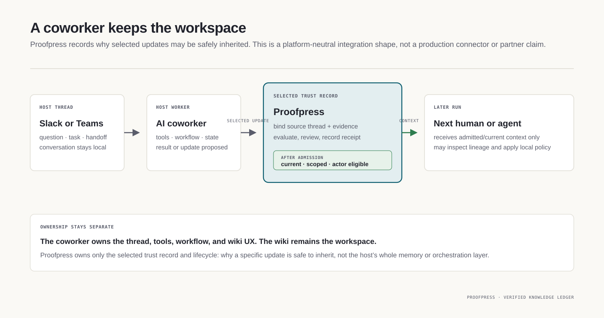

[//]: # (ob:6ec771b4)
<p align="center">
  
</p>

[//]: # (ob:de7999eb)
# Proofpress

[//]: # (ob:7542280e)
[](https://www.npmjs.com/package/proofpress)
[](https://github.com/chenmingtang830/proofpress/actions/workflows/ci.yml)
[](LICENSE)

[//]: # (ob:e667d986)
**Verified knowledge infrastructure for autonomous AI agents.**

[//]: # (ob:0e0e9d9a)
Proofpress lets long-horizon and multiplayer agents build on evidence-bound,
governed knowledge—not unverified memory or opaque summaries. In high-stakes
workflows, every trusted conclusion remains traceable to its source, version,
policy, and reviewer.

[//]: # (ob:92fbc10e)
Its native ledger travels with Markdown and static HTML artifacts—even when Git
does not. Its format-agnostic evidence envelope can also bind provenance to the
exact bytes of any file without pretending to understand that file's semantics.

[//]: # (ob:815b673d)
Proofpress also includes a **verified knowledge ledger** for long-horizon agent
work: it distills bounded telemetry and artifacts into candidate knowledge,
binds it to inspectable evidence, records deterministic, policy, and human
review gates, and projects only governed current context for the next human or
agent. It is not a trace backend, generic memory store, or truth oracle.

[//]: # (ob:6ef36a68)
> Git made code collaborative. Proofpress makes intelligence compound.

[//]: # (ob:df7a085e)
<p align="center">
  
</p>

[//]: # (ob:cd8c1f66)
Think C2PA for knowledge work: a portable, inspectable record of admitted
history—not a claim of C2PA compatibility, signed authorship, or complete
capture.

[//]: # (ob:8f7c2d11)
## Architecture: trusted continuation

[//]: # (ob:9317a2bd)
Proofpress sits between raw agent work and the context a future human or agent
is allowed to inherit. The host platform keeps its models, tools, permissions,
workflow state, UI, and raw telemetry. Proofpress receives a bounded evidence
projection and returns a governed context projection plus inspectable receipts.

[//]: # (ob:70d6d4b1)


[//]: # (ob:bf4b55ec)
Proofpress is not an orchestrator, trace backend, generic memory store, company
wiki, or truth oracle. It records the evidence, scope, review, and lifecycle
that make a selected conclusion eligible for reuse.

[//]: # (ob:9d1bd154)
### The admission lifecycle

[//]: # (ob:58b75297)
The local ledger makes its authority boundary explicit: bound evidence becomes a
candidate conclusion, evaluation can recommend, and only the configured
admission gate can authorize governed context. Rejected, unresolved, expired,
superseded, and actor-mismatched conclusions remain auditable but are excluded
from `context` by default.

[//]: # (ob:2e31b1b9)


[//]: # (ob:4e7910c7)
The current CLI flow is deliberately narrow:

[//]: # (ob:10e4d4f6)
```sh
npx --no-install proofpress evidence import <bounded-export-or-artifact>
npx --no-install proofpress propose --statement "<scoped conclusion>" \
  --evidence <EVIDENCE_ID> --scope <SCOPE>
npx --no-install proofpress evaluate <CONCLUSION_ID>
npx --no-install proofpress review <CONCLUSION_ID> --admit --reviewer <ACTOR>
npx --no-install proofpress context --scope <SCOPE> --actor <RECEIVER>
```

[//]: # (ob:78529bb8)
### A multiplayer AI coworker

[//]: # (ob:462d0dc1)
A Slack- or Teams-based AI coworker can keep the conversation, tools, workflow,
and wiki experience. Proofpress can sit at the narrower moment when a selected
thread result or wiki update needs a durable reason to be inherited later.

[//]: # (ob:2b2d03cb)


[//]: # (ob:61e99a96)
This is a platform-neutral integration shape, not a hosted-service, automatic
semantic-distillation, or production-connector claim. The wiki remains the
workspace; Proofpress governs only the selected trust record and lifecycle.

[//]: # (ob:9c6c7f6a)
## Evidence

[//]: # (ob:30685e8d)
We published a bounded evaluation of Proofpress for agent handoffs. In a preregistered controlled task where a document had changed, ordinary handoff continued incorrectly in 12/12 trials; Proofpress-assisted handoff did so in 0/12. Both conditions continued correctly in all 12 unchanged-document trials. This is evidence for the version-checking mechanism on that task, not a general claim that Proofpress improves agent capability.

[//]: # (ob:cf466876)
[](studies/agent-handoff-artifact-provenance/README.md)

[//]: # (ob:aea6ced7)
Read the [open study package](studies/agent-handoff-artifact-provenance/README.md) for the technical report, evidence, methods, limitations, and checksums.

[//]: # (ob:6a39b2e1)
## Why admitted history matters

[//]: # (ob:6c80c41a)
Agent-native work is not a linear document followed from start to finish. It
is a graph of hypotheses, source material, decisions, revisions, handoffs, and
evidence. Different tools can generate different views of that graph—a brief,
a research artifact, a design review, or an executable task—but the work only
compounds when collaborators can tell which changes became dependable shared
knowledge.

[//]: # (ob:6dfb284f)
Proofpress operates at that boundary. It does not attempt to orchestrate every
agent or capture every thought. It records meaningful, accepted transitions in
the artifacts that survive the workflow, so a later person or agent can inspect
and verify the history without needing the original session, workspace, or
orchestrator.

[//]: # (ob:cc376e2b)
## Install

[//]: # (ob:d6f9f208)
Requires Python 3.11+, Git, and Node 22+:

[//]: # (ob:7b197ac1)
```sh
npm install --save-dev proofpress
npx --no-install proofpress --version
npx --no-install proofpress setup --agent codex
```

[//]: # (ob:5ae48e1b)
`setup` installs the agent adapter and writes `.proofpress/manifest.json`. Use
`--agent claude`, `cursor`, or `all` for another supported harness.

[//]: # (ob:4ccd51b9)
## Verified knowledge ledger quickstart

[//]: # (ob:460f8108)
Bring a bounded OpenTelemetry-style export or an artifact. Proofpress binds it
as evidence in a local append-only Git ledger, then exposes only admitted,
current conclusions to the next agent:

[//]: # (ob:8b9b3369)
```sh
npx --no-install proofpress evidence import \
  node_modules/proofpress/examples/verified-knowledge-ledger/demo.otlp.json

npx --no-install proofpress propose --statement "The current conclusion" \
  --evidence EVIDENCE_ID --scope demo --proposer agent:runner
npx --no-install proofpress evaluate CONCLUSION_ID
npx --no-install proofpress review CONCLUSION_ID \
  --admit --reviewer human:reviewer
npx --no-install proofpress context --scope demo --actor agent:successor
npx --no-install proofpress ui --scope demo
```

[//]: # (ob:20fbea6e)
`context` excludes rejected, unresolved, expired, superseded, and actor-mismatched
conclusions by default. `ui` opens the local review queue, trusted-context
preview, and lineage graph. The 0.4 `proofpress knowledge ...` command group is
retained temporarily as a deprecated migration surface. See the repository's
[`examples/verified-knowledge-ledger/README.txt`](examples/verified-knowledge-ledger/README.txt)
for the complete local walkthrough.

[//]: # (ob:8fb4a17c)
## Choose your path

[//]: # (ob:eac911f1)
| If you need to… | Start here |
|---|---|
| Verify a document or portable handoff | [Artifact provenance quickstart](#try-proofpress-in-two-minutes) |
| Turn bounded agent telemetry into governed context | [Verified knowledge ledger quickstart](#verified-knowledge-ledger-quickstart) |
| Understand the ledger's scope and integration boundary | [Verified Knowledge Ledger overview](docs/VERIFIED_KNOWLEDGE_LEDGER.md) |
| See where Proofpress fits in an agent workflow | [Trusted-continuation architecture](#architecture-trusted-continuation) |
| Implement a portable artifact carrier | [Portable Artifact V1 contract](docs/PORTABLE_ARTIFACT_SPEC.md) |

[//]: # (ob:32f0ea79)
## Current focus

[//]: # (ob:4902cb38)
Proofpress is validating the developer wedge for trusted continuation:
**bounded telemetry or artifacts → evidence-bound candidate knowledge →
verification and review → governed current context for the next human or
agent.**

[//]: # (ob:99c9f31b)
The next proof point is a real design-partner workflow with a measurable
handoff or fresh-session decision. The published agent-handoff study establishes
a bounded stale-reuse mechanism; it does not establish general long-horizon
agent efficacy. We keep the portable artifact protocol and the knowledge ledger
compatible, but do not yet promise a hosted service, real-time trace backend,
or general-purpose memory system.

[//]: # (ob:2f4c353f)
## Try Proofpress in two minutes

[//]: # (ob:d61fe659)
Start with a real Markdown artifact that already carries two admitted versions.
`inspect` reads its portable capsule before any local Proofpress ledger exists;
`import` reconstructs that ledger from the file alone. The demo uses a
repository-local Git identity, so it also works on a clean machine:

[//]: # (ob:9a25e119)
```sh
mkdir proofpress-quickstart && cd proofpress-quickstart
git init
git config user.name "Proofpress Quickstart"
git config user.email "quickstart@example.invalid"
npm init -y
npm install --save-dev proofpress
curl -LO https://raw.githubusercontent.com/chenmingtang830/proofpress/main/examples/portable-handoff/strategy.md

npx --no-install proofpress inspect strategy.md
npx --no-install proofpress import strategy.md
npx --no-install proofpress log strategy.md
```

[//]: # (ob:862797da)


[//]: # (ob:66c93d16)
Review the accepted change and check that its recorded claims match the actual
document diff:

[//]: # (ob:d63d3ab4)
```sh
npx --no-install proofpress diff strategy.md
npx --no-install proofpress verify strategy.md
```

[//]: # (ob:399f86cf)


[//]: # (ob:07612948)
Static HTML carries the same native ledger. Download
[`strategy.html`](examples/portable-handoff/strategy.html) and substitute it for
`strategy.md` in the commands above.

[//]: # (ob:ec2e5323)
DOCX uses a sidecar evidence record rather than an embedded revision ledger:

[//]: # (ob:3ebf7611)
```sh
curl -LO https://raw.githubusercontent.com/chenmingtang830/proofpress/main/examples/portable-handoff/proposal.docx
curl -LO https://raw.githubusercontent.com/chenmingtang830/proofpress/main/examples/portable-handoff/proposal.provenance.json
npx --no-install proofpress provenance verify proposal.docx \
  --evidence proposal.provenance.json
```

[//]: # (ob:a528a698)


[//]: # (ob:4149c80a)
To continue the native-ledger demo, edit the visible Markdown or HTML content,
then admit the new version and inspect the updated history:

[//]: # (ob:9df616af)
```sh
npx --no-install proofpress snapshot strategy.md --kind human --author you \
  --why "accepted the revised volunteer plan"
npx --no-install proofpress log strategy.md
```

[//]: # (ob:20a32f50)
See the [complete portable handoff example](examples/portable-handoff/README.md)
for the files, expected behavior, and security boundary.

[//]: # (ob:4273537d)
## Create a portable document

[//]: # (ob:1160e434)
Run these commands on a Markdown or static HTML file:

[//]: # (ob:2b655d31)
```sh
npx --no-install proofpress policy proposal.md portable
npx --no-install proofpress anchor proposal.md
npx --no-install proofpress snapshot proposal.md --kind agent --author codex \
  --why "accepted the smaller launch scope"
npx --no-install proofpress verify proposal.md
```

[//]: # (ob:f46e6643)
Applications that need clause-, issue-, or work-item-level handoff context
can attach a host-defined admitted-decision register to the same portable
event:

[//]: # (ob:d7acbb2d)
```sh
npx --no-install proofpress snapshot proposal.md --kind agent --author codex \
  --decisions decisions.json \
  --why "accepted the revised implementation state"
```

[//]: # (ob:eb60d5b2)
The register uses `proofpress/admitted-decisions/v1` and travels inside the
portable capsule. Its target and evidence identifiers remain host-defined;
Proofpress validates the record shape and integrity, not the truth of the
decision.

[//]: # (ob:5796ae98)
The policy is sticky. Each accepted snapshot refreshes the hidden capsule in
the file. Source code stays in Git; the native Proofpress ledger manages only
Markdown and static HTML knowledge artifacts. Artifact evidence may reference
other file types without placing them in that ledger.

[//]: # (ob:d8a43a89)
## Verify documents and other artifacts

[//]: # (ob:b8c9468f)
Create a sidecar evidence record. Proofpress automatically selects the
strongest built-in adapter: semantic OOXML verification for Word documents,
format-aware byte verification for PDFs, and byte verification for other
files.

[//]: # (ob:989efad2)
```sh
npx --no-install proofpress provenance create proposal.docx \
  --output proposal.provenance.json
npx --no-install proofpress provenance verify proposal.docx \
  --evidence proposal.provenance.json
```

[//]: # (ob:227de120)
For DOCX, `semantic` verification canonicalizes the meaningful OOXML package:
document content, tables, styles, relationships, headers, footers, comments,
footnotes, and embedded media. Repacking the ZIP does not change the result,
while changing document content does. PDF evidence remains `byte` level; it
records format metadata but does not claim the document rendered correctly.
Use `--level byte` when exact DOCX package bytes are required.

[//]: # (ob:949eb6a5)
## Hand off a document

[//]: # (ob:2173502c)
Send the original file. The recipient does not need your repository, session,
or local ledger:

[//]: # (ob:af7113fa)
```sh
npx --no-install proofpress inspect proposal.md
npx --no-install proofpress import proposal.md
npx --no-install proofpress log proposal.md
```

[//]: # (ob:5e991c72)
### GitHub or a raw file

[//]: # (ob:398568bb)
| Route | What travels |
|---|---|
| GitHub | The file and capsule move through ordinary commits and pull requests |
| Outside Git | The raw file carries its own public history |

[//]: # (ob:a908fde7)
`refs/proofpress/ledger` remains the complete local working record. Portable
files do not depend on it: their capsule crosses the repository boundary with
the file. A team that also wants to share the complete ledger must run
`npx --no-install proofpress sync` explicitly; an ordinary `git push` does not
push the special ref.

[//]: # (ob:226a29fd)
## What is—and is not—recorded

[//]: # (ob:cfc1c3aa)
Proofpress records accepted versions, computed block changes, stated actor
roles, reasons, and consequential rejections. Claims are checked against the
actual document diff.

[//]: # (ob:5e0b34ed)
It does not automatically store raw prompts, transcripts, private reasoning,
tool traces, casual brainstorming, or every save. See the
[privacy boundary](docs/PRIVACY_AND_DISCLOSURE.md) for the complete rules.

[//]: # (ob:47f21d3a)
## Merge parallel copies

[//]: # (ob:55bcd98e)
Keep every original copy. First, ask Proofpress to find the common ancestor and
report only genuine block conflicts:

[//]: # (ob:8f498c01)
```sh
npx --no-install proofpress merge-plan proposal-alice.md \
  --from proposal-bob.md --json
```

[//]: # (ob:d4ed0d79)
After an agent or user resolves the visible body, record the reunion:

[//]: # (ob:74883804)
```sh
npx --no-install proofpress anchor proposal-alice.md
npx --no-install proofpress merge proposal-alice.md --from proposal-bob.md \
  --kind agent --author codex --why "resolved the parallel review copies"
npx --no-install proofpress verify proposal-alice.md
```

[//]: # (ob:1575e201)
Same-document branches become `parents`. Other source documents remain
`ingredients`; record those with `merge-lineage`.

[//]: # (ob:2a955c60)
## Go deeper

[//]: # (ob:8deed5b3)
- [Two-minute portable handoff demo](examples/portable-handoff/README.md)
- [Interactive verified-knowledge-ledger demo](examples/verified-knowledge-ledger/demo.partner-style.html)
- [Documentation map](docs/README.md)
- [Executable V1 contract](docs/PORTABLE_ARTIFACT_SPEC.md)
- [Artifact Provenance Protocol and adapter API](docs/ARTIFACT_PROVENANCE_PROTOCOL.md)
- [Privacy boundaries](docs/PRIVACY_AND_DISCLOSURE.md)
- [Agent adapters](skills/README.md)
- [Contributing](CONTRIBUTING.md) · [Changelog](CHANGELOG.md) ·
  [Security](SECURITY.md) · [Code of Conduct](CODE_OF_CONDUCT.md)

[//]: # (proofpress:meta:eyJhcnRpZmFjdF9pZCI6InBwXzU1NmIxMTVkZTcxMWIwY2QzM2VlZDI2MCIsInBvbGljeSI6InBvcnRhYmxlIiwicG9ydGFibGVfaGVhZCI6ImRhOGIzMDY4IiwicG9ydGFibGVfaGVhZF9ldmVudCI6InBwZV9mNTE3YzM5OWNmZTZmNTg5ZjQzYTYxZDciLCJwb3J0YWJsZV9saW5lYWdlX2lkIjoicHBsX2UyOWYxODUxZTBiNDhhYTFkNDIxM2ZjMiIsInByb29mcHJlc3MiOjF9)
[//]: # (proofpress:discovery:Verifiable revision history by Proofpress | https://github.com/chenmingtang830/proofpress)
[//]: # (proofpress:capsule:eNrtvdmSHEeWJfgrViiRzmRWuMP2JcimFBJEVmKKJDgAyOweBAWhZqoWYQXfys0dYGQmReqp571lpJ9mXvsX5n0-JR9GZP5i7tXN1DfzJQLOJe9DMgMR7mpquly9yzlH__KIzRdNzarF24Y_unw0m71NkrQMgoSLLAhKv-JRJAQPU__RxaNyyu_e8uZGtAv4bHvLwiS9zDLhx3Fe8boUaZRGdRiHaZywPEwSwQIeV6lfVQmvi9yPWF6JPIEW4ySLslzEJbbLm7aavhfzu0eXf8F_LN4u2A08YcQW-KgL-KEUI_jFd2Le1A0rR8Kbi_dN20wn3i18fjq_88o775v5dFrP5qJt4TszVr1jNwJfauXX8-m_CXjd5RwbvF0sZu3l48c3zeJ2WQ6r6fhxdSsm42Zys2CTmzzyH698ey7-fdnAz2-XrZi_raaTVkxgLBbzpfjx4tGtYDiInOVl5Kf5I_Wbt-K9_BAMrnhbJ0FWRUVR1SKtk7yo44ilAc-wZ9P5Al_t7aiZCOi5mZHRWxEWdZAngfDLOGc4pmEQ1VWoXkf37m3FZu1yBC8cYj-r6Zy3jy7f_OWRfvxfHsEsT-ct_qT-LPjbEob8zaNqysUPj76HNzCrAR788tmTL756NhzzRxdHLRK2WMybcrmAuXlbsrZpcZjZfIJdhL_BhArZ5HJxO51jZ941E2y1vYO_jOEvEzbGWVOdunjUwhehrUeXk-VoBF2sbmFihHq1cjSt3sFnU1FlWVDG8HGYk4X4AV_gt__v__jf_7__-T8-gV_qRzDO5bNnuHjEB_jNZzOPjZqbyX--elTBKIn51aPPryae91kzvvHaeQW_Z20rFu3j0fRmOmzf31w9gm8s4Pd6sUFzi7uZXGZszh79eNH1CkanKApRrvRqZY3u7Nc_rq5l_QRcTbAyVx4i0jTjRZ6e8JDuU17Teotb4cE6bhfeiN2JuVdP5954OVo0M_XvJ88vPTbxpjMxufBYz2v7whcFL9gJPfrjcswmLTyGe7ABJovWq-CRsMb5shIe8_i0Wo7h9x7swurd6O7Cg4Ume85FT4-qKspSEZ4yEa9vm8k772n4zRP1LByVd5Pph5HgN8L7MJ2_g1HxzNa98JpJOwPzIk1UT49SUUcpkybi2B597v1Ls_DGjAsPtwj8ZwTmcTpni-a9GDrrBj7zTsDUQvMjWONiUvWNUZAWPE_CaKVHrxZssexfqP_o2Q_1rFKe1kUd-vmRrTsv4w-DoW_WabWcz3EZtGqgJ7MxnAcjwVoYADgj5LnQ965FGPh1svquzyfQ2mi052W7T_W8bQF2PUxEdWz7zuu-E2IGcwc74M9iPh1wAduOwxTCIXcHhnPiickNHBNqq3De9r1uVgZFxqrg2O5cX1-3t1cTHN1GfdobDFr2XkB33nvdyYMf-QH-NJkOzOfgj12HcJmudChhIs5FUB7dIbDEy9m16U2LO0-d8gP2gc1hNDibgRGXo_Jh3sBhczW5Hqqe9hlq5gcFr4-er-tuDP5Zrs_rHQtUL04Pz66JGA2917c93YnDLEqijK90R7o-d46t8aAtPq1rGA2vhq3vgdOyXIg96_fQZvbs5yBIfRFH8YN38TUM3puN73Mxnn7_W_EDG89Gon1s_j7Qf3_8iYe96BnSsEyThEfBw_d3itsP2kBvVJ4AizkcYdABnH70ZY0zBOZ4_s5bwOdhOcymbdPXXx4XQQqn1oP31-7pzQ1rTI_cZPBXeQLLMwY_WzJ-07elsyJlosg_yoLAZwuvZXe4udii8_2h1-DcMjjZPHDIW-fw-xRsZ59NFFkZ1-CerR5IsMxhVdUN9LQ56DjY_o2-gzCvWF3y6D7PXfXbmNfKr5uDQbbyAeIZbzKF4WrmfABvv7jz5svJounz28qkxGV3n67p5QXhlFeNpnA-HRNg9SyvIE1rnhTxffoGWxUWCa4LWH1sMgU7PTdbEQLICw-WEgf3zrHqw9ndtQcLrm-rFjG4-ClLVrr2J1ymf_uP_9Ms_L_9x__ljQUYhj3rqe97PasqDODE8MPq_n14vZxP9HZtRg2sGlhRU9hfl33udRzXabbmzJ70dL18ZnIlR97KRECvRg34P_BLmDI2gsjU2hU45a-ve5ZPVsRgTuP4AcYHzBEYyAXMAG6-dgFxyN3Q-5JJt6OqBPgf3BqoFn6qof-3sEurac8QshoC6ahmH3kIdXTijuHqR_ssvCiKoMrClS6-_jDVBx700ZuzZrRnhf-jt_0rPYs7KvIkzcvyPg8GZ66BWAkipz8uywvpon0FxzGffpg8_uPrr75UVhPdxkYGnTKTgg94L0Z901b4eQ1h_n269mK52OjbdN6Ad89G8O0Pqms2QNftDr3ni16nv6yrIgoqdp-u4WI3YwEd4KIaMRVnepwt2AWcMAsVqEv7O19W6Oi02Le-ruVRUVc5C-7TtW-MR1Gx-byBkA96UI2WHLMEk-lkMMdwaY671CYXpQMGu_RDb6bAL5KSxxtxalN5cp3oxx0QEm9-ozeLE6dRnYj7PNdxC9ionXrtcoZjiUZKtnM9vF2MR9dylcuf4Ued12v7FlLOygqio_t07RC7PmLLSXU7mI3YRHbUGvcem-T7cOzkoX-fvr2-bYwfJb84cL_offXdN3qZe_WcjQVmfGB7ek-_egUrri_iCFMWFjXftOg3YoHngsrAHuIPrH-hZx1VdRVUEWP3eKqzjHQWuTvXzHoBV0kmWVpprpo5HG7jmXLkd41HIvwyisV9xgOsCp-Cly-nY7mYjnG6wOm787ACIKSxhKU1ni1aHYZV80b9o-_s5XmUZ6W_nh1s3jNYlWNYcvuctvXP9sxPwusgYlV92rOeseq2m4Nb1nroYqv90-egRWUSiqiMTnvqADxivRWvL716uVhipsUsCbMSrKeDx5QYlwLbcU6BEYTCqy59mBZZzsLTOuXB88Zg1vmwL6LJC18EQXzyezc3E1hYvHttOA3l_6Pr966ZzVaev_GKVZrGYRBkpz3_FQRx1S0eYTUs6i6GXkw9aB-cg4pNcCvA1sEIvprOGoGmf45VqJ7kZ14UCUtOXAx_ANvHcNkNMIzXtbcBzDwmomcQREGI1bcU6zD3k0CcuAF6z5FqJFSxwIYHg8F0uQC7pH7Zc46UsKHykK1GME_RpqC9r0fTD3tMwPpne0xA5qe8Eiw67Vm9I8DgAIX52end1z1DEEXCT9ipQ_AtBNbXA_C6sLYKGwZWCJhlLJbIGum_L8FHbGDJchgQr5xjR4VO5tR9h0aRpUUVrHqKX4n5DZgWXSWV7gxm2XAz6k2wZ7IOaqBnBuOsDgMerRW4oO-jkbD7cFpLS9iCz2DLVvtCowPb6DtfkrLiRS4etGvW18ZIBMKAqafMjiyFy2oUmKQxDurQ-1chZp6Q7rYMYvrCgDou8soPHrSvvftD9lF6mHaPDBgcngKNxdXVlVs02tggHJwXn2fFg3ZXRljT8RjX4ASHDYZVFS5UVVM3MfSeTHSghQVR-EbZ63xmcQ5OjR-fb2jXTI8dVvv5vuRekiUifOCF8ASOxGYCxr_1xljULkV3gm5p8tqBOFz3ZfsClnNRPmxf_3QrJtKVs_VtuVIxFQ9LAsxm55MPYKkwtF7tdDmvRHvRd9L7fgUmPTv3BjOG1T2K5e6CA7lvGcRxFfHUf_ihZdI3Aa8J1gHmd8ZiwTCBIU2_SXD8dsZaGeO0HliIZtKb9A1hEVRxUp9vaBuOR2gN4bLs5gDfSO6v_sxnmcGpXkX5w3bUdAaTCe0HmX2Rv1nceX_7j__Du3q00EG1POHN1rp6JP86nfTCR0JWJEm1tgxeLefQwt6T3flYzyEJcyd4shYOHfKEwXpt4HKjOu-U5Z9--Xx4NRlIdMKMVX2hECvzNFyLCg_pkCedMwwRjE_1qWPl1MKGkABOaZzf2bIEq-zNxBxrJn1GLvSzoC6zUwYIwqLRqH0MQ_N0xDAf9xSW5IX87w_wf8t5O51fyPH5pvEUCAz772bHN8enzngUhKeMTynaxUDUNSYVa1j0JaveebfT6bu2L3BMYdOkWc5PGIBnJvRdn4dLWASL2wF8U6-Wha2GTmUKuGcA8tCvo4KVR_fn1QI2n6oG4gp4Y3Y3kxVp7MsP3_8Wftk-tnC_TxCdACH8D-vj8_2FgRI-0kH_2wpiTQXnk38x8EDxNi8yn6UiSTiPcl4WZcyKMJXRBfiOsk0zPOa0gNVbvZtNG2l6VP1cYf7MvxDy9z3CJDHd4bTgQiedRiQo80RUZTutF29rWJdiPps3GrzZlsFlxbO6irOUZ0FSpyIL0yKJq7wK_DQULIu48KtcwB-TGj9alozXWcHiOODMr2SBDrOMEoSpZusyLX6EgUaUZOiH6cDPBmH62s8u4-gyTP_J9y99NIV6xDGpUXAeByKGBdL99i8PgdyUq00BK29Ze4uRTh2kLI3zpJIRu2zDwVrqhXh_ECUmG_Fv8PsPDV_cwl_yHP5xK5qb24X-F7T52ePZ51u2re5tnmRpHeVBWviR6a2DwdS93Q-t1M3xIkWfP8tLiXORzTloyw3Q3vEgSnToBxNVUJGAwvnVRJ6YqvDUdhvXTONw99sHGVhJn9V-XQrTXQeKqbt7H4RlpWuasovtLYN4-WqC_lQta1XwrmN51izbpcrKVoj3naNPVc2nMECV_KLC87YX3qsRGOML8MYEllNbeSpcTdrpWCDQ_Dfop42n87uhDDFhcMUPlQC3BTr3Ab067JRMx6uUF_h3MI5YB8LPf-qNwdu7mnRYTVvr0AHsClRSwe0YvhX090IZIw3dwsQ0uEhXE5vz1BDkC1kxkOVe1so3Wk12qGyIelcccJUqn4uRtL4w1dOVuUXXVIxqcJHaqRpjA23HKVJLolsR-OY9qwGWPWcpWKVcgi7lanBgsKbodg90qx0Y7M7VxPSV8XGzwEFp8P2g43bperbSgvALBvv9zpRWKnC4x9gUduVqgtUEGCOFQIBRBtuCi0g6C-1tM7vwpqrkMBILm5PtGYykLqoyq9M0FqwzYxaBqwfjPsBaD3bNcqQ-2TMpqR-EImdhURWmHw7u1hiofkitbouxHJy0MAtYbd_JQdluWqejAbT-MBz6EMjPbtkwgLBEORXtij2zp7ixG-2lbB98X7lqcZ7v_gyu50bEcTXBgNcU4XFCW6duZxbNhYedF3MwkOUUVr5aZY3QO0qvQbmxnP0JX5mOFOiO4a6WPR5oTJ70VGA6G2VBNIDU1DGUabmbLq8mE4GLDozbD2o1i5u5cpta5Xj1THRec55XOZyzRWYnugMddxPdCyfWjflpEuTgRomQ20PYQRhvzvTR2GGGOLGJXAWqCosH0Wy0bB14lIYF6mTV0DQVyVZw46Dl1zlBfrl7aCoe14VfRhmr7DHlAJT129wPemwGYjDQs3o04HFXWG0MShpGBS8ZWFlrXR1Qs3mJ-8CVsWePYaibGiKY4b_B-XItcRWNjLXHM_CiobMyd23q_Ney69cX8IMMva4voLlKRlzX0mReQy-gFZvPNTZ7LsYMOgluyQLGBwPEQxyOvKr9sIikA2ktUIekNoNwD4w0Oh0zLG8t0NO49ofQwDVmZypxOx1x6GaD1WBwHdFT115KzWC3mzHvOxR4XZSIH6i43aMO8rrbo_eETBv3LMijiCehSLPKmoQORW0P5NPhz2oKYV9PxBK8hZE8R8dL8NDuZM57ItEwxr-TjgRCkdnooqvXvg-8v_23_-69D7U_CktOps-wtHY1wW3uAibNXnLm-PpC5dpk_ee6hX6A3cRE1bWECkwQhQpTqR0JXKvNGN_nWhn06_dysK_V7MPUN3BcQG_RFsNUi0aCNmWySuY_ryaOhZpM56voKe1q9iyCMgGfIGd1EFd2DTtYcTMr9wB5Y8dUQNZnFBMWszpmWZlbo-hAwNeN4inYbeHZsHCPcSsEHDhxyLmf2jFx4N3OSj0Vl91oDAesBAc3Jr1PHZTACKJbMJoyjoZL_CAq2GEexuVoOYfm4MQTWhnRFp8Eb7Y-OrCwWuWH2vIJooDh_8QPMHG4J1Q1XX9eHfEwm7B9VH29bTDmwHKmWFS3rtPQs7AYnP5RyJOsCu0gOphzx9U7FEGuG67rMC1Knos8sUePAyrfGpUeBxEfS7OrXAbwtHqWbZjWVV5lMdh8a0IdFPnqsj0NE94O4VMwFXzl0N-eIh8MbsVotmd1R0WYl5XPkyoNOh_cosu7HX8yVlztBPPR30B34TPqqDY7FtfQmGl0h_ECJMrjjU2gfv9b_dMnPcuMp3kkiihg4ItY37ADpHfL7EhguRks8HHAENRZye2h5WDNzWAdgRk3iaWoKsoKLUpg--3AyFdXzoPBwY219SH441GdR7lN7DgIccfAnYr0hvAVY5fbBg7VCRoSjaFVKGTp_Gh8IW7FofdKqPRAd3TJLSrPkS4Mnc5VhkTlETp7ZlDdcoXJ01Q6_zrdb5w83O9TiPGx6620sBDlzLtD_WIlPSP9RTc7J90BfElzNNfWbVyoIraMxq8m0po-Vq1idPYp1t3kIDrwvWbyno0aDmPp-lX40ioRIRsZoBPhZBZkwGf21WAkMB8ymk7fwYmnSxxg2yfsPWtG2FzPtsl45CdJFFdld8Q5EPxDlt9eKL3zUTUnB3xyNL1Z_VjvOgbvFSLDOkizoItCOpS-3fxHYO6NCxBlVRYFUVJ3-96B4XcMyZNB9fDp-XR5cwvLDB7O5nfKW20QrWlqWcolnC1HIxlYQhzUDr1rWHmtcz48Vivz2q5GdjVpBU74oluVZvmuLiFV__gUAhFYYOMBLml5xD9u7yYV7nk4Auol-NG4Ih3IC8fNY9ev9AfcFdyz7lIWBbUQdeUXNmnjcAj0uN6HEWBG2QYEMjmnTYHFaqI7Da-BDpdex3LLO7lL_D5ENUz9QZodla6-WTb4Vaz046ZWYYQ-IJXn7xSTdc2lLyUmeBZxnhc8TMyIONQFxxafSkTAcYLAScwHYKqx7HY1kY5mVcl_ISgNQg5zPmMGF-wNtmSQOMoifRd01kulK1VaEsbF5iU9hYBZCO3P4oH-ASJVAdsZD3yYg2aqsioYw0pkT4-RqlIB8WISZ7EtZzjUCePp3YMIAXMHJuZgUZVrk8X2tIiK9-3LL9VxoCcHnR04kaYTxGU7D5yW8uOo7NG6PtM_K4WXawffNGZ34JlLBAaedDB7TjCBz4eAV8xXvHU1QRLlMy1x1ePG1cjDCSJ_YL5hE5iAAsfCxhTSAZvcYf7rpm-ZRnUS5ryAhdn5Kx1XZDVzexDzw7jzYFOjvI5yFgVdkcmSQTbd-aOpHWAyFTjrWueYpIVUa-Yad8-gm49BI6GbC_sETAmomNdT1UHvt_olYFvgIN3M2ey2vYBjv5HgGjHG_YIf9f59OZW7B1rG0hCTVQHVCtg0tWYFOLjKzNfNjQFY49b9ZHg1wYVloTp6zdoaz_Vn2JHPrz91HQjHRqjVbycZ1jmbzWADyhXz-P2EO3m2f5LpNWlKdN_VmoGHPMZS1OfXfXmkSuSItoMz0y4NhzNzhCu7kwGzB3S3_r1dH28nMDy308XmgwYDRBDoHTgYKIum0wcGufXh9s67eiTLI7Jq5XrA4oMHW30m5M4FI7e4erSrEyrBs6XP_TmJCgLnhAW8CqzL7pB_unLWyVQem953Kz1oNLTNvxPSgxs3EBaC5zLhA4QMm_KEyhoYn-algI33-LslbJplM-KwwrEjsOvYpFk0fwYjfeEJjj5Ie2F6MGtmAo9LzJDIE_ROgZIdv00ddTj46ABA37DLXEhfHovK2pNaraBIyJUD2MKAAWIZ6VNV05sJdMfDCFt63KbeK8OHzux2B990jFmfqq_yGOQprxhjgR93MWNHhloLSQ_gNpnjEDOlOYfAPS6tCe7oTpuW8mj2krZOtrx7NTHL2ZPSWTDvI6G-pEu-0oOS4Y_8irJk24rA6CdwcB2VX9LVrzsAlNp7aHZHjUL_jtXRCt2H5Sb9GFmVli7HDfp2C70RF0t4jn053tR1z_T4WeVnIuEsSEQXNFhulnHt70G1mo7wN4hNhcWGUABwoOeyv3AKwKvKJa8g4ljRgbN_FZmlXrOVRSVYrVy62QqyoEsGYFvY4ra1hX9bc9YVdeXtX2hPCEcX2hpoMo97Mj6XT5C1TVVkxG2EruwH3Oaw19uO4aR3htpIOEWqXK8y3QwrN46q2vWnK-HuzRIXJLiCcARPdcwggVwwrzAYYFqH3h-VRpqnsj7Sj1KHveEcgVUDTx2eXXWpSxkJ6MPK5jjRtGD3LmQlUB5-EBZrWTZ4oVvEgGiv14ZK0lmV6wnb-E1rfcG-tRTmScZiiJuDqstFWjZdt9UPYMiZlGJRYjybhHHg2-XZkeZ0k8cS4cxRHUTgW9VJlvs22HC4cbrx-_DdtAMicZ_X0qRCE_YrcCph0KnWqE2TqNX66UpNrHNktqACTYq5zJjvpyyJa5vEcEh1-m16iXImLI2LlIeMYU3Znq4dd64blxP5cKbDPC5ZGFZ-VdlD3KHIGVjjPWhvWKXG4v5LMYCjC2JeXPu2hRbBkK0pZ3X8n8XK0KPDJ2sGM1y0CzFA3wBO-JE6BPBYsHgfY9wltBMPdcQWeM-_0D7tVJmlgfq1NOOWPgNd6DtFmQjCKsnrIgm7cmHH3NNjdSobz8x7AAdqUlWIhTEPcQh6h7iu-0h3yAWRn9mfzoqqKIqjKCnzKupSAZaY11mTA8h2xkAlQZz4CTTb-SIO_-6QF9zLqdt0r1dHY79nrdF3fADRtinZmbOk-535tKOvOZD6mt66uqb9KEJtwWfHrMZ8hhlk665fPYI_yzRG6z1ejGeP1c8SZ7Dm8cskk2BjOJanrTq62jGW3kzgoVz_vR7_4XlNnuVp6Bcxy7qihkNP1LN2H8qhNl5OZh0OXJi75YjrRN9MMLAjr2SRWcHB0Hh36MLVAhs-1UKZFIrRyQNswSD27Pw6KMvQz_zI72AVDg-y2wan0hiNPw37IMbDz-c2F-kwG53s8em0RGNnyigo4rLMktC67g5TcT2TdQLNcCJTljNVJGDtu6uJM0Hwtbqx-EtMM8MiNycsBjitLq3I3DAEWjIMUAUGTEtPavArFn2F0Lyogzgrk5xxO2cOvfEQO7Ofmwg7Up2I5s_ltFQmBnftnj1VZ6Isc78M6w4C6TAa3TzriXRE4TnUBhg2FUSZCZHfl2k55S-XWIqCFpb4xVbAE3G72LGGJ9QLhfTA47adjt5jeAZHswRAKRcKjnMIH3XVyLrw6Psqo92uYQSxpeUE7GbPTMKmqzM_SdCRsidGx6Y84cTYpEJum_ktk75jus1a2H2uGMttx01BFvQm1vkatZcPttrOW_SvsyLy_QRi8jJMrd_S8Tv1-N2HnKmKQjYzZkoMGCvD7kbr00J7MlNxrYkj16Y1NdQaAbrBuoQwCcEqGEALhewxoFaEkRrCpQQGXK8wHRXED56MTvwUYSjwmmIuIUjqW7o6BR705AYc6Eb2SmWjdB97TgQIiQLuR6J2kGoOD9VqqZxOIl3ZJMsZHCN44EOEg-OA3cckkqH4XchB7sJinA8lCn-hjYacQm4rtz3brQ6jKEoznuQOIrqjrR5uOPs4p3IboXlg8-p2wJy9ZX9Z7l_ZWZTngWCpqJJuZXeUVXcWTuSbQgs4EzZZftFlDPknF05mY0cSD6s1DPwdWHrjZoIZgspkGa4mDpupLyIIA4gDozzOQ1uOcLiuBxXGjyOqmqxh4os6iUvwRqyL4HBXzYPvTTz1xgyDS-EhgFSGh92wynyQzdnMhUp1mVKYMunvTfIG3vQDa_WCZyPJc4EJk8ed_jOWRj_IrOyNySnKRPMEfXeZTLMPk2CgYS-1qRRpldY-t4vPIco69adeBmxX3hd-kafcr-1gO6RYJw9yMtsV4XGXClYuuT_o2SwkQ8ggzFXBtYMyr0PNVQ5lR7X_0intm0TKADOI6BDr7N9Kamt3VkJkaZVEoQ_OUQcI6wi5No1yOtPW1kv7s2lxlRZ-UBV-0cE5HCZuNysnU2wnmJfF1P5o2ZNXKqM0KGse8iDu8kodA9cOyHHUWgsujfywYEGRJx0Vp2Pb2pc8nUYrQ4WeLFSQF35ZZ2FdBp2v3vFrOxG5k4mzWHKUXS7FLXvfIMgCK0kCTDA6sXeqRRvuPDF5zO8CO0e67W9evHz95PdfPnv75OXr53948vT121ffPHuKzwJTIzuHxwvW2eGswZB21Ixl7hfCgTcm6fp7rFYxJM3IOHXjua152Mvn3z15-l_fPvn6i7dfPH_19MsXr759qV5sgwr8Iw7olotFMPW8fq2IvKREJjjWf7_9GhJ1y4rMZOg_vGzAfM75T31DiXS2T7ug5KD7D8ZTjpUFfm-leqehyRI2Es7NmzePJP0CfieJXY--_36T362yQLt6vqV1xeX-dsZlbkkVxhSNo5Uv55QVkEfmaRKZKdRoGILs0AqvzJDRdr38QV0xexYd3Y7ntk74Wky9FYoKdGWoBsMM8F8eQTyFw4RWXWf8t5LgVHhhRgC9A3jee5dOh6Ttg0n04FkWZVlkLElZXGRRWsVRXIeFfVuXHe8yw13G_F9-yevxcFUBy6q3z7oMf9xOm9-nIfAwQgEROFd5UBSM5TUcnTxkNQviiglMutdhUtR1yEM_ZmnM8qQqs7IUcOomtQjTUjrfO15pXSogCC7j7NLPt0gFhDmsGegJSQWQVABJBZBUAEkF_H1KBWRpWcc8LMssOlAqIDxMKuD5QhHIHbvl1NuP1gTw1iQBVstoJ2gCWNiGLiLcUxPAU5IAmEwjTQDSBCBNgC2M0DiOkjQr68w_VBMgJE0A0gQgTQDSBCBNANIEIE0A0gQgTQDSBCBNANIEIE0A0gQgTQDSBCBNANIEIE0A0gQgTQDSBCBNANIEIE0A0gQgTQDSBCBNANIEIE0A0gQgTQDSBCBNANIEIE0A0gQgTQDSBCBNANIEIE0A0gQgTQDSBCBNANIE-JlqAjgE0Y47vUI4PZyH7bA3792Ww_07jNO95VDp5Zkf0NZGpxwmzf0acugcXUNPJQXfRQ04OYyjXtihb9y3-Y2uOySE-7ZtXS07vh2Y_8H77YCPu7b_qHE7DpH42LF2UMcnt7u50DqwZNeoQt15MrNuwHbH9tbBSp7esBIrcJt1oIKnN7u51LrifNeqLM43LbjN0k2TXir8w6nUHzUgTqH-QZ6xZSptCfvjPMBJjXYP-Eqlblbzo8eOjZMJvUfLm3IdXXbvIZt1kjkP2awTzDhLewrRLLh582OH1AlmjmzNeoumKYcQ3jXVtaCLq6gpohJr92SM9418Rwk_tCd7OOO25Y6afETLvdxlex50ROVDm74Pk_lY-Zr-ntyHu9q7My2z7-Ce3If61-MKOJS0Y9bUoZw1-8YdQe2EVXA0g63Pee7oaUeO_Wn8tZ6xd1hnh3blPrS0viigY14dOSgPRs0yXXF4WAcPyj2IWj2D4rAQjunJqTSFnp44oP-Dd889WAG94aKFvB95BB2Eie-iZQuAP8FcHI2Q71sEHZD7IXfGTqR3z85w4M6Hr8fT8dB951cH8TtiFRyAAbQecQf4O_QBxyICbaTWwf8OfdR98IE9jqYD3Tu0J73YPrtuOiDfEW94ItLPGooO1nfoQ--D--vzmjvQ3KE9ORVVZx7pQOgexGjsw9j1GA0HP3fEVj0AYGfP6w5N9yDvuhdu1_OyDkbs0L7cB0TWl43o8FpHDPupgC4ba3WYgEOfeh_QQN-m60r4D7Iq9tf4-_zsrkh_1LCcWMXvS3J0lfQHGZYjS-3WKHR19YO7ce_Ce99q6aqth598p5dj-7LXXbn1iLPy5HpsnzfQFVwPH5PjKrI2w9WVXw9_6dPrsz0v7ZRhD_Ya7lGnfXSQKLZTutupRP1SqGhuOddoOwn2klR5WIRYfzV5kgszGmpBKEAa03HgrjLfWZ_rlATP-txDxMc_xnOdauNZn-sUJ8_6XKdqedbnOhXN885vV-0863OdSuh5x7mrlJ53nLti6lmf69Raz_pcpxh73vntyrXnPRe6Eu6Z15Wt7J7XPncF3_O-b1cOPu_529WLz3sedQXl8-6jruJ81uc6temzPtcpZG_40x9zeruq9Vkf25W0z_lYp9x9zsdu3pZznsd2hexzPtYpWp_1bbsi9jkf61Ssz7tvbXX6nI91StHnfKxTdj7nY50a8zkf6xSUzzq3XfX4rOaiqyafdW670vFZzUVXJj6vcbQ14XM-1qkUn_OxTtX4rDa5KxGfdUl1FeSzmouuhnzWQe4Kxud8rFM0Pu8JZAvEZz1vu7LxWfdtVyE-q5XqysFnDUa6evBZN1BX_D3rY7sy7zkf69R0z7pvuxruWQe5K9WedSV3ddmzvm1XhD3nY52C7Fmjgq76-tEfu-3KXSRDKK3zum4qibpZKeaqbw_qZt4qtW7BWsQxolpxxSZHXbdbhKz2q7wOYIKrLKoqVomCV_6u63bt7ar7r9slqidRPYnqSVRPonoS1ZOonkT1JKonUT2J6klUT6J6EtWTqJ5E9SSqJ1E9iepJVE-iehLVk6ieRPUkqidRPYnqeX6q51pFEMxGUZZFxpKUxUUWQWQaxXWI6RL0qKW6rc0hXobRhe3jZez_eGFKjm6tEJ-i3FJ8Ruf2mx_faitnOjF6K8KiDnJwKPwyzhkLOHhWUV2ho9hO68VbR8RdfqMtg8s8LIK4EHmZlnVc-EkchTyryzDJfJFnLApSURSRXxVpkLEgygOe8ZxlZVhmSVYX_qEviJ94FPphOvCzQZi-DoLLJLsM4n_y_UsfW-lGIEu4H9VF9Mgdl788hHSvuj5W1luNanYdpCyN86SSXpgSlBZVlgWlc2HHZzNwH8HR_c9XjyqB93ldPfocT5PPmvGN184r-D1rW7FoH4-mN9Nh-_4G7BkbLeD3TriJf4Pff2j44hb-kufwj1vR3Nwu9L-gzc8ezz7v1XFPa5iDtPDtHVfwnkVRCPfGPG-lxttzW14WsoSJuhTM724PtvXnzTsxb-T1ue5VRZ57UxFTdy_KTW5076WVV5e2t_rKaHMFKRh83EXqOst_cS487BEAj1hUh35Rwklg5dadMrdzuRO0JxueielM3yMvEyr6akKxeQmRvZ_ahGioul3pXNAHebtTd7ujvpGjrVDyWd4LKYXqMbGL91iOhVioa44VfmEMY9En0F9znlc5LNsi6y6IthX3TqC_N5Vu71X0_bz0wzhIrRK8U3LXjb1UNyO1JlEaXeAcqP5-jcWIIP-nnqseKh7D7i-jjFX2lq2sDMACVpt3FqGqv0lEDwZ4beeAi_eOj9KfsB4MtBk4Oq-976qwME5SsBA5q-3NhQ6mwLyEbPjavEHb3XPpgZs3W-jLCPRNR9fOzdCPwRNuajhr5c1o10PvW7zd5dp2UToB1xfedSWP_mt5t-k1PONaRhYmb9vdpq11xntWEk94FotIpFyE9l6uDt3gXIPXV8bfvbhYWEDk4BdVyLorVzp4g1lcS3nHUmvvg2rV9RnWdMDbuZYDzUHfYgsFuB2Mh2VoH-rgHo64JHt7pvknu7tP3bRkU0JnuB0vzeM4ykKR5Lk98ByYh3OTlx4xJ1GuUmems_aldf5K3_J124C3112QhncJGIN_4I14KnxsVYS95bC5mpxwL56fR2VciiSNI7vVHQhKty-2Q0V2b4ikAC8DXNyUZdZ0OxgUcyGE0GeLvW9ODchreRl01cwadWOUvtBlAi6LdweDtVKz0VcFXFxN8Np2mepSt5X0bB0IDvwkieKqTO19FawG1yiq2aFX8kzw5uDFIRuhGcsb8A74JDhDx9zpGCVgdrI6rFnQXTttMTnObYM7QC675y9KM_DbM7CX3T24DipHN_1X7yUEJcL7q7p33Dg0f72a_HUwGMj_wY_m6X-V8ypLj24KYKzu_1G3vNv71tFCqlvnwCQt5aVM8v4K1br3oruWRLdrXkvn51XZG7eIjl6N6_XXbQghsyySPISjL4xEZi2qAxoyy2LH_Tna-9EV7pWrdGy4rbAzK5ciwfEt1DXbyldSN6Hbe3tKddOIyqo555J8V_jSe_DB8TLvvntvfT_mSZblcXXA7fG9gJ-eFQOnHy8zDkGCf9pV8t0N8jvujpeWTjqVMDJXE31zvL04eNc98apG-FRdzIo5DX3lu-fc-H410Ve-W7d3z5XvVZxmdcBq4TP-Ma581xcl67fDG97hxNi8Bt7rvwX-lRDq7d7MdPnILKe999PI9baykueYFOpzssD0sCQTOTjtfZefervgTj3HSclZHUNIB__dfdnprgtMh94fEN98Ie_M3H6HqbnB1L25FK-2lIZbHrnmXk29JH8VF5iGEY_qKvF5kvu7LzBVt4YyczspDI68c1TfhKkMFoID5O1M8qLv7uZDj24H_di3gwZVGkOkxsDYZrtvB30FMf3AGjdbilm_1HPovVDBlXJJu8s61dkGXXEv2_y0m2m8xlqmEddu8ey7lLmI4iDLwnzf_Xsu8nC3jaiTrMryMOSVqPou4HvzhwYibTCX6LnY49QkWbkYT7__rfiBodGDU17_faD_7qRB8Sq9N1-s5EvHbLaRLZUfe9bdX3bMhWTyu9-sWm5YQnttt_zeEzcWh-_oNHvXs_VMMl1A9iu5gGwr5nZbW4zz82BvK3AJgjpNT-jR69tm8s57Gn7zRHokXXyLLvWl4xFfmJBMQ0phFT6sGOXUELTgFSqZK50v28VgxO7k7bELcYP-unTc5aWUxwpPPp1CJFCZjMdGg-iuWHPVQXVUWLNPlsiMa9_rgCVbjuRED9xp9dRGl_HrGD433DWzBzxKTiMDv2x6o-9yFT_M4JjDe-jlYNpopwL_lS120drMPbIyNbTAC0lv8F7ejSH7cItREsKgMfjCTyvzYt9ZJsAdDtxRhDeIu7MQou8kCHL4sU5KAYeXvKN7K-HNlnB-uYQ3Mi27TcvhdEhbG1R9ugwv3Crhj9vLfmcpfBZlHLIq8uO4COF_fsSCtKrLMK3ryIfgq66qOvV98NiLNE6LIs3LVIgkD2L05VTb-15uo-gZXvrxZZBsKXpWPA3yICqp6PmRi56iQkPGSuH3FT1_9zvMtElL7aljD_cNnBqLZqb-_eT58He_67mOOY9EWvOojFmyu1C5xl2YeNOZmFyoyGswUYBwfWn7RiF1JTV-NVkpxJqE-O4SK-blFGnGZqVM8km1JZHwB-SbvEWjcnp45qA56YmDkrqoygxMWCy665s7O6sH5T7m0znae4sBRZwxH8Kn1G4Ax7raIsjpRhNLCBCRjJuFrCNr3wWmQ8GopW-GH5GtY94Julw2o2aBaX7YdJizk_57e9vMZLLLJKeuJhpgS-VkKidTOZnKyVROpnIylZOpnEzlZConUzmZyslUTqZyMpWTqZxM5WQqJ_9My8lZEoewesUJlYw3__AG0z_a5fn-t0ZipRnfDNvbRox4O2ymj-Ezj987riampz95iGrPrsrR9oKr86Lba4ZPJDUOenvhPX2uPDE0XuCLSZ9t2SLJ910rfQodws_lDpZpm_5K6Ja6q5wLbg-e6cSUOhWVvkueSq8a_BfcOjsqk4xPZwv7IeS1ynwDLB0wOKZ5OIBvlpajvJzDosRAYwKeGXr3M1a9M38tl82I67c-qjiZVjyI0qRiZV4lgSizUtR5IfJdxUlbatlfnPx1LtTDi7vrFa7ArXAFP24vYJ2lfBdXeckzlma-L-KqqOo6ypNIBEWQBUkQx1FQZDzMRSay2Gc5D8pcwCvkEONXcVFnh7zclvJdUGwv3_l-WAnmCyrffeTyXRnHLCrDIlHcU-X0drtUN3efzdd9-sOHD0P4yL-1UrlL2yrn4-AuwIOePu--cYjQV_tYCxk_NsIZ7eOqGd6NR49Rg02sdeJ-TaoufqmOlEvvCbzErRiEQ3_nmMg-PNaH0EB_Ab8xKEdL07kvnz999vWrZ5_snnYqs_50ZVae5UkKznwiovBjlVmtb0BFViqyUpGViqxUZKUiKxVZqchKRVYqslKRlYqsVGSlIisVWanISkVWKrL-Aousc1VkxVTrxyy0tmJUv8U8_Pzhq6xHX7M2WY5LgYP65s2jCFV7o2EQwOC8eRRgI2H46Pvvf5qLyJzo5-RLvTYadU67e1xQtHkxRXc6PGSz972paHuB2lkjPWxd5WLpc2MOR74KWmxBWhd7cT7AKWHNXIpTy3sWK6VhO9y1VM74VGcRnfGpzio741OdRXjOd-3W6Md-6jZEQnVS0zZbtfqMoyAIWVqkBURbWVyJPA_Aay3KIgh3Xghqy8X7IQhkxcmKr1jxw9EvW4SZ0x-3oxbOg9mI6yxMo5LDTomKNOfcTwVjaZHBzgnD2K_9MkhZkWZJDf4yr1nNEo7U8igp0jrc_UobSI3o0s-2IzXyumbcj1NCahBSg5AahNQgpAYhNY5BaoSYuUqZXwdldgRSA3ywf1pHa4QhoTUIrfGzQGv4YZayHPxzPwz2ojX6lkgvZqPvi9uQG71r8Qz4jb7nE4qDUBy9KI40i8KogCCyyMK9KI6-lbYVy9H7hS2Ijr7PE66DcB2E6yBcB-E6fgW4jiTiGYdwxE_Kei-uo-9U-LtAd9R-nkIM7uc-24vuOMJ7ddARe4f4J0R6HOHfEt7jOLxHJmoIpcB-FJ23T3iPHryH_NRT7IvESExuvv_t0xdfv375_Pffvn7-9b_Iw-H_-b_hI_JYBpcV_v7HJ1__y7MvX5g_4u548wrebd4s4Kh59ezpty-fv_6v3Vcx-MEs03SCMs_4gC-evX3xh7fwoC--ffqauP0PgDpxPFenwrU9EjiJU-88YHeRecSk9ZI54s3rflXIIC0ERBImodzeTSp9ByR8C4nsRkrbOiMYiIGLNwBf3HwL_FWj7L2jLN0KfB13e5sgRPpe8rCX9n46w4kC98E8G9bqFq9ePfio-nTt-2B50lgkQViWUZ7ECcRZSb45YjIxbqXK3ZFBx1wITXM3hWxbTdtfyH7YhXF4AX5LyXCVud5VBM9SBU1EFRShyDIYjgSCo7gI4oCHWZLWNY9E6SdhnmRR5Gd5WBcJuEhxEYUFy0oRJWEQ7n6ljSpofBmFl_G2O3aDoPZ5ldIdu1QFpSooVUGpCkpVUKqCUhWUqqBUBaUqKFVBqQpKVdAzV0EFS-ssjiEmzIKPWwX9xlpi7HMLq16ueS5muEng_GgWl9hOM7fjJGukYneVFB1v18488RaCjZVzzkbt1PvAMG0N7jCmdsRaL5UnP8agYr7ErHavxb-bVNc2QzO6-1TGB2bqriH8glFvb6-dSi_-W1l4lb5Ci0mFWyrcUuGWCrdUuKXCLRVuqXBLhdu_98LtQ16e60T092WRbrTNcxZHLC9W2v5OGT02ubPR-G_ALN0tRK9IN1iF_m9usROmH2VeFXEqjcS9-2GHBgMrCKLALYEfMHGtLaOCYX7zxR8uvBd13Tg29aJnqIq8EDXj4UN08ZCs1xzCyQmT-Xb1QsojGs56GLFhmHGhKrX37iPGoigjv4DeoQcGrVQ2d6r6otM619jWtTorwcWGfdYzjB9HeuGQi9K_EDVK_bteqNbZf2KuRf-mG3T4cTGtwOlXl4Hj58X8vQExrNaNZHZvuGvT7gFWNNqBs_FvKRYfhKolXWw-TMVadknjWlYJZ4UmhqFau8vA2eLbr014DqeNtNfyZgQIkwbsZjLFPKFcJO68rl1P7-za7U0_g8jaZhJsn82-NPXK4a59tr1RnCRoAaEi9gTf3C04Stp7M-ns4a69sv05rzDibXVREPq_vgdsdIklMtgREw6_xBw5uGUTHD21To9XdfhS3lIhZ17IGFUtRHnpvH72k2-eW6NlJmYbXEb8MMOvOUte-tR6RZl87GOZg9XuIYZmTAXz8_fqc87ormLZwWQZk6KW3lFAmiiuijCBCFVkUSqqIGVhEAfxxpbt35_4fmZq5Ho168yF1liIxn5oDR3ddHTT0f2Rju7DoXTrF4rE7oUi0Y_b8VdnwZzxLIoS5leMl5WfVEFV-GkdxEkC_UjzqPTzok6LOMrzOk8LXoa-SFOWhmVUFBBY-4e83Cr6rHjt-5dJfulHW9BnSe5ncZqQBgehzwh9dkb0WZmkIqn9iAVJdSj6TBaNZ-Db93o0m1gohJIh3mYVrbYLqOYdhFO7mhgHVtecdkDVvL1INUzW74aqYdc3Agt7rosJvAMMCd5jJqt7V5MSE7vOGaobEz_geMmzT0K_4EyUIY8BnsMgL8AHlxEatLJEdxy6biDo-NnftNY5bwlCRxA6gtARhI4gdH_XELocQpAsiFnGGfs5QeicvJ_rE2t0iwOqu5rsPPq3geo6z8MewWN2h30Wc_zX1WQ9m9gdsCNW6fwnmjV1rKoe9WzM1Gd1KQJwxGu7cZzURbcxj05AWBAk2OMyEWHSoUGcnMR60uWEzILXjGG44YiYV7cwIWit3GHq28BVmhYiCMKisuVUJxlxxAbemVLgtd1DMEmz5cL-xX5lqIAIB7avt9CW9p0h2_6E3p1WpQGr84qlURp2SCib9HB22qmpi8ml9-qPTwZhkioIicwGjgRELbewyBfV7WoaeouQh_Z5FNQMF4NO66J7BB-GbyxG4PzAKprhzcGwyQWOd8VGFd71K7g8ycCTXVtC0mpozxMhSOieKv-aI2x0Km8onk8x16CzxhImCL4KNmYZhMqLdk_fq4n7_nIa4e3mhJ0l7CxhZwk7S9hZws4Sdpaws4SdJewsYWd_WdhZEYUiqELhF1n8a8LO7gVzOBgX3aJt6JuXL7579vWTr58-wx9fv3j64kvC5J4Hk4tW86cG5N4uIYTuALnLCWa4Jofe4NWDl-nsggx6pcmwObM-YMOxgJiTH3QUpuXkpxyFSrnnu-y4Q2sDrbiJj-MC3c1S2KriB_SOLRDNzYjsgStuadscKdbttfaoFSPlle-BK242CnvH--LF0__SQQNXsjYylyq8f1821Ts4ReeLPTjFzQcIhbNce4hE_n3xB4WK68zidqSgsfyeCh7B7zT559Wsk5rtbnRW3qQUt-x9M50Pj7vwKRFBVPCwCnkSgJkIwRkHF0rsuvDJIl4OuPCJNv3PbdMfDgLdoswV_7gd-nQW4Jdf43VKmAsqIIbOOUvyIBVxECYJC-ElImiTVUkSBswHZ7VOOMvCLKxqaL8Mg2r3K23AvdJLv7hM8i1wrwz2YVolnOBeBPciuBfBvQjuRXAvgnsR3IvgXgT3IrgXwb1-YrgXD-IUb6bNyrg6BO61L57cvUXrikV5zjnEbux03NfKyb1W6pT5nlYVIjU8B7xHi07SVvGyS7i8ePFfYB5WMiJo4P6EZ6990YuryUreaoNjK7_zzRd_0L7X9r_LkdLAgT6vIsujKi3TIGD1AwPQ7KaDN_thHYNm_3hPFNr2h9g53P2YXisgWBT5fpUzwePdULQ_wDBjQg0OLjPDq3AzdGKnE1wtzZ_19h8LhkXvejnSi0HHcpfofusEm8ypIKxQGmTpcd9pRMBItov-FfwT1zw4BBcw39OF_AFPGbuEpgtMjulFIsalQCoZdIA3bOi9FPhgw1b_355_40DcpKOvy5tgpBbQmuK4y7_gd9a7Kr88lLlEZ_sonIuG4Y0g2Bh96mGcYQASOm84FgvYKQsGG2cL0M7ByBmonWeRdsOrCbgSHngSsnlPPUqr6qNRk_lOPcQ6VsAtpbFznGBwBIMjGBzB4AgGRzA4gsERDI5gcASDIxgcweAIBkcwuF8wDO4eupROYfTe4lYPKZRVhHVZBbKw3t_WptgR1htPrZT29ChlUVGC6Vnp0Z_gUDAVNBtFjXGu5vv0tfZ8tQdalFa5X8UBe5CePHGvvcJITMcJEAxL2z7vXOh6OhpNP0Dz8gyFoesbLV6XYR7XD9JHx8ebwvEgVfikBh_8xzjAq7RNbBO8cHAJD0MZOttgJ6bupajnsMHU0b9gNzg8sGjw-ZtvJetY60M73LVddj5T6yUaf0MfB7-Bc3qKpW9MfM3EdKazBvKBrSout3o25VwxCFVgmYP9W5cfdPbZDtFDfb8m10V4eD-M1SHwZqoWvKoAuLLx2lVpSlPrl7Xwqc1ByK4Md-217b16InObzGtVPIgNSjuOXfvQs8oOmRdne21_-Bcabso3W0IBUebdzNnsVi3PSjn5eMQYcIlATxsTwh1AFZb52rw4-2d7J4xWqIY39AXinSIjRqSNwmmYqo7eKThw4odbtmzlu0zn6DYu5srfkZEjpqDwfXRdfytmdG62yKakqpmRgZmRDnSzOYobEqu4VsBLmMsc9MbSa47VmSyCJI-LmtWcVzHzWRBUWc3LXfhSC7Hbjy-l85TO07-38_Rw9HavzGH443ZY63mgvCzN4MM8SqKiSvM0xaJomuZFkAU8BG895VmdhTxkQRaDtx7FflpGfuCHRRiyvDzk5TZAvfllnF-GxRZQb1ineRkWgkC9BOolUC-WI8qyTvxYJHXN9oF6j3E1eiG-YYlWTCRhkPCPD_F90l5NNp35dgaejj5I0Gt2XfkLWWbCwgNsNDFXr9VKjJFJTaoyClYdWjFWyE8s8WsXvMv7QX-4qBpdsHFeSaKCVels46iBUwGn0-J9jR26BAeOGWABv1D_-sA6l1QiDKaYPwVvoZkpoRwJJsRP2oBhOtf1EgcKKIMv68f2VclyHoZgtsG02fKF4wXZis7pzs0eWPWxyGdvO_D5anIU8tkj4PPPHPgcFLyMgpzFSdCdt50z7JZvj_VozROECMIM_BIW5PYJnZNrKkD38FTnC11ta9pbXOdXk6YLfGHkbu9mUwmExSqvqjFAx8W8YWCRHEODLqn-UWfeVeEXFr3eJ0Pvi6aW4ER85BQ2Ju4XKQSG9VRu_yiDaHy2XPWyJ1j49koID2swOAxNn0DJNrt5UbiLC5xRXcExal3ORRIL1r6DdhCrZCgNGndplnKr9n63DWBdyE7issdQFp6oQ0Wsw0B8rKEMsn2JN4D3tQu4b-X4aQR7lMF_LPjcCQw2z6OjvXsn8Beq9Ho1sQVCvbR1SVZnBGRLJuXQod0uuvSDm3Uw8FdrPlW32iWE-e-FHWF0OXDh4FLEZePBe7QqEaEh5GxitjV0sLvZQyFu1U4x5hGxUgb4ZuvIBiolH9eCV2JU_Oz7T-dEXiDyApEXiLxA5AUiLxB5gcgLRF4g8gKRF4i8QOQFIi8QeYHIC0ReIPICkReIvEDkBSIvEHmByAsfk7ywnY7w8WgHrRjVbxE0MH94zkFelzELsmoFy_YaDkoXSTHxFh-mntoB-6B_-77bg_3jaVCLNCkepi-vZGVUmhgsN8KR3-U3LQhXue14XdCdDWmg_T7wJgsTEQQP1El9bo3f8WbumPZBJzfr_af_5FV86996VELzNMyKjLOH6eU_vPlmIzy_0GG3cq8xpFYJuu9_q6Fnupt9OMq0KiIepA_TyZfq6JS1pVXdPBUAoG-vJrxZmCADP4Luf99N7il4QUyi7x5uvvtOdYwvPFX1vblb9U96JjwqijpPq_ojTLjskFPX3T7PsFQfyzpDH4g6S4OwiPMH2-C2QmH3Lsa-WNVfwRENvS9g24-mDAbzzbUc255eCoSZRWH0ML2UicQlphR2X28H_UEfChbnRCIeTMq1p5ORKGsYzeBBlyUcnyNv8OULz-AHIQwdKpAi-vQ6Z7uOV-xZlSwJc5YW-UdYlSpBu5bWN-nzzSXaM5RxEBeVii4eoJOvp9Jdgw8Kp_Y20Kkf9BYvPGQ_rsRF-mTqO3Z4nQYpq89mhmwV0jFFKrDpE6f2WRTWif9AG1wlKbw3NtOw4X1rv3vTAe8ZSsfH7zrphgw7mRzaL9zKWnMcqZUX2uHg7PyM41_s_Ixzuu_8jHO49vTHnm07P-McLDs_49j1nZ9xrOruZ3VGbednHJOy8zPOjt49zt2G2vkZZznvnotuNa2vm620LNmCQs5-mJqo0nH38KCV5LSBrnI9_fK5WebHMatEFBQiCSPB80BEZSV4VXM_4ruYVZbnsJ9ZRVEDRQ0UNVDUQFEDRQ0UNVDUQFHDIVHD4cz3dfpqsMJfDX7cTk89CzlXFIWfQ2-zsCxYEAWZiBNeVllQp2GSs0oETMRFkgdR5ScshycUaVXmWRKJtBRBfNDbrbBzI_91GF0myaUfbGHnpnkRwXMCYucSO5fYucTOJXYusXOJnUvsXGLnEjuX2LnEziV27q-JnZtUZc0LUSRltwCcYkS3mk4oKJhRqzi4yryEYL_s1pitMRh45D3qBN1RZZDtQ4mTlJsUCQ6MK2KFTVwYdkIpaunDgl-jGA-blE6pCtl-ig3KTPu1NDnIMlxaI6I_Ko-ohWWLjKaTXg5xkfG6EqKsYzv0TlljdUucVpoAC4WsBjgrF2ZXwT8HdwdtsdPSkOvhHIJWH-9Gc65k2A-jMW1Pyu-mMR38eayerHy41xhEeSyiKBJBVFqL5tR79PTdp2Zjc_nChJMyZt29ooooEIlf1EJ07qtT3bHW_PQKDTrWi-pWfxl5HA5bEh2invUe1XkUF2GC9M3ODtiyzuHA857SzG5Q9-ETWwciS5BfAtuzI5HZus62iT2yNgN7Db4wUB_eM6clT_0Mzs2kTC25yyngdNbz9CIMjsrtYjy67oNdr3zyExWULkuIKxdYb2_QUQcf5toZ5mtFRXcUF8BHfd_nZEYRLI8kLPM0tXh0pwyk3_U-pRzj9O9nX9bML2F_F0UY20DGqfasrtazmMoVgvW5n_mzJIeDExFGccoZBCeW-NjVurbt1CPrVWbbYrcHTuf696wIozITkQ_Old2zTnnLpBHuUaKS8Yja7ZqiLoObifKEVHNg47U7JHerOT7xb8sZZ05k30etCtMiCkMelh3Z0CmCHW60dxeyoBtLsA8dr-duuuxTH5F7GH296WgJ744h2ohN9nF7jjvcw7woYlHC6uKdvktXVbPU8NMrY9sJLYYKKOm1MscKU4b0THHL3jfTuXIZWs3L6GJqkt8h-R2S3yH5HZLfIfkdkt8h-R2S3yH5HZLfIfkdkt8h-R2S3yH5HZLfIfkdkt_5dcvvIOwqAT8kSpKiV37ndceTJPUdUt9ZU995-pOr78hyQKe-8_QI9Z370EI3iSbK0mwjHUsIKlo6B4aB7zXAT6o7TTHrMRJwjjx9js7xBJGTx7CNyyTgZViLIPbLIigyP64jP8nSXWxjy9vYzzb-SKN0OF3aElZ2cXA6EspZODhRkFch-HOM13FYVAF4NHlQ-3GVo3kuC_RuoiCtalaCeS4j9CDy0GcVKwO_ktjZHa-0jXhTXCbpFuJNXCR1IvKEiDdEvCHiDRFviHhDxBsi3hDxhog3RLwh4g0Rb4h4Q8QbIt48APFGBEUehhDqg-tzDuIN_oR1lOZGlhKGmNfyVkLk_7X73qPNz2PmeQRf6Fr_Z52gHTaT9xChc5VZJ3oP0XuI3kP0HqL3EL2H6D1E7yF6D9F7iN5D9B6i9xC9h-g9RO8heg_Re4jeQ_QeovcQvYfoPUTvIXoP0XuI3kP0HqL3EL2H6D10ufbP_3Lt-1xNt0lcURt2--2TmzdLOt9X_JtHz8DXBaPhoYVc4wIp-MZyLquYnWM-UI4_BiiYPVjA9A8PJxhBO_MpLAh5Nt2XXsTiJEyC0AfzFEVVkvmMZbmfRbvoRZadsp9e9JFm6XB-1F56UUe1OQu9KM1ZUPhpydO0SPLYrxLwVELOcwgp_SoIIuEnPI3DGjyssvKLPAB_S7A6DIswyIryUHpR8Fqyii6TZAu9qIIDNKpyQfQiohcRvYjoRUQvInoR0YuIXkT0IqIXEb2I6EVELyJ60VH0oqyIqjiEUybKsr87epFCKGA6VWPVVZVlZ5pHmp7GFF3RQCiEpMrhjMHnbYizRJwl4iwRZ4k4S8RZIs4ScZaIs0ScJeIsEWeJOEvEWSLOEnGWiLNEnCXiLBFniThLxFkizhJxloizRJwl4iwRZ4k4S8RZIs4ScZZ-RZwlrDGsX0h08UixXzZ_v_0CI_y99LTtH9Bo_pwuNlpKhN7kQO5THacihYh3hVXTmyE3fCuu_MeZsnx4nszQ4VXpCuVXyxgVcUitGFyA99ku8f_BoqK_P0BkuI7ib7fYDsv7yVhVliF_gB4eU73ZSF9vscumi6JM4awtwwfooor2b2Ahi7mq_V67bAdDGLDI1Mfvg2tpHMDQHMZBc2Z8rReagPaFPQpcLL19pLWgSyxysFYMd03X9uafcK5L9maodaXElJCgYYwFmYXf2gEZ7hr17U9CrID2YzagXKpQuBA3K-Ul6SLDCbeAt63lfVt2oHcw6sxg7Rkr-I6YdBVKRWtYe_jwKKZdniMbKkzTLKhyzsMsqXgSMrGLaWeJWvuZdmQTftU24XDKpqUHqj5dRj9up_6dhe6YJXnN4cgMeZJFAUuiMBNVCc2EEI9mdVwWflpHYV2WdVUUYVb6sEIQTMrSAk5btuN9HK5jPvCL10FxmcSX0bar1LI0hz0WFMR1JK4jcR2J60hcR-I6EteRuI7EdSSuI3EdietIXEfiOhLXkbiOxHUkriNxHYnrSFxH4joS15G4jsR1JK4jcR2J6_jTcx15nNRJgSS51AacTrXf5CDvUbTXO0SXvDHzOtEVCVgYK8iKTbCErXHryoX0c7qZk3XrnvUTh3EQhgV4nsIuWgcocIJVO3ZabQ7VgY3giXeI4WvQkHQIQwmMx_nvn8-MFyGclCwL7Xw6wAOHu3oqfkBWXWCMGq5x5-uJAlVQgfP0RiwU78yc_ypwrxs4rjSodGUBfHo1cY5wGdBauI52-NpbNluD6lzI3KiqN8EUqNQydMt0vjc9SERfIvoS0ZeIvkT0JaIvEX2J6EtEXyL6EtGXiL5E9CWiLxF9iehLRF8i-hLR91dG9K12EH2rHUTf6qci-mpI2lsEfrYf4ZbDOmN-nogVQtoKIWcnAe1wmpHkDuA2G8Oum98N1FY78HLEroM7maPaGhuk8QoyH4zcFCJNTAfoAoKacbmR1URJK4kYhzlMlLZuMBhV00q2hoejsoPoibGVPDbVnDR_xodjSNXemlTLvl5p5MRGrz41eeTtVFXjzXXedqP8Rxy340ijEMwmURaXeVaErIyyPAqjiEmE-8YYOx1nmkGDzpQeSN0HtdA-BZebK0-ZY64eTwpPLwXVhHQ-LRfVEukOuPXxZ7VqD-fgrlMNV2-K7JiEv1TqZLBOnQz8135wGUWXfrGFOpkHZZ1EcU7USaJOEnWSqJNEnSTq5N8LdTLwE5HwLBWl3yVpOrfm6PNou7cCIwSdc-CMA4EFPSHAE7gZoDM3nE26M-z5aLSUyDkJkcQKlzNRKysHp0GRTzq-iXPkBaHvH3DMEX-U-KPEHyX-KPFHiT9K_FHijxJ_lPijxB8l_ijxR4k_SvxR4o8Sf5T4o8QfJf4o8UeJP0r8UeKPEn-U-KPEHyX-KPFHiT9K_FHijxJ_lPijxB8l_ijxR4k_SvxR4o8Sf5T4o8QfJf7ox-ePvgBX8slzb9d9set_XmOTbv55lVT6VFdhvdfw6r_ca2SLKq2yOmUrNL1nOt7vI-nBXnY-tmUrmydEfpon4GAc_YQ_CcPTRL9PLW6BaWY2Wlr4u-MaWFoNWICeKyirOk7TPEuP7g9SonArTOE40CeIsSXgGi753WUXApjfB-HjIPTc-yY3-sMg6IJVmR3dn5cw2KpgKWk-sgsmLwJ7Gf4JhuDxSj8Hdo0eROx1FkcfsZeZENOhlCxgEGbTRqLV5x3cc3XAhrsWyo5rYZfjMVMEXmzQLAgYEVPkkJgQTG_Z21plOW24awH0v5Wmyo6Q2mAqU-4gD3fN4_Zmv4R2ZAdlhs-0KOduIapbmVP0tPu6Uk_pHreN3_wVe6diWWezbA41xEYwFOCWyJPLojI1pdm7Bc9hpl_pcFZyGoRVkjGRxL5fx2FaMvBUiijadZWtJZPupw-TXSK7tJW63cOEX6c6xz9uZzKfhbqdVCIqyrQo8phnZcCyGlM6fpJVWVUUVVwFgZ-kgR9zCLV5GgZhWaUBxuPwdqIUO95nlbodvQ6iyyS5jLdRtyGSjeOwJOo2UbeJuk3UbaJuE3WbqNtE3f71ULejNEiqWkSsdnZnFzd0Scf-gMAs3CrOyjAK4qIjkToxgm7tPs6_YlTDlp7IqXej1qpz4JHijJYALXJX2rplvLOFG-68QZ4jXs4CKRC_pfz8BTK920-dfg1gXeOzeZctbbjk2U08H74y9H4_VRJbXHOFu0esPADz3vAEhK7KznV5afVQRDc08lCzRsskBLQnNJClPVzxY4GNNO0Y67_S7uBYXGgWvCKZjyyIhC1WyJdjuZday0ieMbXQetZPmflR5ocxy8OkK3_aKKzz204Or_RQ2cFbmQM50JaeYC3MamAknzCo2JwPtNePJuWTfXGUY5OcdG6PqYjymIk8zf3KJtydANByzU6P7Lb3yC6G9QzIhV0vFwgmup1ycClGDVgahZa66Nht7XLcksADCTyQwAMJPJDAAwk8kMADCTyQwAMJPJDAAwk8kMADCTyQwAMJPJDAAwk8kMADCTyQwAMJPJDAAwk8kMADCTyQwAMJPJDAAwk8kMADCTyQwAMJPJDAAwk8kMADCTyQwAMJPJDAAwk8kMDDz1zgQe7xy13XhK_9dU3eYeOvq-oOssR1OW_Ay5nzweIjSzwccoH4vVQeHJZb_2XM4ynHvC7v4QXnQVJCvMlPuNjZTcqNJNmgGi25RAb87ncqBwNGuct4Kp_9d79Dt6enR-BB8yQoi5UefberOa-rE-_hkR_YRA_HPE79Og8krPThevZ7ZBc53BNUKnktsMSwmN8NZNrJ-19evfgawxcwiSr90Eoj6fXNa1mUUZQ-7Cge4Bt0LTcqFavO8QlszbdbDlLT3dCvS4hmxcN2VzeFoZ9emipcQdbNcmL8BlnpxVSUru8uZysUgT5JDWcnbm45LRTxrSz3m7DeSDTIeLiRYQc6yVu2SzOp50xhNCVxaseu3a5O8RwpLmg_DTdnx0B2zBr17ljNdArbO_blTqENTyHLcVHII_fF6y-_GSymgxvUqpgIPtAz4kzgcNcW2_4Qc-yb2g-zCAbr8KkS93DXdtjTLpx86I_ZnrYQgC7uXLLkjnW7WybE1ElrzAu5OUDvAxu906mkHXogtl_YgD-Mh37PbH5QlSVJ71ULTcYKXChe6Xxt2A-XBil5KOrKj0UQRFmal0mK99XX5S5pECtWsF8ahA4zOszoMDv7YXa49s-6bkly0W3Fy-DH7RolZxFlwS7HsON5VYVFnCYxr8pQlAi5KkScFlkEpoUXVcbrKi3AMKRhlLIq88s8T3lYH_JyKwotYfTajy-T6DIItyi0ZFGVZVWQkUILKbSQQgvOSVYxgbvCD0WfQst3-5zf7UIt8h1JrYXUWkitxVCQYHdFfhRlQth6sOMTb673o11dOAxQC2U6b_481XUKWApSWqTBgh4MEfJFjf-3ML6f2hGWtywXL4wbl1jC7lmwrnAQsRiOQ-EqlHQCAqaqyWHUsCaHD60udEB40UWEWFySIeENsxgcmJ1_k4AxVXDSYakJ-gwc1hbmJvgPFV5iOVS-r-RsW7K_rBV6JZwLMIMXiloPq0QJy6gSpCwZahQkfHokSG-H9HZIb4f0dkhvh_R2SG-H9HZIb4f0dkhvh_R2fhl6OzHnvoCQBLZ2h0Hsyhxr7KGTahQ2nI1hEURlEXKbNnTKFvpJ96k5lBDBf9BkmVaSIHVEqvU2rByOjpHhTGl-QLNyoQ9PxbxyUK4mlEQCnopHLQh3pU6pKSHQpVazxrrTsxsvzBd5krqmLVvPfsnBHatYFkfM0UHqCieHw_v6qh7jKV9KdFa3Ai1iy6QOBrYBTad_jNCu4XQxmq2wLKfe48V45jSlP75KxVQlaSk_NBgogJ7QhvUSGdrzBg_9wXw5mSDZ6tBXU7Mz0BmCQzqiPOenXz55_tXb518c-pyTH-DQVPXpBL9RrcH7a0ST_uehnTHpjb7euCN-aLv6POtpdh8-tuRBwqsEvMC8Y_zbKppZu_cogQmpomP2N_g2d8hFrdlyBBbhGocRWlUMDnQZ0dlR_iFKb3mw7E0q9tq4hs2fkeekTDJz-LY25ahzTZjlNChxhwjxmxYlYA7YPNrdX8B7O_DIQz7vSBqs0ztc3AEpq5GyGimrkbIaKauRshopq5GyGimrkbIaKauRshopq5GyGimrkbIaKauRshopq5GyGimrkbIaKauRshopq5GyGimrkbIaKauRshopq5GyGimrkbIaKauRshopq5Gy2i9cWc1Bt3XKHU9vp2gIZAA6Y4vbPkmabUorglVFENTBgY1uSn_81Xtey-qhDIQX07_9x_-EUEeB4iTTbT3M0tlFE7Nvi3NM56Kw9gXLVqVVnmo6bA1fb_co0ax_tk9ypvDDqozy0561StPX2XKT4-kkjpQGUq0ot5KjB8_q0ZYpiqqoI4nGP6FTrw1JWB55YHqbiSQHa5ii4usMkCc_EXPLFlGHSk-nwjquoiSqVzq1D2XZN0vHIjS3y50522On3NlLgalz0dGnHdygbt4gOSfsfXOjThkYbOihHL7hrs2zW3UMaU8DMBIw2U6bpVh8EMKBiDoJVqY953VqwnDX5uiRPDN5BaMcJheNedfhrh2wvUEEPAlT3MHVO9BYCvVKa8t8uGsl72t8bV26i1ez5KVIXXeMDnctz-1PeikWTKOktjAY3SUh1Q5khgaBHUYVb4cY2lfsneq_HnEn-eEsoFbpEExulk17u3X2LRZ3t5SayjZJqrJL67B2RxYiYJ6P01ETUVIELBG5qGAnsZzXdZDlklm5VUfNSgrt11Gjo4uOLjq6braJm_WoFx4hbtbJe51F3KwI8kBEAcvLvK7DLOac-VUcJ0mYIOm-qhIffkiZn_OsyKuE10laizjxIWSO8kicIm4WFJd-culHW8TNkiyLWSFSEjcjcTMSNyNxMxI3I3EzEjcjcTMSNyNxMxI3I3EzEjcjcTMSNyNxMxI3I3EzEjcjcTMSNyNxMxI3I3EzEjcjcbOfpbgZKholHI7gqONKbxU321Lu7qFlxmVdsyjmWWmtulNEt2yZ-1XFlRO4gfP8qwOs3Iq2-P63_4jHhrOKm8lgYZGj7SeKUvN6OZ_YE0edtV2uU2Y3u9yi3nTw6ENOROjAzrl1RMR0P751k8WmNcwWyz3ckaI13MfQX9y-_Kvty5eqL9hx3BAaF_rds5fP__D82Rdv__XrF3_68tkX__LsrfzvSxmByl48N7R0V0PCokoUx2iODzVMnq64cgwutpeOhBJteVWwnHXpCAf-4CzW_ZAGE9bHQZ5EeZrkoU2DOiiHreWj45ALFrZ0eTX53e82s-ZTh-vs_e2__Xcb1g_kZ7el0PFjV5MVFqqqIMlzCNs4LevdV2dj4ObyLA54EVtD4SAvHNL8qWgKhtEaBF6KBmZ283SunKOBDpBssK6cPCfVuJl38oQ08_j3FuNtM_h4zAk4aJet6FJqn8rqholA7TdtVs2tipgYVNQ4ARVEr38SsgqnYFkb22Pmgrq3Ae5U8I65X8wiK5Ks7MedkN8eN63QuhnYf9y8qkzCRoMFeEdrNQpJBtUdH8yWc3SobL3iDtoYH6l36cBZSO-S9C5J75L0LknvkvQuSe-S9C5J75L0LknvkvQuSe-S9C5J75L0LknvkvQuSe-S9C5J75L0LknvkvQuSe-S9C5J75L0LknvkvQuSe-S9C5J75L0LknvkvQuSe_yI-tdPt2hdPl0h8bl013qli-VrqX3-iPrWorJ-2Y-neAi_Hjalo44SSfMtCJKs1MabEPkydEZOa2t7fqCThf79AWnhsOGZlrNg0yfoLkCn1GCR9GBm0zH02XrPXmu5UqGu95h58OkYp56jouCvIBwYbRo4JC_E7qWd9vc3GrSP2a2l-Z86pOzAy_XUuV0rGa-IVk_u99E5-o3obaYuj2ip1Lb5SgFOz_gvIhDlua8QkByytKwBu96l4Kd1Y3ar2D3c1ugh2v3WaGtTl4r_HG7etZZtMPArY-iKBQQ5fkFxI5BLeKS5zxg3M8KOKurKq7LIuZR5ovKLyEW8v2Qp1UUpnD8hrtfaYtiWJBehskWxTCGDFtw-kkxjBTDSDEM7RuPYT3zLE54_gCKYdsOuF4eQ5KGcRXHIvPrg_TCRrAT1iSR4PhwzhNzGGGNTKbuVgkcF1cTy8awr6IFYJYTq8Wk0flY5Zox8L-8djkeK9FZlENxjislxiTn8sJQ37szsBotNaZA5yIx96KEA6YyJarCoQuzBS46FmvHIemtdpJoF4l2kWgXiXaRaBeJdpFoF4l2kWgXiXaRaBeJdpFoF4l2kWgXiXaRaBeJdpFoF4l2kWgXiXaRaBeJdpFoF4l2kWgXiXaRaBeJdpFoF4l2kWgXiXaRaBeJdpFoF4l2kWgXiXaRaBeJdpFoF4l2kWgXiXaRaBeJdpFoF4l2kWgXiXaRaBeJdpFoF4l2kWgXiXaRaBeJdpFoF4l2kWgXiXb9qkW7FH6-2iHdtfbXNQGvjb-uynhpaLoS8xosPrKYVytG9VusYs4_hoqXwzbphI0O5LUcLp_ksDQe7inWfJqnOHj6h36X7fpizuDtlPz6QqCHWELQN8PgZiBdky5ZriJktfs1ZE_3fbhrBPukzEaIg1SwXDiKKul847qQlDrnjZWFr0eY38UIbfDVd9_Yct5w16jufPIziIUw0W9wtpK9oEMDFQF--_zCwj-R3Tid6zC3o_yj1gJrd2ibPZM8Ivl1f5joTtfoJCq0sSm1r4Bqp5olCsccmkawdt0isKNynF5ZEoigCrkPU18mPIOALE9EKuE8W_XKrGrVfr0y2oqHbsXDNeS2yI5FP25XFTuLkloFPnsW8SoReSpEnRVVEEZJniNItRDoPmcRhGRJGUZ1yPJSRAlPwyJLgyJmQRXvfqVVJbX4tR9dhsWlH2xRUvNZmCdpGpKSGimpkZIaKamRkhopqZGSGimpkZIaKamRkhopqZGSGimpkZIaKamRkhopqZGSGimp_RKU1JKyrpK8CHnA7qmkpkTUtL0023klUDJhJ2xQx9lCF00XO9xSD0Zf6lUuvIWCsW5RRLuQHFATV5riiWHEyNBynzqaSGPBk5T7aVzeSx1tvTj1wOJoV_sR4bLUMxhI8Jg8pq8kP2NzhCBS2wCIP_vu-RfPsFAuFcb6xNWMolr_YMhwQ3hPX3z99MtvXz1_8fVebTSdSlj5hu2nInWeKHRmcg5r7yVL4Pql2iUcT2073dPSslnTQesn51ZpmcEOw8LKQ6qXdcplytTLFxmMITBBZQL0HtzdUN55naDZsrlGL2BiblNSDq0c-H9fiqW4MBnIgSWlzVxhQl3OUf6UQmH7w9ilSDm2aDgcXpvyKHxjCpa9aTFntGCS1GYqmg1u6VY6X7b8Om6MOBU4AzUWHEkrjbTSSCuNtNJIK4200kgrjbTSSCuNtNJIK4200kgrjbTSSCuNtNJIK4200kgrjbTSSCuNtNJIK4200kgrjbTSSCuNtNJIK4200kgrjbTSSCuNtNJIK4200kgrjbTSSCuNtNJIK4200kgrjbTSTtZK26WStksfbacymtZE-8kl0aTR6iTRVH8PE0TL66wKuax1d8pFT-bVLYyX1Pi43ArZ7HSLGFfOpEabq818UANbdrnpVREFGQtL_oC9clyFFgOgUiw-CDGRXpsy-pISyKwLoWChzKuXix59qQzsGo_Lhxy_f3jz2oHym294bLVRzC5Pwd9FcGVrCXc9PS3ruEwSUX2cMTWU04nnMu8udotA9PS04AFeHx-v9BQjWSxMKKzrqKlFdVeNRP9C_Edv99d6ll-Sl1kSSkbgvTrw2lI1bO7-nY6_1R52i7s2aryUv-oZn1BEQakoZffq3j-8sfD3wZavXrriA1i1Q7OIKUeYx7Kne7HIisCvHmT0DEr76ZfPPQmIbrCSNmpKyYcFTx7i6vn0w2VPdwJfxDyu0_t25wQq2WcaVz0QPdpx4CeHRVmu6uA9WZE3evIctiRub-kd9a73vi_2rPg4DSFEqIL7d-KJ92oEu32AQcVrwcbtAI4xsCnO1-VisqBweB4mC3CZ9a35EjoYVeX9O_gPb77a_iWXLXKpa9OYJ-usa9vTwTTAiLlI799Bo2vBsOi2wLz5YCKWC4Tau3wWWQo1GhYK_z7o66BDM-o6uIW8tFOPsEsKWueh87y7Jl1Hfmdb2l3bKjPquCRrY6TlN59w3pqCb_85iRCahawB7_Autj9A63u2jgpLV2LSWSjpKWzwnLq_D3e5CXveaaX7EGzI1I1cih2hXr63PTi00uiWs3u4ywHY3gdEl-rgvzvEJblenuIXmihxATHgu8Y-dXE7UNpNsBQng5sparPsOs73vfumRZbo020j6pzReyZxteUbWQCGrmtu5RYR1-Gu03ZP97tO47zJ9LKU_ZrcLCXTxj1PZSbC9mq46wDd_sTnqBqDkYvOqOtDUp2F9qwc7joGtzf6hU0DrB1jFzZbceG8wYUzpi7RdHMn7BDadc69PeO6w4buXBrOYXbA0pAIFDDzcu_olqWkACxyB3m34zDa0_UNCz7ef_bg6hnuOlu2P-_LRpaE8IkbRwRmRpncm-qQuJA_wzRNhORRSwu8Q4ZYPuYAMws9bo_SFa6TIKuioqhqkdZJXtRxxNJASgJt1RW2Gq77dYUpoqWIliJaimgpoqWIliJaimjPHdEefoOClbZXI3YZRBeOyn3443YR-7MI94OvElZxEldZyYoyKeCoFbxCcHmWp1HM67jO4MciEEmelTwSyHtiRZZUQiR1UR30dqsa_tlrKd1_mcRbNPw5y0vUTCUNf9LwJw1_0vAnDX_S8CcNf9LwJw1_0vDfwf1MaiaEDz5s1OmDdqnBDnh2ambPKDaJJIzCsi7LjqPsJPs2jdLRuTo8pM0mNTYJgykt5S0NCSynZqEIIzLIM3GWTqbhI8H3hnPjQolvX6ASs04WIIHICo5JVPaFvb8O-2et3MrWgykWjdTF36iSofTkSpkMDoDlfCKFxXcXzKDPy3Z9FQkEUPcdCTVnWV3zsogsHtBJYFppiNPzjzgqK-L63Z8VnBuXcucwIJ-ylBjZVvChI8LfPerxtnz6wP3EHt2JMOEFuPtlVubW5XdyoVul-Y5LZbrWXe7MyR2sEVn1Wzf2rmw4Dkp3kEnC-oW3qkKq01JIx0A2GJhIZGNKbuWq5wV27kbij9HuyOHsO1eqOoyiImJBnnfyFTbn6vB9jsqeGpYUbHGeVUlRxB09oEuoOgm4U1OjToVZgXWl-FnnQXTjctGTwpTcNDz4tQmpm5ul1KRfq35Kj0516c9iY0siXbBPxfZqsk_GdkXTWfO82ZI3alcj8Q-JG1o0F7ona6Gdmq6je9uDx_fTLBdpEBWFhZg7WWS78U_PBy8XnWa1-p4ds1YvyO3b-93mIwf2kXu2dhwmBauSwI8d2kWXfXaW2j3yyCaEFKXIs6JMgsIqmzmp5dMVtLsksdQWH8DiMH7K56eIYX8mLYm7rD7fpoT9mSOF_bmVe_7s1dMX3zz7_EDZ689WVKw_P0j4eu0720SvP3vy9PWLl58fp3ate24Frz97-ezps-ffPcN2-jkgSZGFtV_kWaev5eTkHWt4ZG7dYPo542nBk1x0C8dJt9tM8elp84l1UyzoRV0PIYvyKJcDIb28VMQ55bCxFuUgtTCSXP9oh6dyHckIuDtr8ARCsUtNe5bSJdi40kySHFupbK1kV81ZD85WKYy_BS8jb7Xoi_Kz1E_yNM0d_8RJ_FszdXoCX950rBjbW_h4yFtxzlf9cihjwWrhuo7bTZmzOtS1CQOnQ3tMWcZzv-RJxurE0ryckkIXYJxcGjBir5aMB0eTTiMMdKyuF5PiECGNoNmCfZBOgZx8h6eqfGI5vCvunzou2-6gtYOrUFk69FnxduiqMbpqjK4ao6vG6KoxumqMrhqjq8boqjG6aoyuGqOrxuiqMbpqjK4ao6vGPspVY2Chiyqsskx0-Re6auwXfdUYrm6VVXGzM41EnHRqPraWC0_fW_eEYXD_OdhWm6SLzuiiM7rojC46o4vO6KIzuuiMLjqji87oojO66IwuOqOLzuiiM7rojC46o4vO6KIzuuiMLjqji87oojO66IwuOqOLzuiiM7rojC46o4vO6KIzuuiMLjqji87oojO66IwuOqOLzuiiM7ro7LCLznxf5FmQ11EVi3NddPYcVY5Q6e69iby3YCPXG90DTtdAL8UAULVWulTtF3ep2vc__v-byF8K)
