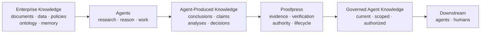
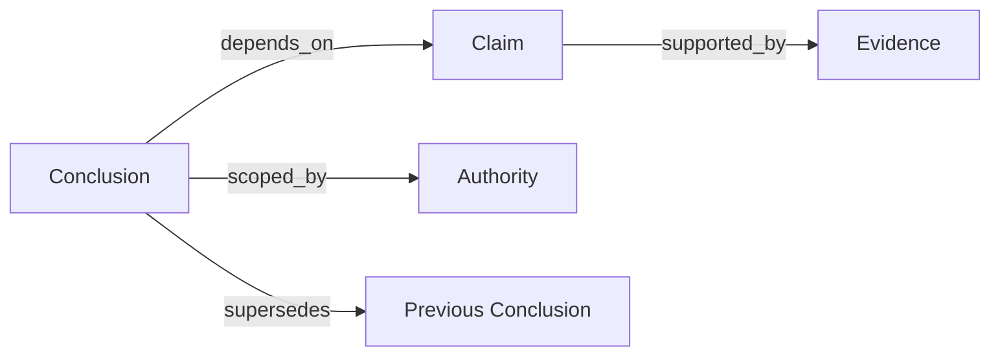

[//]: # (ob:5ec41bcf)
# Proofpress: The Governance Layer for Agent-Produced Knowledge

[//]: # (ob:8fa0fe98)
Agents do not just consume enterprise knowledge. They create a new knowledge
layer. Proofpress governs it.

[//]: # (ob:1ad0eb7b)
The defining question is not only what an agent can retrieve. It is: **What may
the next agent or human rely on, why, and under whose authority?**

[//]: # (ob:e0dbe9be)
> Existing knowledge infrastructure organizes what agents reason from.
> Proofpress governs what their reasoning produces.

[//]: # (ob:d6ac94d9)
## Two knowledge layers

[//]: # (ob:14002896)
Enterprise knowledge is what the organization already knows: documents,
databases, policies, domain ontology, and memory. Agents reason from it.

[//]: # (ob:f33711e5)
Agent-produced knowledge is what agent work newly creates: conclusions, claims,
findings, analyses, and decisions. It is derived through research and reasoning,
then increasingly reused by other agents and humans.

[//]: # (ob:6bf41fa4)

[//]: # (ob:257609f1)
Proofpress governs the second layer. It is not another enterprise knowledge
graph, ontology, memory system, workspace, or agent orchestrator.

[//]: # (ob:ca7cf86a)
## A different level of the agent stack

[//]: # (ob:624831ef)
The adjacent layers are complementary, but their primary objects and questions
are different. From granular execution events upward:

[//]: # (ob:9ad7a7d9)
| Layer | Primary object | Core question |
|---|---|---|
| **Observability** | Runs, traces, tool calls, execution events | What happened while the agent worked? |
| **Memory** | Retrieved context and prior interactions | What should the agent remember or read next? |
| **Knowledge graph / ontology** | Enterprise entities, concepts, relationships | What does the organization know about its world? |
| **Proofpress** | Agent-produced conclusions, evidence, authority, lifecycle | Which conclusions may future agents or humans rely on—and why? |

[//]: # (ob:5db8ab79)
Observability can supply evidence. Memory can retrieve governed conclusions.
Enterprise knowledge graphs can supply the knowledge agents reason from.
Proofpress governs the reusable knowledge that agent work produces.

[//]: # (ob:ceddbe38)
## Why governance becomes infrastructure

[//]: # (ob:77ec9918)
As agent adoption and autonomy increase, enterprise knowledge may continue to
grow relatively steadily while accumulated agent-produced conclusions and work
grow much faster. More agents, more runs, branching research, and agent-to-agent
reuse all create derived knowledge without requiring the original enterprise
corpus to grow at the same rate.

[//]: # (ob:7fdd1756)

[//]: # (ob:5665c586)
This is a directional product model, not a claim of a universal mathematical
growth law. The important shift is operational: beyond a threshold, teams can
no longer review every conclusion informally. Verification, authority, and
lifecycle become infrastructure.

[//]: # (ob:475de7e5)
## Output becomes input

[//]: # (ob:3117375a)
An agent reads enterprise knowledge, researches and reasons, and produces a
conclusion. A later agent then receives that conclusion as context. Without a
governance layer, a derived claim can lose the source, scope, assumptions,
review state, or authority that made it usable in the first place.

[//]: # (ob:73e8bfe9)
The failure compounds across handoffs. Retrieval can surface an old conclusion
without showing that its dependency was revoked. A trace can show how an agent
worked without deciding whether the result is approved for reuse. A knowledge
graph can represent the claim without establishing who may rely on it.

[//]: # (ob:311756fa)
Proofpress makes this transition explicit: agent output becomes future input
only through governed admission and scoped projection.

[//]: # (ob:4e2b8803)
## The Governed Claim Graph

[//]: # (ob:ecbaa093)
The product object is a graph of conclusions and the claims they depend on. It
binds each reusable conclusion to evidence and provenance, verification and
review, authority and scope, dependencies, and later contradiction or
supersession.

[//]: # (ob:5efeb3f3)

[//]: # (ob:1521197a)
This is not a generic graph of enterprise entities. It is a graph for answering
whether a concrete conclusion is currently eligible to enter a downstream
human or agent's context.

[//]: # (ob:f30c0b28)
## Three distinct governance gates

[//]: # (ob:0b24e759)
Agent work becomes governed knowledge through **extraction → evidence binding →
verification → admission or review → governed claim graph**.

[//]: # (ob:9c35c79e)
1. **Integrity:** deterministic checks establish that evidence and artifacts
   are present, bound, and internally consistent.
2. **Policy:** evaluation recommends, blocks, or escalates according to declared
   rules. It can inform a decision; it cannot authorize reuse.
3. **Authority:** the configured actor admits or rejects the conclusion for a
   defined scope.

[//]: # (ob:ad9d90e4)
Rejected, unresolved, expired, superseded, unauthorized, or
dependency-blocked conclusions remain auditable but stay out of default
context. Admission is not a declaration of universal truth. It is a scoped,
inspectable decision about reliance.

[//]: # (ob:630b5087)
## What exists today

[//]: # (ob:6d56c962)
Proofpress currently provides a local ledger and CLI, local review and context
UI, supported agent adapters, artifact provenance, and portable Markdown and
static-HTML carriers. The `context` projection returns admitted, current
conclusions that match the requested scope and actor.

[//]: # (ob:903521b2)
A supported public API/SDK, MCP server, hosted service, and production
connectors are planned, not shipped. The local UI's endpoints are implementation
details rather than a public integration contract.

[//]: # (ob:2a7dbed1)
## Evidence, not definition

[//]: # (ob:2522c0b6)
A frozen product study tested 7 models across 3 Harvey LAB-derived legal task
families and 126 valid paired runs. In that bounded panel, governed handoffs
raised rubric completion from 89.3% to 93.4% (+4.1 percentage points) and
reduced observed unsafe propagation from 8 to 0 across 63 controlled stress
pairs.

[//]: # (ob:58dd5e9d)
This is evidence for one composed mechanism under frozen conditions—not the
definition of Proofpress, an official Harvey leaderboard score, a
population-level causal claim, a statistical-significance result, or evidence
of improved legal intelligence. The retained receipts and boundaries are in
the [public results](../studies/long-horizon-eval/relaybench/PUBLIC_RESULTS.md).

[//]: # (ob:1839c957)
## The thesis in one sentence

[//]: # (ob:7afb2fab)
As agents create and reuse more of an organization's conclusions, governance
must attach to the knowledge produced by agent work—not only to the data the
agents started from.

[//]: # (ob:9389afa3)
That is the layer Proofpress is building.

[//]: # (proofpress:meta:eyJhcnRpZmFjdF9pZCI6InBwX2NjOTQ2YTQ1NzAwNmZmZjMxMWJjOTM3MiIsInBvbGljeSI6InBvcnRhYmxlIiwicG9ydGFibGVfaGVhZCI6ImVkYzMyMWMyIiwicG9ydGFibGVfaGVhZF9ldmVudCI6InBwZV8wMGFlYmU4ZTFhMWU5ZGRiNGYwMWNlMGQiLCJwb3J0YWJsZV9saW5lYWdlX2lkIjoicHBsXzVkZmUxZWNiNTQ0ZGJiY2YzZjVmYzY0YiIsInByb29mcHJlc3MiOjF9)
[//]: # (proofpress:discovery:Verifiable revision history by Proofpress | https://github.com/chenmingtang830/proofpress)
[//]: # (proofpress:capsule:eNrtXNty28iZfpVepVKTUSgK54N2a1KK7cy4bFdUHk9yYbo0je4GiTEIMGjAMmO7Klf7AFt5l73fR5kn2f_vAwDKEiyLqs1e8GI0PDS6__6P33-gPxzRpi1yytrLgh-dHW02l4ylQUSDMHacKM9z33UzlvqxdzQ7ymq-veTFUsgW1soV9cLojCcp86LASdMoTyk8nHmJ71D4m-csZ1Gc-2EYc-HTPKQ5EyJIvDikSRi7fhw5LuzLC8nqd6LZHp19wDftZUuXcEJJWzxqBi8yUcIHfxFNkRc0KwVpxLtCFnVFVrC-brYk25KLpq7zTSOkhGc2lL2lS4GX2vm4qX8RcN2uwQ1XbbuRZ6eny6Jdddmc1etTthLVuqiWLa2WcJHTnacb8beugNeXnRTNJasrKSrgRdt04tPsaCUoMlFw5nsuQ47hJ5finVoEzBWXjkNFJhLhUleknGdB7rhMOBwpq5sWr3ZZFpUAyq1EysuQ58IVLAuDgGcZy_08BMYGmb6Ooe6S0Y3sSriwh3SyuuHy6Oz1hyNz_IcjkHLdSHylvxb8MgOWvz7qqrdVfVUdvYE7WH2Ao3nN5OmrH578-PTH-Rop_BpdoW3bFFnXgoguMyoLiRojyvySSmBdK9R-XbuqGyTobVHhlnIrW7GGbyq6RslZwmbwqERpH51VXVkCmWwF4hH6gllZs7ewOhQsAAJyWA6SacV7vMSrlSDfo3JVtGKCPKdb0ZC8bsj5EthyAirDOyY4gYcMEZRzRd0GVUxcwSe_IXfd5RmQWwoOajc7arcbvAOqAKjT0afZQGmSUycXafLglKqlkvCaVHVLfulkS1BJu7Ug8IVoNk0hBXlrqZzjxbaENQIsbSB5Qxu6Q69LuSOyOHtwenEPLvKiAg6Rv3Vg7WjShVTk11W5JVcr2hJaEYqbEgavGgGaBUo9QS8YVCbSTDw4vd-RJ-_B3yC1PRNJUeUNleADWNs1gtTNklbF34U0tGuRNFP08ggdJ0936b2qR4eUSK6c1FJQ05sfmdBEN3AcL0mjvU5-coNqoRDV_dtVzxKqpEtLUDe-VUvl2QRXct-PXVeEe9Gmhbuxwv2cPq1YV3XzllTiqrTWIM8Im6AtyvLAzWmwF20___zzWjRrWvBFlZf1FTi1piXPXy4qQp48e70YM7b3LP-RNaffgWvu1gN5rOZihzwvhNCa5u5e5A3hlCyV3UglTAnBo-L6-Tl52lpzpfBnBSalHM0E6xiNWZ5EdIe2c8KLPBcNyqIE4y5JnavTtHhkC9H8C8p_xy0mjCHygsR3Rf6glKHbofwXytQGiumEgpsArLEpxRo-pc12RiBU4q5FQ0Dea_iI1NkvE1xMKY9pfM1l7EvrR-MVPwKU6okAtAQfPKqB5t5Df1xUH09OTvr_4C05HqhVOGaH3JBnCc3ihyX3zxlAiXc0K8qi3arYIDvAS1sCC7gAJz8nL8QaweE4bmhlnlJQAcBM-LvR-a-rrbECFT0yMII1uPhd3_8FDb3rHhMqGseCpan7wLSdS8NyyuuNdtJg4QDP6qpeb2Ej9IlSzG4CEROMjHPO3TiMHpbYf3v9GCA4QzJpCT58ewKUENY1IFq5qq8wON8EdsiyqSeIDaMoZGHywMS-gvQEHSQFVR-I1uGoJWvw2-VMe0_CSlqs0QIo6apiWkWDOOQivhYa_9y1G_AiA5Hw7gsaecsjEwoIGD_2IX_b6-Rzi-cQCcgbpTWD76SgDaRjUmkjaiBA2dmUvvkiyQBX70Ub-uucFmVnfHTdVUAiZU0NcRCyDl7nuZyTl9qbgDC132kgMZqCeMi3MMr349soIq_pW4HxGHSrbWglC2W24v2mLFjRnhn-1sMBU9okvCxJHP8WuAyw6ZHSze8bull9CYLe_tiEVkFyS6mT7k8BPmOty8QuZX1LfBCNC7ZnZYe5pFYrDDfK8iSZcg4iF5mf70_fFOR7BIjvUU_e4ugNOTn57iMXGwEaeFlDiH32egLzuaHnumlMH4CH2mdptwR6JJqCDRwcWSu8BL0T0sJASibhvMOczLue9DYCUkCVU4GsRr52iSD8i8r2pacndA5oCUQcpg9Fz_mQSFiDXlrOD0GoXTV1t1yR42M4sKEqIpBf__O_pqAe80MWp-KhCHXncPpT2GjZAG46Oz6GFBxEuoYsHHZjBFwuewteWSKMK-QKaIY8SWOqgUz4pt0hk_KUp44IHorMlwLNV_AZhENweXX5Dl-Dh4NACi8A6gGUFlwv0KUkyLrhXd0sqqnUzXey0Enia4Eer4i5PfjTmtPtF6Hc5-unMgseRiyNvPufOXL9AHUQMgPOBU-HUkHDg4MgFikda5Rje_T86cx8OqVbjg9uI9uDsHMFumss6ZFNBwrDyPnF09MfHz-bkRePLghCdNHMyKqWuATfFgzCO9I4QZgHyU0m-G4G-8Tgeg2ZdOEIDegLwpp4bEJmXuh54LCivSk4J3lT_11UfWCSbce3BGvbwJBYo8AeYvjkBwoc25Ln53884VMxKeE8FCnfmz7r723WpIpidWXgD5gYWQustxZyDZbGsWqm78PqKTtzEz9laRh_Fo8g5Eo8sVKHYAUdT70Drrj1wamEieaZl9PsAaiwWZI0JSIDSzsIhGvMjhG6Vzu1rm-kxRtTJugnKc2p_wAUvkLDLXSZRpUaRi0R_DzrihI5NL9OzpuZbRMcgbEi_LjUd8T91Te25i8ug8QPXBqJxInd2Ikyh_tRnFGMo6Bzak_TySCmk6EjyqYuqlY1Zhp1Elby7Tss5L_BFgi4j-1oh3FbZLSJarjcs2Mi67y9BLNYKhBjGjMyc8_yOHGdIArDIEpdwT1sboiI-nkG4FSEWUh9P8y8iIZumtIo4n7mpdx3wYMmQqRYNYKI2aoGixbNmZ98AkZj68NzvOjESU689JUbn3nemeP83nHgLzxlOI6YzstTFjsM9GP49MOD9WSUxumeyYrKFVoHhOzMiVyPUfRzao9RG8Uo44P1P8ypXpoHIqEiCp3Mnjpqidjq0B69DAiIlbgavlxUplx5Q02zaOc3WKchNQetYKHvMkeJSpE66oaMrPW-bQyDnc8Ak6m4u6bbRYUGXMHeNo1ryKpbq4dgr7qaYdlDh1DtkK8gugpiQFC7_cPx8e1XCpgXhBwk7Hv9lUYNE3OlfTodmKhjjFjPF9V3N7HcNgaKxqzGY0yNXk5IIw2SjIJS52GSWtJHvROrrl_TCDE78yyNEy8UWRj3hjDqjdjoukejg6iaPXJotqg4BcdFpZAzonxega94DXkhOvu2Luulke9aFTDn5Pwz5k4rrs9dyjiF4OL0Fxo1VMY2ds_uyJBIz0wGDRcDG0DWSiSellt1Q7wGF0y16_tUEbS2AEDf50O22jOq9cA-M2UKla1AwidAggq5HBv-uuFg9A4fVFYypUEZBUQnIi_xosSyZdTLMWzZszGjyPmf_yYoZfy_FbFaYcWLX2jhQqaPG5_DvlrKal3PEFhnpA6vUBJ2_cUz-8QNDljtMS52wMNaSuobKx1FppWN2fjiAvYdrFat77EhrH-npjCYUnK9mfU7-G1Z5IJtWSnMbt8jlX0JQifJ16jU-Qw-LFm9gVXwakjozD6PYZvH9VUF7kfQtT53aTmt5W5WPnmGhRNyrv9e6HcXF-p_3-t3jxcVyPiGYopRExfSNRp6HJBD72hGPTWjJvs0yK55kUWl6iuzkfVr5SB6JmKmJC83FKF93fRxAcujbUPbuplQ-oRGThK4fiYcz95m1IUb3Ob9W2jWvHI4ys2jPHRYb15DV20ULu_bEhPMmLoNs3JR4bM94XPyJ3SOwE4AmBS4_V6wThdH3yl16TZXtOFnt7NLUMflbsqEFwT2EqN2m7nEfr2y453e1fExPPWyQ0-KNSF0mm1dY2m5LOXs8yt81PWHFQU8jlZ1tSpKMRIU6orgfyDmLN0E04cY1MGJyTUUL4G_oFMF6qWuSPVHyFXdlXy0dQPyWWdw71rFbq5gSn_Ss1GzBcuFp70-q9OffF46nKlAIjYQFhHdKKciV8Wmp4DXQn4eW9FwCM1qUJECGAIXLof7DnapTr0W5HYCl-jz5d6JzQYXpmgowAePHSkANJJ3CgAZB2ThmbT47Nd__BPZCiANaLqpLWqBsO84LIp5Hqe9po06pbZLsEebs9q9MACyJze3xkBacrw3cnz4_kZod4v7w_Cssr9x0XMXStwF6gHOoyyhccDD3mcNjdnBZ-3RVLUYn0L-I1yHh4lrjxr1WS1U2qNHKpTSoMUVVQfsqNHdgwJrhX-HSgNOHghTmQLaMmWAIzocgOT62Bv1V5GgIIHeb92BruZwbQw8L-peQ2e6QNEoD5OBZ2QrRNwWYmiIpo9p6xP1YlHpygZ4IJtTWcg23OqqAJvp0CngWCRuqQ21WBbY5hw4sahY3Ww6LCcSRanBy5JCNgfhS0xoAvccV8R56kd5n6-MOstGPPt0hdWXYAK8g9veUwK4XpSiUcnnXVVFVfzwcDpWYYDEAkgu0YFASNvBW7fo9_zN7-bzUxytbOUpirRohfridJf0k_7eJ3jvdjXfVMtvb-c9pX6QoR3k3lAfGBrlfTy_f5Nbwso1BV2AP3DHUmtyuwJccKVSelKsVZ0H8ceqyBWaApDYUH3MGXBki3CLDnyD6AkQUbmzRVXVpKyx2kN0mQxjaLMdyRBZWQPYB9HPyV9GvN6JCSDBRTUEBi2G61KYqCPEKk91Ql_ElpGjJv7gzu7ekTc7w7Y89zwWxDS3O4-a9NZ77dFxNxBBu2xC0ZYt7yAvJWgiFpCqZA1UQIBopXb7I0ZTaVHHnPzVuA7YbqT6CgzOUJGMr9H6gnGpxAqH8hl112DAVrkCrJWyWysrw_zTyBgLcQYo97lJq6srHKTWEhOiIN3GLfOikS3ZlAC9JmQYBo6IQprEUSh6RzSMHIzA7X3nB1T9uBw7mEVlfax1YuoaiHl0YxjiP3gsirH5XQ2gDyWiMKTeFx4i-J8tPcF-Chv2rhuTP1Qp9DUqO9EhXHal7uhusMcE63OF9yAi4AHX0xYDPBALGC0wgrOn9L1EfVKt4qEBS9N1jNhxQJsZd9w4Gau3maX4PBP76sEINDOD55S1LSpVsbOFiR5GUb4upLTe3GSq5ucEaAoTtRiPR54TsCB0e8UZzVyMylZfNTxhfTQ4ERegEudJ71pG8xQjtbzvYESLhVWtbgRt_inwKCtQrQVlqwHwjUwd4nxfMjDuA1IXqpD2TjxTflVb7cjfDiyeDXpe2GKS9jjoSiBmF7qFjk1f0xJWQppSKRY7IuU0i9J0KHr3Ax53qAHdZVIDViD3TE1ClR0-9p3Sy2wL2RAWkgyTzLJHepnSLbVGFYUsV3YX2f63hAxUFWyAiTVArB3CvlDnyP3MDX2W5RHtK_GjOZJr8f0-AyF6FXoPsMUrgSARfJDxNVSpDGQsO7pTjFvcogQwicqFGlWpSAMpoS0DLSpdF7cVkW-GCHO7_J0wYNxNYjBANpRG--GUsTneY7zEKhnYvACVSpOM2kNGEyfj-uu9Z0YGE8t02RU_XFQ79oXLBs9V9ygIPx8yROVqlKiOjyc454bgWDjzE8H8vjIyTKeYS-0zX2Lche1qSdR3VRsysQXSFwyo2g-ogkWlMDt2hmB3rP8sKg8JuFC9RDwdo2ynuYE_fFqv0UphI9UNUyBBSECeKFJE8XWjWAn6BrGxhLO5IqLpSqPXGOw0ZlRARRdP_x1RBXyjbMTWLk3EXFQ-UtTbMRKl3Gtd5cUSAg9cGH-bpQSl6wmN0JUus8yahrIjRY5qNwnjJOc3jOXYEoPnZ0mcJgkd8ujRpI4R2V6zNgMQOVE8vZYhNUK1NWjHC90VxroeyH6LQRj9B1yFAtxQuFKDw_NeYXuvo2WhpQjPDMkDgG9IY3p_o30nIMGikhu4kzrRCslUjAB4FGjGUzEiC5gTZzRzvN4xjgaHxuWHOw0CWSSQCs8HsM4Z70PPaDboczTz1bM-xrzxU8PORfXT09loSMempnQD1oMR1djaToxWMdu28V_Q5i36XB2sEVsX7OSHVy-eg8I3gGIbqTO1n82JP49gEdajOiwNKd1WKmbuNM4jpEXnLVsZBKrqp1bBtVNg02XuLPGjxAmcMIwG7zTMN_U_Orj_vJIBUAqXA_GVUL-o1P6pBNvH26G6YgFzg1gcuaLl8tPTbzDt4mqAQT9S9NVuvSN4ScgbJNZDNBBH0G5pLJQ_1fqvkQ-b7FuHvh_lMfUit9ff0UjVoL9fNxtlGwqAXvMsTKJ86IqPxqV6Tt9_7smkf6VYoolT-RZAGF0XZWFyU9eLCLj1AmRC0Uep2hZ4gUorkgoSKGBaYe2hD3Q2_wLISQupHssQy-jOg2Kuaq0m6dz_LYaA1J8HvyW_-30wdwn4QOxY4ECLluK3Fr3qslCt6rQCe_KS5gpub-iSjnbFHR174cjXgqzLEvWsRXtfVHidqbooy1jMQydN86GBOZoEu4bY7jPSxZX85a__-CdqBKgiaqZVC_S9g3uaqYQ1B7BRgJiM_ErQF9FkNW2U8TZoO3CvetPp6v6J7iwx2qH7VtADM37lVqSqAZ3IYlkpCIOk62RUx2mLlisgA8xHp6ZaSdBASgCLuiD-SvkQsCeUuipIbEzfSKkGbZQiqZRPT1u8NnamT5Oqnob6CutOsX50okIeUI9o4hQLt9sMjlqdXvz0x-dPH12-fPLjT89f4VDOt1NV7Sxw_TAK0tzpUeFoTm43E_yacTe7f86Fz_0AoOdQyh4m4K6Vsu8zyKbbJgMUXlRrnMyhbYupIOj3buOgr5lm21EDwOiWzrP1I6pXrpTNkAb6oHy0ajZM2EMS5A4G0NTp7WE0Udfbw30H4z7hWTf8hF6AmfQ_oMe06v3RG_VzfHXd659f-8H96HMT5uwv8cGD_Ot_hq9yqgf9Ff7A7bPJWbJhuBGCA3gAwW9Qd-CbLkzcdu7nW5jBxBdY_RtJ3laFbB0QHE5doQeytgfZbAkwUR1pL_Ph6GqFM4p_wh4HgvzdJ0fbX9vkK2YsJ_6ZCH2V8fDkeHBwPFD54V8nn7uPjPYjk_2GZ-6nm2civzQg-iBToBEkuC7kS5kTJmHK4ezMCTJK_SiI3SjNPJF6TkJhF9eFvYI4DZwgh-Wp67m-yG-_0k1zoOGZl9wwB9r_CyL_V3OgcB8P0DOIJc2m5kDvqieHmdDDTOhhJvQwE3qYCT3MhB5mQg8zoYeZ0MNM6GEm9DATepgJPcyEHmZCDzOhh5nQw0zoYSb0MBN6mAk9zIQeZkIPM6GHmdDDTOhhJvQwE3qYCT3MhB5mQg8zoYeZ0MNM6GEm9DAT-v91JvTNp_8FmYu-0A)
