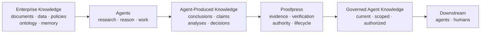
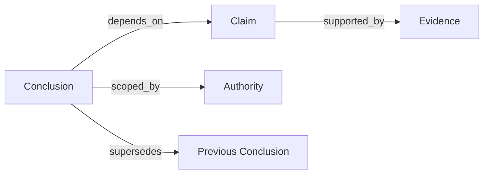

[//]: # (ob:5ec41bcf)
# Proofpress: The Governance Layer for Agent-Produced Knowledge

[//]: # (ob:8fa0fe98)
Agents do not just consume enterprise knowledge. They create a new knowledge
layer. Proofpress governs it.

[//]: # (ob:1ad0eb7b)
The defining question is not only what an agent can retrieve. It is: **What may
the next agent or human rely on, why, and under whose authority?**

[//]: # (ob:e0dbe9be)
> Existing knowledge infrastructure organizes what agents reason from.
> Proofpress governs what their reasoning produces.

[//]: # (ob:d6ac94d9)
## Two knowledge layers

[//]: # (ob:14002896)
Enterprise knowledge is what the organization already knows: documents,
databases, policies, domain ontology, and memory. Agents reason from it.

[//]: # (ob:f33711e5)
Agent-produced knowledge is what agent work newly creates: conclusions, claims,
findings, analyses, and decisions. It is derived through research and reasoning,
then increasingly reused by other agents and humans.

[//]: # (ob:6bf41fa4)

[//]: # (ob:257609f1)
Proofpress governs the second layer. It is not another enterprise knowledge
graph, ontology, memory system, workspace, or agent orchestrator.

[//]: # (ob:ca7cf86a)
## A different level of the agent stack

[//]: # (ob:624831ef)
The adjacent layers are complementary, but their primary objects and questions
are different. From granular execution events upward:

[//]: # (ob:9ad7a7d9)
| Layer | Primary object | Core question |
|---|---|---|
| **Observability** | Runs, traces, tool calls, execution events | What happened while the agent worked? |
| **Memory** | Retrieved context and prior interactions | What should the agent remember or read next? |
| **Knowledge graph / ontology** | Enterprise entities, concepts, relationships | What does the organization know about its world? |
| **Proofpress** | Agent-produced conclusions, evidence, authority, lifecycle | Which conclusions may future agents or humans rely on—and why? |

[//]: # (ob:5db8ab79)
Observability can supply evidence. Memory can retrieve governed conclusions.
Enterprise knowledge graphs can supply the knowledge agents reason from.
Proofpress governs the reusable knowledge that agent work produces.

[//]: # (ob:ceddbe38)
## Why governance becomes infrastructure

[//]: # (ob:77ec9918)
As agent adoption and autonomy increase, enterprise knowledge may continue to
grow relatively steadily while accumulated agent-produced conclusions and work
grow much faster. More agents, more runs, branching research, and agent-to-agent
reuse all create derived knowledge without requiring the original enterprise
corpus to grow at the same rate.

[//]: # (ob:7fdd1756)

[//]: # (ob:5665c586)
This is a directional product model, not a claim of a universal mathematical
growth law. The important shift is operational: beyond a threshold, teams can
no longer review every conclusion informally. Verification, authority, and
lifecycle become infrastructure.

[//]: # (ob:475de7e5)
## Output becomes input

[//]: # (ob:3117375a)
An agent reads enterprise knowledge, researches and reasons, and produces a
conclusion. A later agent then receives that conclusion as context. Without a
governance layer, a derived claim can lose the source, scope, assumptions,
review state, or authority that made it usable in the first place.

[//]: # (ob:73e8bfe9)
The failure compounds across handoffs. Retrieval can surface an old conclusion
without showing that its dependency was revoked. A trace can show how an agent
worked without deciding whether the result is approved for reuse. A knowledge
graph can represent the claim without establishing who may rely on it.

[//]: # (ob:311756fa)
Proofpress makes this transition explicit: agent output becomes future input
only through governed admission and scoped projection.

[//]: # (ob:4e2b8803)
## The Governed Claim Graph

[//]: # (ob:ecbaa093)
The product object is a graph of conclusions and the claims they depend on. It
binds each reusable conclusion to evidence and provenance, verification and
review, authority and scope, dependencies, and later contradiction or
supersession.

[//]: # (ob:5efeb3f3)

[//]: # (ob:1521197a)
This is not a generic graph of enterprise entities. It is a graph for answering
whether a concrete conclusion is currently eligible to enter a downstream
human or agent's context.

[//]: # (ob:f30c0b28)
## Three distinct governance gates

[//]: # (ob:0b24e759)
Agent work becomes governed knowledge through **extraction → evidence binding →
verification → admission or review → governed claim graph**.

[//]: # (ob:9c35c79e)
1. **Deterministic Checks:** enforce fixed rules and required evidence, then
   return pass or fail.
2. **LM Judge:** evaluates meaning against organizational policy, then
   recommends or escalates. It cannot authorize reuse.
3. **Human Approval:** an authorized human admits or rejects the conclusion for
   a defined scope. Only this gate enables downstream reuse.

[//]: # (ob:ad9d90e4)
Rejected, unresolved, expired, superseded, unauthorized, or
dependency-blocked conclusions remain auditable but stay out of default
context. Admission is not a declaration of universal truth. It is a scoped,
inspectable decision about reliance.

[//]: # (ob:630b5087)
## What exists today

[//]: # (ob:6d56c962)
Proofpress currently provides a local ledger and CLI, local review and context
UI, supported agent adapters, artifact provenance, and portable Markdown and
static-HTML carriers. The `context` projection returns admitted, current
conclusions that match the requested scope and actor.

[//]: # (ob:903521b2)
A supported public API/SDK, MCP server, hosted service, and production
connectors are planned, not shipped. The local UI's endpoints are implementation
details rather than a public integration contract.

[//]: # (ob:2a7dbed1)
## Evidence, not definition

[//]: # (ob:2522c0b6)
A frozen product study tested 7 models across 3 Harvey LAB-derived legal task
families and 126 valid paired runs. In that bounded panel, governed handoffs
raised rubric completion from 89.3% to 93.4% (+4.1 percentage points) and
reduced observed unsafe propagation from 8 to 0 across 63 controlled stress
pairs.

[//]: # (ob:58dd5e9d)
This is evidence for one composed mechanism under frozen conditions—not the
definition of Proofpress, an official Harvey leaderboard score, a
population-level causal claim, a statistical-significance result, or evidence
of improved legal intelligence. The retained receipts and boundaries are in
the [public results](../studies/long-horizon-eval/relaybench/PUBLIC_RESULTS.md).

[//]: # (ob:1839c957)
## The thesis in one sentence

[//]: # (ob:7afb2fab)
As agents create and reuse more of an organization's conclusions, governance
must attach to the knowledge produced by agent work—not only to the data the
agents started from.

[//]: # (ob:9389afa3)
That is the layer Proofpress is building.

[//]: # (proofpress:meta:eyJhcnRpZmFjdF9pZCI6InBwX2NjOTQ2YTQ1NzAwNmZmZjMxMWJjOTM3MiIsInBvbGljeSI6InBvcnRhYmxlIiwicG9ydGFibGVfaGVhZCI6Ijc4MWMxNGQwIiwicG9ydGFibGVfaGVhZF9ldmVudCI6InBwZV85MmY0MmUxOTBiYzBmMzI0Y2NmOWM3YTgiLCJwb3J0YWJsZV9saW5lYWdlX2lkIjoicHBsXzVkZmUxZWNiNTQ0ZGJiY2YzZjVmYzY0YiIsInByb29mcHJlc3MiOjF9)
[//]: # (proofpress:discovery:Verifiable revision history by Proofpress | https://github.com/chenmingtang830/proofpress)
[//]: # (proofpress:capsule:eNrtXetuHMeVfpVaLgLHzJDs-2V24YChFFsrCRZkOVlAI9DVVdUzbfV0T_oiaiIJyK99gEXeZf_vo_hJ9py6dPdQwybF4ToI0D9ikzPdVafq3L5zzsf4wxGtmiylrLnM-NH8aLO5ZCz2Aur5oWUFaZq6tp2w2A2do9lRUvLtJc-Wom7g2XpFHT-Yp4kdhHHiBzxMUx7awg1i5jgxDezA4naQ2sLxGXVi33b8NOYR56HDEj_hnutFkQfr8qxm5TtRbY_mH_CX5rKhS9ghpw1uNYMfEpHDB38SVZZmNMkFqcS7rM7Kgqzg-bLakmRLXlRlmW4qUdfwzoayt3Qp8FA7H1flzwKO21a44KppNvX87GyZNas2OWXl-oytRLHOimVDi2XkWmc7b1fiL20GP1-2taguWVnUooC7aKpWfJodrQTFSwwjm9ket47UJ5finXwILldcxk7qOcKOrYRZqet4jKUxC2mEkpVVg0e7zLNCgORGI_mlz1NhC7gzz-NJwlI39VMWeIk6jpbuktFN3eZwYAflZGXF66P56w9HevsPR6DlsqrxJ_W14JcJXPnro7Z4W5RXxdEbOIOxB9ial6w-e_Xd4x-e_HC65kezL7IV2jRVlrQNqOgyoXVWo8WIPL2kNVxdI-R6bbMqKxTobVbgkvW2bsQavinoGjVnBJvBqzVq-2hetHkOYrIVqEeoAyZ5yd7C075gHgiQwuOgmUa8x0O8WgnyLRpXQQsmyDO6FRVJy4qcL-FaTsBkeMsEJ_CSFoJyLqXboImJK_jkX8ldV3kK4uaCg9nNjprtBs-AJgDmdPRp1ksapdRKRRw9uKTy0ZrwkhRlQ35u64agkbZrQeALUW2qrBbkrZHyFA-2JawS4Gm9yBta0R15bcotkYTJg8uLa3CRZgXcEPlLC96OLp3VUvyyyLfkakUbQgtCcVHC4KdKgGWBUY_IKyyeiDgRDy7vN-Txe4g3KG13iSQr0orWEANY01aClNWSFtlfRa1lVyqpxuTlAQVP4vGuvFflYJMcxa1HrRTMdP8rI5Zoe5blRHFw0M6P95gWKlGev1l1V0KldmkO5sa38tF6PnIrqeuGti38g2RTyt0Y5X4unzKsq7J6SwpxlRtvqOeEjcgWJKlnp9Q7SLaffvppLao1zfiiSPPyCoJa1ZBnLxcFIY-fvl4ML7aLLP-eVGffQGhu1714rORiRzzHDwMrTu2DxOvTKVlKv6mlMmtIHgVX75-SJ41xVwr_WIFLyUAzcnWMhiyNAroj2znhWZqKCnWRg3PnpEzlbko9dQPZ_Bbjv-MSI84QOF7k2iJ9UMkw7FD-M2VyAXnphEKYAKyxycUaPqXVdkYgVeKqWUVA32v4iJTJzyO3GFMe0vBayDhU1o86Kn4EKNUJAWgJPrgoQeYuQn9cFB9PTk66_8Gv5LiXVuKYHXF9nkQ0CR9W3O8TgBLvaJLlWbOVuaFuAS9tCTzABQT5U_JcrBEcDvOGMuYxAxUc0oe7m53_vNpqL5DZIwEnWEOI3439t1joXdcYMdEwFCyO7QeW7bzWV055uVFBGjwc4FlZlOstLIQxsRazfSBi5CLDlHM79IOHFfZfXj8CCM5QTJpDDN-egCSEtRWotl6VV5ic94EdsqzKEWH9IPCZHz2wsK-gPMEAScHUe6FVOmrIGuJ2PlPRk7CcZmv0AEraIhs3US_0uQivpcbv22YDUaQXEn67xSJveGXEAAHjh27o04N2Pjd4DpFAvVdbM_iuFrSCcqyW1ogWCFB2NmZvrogSwNUHyYbxOqVZ3uoYXbYFiEhZVUIehKqDl2lan5KXKpqAMlXcqaAwGoN4eG9-kB52b4OMvKZvBeZjsK2mokWdSbcV7zd5xrJmru-37DcYsybhJFFkuTfAZYBNF9I2v63oZnUbBL35tRGrguKWUis-XAJ8x3iXzl3S-5b4IjoXLM_yFmtJZVaYbqTn1WQsOIhUJG56uHxjkO8CEN9FJ97i6A05OfnmIxcbARZ4WUKKffp6BPPZvmPbcUgf4A5VzFJhCexIVBnrb3DgrfAj2J2oDQykZBTOW8xKnOtFbyWgBJQ1FehqEGuXCMJvNbbb3h6xOZDFE6EfP5Q8530hYRx6aW6-T0LNqirb5YocH8OGFZUZgfzyX_89BvWY67MwFg8lqH0Kuz-BhZYV4Kb58TGU4KDSNVThsBojEHLZW4jKNcK4rF6BzFAnKUzViwnfNDtiUh7z2BLeQ4n5UqD7Cj6DdAghr8zf4c8Q4SCRwg8A9QBKC64eUK0kqLrht7JaFGOlm2slvhWF1xI9HhFre4inJafbW6Hc58-PVRbcD1gcOPffcxD6AeogZAacC5EOtYKOBxtBLpI2VsnAdvHsyUx_OmZblgthIzlAsHMJukts6ZFNCwbDyPmLJ2c_PHo6I88vXhCE6KKakVVZ4yP4a8YgvaOMI4I5UNwkgu9WsI81rleQSTWO0IFuUdbIayM6c3zHgYAVHCzBOUmr8q-i6BJT3bR8S7C3DRcSKhTYQQyXfEfhxrbk2fkfTvhYToo490XMD5bPxHtTNcmmWFlo-AMuRtYC-61ZvQZP49g1U-dh5Zif2ZEbs9gPP8tHkHJr3LGQm2AHHXe9A6648cWxgommiZPS5AGkMFVSrVtEGpa2kAjXWB0jdC92el1f1QZvjLmgG8U0pe4DSPgKHTdTbRrZahiMRPDzpM1yvKHT6-K8mZkxwRE4K8KPS3VGXF9-Y3r-4tKLXM-mgYis0A6tILG4G4QJxTwKNifX1JMMoicZKqNsyqxo5GCmkjthJ9_8ho38NzgCgfCxHawwHIsMFpEDl3tOTOoybS7BLZYSxOjBTJ3Y8zSMbMsLfN8LYltwB4cbIqBumgA4FX7iU9f1Eyegvh3HNAi4mzgxd22IoJEQMXaNIGM2csCiVDN3o09w0Tj6cCwnOLGiEyd-ZYdzx5lb1u8sC_4Jb-kbR0zn4DTIYmAf_acfHmwmIy1OzUxWtF6hd0DKTqzAdhjFOCfXGIxRtDE-2PxD7-rEqSciKgLfSsyug5GI6Q4dMMuAhFiIq_7LRaHblXt6mllzusc7tagpWAXzXZtZUlVS1ME0ZOCt9x1jaOw8B0wm8-6abhcFOnABa5syriKrdi1fgrXKYoZtD5VCVUC-guwqiAZBzfb3x8c3H8ljjudz0LDrdEcaDEz0kQ6ZdGChjjlifboovtl35WYwkFX6adxG9-jrEW3EXpRQMOrUj2Ij-mB2Ysz1SwYhemWexGHk-CLxw84RBrMRk10PGHQQ2bPHG5otCk4hcNFa1DMiY16GP_ES6kIM9k2Zl0ut37VsYJ6S888ud9xwXW5TxikkF6s70GCgMvSxe05H-kJ6pitoOBj4AF5tjcLTfCtPiMfggslxfVcqgtVmAOi7esh0ewa9HlhnJl2hMB1I-AREkCmX48BfDRy03eGL0kvGLCihgOhE4EROEJlrGcxy9LUcOJiR4vzv_xDUMv7bqFg-YdSLXyjlQqWPC5_DukrL8rnuQuA5rXX4CTVhnn_x1LyxJwDLNYbNDnhZaUl-Y7QjxTS60Qu_eAHr9l4rn--wITz_TrIwmDRytZiJO_htnqWCbVku9GrfopRdC0IVydekVPUMvlyzcgNPwU99QafXeQTLPCqvCgg_gq7Vvktz00rv-snHT7FxQs7VP1-o3168kP_6Vv32aFGAjvc0U7SZ2FCuUd_hgBy6QDOYqWkzOWRAdi2KLArZX5kNvF8ZB1GciJnUfL2hCO3LqssL2B5tKtqU1YjRRzSwIs92E2E55jSDKVwfNu8_QjPulcJWdhqkvsU69-qnaoN0ed-RmGDa1U2arRcFvtsJfkr-iMERrhMAJoXbfi9Yq5qj76S5tJsrWvH5zdclqGVzO2bC8TxziMG4TR_isFnZ8c7s6vgY3nrZYiTFnhAGzaYssbWc5_Xs8yN8VP2HFQU8jl51tcpyMVAU2orgvyd6LzUEU5to1MGJrjXkXcL9gk1laJeqI9VtUa_KNueDpSvQzzqBc5cyd3MJU7qdng6GLdguPOvsWe7--PPW4UwmErGBtIjoRgaVepVtOgl4KerPcys6DqFJCSaSwYXAgfP-vL1fyl2vJbmdxCW6erkLYrM-hEkZMojBw0AKAI2krQRAOgAZeFYbfPbL3_6O1wogDWTaNxY1QNi1LBaEPA3jztIGk1IzJThgzFnsHhgA2eP9ozHQVj1cG2-8_34vtLsh_GF6ltXfsOm5CyXuAvUA51EW0dDjfhez-sFsH7MOGKoajE-h_hG2xf3INlsN5qwGKh0wIxXSaNDjsqKF6ygx3IMBK4N_h0YDQR4Ek5UC-jJlgCNaJEByte1e-5UiSEig1lu3YKspHBsTz_Oys9CZalBUMsIkEBnZChG3gRgKoqltmvJE_rAoVGcDIpCpqQxk6091lYHPtBgUkBaJSypHzZYZjjn7m1gUrKw2LbYTiZRU4-WaQjUH6UuMWAJ3LFuEaewGaVevDCbLWj2HTIXll-ACvIXT3lMD-LzIRSWLz7uaiuz44eZ0aMIAiQWInGMAgZS2g7dusO_TN789PT1DamVTn6FKs0bIL852RT_pzn2C525Wp5ti-fXNd0-p6yXoB6nT9wf6QXmXz-8_5K7hyTUFW4B_wBlzZcnNCnDBlSzpSbaWfR7EH6sslWgKQGJF1TZzuJEtwi3a3xtkT4CIMpwtiqIkeYndHqLaZJhDq-1Ah3iVJYB9UP0p-dPgrndyAmhwUfSJQanhuhZG-gihrFMt3xWhucjBEL8PZ3efyOuVYVmeOg7zQpqalQdDehO9Dpi4a4igQjah6Mvm7qAuJegiBpDKYg1MQIBqaxX2BxdNa4M6TsmfdeiA5QamL8HgDA1JxxplL5iXcuxwyJhRthUmbFkrwLN13a6ll2H9qXWMjTgNlLvapFHdFQ5aa4hOUVBu45JpVtUN2eQAvUZ06HuWCHwahYEvukDUUw4G4Pa-_AHZP86HAWZRmBhrgpg8BmIeNRiG_A8Ri2JuflcC6EONSAyp1oWXCP7PtJ5gPYkNu9CNxR-aFMYaWZ2oFF63uZrobnDGBM-nEu9BRsANrpctGnggFtBWoBVndulmiWqnUuZDDZbG-xihZYE1M27ZYTQ0b82l-LwS-2JiBLqZxnPS2xaF7NiZxkQHoyhfZ3VtormuVPWfE6ArjPRiHB44lsc83-4MZ8C5GLStvog8YWI0BBEboBLnURdaBnyKgVnelxjRYGNVmRtBn38Cd5RkaNaCslUP-AauDnm-axno8AGlC5VIeyefybiqvHYQb_srnvV2nplmkoo4GEogZ2dqhI5DXz0SlkoaMykWWiLmNAniuG96dwSPO_SA7sLUgCfw9nRPQrYdPnaT0stkC9UQNpL0JenHLtRj0rbkM7IpZG5l9yEz_66hApUNG7jEEiDWjmC39DlSN7F9lyVpQLtO_IBHci2_34cQop7C6AG-eCUQJEIM0rGGSpOBimXHdrLhiFvkACbRuNCiCplpoCQ0baBFofripiPyVZ9hbta_5XuM21EIDsj61mhHThm64z3oJcbIwOcFmFQcJdRsMmCcDPuv9-aM9C6WqLYrfrgodvwLH-sjV9mhIPy8rxBlqJGqOj4euTnbh8DCmRsJ5nadkZ6dog91CL9Ehwsz1arR3mVvSOcWKF8woao4IBsWhcTsOBmC1bH_sygcFOCFnCXi7phlW3Ub-IdP6zV6KSwkp2ESJIgakCeqFFF8WcmrBHuD3JjD3lwKUbW5tmtMdgozSqCimqf_hqgCvpE-YnqXOmMuChcl6vwYhZLhtSzSbAmJBw6Mf5slFaX6CZVQnS79mHEN6UdSHDluEjpInu6h5ZgWg-MmURhHEe3r6AFTR6vsIK5ND0RO5J1eq5AqIccatOWZmgpjXw90v8UkjPEDjkIBbkhcqcDheWewXdRRulBahHf64gHAN5QxXbxRsROQYFbUGziT3NEoSXeMAHhk6MZjOSLxmBUmNLGcLjAOiEPD9sOdiEAGCcTCcQGsc8a71DPgBn2OZr6Y66PdGz_V17kofnwyG5B0TGlKN-A9mFG1r-3kaJmzzRj_Oa3eYsxVyRqxdcZOvnv1_BkYfAUotqpVpfaT3vGnASzCflSLrSFp29LE9JmGdURt0HnDVhqByv6pMXAVFNh4mzuJ3CCyPMv3gz469fym7o8O7s9X0gBK4nIQvhDyLypVfMrB9_F0aK7YwNwgFsdbUXr58clXWHZxSWBQr2Rdt1utCFES6oYa-yEKiCNoNzJmMp4q-1fIh43OrX3XDdKQOoHd2e-AUtXb75dxo8xAAdBrmvhRkPZT8QFdqrvp-_OedPmXiyW6OK3fAgij6yzPdG1qOwGBsJ6BTijGKNnbgihQKEOSSQIVTAvsPXSJztRfADlpVsvXEsQyavIgL1eOVqP41P0NpoDYPfV-Q377O-_UJhADcWKBhBalxa8NelVtoVL2aQXO5GuaSri9oUs6WBVXtMyBA1cpssxztLMG_X1R4HHG-qIsYSH3rThO-wHmgAl2DbHdh9LFpf7rX_72d7QIMEW0TGMWGHv78DSTBWsKYCMDNWn95WAvokpKWknnrdB34FzlplXd_RM1WWK0xfAtoQdW_DKs1LIHdFJny0JCGBRdFaMqTxu0XIAY4D6qNFVGgg6SA1hUDfFXMoaAP6HWZUNio-dG0jRoJQ1JlnyKbfFa-5narZb9NLRXeO4M-0cnMuWB9IgmzrBxu01gq9XZix__8OzJxeXLxz_8-OwVknK-HutqJ57t-oEXp1aHCgc8ud1K8Evobmb9lAuXux5Az76V3TPgrrWy70NkU2OTHgovijUyc2jTYCkI9r07OOh6psl2MADQtqXqbPWKnJVLY9OigT3IGC2HDSP-EHmphQk0tjp_GDDqOn-4LzHuE-6150_oBbhJ9wf0WFa9P3oj_xxfHvf659f-4H7wuU5z5i_xIYL84_8MX9ZUD_pX-P1tz0e5ZD25EZIDRADB95g73JtqTNy07-dLaGLic-z-DTRvukKmDwgBpywwAhnfg2o2B5gotzSH-XB0tUKO4h9xxoEgf_fNwfLXFvkCjqVlUZGISNjUhrjOE7BxmwmrP8qQPDkkDg4JlR_-cfq5O2W0o0x2C87tT_s5kbcRRB-EBRpAgWtDvZRYfuTHHPZOLC-h1A280A7ixBGxY0UUVrFtWMsLY8_yUng8th3bFenNR9rHA_XnTrSHByqgxnZs5vxqPFA4jwPoGdQSJ2M80LvaycQJnTihEyd04oROnNCJEzpxQidO6MQJnTihEyd04oROnNCJEzpxQidO6MQJnTihEyd04oROnNCJEzpxQidO6MQJnTihEyd04oROnNCJEzpxQidO6MQJnTihEyd04oT-E3NCL27ghF7cwAm9uIkT-jLDMpOTVxT0-s_NDT3s_8n4c8qhArb7-aCDvW7kg55DbFDdPu1XuCPBo9WmPa97DzpCbGX3Sr4hY0O96hFDAbhHTm7m5NFObXMha5sZefac_Ecrm6q49neySD2XvTSa38Ax7QXkbSVxlxZ0jxjPsgJg9hPVivrPXhx0s7Y2gxjxHmFdI-_82lUPDi4rKwA58NKunNivVQ3XvOOW6fGruaIvY7qO_AfR9jJdO2rk7UzX_zdruztZ91Z2a8_0_FXYrU4QCRH5sRv4oRNAQAhDB0oNpH1EQWD5KSAIL3DSgAapbYWeGzlOxJIoFfBxyrwvYLfGc8ua294edmv338eb2K0Tu3Vit07s1ondOrFbJ3brxG6d2K0Tu3Vit07s1ondOrFbJ3brxG6d2K0Tu3Vit07s1ondOrFbJ3brxG6d2K0Tu_VXZreKxPMT1w4h4yW3sFv3DX0l1RTBFtJtsveSXJR3YANLCPior8gRTChiqSTIkQ2kejwBZlfDYTVT5AGLFRZcCypHCnRJM7CUndYBIlM5WdzZwJBed7iuhss6wljdnQejFJhpu96lHtvchbWqeLzXWKvke5WKzDAeQmiCN9Z7gBZnordO9NaJ3jrRWyd660RvneitE711orc-HL31zaf_A9rggps)
