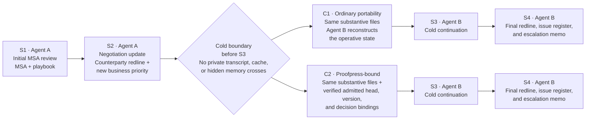
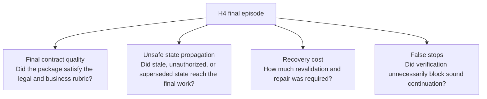

[//]: # (ob:0dbf9f9b)
# H4 Long Horizon Eval: Flow Illustration

[//]: # (ob:5a0e2c01)
## Status

[//]: # (ob:40cfc395)
Proposed calibration protocol only. This illustration describes no model run and reports no result.

[//]: # (ob:cfb9ee3a)
## One H4 episode

[//]: # (ob:d5c91f67)

[//]: # (ob:5e12ab89)
## What remains equal, and what changes

[//]: # (ob:db071706)
| Held equal between C1 and C2 | Intervention in C2 |
| --- | --- |
| Contract versions, redlines, playbook, emails, approvals, task instructions, model/runtime settings, tool access, budgets, and scoring rubric | A machine-verifiable binding from the operative artifact to the admitted decision history, supporting materials, actors, and version |

[//]: # (ob:72a923aa)
The intended comparison is not "more context" versus "less context." Both conditions receive the same substantive information. C2 changes whether the next agent can verify which state is authorized to continue from.

[//]: # (ob:20976280)
## Score the episode, not merely the handoff

[//]: # (ob:c04bf090)

[//]: # (ob:37122388)
## Interpretation boundary

[//]: # (ob:599b28b1)
If C2 helps, the claim is that Proofpress made an evolving, authorized contract state more safely portable across a genuine cold boundary. It does not show that Proofpress makes an agent a better lawyer, supplies better legal knowledge, or improves drafting skill on its own.

[//]: # (proofpress:meta:eyJhcnRpZmFjdF9pZCI6InBwXzZkZGM0Yzc3YTA5NTRiNTIzY2UyYWQ5MyIsInBvbGljeSI6InBvcnRhYmxlIiwicG9ydGFibGVfaGVhZCI6IjcyZTAzYWVhIiwicG9ydGFibGVfaGVhZF9ldmVudCI6InBwZV84NWExYjgxOTBhMDU5OWI5YjU1YWUzNGMiLCJwb3J0YWJsZV9saW5lYWdlX2lkIjoicHBsX2M5M2Q4OGJkNTQ4OTZjMTBhMzBlMTFmNyIsInByb29mcHJlc3MiOjF9)
[//]: # (proofpress:discovery:Verifiable revision history by Proofpress | https://github.com/chenmingtang830/proofpress)
[//]: # (proofpress:capsule:eNq1WNly28gV_ZUuzKMpCSsJ8CFTkjKOVeVYieWZqYrponsDiQgEOOiGNBzZ35X3fFnObQBcbA-9yHGpXESj-67n3nsaDx5vbJFzaeeF8qbeej0fKyVjOZlwP0tikYSR1CFXWeSNPFGrzVwVC20s9polD5PxNNWBEJHPdZDkiR-HiVBjFSRJksk0jce54JxPQpH4WokgihKVynQcCx4EIo2SNIVcVRhZ3-lm400f6MHOLV9AQ8ktqRrhh9AlFn7RTZEXXJSaNfquMEVdsSX2182GiQ37R1PX-brRxuDMmstbvtDk1MFyU_9bw922IYFLa9dmena2KOyyFaeyXp3Jpa5WRbWwvFqkkX92cLrRv7UFfs9bo5u5rCujK8TCNq1-P_KWmlMQJ6H2I665163M9Z3bhODqeZpw-B1kPveTLBOZSBKuo1iSZXVjybV5WVQalg8ZKecyi1SaCpXEaTaWgc8jXwdBPunc6a2bS742bQmHQ7JT1o0y3vT1g9erf_CQ5box9Kt7rdVcIOSvveu1rs6v2GWt9O_eGzgygIKybFtVaHP2_PrF3-bPrl9e_ev6xfynX86fz58-v_71dKW80VdhiFvbFKK1SN1ccFMY0qHLfM4NQmq1k9faZd2QobdFRSLNxli9wpuKryijBwaPcN4QFLxp1ZYlzJdL5E533ouylrc44iuRZ3kmsB1ps_p3cu5ZzJ7X1YI9q5viD2DppzteTtnTsr5nV2XZGttwMhRnekO4Us7CNcFP32PlB_blQuxmTdYTKAAw7_1oZ17CfR1KPzgw78Zy25qj2n9g201HpMe-zGWUJV8pHfW0ro1WTPKyEJ0bDIiztaxLVlfl5pS9Qv2xYs9PprSRTbEzaM0bfmCNzEWmdcQPrLmuNEVSrwuDrH7G5482H_FdJTIL8vHkG7W9fft2pZsVL9SsypFTYKux7PnLWcXw7yZ4PfNuAvbf_7DzBcqMnc9m1VVV2IKX7O8352hTO-skqTpIug5CLtLswLRfl9ziGDRWhqHd8HLEeKXYPa0PyD4eni8UcSxowp8EE3_8XS17x57pUnUnmdD2XuuKXQZOxmXI3rEraGqoWxGMisotzqp37OTkhO3sdU3ywNpJyLMw4vy7WvtqqWGD1ZWiAqhXgDHAArsMq2rLZt6qbjTr9c08hvllWoP1Et2IySP4D_1sMg5T_7AaJYmzUNqDcuTUAHu63Lh1mKzq_HPd4AvF5MfzL_1Y5H72_U38dDm9uujK6RrVhLLMiwoI6ZXMvDcAwF_YP_HuaVEdKadoEoRh5BjFzmiHKei3XXMSdVspDqZxPIx_fupYD8dAD1MRPFb_VU7IX-pybUYurLLkxYqAZwm7O5bDVlxpgJrpu7q8gzkj9iHs3oyG-e8RQGnqykbzbs66N8PQPspNkGcns6corKcoqCMtb9c16sQxrsZpoik8PNEQfkPcpizkZk_CPt_ZE-KY1DdSIVPndg7oLCjeRc-4jAimSSqzMBZZHk8Uj8eZnwQ6ysaTKMomPNVjX8oo19kkDeM4DSca5FRKpRTnSc5FSPk0SJ9jTl22pkEImkErKOZwfOKnJ2H4yp9Mo2waxk98f-pT6fQR36eE7_dWH_6fPMuBsqNAS26WBLQwDhI1zkDXQ2xwMvZYUY_XR_KZXheCGoQ65WEms0HXHsUZdB1nL4OsCUIe5eNcuiHuZO0Rml7WY7iK0NTT2QoNpWRNW7k50WhCoXuBWmtLe_qJlt6biNinPNJpHqRyMHGP5ezc_RLi0svEHWrM4zQSfhwMMve4TC_z0fSEeg4W6eEJW5d8I-r6dui5NyGdDw_Pv9CLGgJc_Nq1Qi_B4iX6GjU6aN9AqqLCZU_wotL3TLQGj-hXqEuAym4gvzcwdHouHmbeZQ1uMLRHHBQ6p3FzE5HKmo7eQRVD5irK2dqOkGq0jhHe1w2ugajMCsNoRZdB2dS4TpiZ977Tc-HUXFI4Ll04rhvEG4pY12qKkqyaVTe4XzDTCtQ7WMidxijCOMeLzv0LRjenCvBppaVl6s71WhOasJm6hN761uukEF66EO4a94nz80_1ucDdubsuAM3VqrBo2IxAMmJ9-yC3CaZKy-4eLDBOACGz1Q9HXQ6jc0pitEvihctXqRx5KarWpXJ3LOyPXXzVMajpzsVOXXx47qmb6D0uRhhlpqUr_AJ3d90MrqAWednhitK4J_qiF33xPUWjdD5BJobqi8djFfsJqGW6bWA7ur6r6G_n2r2mZJzpWKVhFPpiW-c7-t1rehR37v-nx0vkrsEIGWAEhtGHDr-G8h8x8qfECl-jhaL_ExHh5haCO-x3J13DPEPDtAXBWFtLAMTWGi0XMxRIH6H41UJb00XFgEJiD5qsaAoJw87BYeQS6k_udt92eiizvKlX7LDEhhEIHe7Ntji2ddB_DxqhrNZU3CRohbpsCudG9xGks6aPAXv3qcvFMDWzIPTHOk-iaDt99u4bfXoeeVno1k_x4qK2S3pWhYsx9RtNfpOv5sNmUVRokSsH61NKeA83YE9jf-MOVRDMuKsWCaboorzBjkIuu35FNnYfXIo_YDzi2te3dvE_MvXEOEnSPE9EEvhDaPbuNntD_nGXkl7dRPBQy0DH2URth-zunnJ0IH7FBQMv5FAkVG3dYPhroZyh_VdF5MIWJu-ML_UChwhQ20HX4fvHbQu7dhp-hoafK8PzflQQP1nzRddIOx1YLxGettqlZMQw3gBmQEYTvLqjIPHIIKnvnLmvm9sP9b2Evpe6-7QKp4yFkmegcasWRzH64ZzqmmJPeHjRsHtOqHOfOdWHAp9SiFBGZH-9Nr3NXeXKnhFg4lPhowCQW8dCmaFpdzA2fvx8B85jEPs0i2OQqCHdeze8Hbq-6q42CB8ngRz7caZlsm3vu-vbcHd7xEVsr6S2cOoy51oBgaAc2AdaHneMhXGGSm2JO8l9OnTKrixTte66iVkihx9bcIvXMKGrdU5DAnFhJb_fYA66bljigrFdd6C9rer7UqNBO5AVK-r22KManrvGaW5Blxk1MjDh-r76qBu8eY-__wEUYQ4z)
